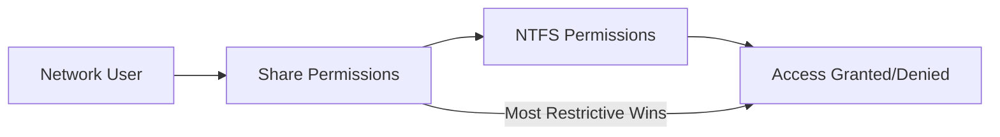

# How to Use Ansible win_share Module

Author: [nawazdhandala](https://www.github.com/nawazdhandala)

Tags: Ansible, Windows, File Sharing, Networking

Description: Automate Windows network share creation and management using the Ansible win_share module with step-by-step examples.

---

Windows file shares are everywhere in enterprise environments. Whether it is a department's shared drive, a software distribution point, or a data exchange folder between applications, SMB shares are a core part of Windows infrastructure. Setting them up manually through the GUI is fine for one or two shares, but when you need to standardize shares across dozens of file servers, Ansible's `win_share` module is the way to go.

This module lets you create, modify, and delete Windows SMB shares, set share-level permissions, and configure caching options, all in a declarative YAML playbook.

## Prerequisites

You will need:

- The `ansible.windows` collection installed on your control node
- WinRM connectivity to your Windows hosts
- Local administrator rights on the target servers (required to create shares)

```bash
# Make sure the collection is installed
ansible-galaxy collection install ansible.windows
```

Also, the target directories for shares need to exist before you create the share. The module does not create directories for you.

## Creating a Basic Share

Here is the simplest possible share creation:

```yaml
# playbook-basic-share.yml
# Creates a simple file share accessible to everyone on the network
- name: Create basic file share
  hosts: windows
  tasks:
    - name: Ensure the shared directory exists
      ansible.windows.win_file:
        path: C:\SharedData
        state: directory

    - name: Create the network share
      ansible.windows.win_share:
        name: SharedData
        description: General shared data folder
        path: C:\SharedData
        state: present
```

After running this playbook, the folder will be accessible at `\\servername\SharedData`. By default, the share grants read access to Everyone.

## Setting Share Permissions

Share-level permissions are separate from NTFS permissions. Both apply simultaneously, and the most restrictive combination wins. Here is how to set specific share permissions:

```yaml
# playbook-share-permissions.yml
# Creates a share with specific access for different groups
- name: Create share with permissions
  hosts: windows
  tasks:
    - name: Create shared directory
      ansible.windows.win_file:
        path: C:\DepartmentFiles
        state: directory

    - name: Create department share with restricted access
      ansible.windows.win_share:
        name: DeptFiles
        description: Department file share
        path: C:\DepartmentFiles
        state: present
        full: Administrators
        change: DOMAIN\DeptManagers
        read: DOMAIN\DeptStaff
        deny: DOMAIN\Contractors
```

The permission parameters are:

- **full**: Full control (read, write, change permissions)
- **change**: Read and write access
- **read**: Read-only access
- **deny**: Explicitly denied access

Each parameter accepts a single user/group or a comma-separated list of users/groups.

## Multiple Permission Entries

When you need to grant the same permission level to multiple groups, pass them as a list:

```yaml
# playbook-multi-perms.yml
# Grants change permissions to multiple groups
- name: Create share with multiple group permissions
  hosts: windows
  tasks:
    - name: Ensure directory exists
      ansible.windows.win_file:
        path: C:\ProjectData
        state: directory

    - name: Create project share
      ansible.windows.win_share:
        name: ProjectData
        description: Cross-team project files
        path: C:\ProjectData
        state: present
        full: DOMAIN\ITAdmins
        change:
          - DOMAIN\TeamAlpha
          - DOMAIN\TeamBeta
          - DOMAIN\TeamGamma
        read:
          - DOMAIN\AllEmployees
```

## Configuring Caching Options

Windows shares support offline file caching, which determines how clients cache files locally. The `caching_mode` parameter controls this behavior.

```yaml
# playbook-caching.yml
# Creates a share with specific caching behavior for remote workers
- name: Create share with caching config
  hosts: windows
  tasks:
    - name: Create directory
      ansible.windows.win_file:
        path: C:\RemoteWorkFiles
        state: directory

    - name: Create share with manual caching
      ansible.windows.win_share:
        name: RemoteFiles
        description: Files for remote workers
        path: C:\RemoteWorkFiles
        state: present
        full: DOMAIN\RemoteWorkers
        caching_mode: Manual
```

Available caching modes:

| Mode | Description |
|------|-------------|
| `Manual` | Users choose which files to make available offline |
| `Documents` | Files are automatically cached when opened |
| `Programs` | Optimized for read-only files like executables |
| `BranchCache` | Files are cached at branch office level using BranchCache |
| `None` | No offline caching allowed |

For shares containing sensitive data, set `caching_mode: None` to prevent files from being cached on client machines.

## Removing a Share

To remove a share, set `state: absent`. This only removes the share definition; it does not delete the underlying directory or its files.

```yaml
# playbook-remove-share.yml
# Removes an obsolete network share
- name: Remove old share
  hosts: windows
  tasks:
    - name: Delete the legacy share
      ansible.windows.win_share:
        name: OldAppShare
        state: absent
```

## Real-World Example: Setting Up a File Server

Here is a complete playbook that sets up a Windows file server with multiple departmental shares, proper NTFS permissions, and share-level access controls:

```yaml
# playbook-file-server.yml
# Configures a complete departmental file server with multiple shares
- name: Configure departmental file server
  hosts: file_servers
  vars:
    shares:
      - name: Finance
        path: C:\Shares\Finance
        description: Finance department files
        full: DOMAIN\FinanceManagers
        change: DOMAIN\FinanceStaff
        read: DOMAIN\Auditors
        caching: None

      - name: Engineering
        path: C:\Shares\Engineering
        description: Engineering team files
        full: DOMAIN\EngineeringLeads
        change: DOMAIN\Engineers
        read: []
        caching: Manual

      - name: HR
        path: C:\Shares\HR
        description: Human Resources files
        full: DOMAIN\HRManagers
        change: DOMAIN\HRStaff
        read: []
        caching: None

      - name: Software
        path: C:\Shares\Software
        description: Software distribution point
        full: DOMAIN\ITAdmins
        change: []
        read: DOMAIN\AllEmployees
        caching: Programs

  tasks:
    - name: Create base shares directory
      ansible.windows.win_file:
        path: C:\Shares
        state: directory

    - name: Create individual share directories
      ansible.windows.win_file:
        path: "{{ item.path }}"
        state: directory
      loop: "{{ shares }}"
      loop_control:
        label: "{{ item.name }}"

    - name: Create each network share
      ansible.windows.win_share:
        name: "{{ item.name }}"
        description: "{{ item.description }}"
        path: "{{ item.path }}"
        state: present
        full: "{{ item.full if item.full else omit }}"
        change: "{{ item.change if item.change else omit }}"
        read: "{{ item.read if item.read else omit }}"
        caching_mode: "{{ item.caching }}"
      loop: "{{ shares }}"
      loop_control:
        label: "{{ item.name }}"

    - name: Set NTFS permissions - break inheritance
      ansible.windows.win_acl_inheritance:
        path: "{{ item.path }}"
        state: absent
        reorganize: false
      loop: "{{ shares }}"
      loop_control:
        label: "{{ item.name }}"

    - name: Set NTFS permissions - Administrators full control
      ansible.windows.win_acl:
        path: "{{ item.path }}"
        user: BUILTIN\Administrators
        rights: FullControl
        type: allow
        state: present
        inherit: ContainerInherit, ObjectInherit
        propagation: None
      loop: "{{ shares }}"
      loop_control:
        label: "{{ item.name }}"
```

## Share Permissions vs NTFS Permissions

This is a common point of confusion. There are two layers of permissions on a Windows share:



**Share permissions** apply only when accessing via the network path (`\\server\share`). They are coarse-grained with just three levels: Read, Change, and Full.

**NTFS permissions** apply always, whether accessing locally or over the network. They are fine-grained with many permission types.

Best practice is to set share permissions broadly (often just "Everyone: Change" or "Authenticated Users: Full") and use NTFS permissions for granular control. The `win_share` module handles share-level permissions, while the `win_acl` module handles NTFS permissions.

## Verifying Shares After Creation

You can verify your shares were created correctly with a quick verification task:

```yaml
# Verification tasks to confirm shares are properly configured
    - name: Get share information
      ansible.windows.win_shell: |
        Get-SmbShare | Where-Object { $_.Name -notlike '*$' } |
        Select-Object Name, Path, Description |
        ConvertTo-Json
      register: share_info

    - name: Display share configuration
      ansible.builtin.debug:
        msg: "{{ share_info.stdout | from_json }}"
```

## Gotchas and Tips

**Directory must exist first.** The `win_share` module will fail if the target path does not exist. Always create the directory in a prior task.

**Share names have a length limit.** Windows share names can be up to 80 characters, but keep them short for usability. Users need to type these paths.

**Hidden shares.** Append a `$` to the share name (e.g., `AdminTools$`) to create a hidden share that does not show up when browsing the network. The module handles this just fine.

**Idempotency.** The module is fully idempotent. Running it twice with the same parameters produces no changes on the second run. However, if you change permissions, the module will update them in place.

Network file shares might seem like old technology, but they remain essential in most Windows environments. Using Ansible to manage them ensures consistency, makes auditing straightforward, and eliminates the manual configuration drift that inevitably happens when shares are set up by hand through the GUI.
