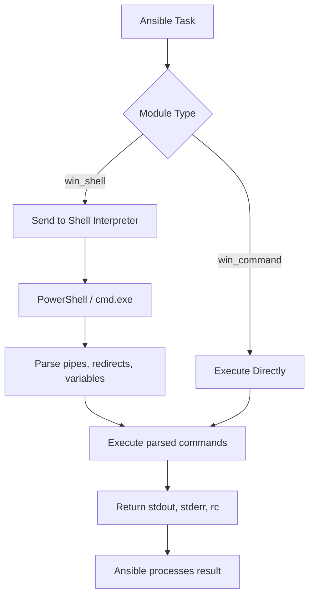

# How to Use Ansible win_shell Module

Author: [nawazdhandala](https://www.github.com/nawazdhandala)

Tags: Ansible, Windows, PowerShell, Automation

Description: Master the Ansible win_shell module to run PowerShell and cmd commands on Windows hosts with pipes, redirects, and full shell features.

---

When you need to run commands on Windows hosts that involve piping, redirection, or PowerShell-specific syntax, the `win_shell` module is the right tool. Unlike `win_command`, which bypasses the shell entirely, `win_shell` sends your commands through a shell interpreter, giving you access to the full range of shell features.

## How win_shell Differs from win_command

The key distinction is simple: `win_shell` processes your command through PowerShell (or cmd.exe), while `win_command` runs the executable directly. This means `win_shell` supports pipes (`|`), redirects (`>`), environment variable expansion (`$env:TEMP`), and all other shell features.

By default, `win_shell` uses PowerShell as the interpreter. You can switch to cmd.exe if needed, but PowerShell is almost always the better choice for Windows automation.

## Basic Usage

Here is a straightforward example using PowerShell commands through `win_shell`.

```yaml
# basic-shell.yml - Run PowerShell commands on Windows hosts
---
- name: Basic win_shell usage
  hosts: windows_servers
  tasks:
    # Get all running processes sorted by memory usage
    - name: List top memory-consuming processes
      ansible.windows.win_shell: |
        Get-Process | Sort-Object WorkingSet64 -Descending | Select-Object -First 10 Name, @{N='MemoryMB';E={[math]::Round($_.WorkingSet64/1MB,2)}}
      register: top_processes

    - name: Show results
      ansible.builtin.debug:
        var: top_processes.stdout_lines
```

## Using Pipes and Redirects

This is where `win_shell` really shines. You get full access to PowerShell piping and output redirection.

```yaml
# pipes-and-redirects.yml - Leverage shell features
---
- name: Use pipes and redirects
  hosts: windows_servers
  tasks:
    # Filter event log entries and export to CSV
    - name: Export recent error events to CSV
      ansible.windows.win_shell: |
        Get-EventLog -LogName Application -EntryType Error -Newest 50 |
          Select-Object TimeGenerated, Source, Message |
          Export-Csv -Path C:\Reports\errors.csv -NoTypeInformation

    # Pipe output through multiple commands
    - name: Find large files and save report
      ansible.windows.win_shell: |
        Get-ChildItem -Path C:\Users -Recurse -File -ErrorAction SilentlyContinue |
          Where-Object { $_.Length -gt 100MB } |
          Sort-Object Length -Descending |
          Select-Object FullName, @{N='SizeMB';E={[math]::Round($_.Length/1MB,2)}} |
          Out-File C:\Reports\large_files.txt

    # Redirect stderr to a log file
    - name: Run command with error logging
      ansible.windows.win_shell: >
        robocopy C:\Source C:\Backup /MIR 2> C:\Logs\robocopy_errors.log
```

## Multi-line PowerShell Scripts

For anything beyond a one-liner, use YAML block scalars to write readable multi-line scripts.

```yaml
# multiline-scripts.yml - Write complex PowerShell logic
---
- name: Run multi-line PowerShell scripts
  hosts: windows_servers
  tasks:
    # Comprehensive disk space report
    - name: Generate disk space report
      ansible.windows.win_shell: |
        $drives = Get-WmiObject -Class Win32_LogicalDisk -Filter "DriveType=3"
        $report = @()
        foreach ($drive in $drives) {
            $freePercent = [math]::Round(($drive.FreeSpace / $drive.Size) * 100, 2)
            $report += [PSCustomObject]@{
                Drive      = $drive.DeviceID
                SizeGB     = [math]::Round($drive.Size / 1GB, 2)
                FreeGB     = [math]::Round($drive.FreeSpace / 1GB, 2)
                FreePercent = $freePercent
                Status     = if ($freePercent -lt 10) { "CRITICAL" } elseif ($freePercent -lt 25) { "WARNING" } else { "OK" }
            }
        }
        $report | Format-Table -AutoSize
      register: disk_report

    - name: Show disk report
      ansible.builtin.debug:
        var: disk_report.stdout_lines
```

## Choosing the Shell Executable

You can switch between PowerShell and cmd.exe using the `executable` parameter.

```yaml
# shell-executable.yml - Switch between shell interpreters
---
- name: Use different shell interpreters
  hosts: windows_servers
  tasks:
    # Default: PowerShell
    - name: Run PowerShell command
      ansible.windows.win_shell: Get-Service | Where-Object Status -eq 'Running' | Measure-Object
      register: ps_result

    # Use cmd.exe for legacy batch commands
    - name: Run cmd.exe command
      ansible.windows.win_shell: dir C:\Windows\System32\*.dll /s /b | find /c ".dll"
      args:
        executable: cmd
      register: cmd_result

    # Use a specific PowerShell version
    - name: Run with PowerShell 7
      ansible.windows.win_shell: $PSVersionTable.PSVersion.ToString()
      args:
        executable: pwsh.exe
      register: ps7_result
      ignore_errors: true
```

## Working with Environment Variables

Since `win_shell` goes through the shell interpreter, environment variables expand naturally.

```yaml
# environment-vars.yml - Work with environment variables
---
- name: Use environment variables in commands
  hosts: windows_servers
  tasks:
    # Access existing environment variables
    - name: Show temp directory contents
      ansible.windows.win_shell: Get-ChildItem $env:TEMP | Measure-Object

    # Set custom environment variables for the task
    - name: Run with custom environment
      ansible.windows.win_shell: |
        Write-Output "App Version: $env:APP_VERSION"
        Write-Output "Deploy Target: $env:DEPLOY_TARGET"
      environment:
        APP_VERSION: "2.5.1"
        DEPLOY_TARGET: "production"
      register: env_output
```

## Idempotent Execution

Just like `win_command`, you can use `creates` and `removes` for idempotency.

```yaml
# idempotent-shell.yml - Make shell commands idempotent
---
- name: Idempotent shell execution
  hosts: windows_servers
  tasks:
    # Only generate the config if it does not exist
    - name: Generate application config
      ansible.windows.win_shell: |
        $config = @{
            DatabaseServer = "sql01.corp.local"
            Port           = 5432
            MaxConnections = 100
            LogLevel       = "Info"
        }
        $config | ConvertTo-Json | Set-Content -Path C:\App\config.json
      args:
        creates: C:\App\config.json

    # Only run cleanup if the marker file exists
    - name: Clean up staging data
      ansible.windows.win_shell: |
        Remove-Item C:\Staging\* -Recurse -Force
        Remove-Item C:\Staging\.marker
      args:
        removes: C:\Staging\.marker
```

## Real-World Example: Automated Log Rotation

Here is a practical playbook that implements log rotation on Windows servers.

```yaml
# log-rotation.yml - Rotate and compress old log files
---
- name: Windows Log Rotation
  hosts: windows_servers
  vars:
    log_paths:
      - C:\inetpub\logs\LogFiles
      - C:\App\logs
      - C:\Services\logs
    retention_days: 30
    archive_path: C:\Archives\Logs

  tasks:
    - name: Create archive directory
      ansible.windows.win_file:
        path: "{{ archive_path }}"
        state: directory

    - name: Compress and archive old logs
      ansible.windows.win_shell: |
        $logPath = "{{ item }}"
        $archivePath = "{{ archive_path }}"
        $retentionDays = {{ retention_days }}
        $cutoffDate = (Get-Date).AddDays(-$retentionDays)

        # Find log files older than retention period
        $oldLogs = Get-ChildItem -Path $logPath -Recurse -File |
          Where-Object { $_.LastWriteTime -lt $cutoffDate }

        if ($oldLogs.Count -gt 0) {
            $archiveName = "logs_$(Get-Date -Format 'yyyyMMdd_HHmmss').zip"
            $archiveFile = Join-Path $archivePath $archiveName

            # Compress old logs into a zip archive
            Compress-Archive -Path $oldLogs.FullName -DestinationPath $archiveFile

            # Remove the original files after archiving
            $oldLogs | Remove-Item -Force
            Write-Output "Archived $($oldLogs.Count) files to $archiveFile"
        } else {
            Write-Output "No files older than $retentionDays days in $logPath"
        }
      loop: "{{ log_paths }}"
      register: rotation_results

    - name: Show rotation summary
      ansible.builtin.debug:
        msg: "{{ item.stdout | trim }}"
      loop: "{{ rotation_results.results }}"
      loop_control:
        label: "{{ item.item }}"
```

## Processing Flow

Here is how `win_shell` processes your commands compared to `win_command`.



## Security Considerations

Because `win_shell` interprets the command through a shell, you need to be careful with user-supplied input. Never pass untrusted variables directly into a `win_shell` command without sanitizing them first. If the command does not need shell features, prefer `win_command` for its reduced attack surface.

## Summary

The `win_shell` module unlocks the full power of PowerShell and cmd.exe on your Windows hosts. It is the right choice when you need piping, redirection, environment variable expansion, or complex scripting logic. Pair it with `register` to capture output, `creates`/`removes` for idempotency, and the `environment` keyword for clean variable passing. For simple executable calls, stick with `win_command`, but for everything else, `win_shell` is your go-to module for Windows automation.
