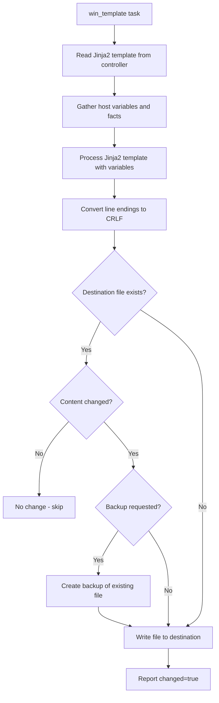

# How to Use Ansible win_template Module

Author: [nawazdhandala](https://www.github.com/nawazdhandala)

Tags: Ansible, Windows, Templates, Jinja2, Configuration Management

Description: Generate dynamic configuration files on Windows hosts using the Ansible win_template module with Jinja2 templates and variables.

---

Static configuration files work fine when every server is identical. But in the real world, each server has a different hostname, IP address, database connection, and set of features. The `win_template` module uses Jinja2 templates to generate configuration files dynamically, inserting host-specific variables, loop-generated content, and conditional sections. This is how you manage configuration files at scale without maintaining a separate copy for every server.

## How win_template Works

The `win_template` module takes a Jinja2 template file from the Ansible controller, processes it with the current host's variables, and writes the result to a file on the Windows host. It uses Windows-appropriate line endings (CRLF) by default, which is important for Windows applications that expect proper line endings.

## Basic Template Usage

Start with a simple template that inserts variables into a configuration file.

Create the template file on your Ansible controller.

```ini
# templates/app.conf.j2 - Application configuration template
; Application Configuration
; Generated by Ansible - Do not edit manually
; Host: {{ inventory_hostname }}
; Generated: {{ ansible_date_time.iso8601 }}

[General]
AppName={{ app_name }}
Environment={{ app_environment }}
LogLevel={{ log_level | default('INFO') }}

[Database]
Server={{ db_server }}
Port={{ db_port | default(1433) }}
Database={{ db_name }}
ConnectionTimeout={{ db_timeout | default(30) }}

[Network]
BindAddress={{ ansible_host }}
ListenPort={{ app_port }}
MaxConnections={{ max_connections | default(100) }}
```

Then use `win_template` to deploy it.

```yaml
# deploy-config.yml - Deploy a configuration file from template
---
- name: Deploy configuration from template
  hosts: app_servers
  vars:
    app_name: OrderProcessor
    app_environment: production
    log_level: WARN
    db_server: sql01.corp.local
    db_name: OrdersDB
    app_port: 8080

  tasks:
    - name: Deploy application configuration
      ansible.windows.win_template:
        src: templates/app.conf.j2
        dest: C:\Applications\OrderProcessor\config\app.conf
```

## Templates with Loops

Jinja2 loops let you generate repetitive configuration sections from lists.

Here is a template for an IIS URL Rewrite configuration.

```xml
<!-- templates/urlrewrite.config.j2 -->
<?xml version="1.0" encoding="UTF-8"?>
<!-- Generated by Ansible for {{ inventory_hostname }} -->
<configuration>
    <system.webServer>
        <rewrite>
            <rules>

                <rule name="{{ rule.name }}" stopProcessing="{{ rule.stop | default('true') }}">
                    <match url="{{ rule.pattern }}" />

                    <conditions>

                        <add input="{{ condition.input }}" pattern="{{ condition.pattern }}" />

                    </conditions>

                    <action type="{{ rule.action }}" url="{{ rule.url }}"
                            redirectType="{{ rule.redirect_type | default('Permanent') }}" />
                </rule>

            </rules>
        </rewrite>
    </system.webServer>
</configuration>
```

Deploy it with the corresponding variables.

```yaml
# deploy-urlrewrite.yml - Deploy URL rewrite rules from template
---
- name: Deploy IIS URL Rewrite Configuration
  hosts: web_servers
  vars:
    rewrite_rules:
      - name: "Force HTTPS"
        pattern: "(.*)"
        conditions:
          - input: "{HTTPS}"
            pattern: "^OFF$"
        action: Redirect
        url: "https://{HTTP_HOST}/{R:1}"
        redirect_type: Permanent
        stop: "true"
      - name: "API Proxy"
        pattern: "^api/(.*)"
        action: Rewrite
        url: "http://api-backend:8080/{R:1}"
        stop: "true"
      - name: "Default Document"
        pattern: "^$"
        action: Rewrite
        url: "/index.html"
        stop: "true"

  tasks:
    - name: Deploy URL rewrite configuration
      ansible.windows.win_template:
        src: templates/urlrewrite.config.j2
        dest: C:\inetpub\wwwroot\web.config
        backup: yes
```

## Templates with Conditionals

Use Jinja2 conditionals to include or exclude sections based on variables.

```ini
# templates/service.conf.j2 - Service configuration with conditionals
; Service Configuration for {{ inventory_hostname }}
; Environment: {{ app_env }}

[Service]
Name={{ service_name }}
Port={{ service_port }}


; Production-specific settings
WorkerThreads=32
CacheEnabled=true
CacheSizeMB=2048
DetailedLogging=false

; Staging-specific settings
WorkerThreads=8
CacheEnabled=true
CacheSizeMB=512
DetailedLogging=true

; Development settings
WorkerThreads=4
CacheEnabled=false
CacheSizeMB=128
DetailedLogging=true
DebugMode=true


[Endpoints]

Endpoint{{ loop.index }}={{ endpoint }}



[SSL]
CertificatePath={{ ssl_cert_path }}
KeyPath={{ ssl_key_path }}
Protocol=TLS1.2

```

```yaml
# deploy-service-config.yml - Deploy environment-specific service config
---
- name: Deploy service configuration
  hosts: app_servers
  vars:
    service_name: OrderService
    service_port: 8443
    app_env: production
    ssl_enabled: true
    ssl_cert_path: C:\Certificates\server.pfx
    ssl_key_path: C:\Certificates\server.key
    api_endpoints:
      - https://orders-api.corp.local/v1
      - https://orders-api.corp.local/v2
      - https://inventory-api.corp.local/v1

  tasks:
    - name: Deploy service configuration
      ansible.windows.win_template:
        src: templates/service.conf.j2
        dest: "C:\\Services\\{{ service_name }}\\config\\service.conf"
        backup: yes
      notify: restart_service

  handlers:
    - name: restart_service
      ansible.windows.win_service:
        name: "{{ service_name }}"
        state: restarted
```

## Generating PowerShell Scripts from Templates

Templates are not just for config files. You can generate PowerShell scripts dynamically.

```powershell
# templates/health-check.ps1.j2 - Dynamic health check script
# Health Check Script for {{ inventory_hostname }}
# Generated by Ansible on {{ ansible_date_time.date }}

$ErrorActionPreference = "Stop"
$results = @()

# Check critical services
$services = @(

    '{{ service.name }}'{{ ',' if not loop.last }}

)

foreach ($svc in $services) {
    $status = Get-Service -Name $svc -ErrorAction SilentlyContinue
    $results += [PSCustomObject]@{
        Check = "Service: $svc"
        Status = if ($status.Status -eq 'Running') { 'PASS' } else { 'FAIL' }
        Details = $status.Status
    }
}

# Check connectivity to backends
$backends = @(

    @{ Name = '{{ backend.name }}'; Host = '{{ backend.host }}'; Port = {{ backend.port }} }{{ ',' if not loop.last }}

)

foreach ($backend in $backends) {
    $test = Test-NetConnection -ComputerName $backend.Host -Port $backend.Port -WarningAction SilentlyContinue
    $results += [PSCustomObject]@{
        Check = "Backend: $($backend.Name)"
        Status = if ($test.TcpTestSucceeded) { 'PASS' } else { 'FAIL' }
        Details = "$($backend.Host):$($backend.Port)"
    }
}

# Check disk space

$disk = Get-WmiObject Win32_LogicalDisk -Filter "DeviceID='{{ drive }}:'"
$freePercent = [math]::Round(($disk.FreeSpace / $disk.Size) * 100, 1)
$results += [PSCustomObject]@{
    Check = "Disk Space {{ drive }}:"
    Status = if ($freePercent -gt {{ disk_threshold | default(10) }}) { 'PASS' } else { 'FAIL' }
    Details = "$freePercent% free"
}


# Output results
$results | Format-Table -AutoSize
$failCount = ($results | Where-Object Status -eq 'FAIL').Count
exit $failCount
```

```yaml
# deploy-healthcheck.yml - Deploy dynamic health check script
---
- name: Deploy health check script
  hosts: app_servers
  vars:
    critical_services:
      - { name: W3SVC }
      - { name: MyAppService }
      - { name: MSSQLSERVER }
    backend_servers:
      - { name: "Database", host: "sql01.corp.local", port: 1433 }
      - { name: "Cache", host: "redis01.corp.local", port: 6379 }
      - { name: "API Gateway", host: "api-gw.corp.local", port: 443 }
    monitored_drives:
      - C
      - D
    disk_threshold: 15

  tasks:
    - name: Create scripts directory
      ansible.windows.win_file:
        path: C:\Scripts
        state: directory

    - name: Deploy health check script
      ansible.windows.win_template:
        src: templates/health-check.ps1.j2
        dest: C:\Scripts\health-check.ps1
```

## Template with Backup and Validation

Always back up existing files before overwriting and validate the result.

```yaml
# template-with-validation.yml - Deploy template with safety checks
---
- name: Deploy template with validation
  hosts: web_servers
  tasks:
    - name: Deploy web.config from template
      ansible.windows.win_template:
        src: templates/web.config.j2
        dest: C:\inetpub\wwwroot\web.config
        backup: yes
      register: template_result

    - name: Show backup path
      ansible.builtin.debug:
        msg: "Backup saved to {{ template_result.backup_file }}"
      when: template_result.backup_file is defined

    # Validate the generated XML is well-formed
    - name: Validate generated config
      ansible.windows.win_shell: |
        try {
            [xml]$config = Get-Content C:\inetpub\wwwroot\web.config
            Write-Output "XML validation passed"
        } catch {
            Write-Error "XML validation failed: $_"
            exit 1
        }
      register: validation

    # Roll back if validation fails
    - name: Roll back on validation failure
      ansible.windows.win_copy:
        src: "{{ template_result.backup_file }}"
        dest: C:\inetpub\wwwroot\web.config
        remote_src: true
      when: validation.rc != 0 and template_result.backup_file is defined
```

## Template Processing Flow

Here is how `win_template` processes a template file.



## Useful Jinja2 Filters for Windows Templates

Here are some Jinja2 filters that are particularly useful for Windows configuration files.

```yaml
# In your template:
# {{ my_list | join(';') }}          - Join a list with semicolons (for PATH-like values)
# {{ my_string | win_basename }}     - Get the filename from a Windows path
# {{ my_string | win_dirname }}      - Get the directory from a Windows path
# {{ my_string | regex_replace('\\\\', '/') }}  - Convert backslashes to forward slashes
# {{ my_var | default('fallback') }} - Provide a default value
# {{ my_dict | to_nice_json }}       - Convert to formatted JSON
# {{ my_dict | to_nice_yaml }}       - Convert to formatted YAML
```

## Summary

The `win_template` module is arguably the most powerful configuration management tool in the Ansible Windows toolkit. It lets you maintain a single template that generates correct configuration files for every server in your fleet, automatically adapting to each host's variables, role, and environment. Use Jinja2 loops for repetitive sections, conditionals for environment-specific blocks, and filters for data transformation. Combined with backup support and post-deployment validation, `win_template` gives you safe, repeatable configuration management for any Windows application.
