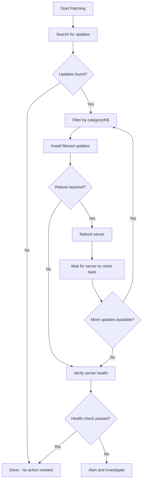

# How to Use Ansible win_updates Module for Windows Updates

Author: [nawazdhandala](https://www.github.com/nawazdhandala)

Tags: Ansible, Windows, Updates, Patch Management, Security

Description: Automate Windows Update patching with the Ansible win_updates module including scheduling, filtering, and controlled rollouts.

---

Patching Windows servers is one of those tasks that everyone agrees is important but nobody enjoys doing manually. The `win_updates` module automates the entire process: searching for updates, filtering by category or severity, installing patches, and handling reboots. Whether you manage 5 servers or 500, this module turns a weekend patching window into a single playbook run.

## How win_updates Works

The `win_updates` module talks to the Windows Update Agent (WUA) on each host. It can search for available updates, filter them by category, and install them. The module supports both Windows Update (internet) and WSUS (local update server) as sources, depending on how the host is configured.

## Installing All Available Updates

The simplest approach is to install everything that is available.

```yaml
# install-all-updates.yml - Install all available Windows updates
---
- name: Install all Windows updates
  hosts: windows_servers
  tasks:
    - name: Install all available updates
      ansible.windows.win_updates:
        category_names:
          - SecurityUpdates
          - CriticalUpdates
          - UpdateRollups
          - Updates
        state: installed
        reboot: yes
      register: update_result

    - name: Show update results
      ansible.builtin.debug:
        msg: |
          Updates installed: {{ update_result.installed_update_count }}
          Reboot required: {{ update_result.reboot_required }}
          Updates: {{ update_result.updates | dict2items | map(attribute='value.title') | list }}
```

## Filtering by Category

Windows updates fall into several categories. You can target specific categories to control what gets installed.

```yaml
# filter-by-category.yml - Install only specific categories
---
- name: Install security and critical updates only
  hosts: windows_servers
  tasks:
    # Install only security patches
    - name: Install security updates
      ansible.windows.win_updates:
        category_names:
          - SecurityUpdates
          - CriticalUpdates
        state: installed
        reboot: no
      register: security_updates

    - name: Report security update results
      ansible.builtin.debug:
        msg: "Installed {{ security_updates.installed_update_count }} security updates"
```

Available categories include:
- `SecurityUpdates`
- `CriticalUpdates`
- `UpdateRollups`
- `Updates`
- `DefinitionUpdates`
- `ServicePacks`
- `Drivers`
- `FeaturePacks`
- `Tools`
- `Connectors`
- `Application`
- `Guidance`

## Searching Without Installing

Sometimes you just want to see what updates are available without installing anything. Use `state: searched` for this.

```yaml
# search-updates.yml - Discover available updates without installing
---
- name: Search for available updates
  hosts: windows_servers
  tasks:
    - name: Search for all available updates
      ansible.windows.win_updates:
        category_names: '*'
        state: searched
      register: available_updates

    - name: Display available updates
      ansible.builtin.debug:
        msg: |
          Found {{ available_updates.found_update_count }} updates available:
          
          - {{ update.title }} ({{ update.categories | join(', ') }})
          
```

## Filtering by KB Article

You can include or exclude specific updates by their KB number.

```yaml
# filter-by-kb.yml - Target or exclude specific KB updates
---
- name: Manage specific updates
  hosts: windows_servers
  tasks:
    # Install only specific KB articles
    - name: Install specific hotfix
      ansible.windows.win_updates:
        accept_list:
          - KB5034441
          - KB5034439
        state: installed
        reboot: yes

    # Exclude problematic updates
    - name: Install all updates except known problematic ones
      ansible.windows.win_updates:
        category_names:
          - SecurityUpdates
          - CriticalUpdates
        reject_list:
          - KB5034441
          - KB9999999
        state: installed
        reboot: no
```

## Controlling Reboots

Reboots are a major concern during patching. The module gives you several options.

```yaml
# reboot-control.yml - Manage reboots during patching
---
- name: Patch with controlled reboots
  hosts: windows_servers
  serial: 2
  tasks:
    # Install updates without automatic reboot
    - name: Install updates (no reboot)
      ansible.windows.win_updates:
        category_names:
          - SecurityUpdates
          - CriticalUpdates
        state: installed
        reboot: no
      register: update_result

    # Manually reboot only if needed, with a longer timeout
    - name: Reboot with extended timeout
      ansible.windows.win_reboot:
        reboot_timeout: 900
        post_reboot_delay: 60
        msg: "Ansible patching reboot"
      when: update_result.reboot_required

    # Verify the server is healthy after reboot
    - name: Verify server is responsive
      ansible.windows.win_ping:

    # Check if more updates appeared after reboot
    - name: Check for additional updates post-reboot
      ansible.windows.win_updates:
        category_names:
          - SecurityUpdates
          - CriticalUpdates
        state: searched
      register: post_reboot_check

    - name: Report remaining updates
      ansible.builtin.debug:
        msg: "{{ post_reboot_check.found_update_count }} updates still pending"
```

## Rolling Updates with Serial Execution

When patching production servers, you want to update a few at a time to maintain availability.

```yaml
# rolling-updates.yml - Patch servers in rolling fashion
---
- name: Rolling Windows Update Deployment
  hosts: web_servers
  serial: 1
  max_fail_percentage: 0
  order: sorted

  tasks:
    # Remove server from load balancer before patching
    - name: Remove from load balancer
      ansible.builtin.uri:
        url: "http://lb.corp.local/api/pool/remove/{{ inventory_hostname }}"
        method: POST
      delegate_to: localhost

    - name: Wait for connections to drain
      ansible.builtin.pause:
        seconds: 30

    # Install updates
    - name: Install security updates
      ansible.windows.win_updates:
        category_names:
          - SecurityUpdates
          - CriticalUpdates
        state: installed
        reboot: yes
        reboot_timeout: 600
      register: patch_result

    # Verify the server is healthy
    - name: Verify IIS is running
      ansible.windows.win_service:
        name: W3SVC
        state: started

    - name: Verify web application responds
      ansible.windows.win_uri:
        url: http://localhost/health
        status_code: 200
      retries: 5
      delay: 10

    # Add server back to load balancer
    - name: Add back to load balancer
      ansible.builtin.uri:
        url: "http://lb.corp.local/api/pool/add/{{ inventory_hostname }}"
        method: POST
      delegate_to: localhost

    - name: Report patch results
      ansible.builtin.debug:
        msg: "{{ inventory_hostname }}: {{ patch_result.installed_update_count }} updates installed"
```

## Patching Process Flow

Here is the typical flow for a production patching operation.



## Using WSUS as Update Source

If your environment uses WSUS, the module automatically uses it based on the host's Group Policy settings. You can also set the source explicitly.

```yaml
# wsus-source.yml - Configure update source
---
- name: Patch using WSUS
  hosts: windows_servers
  tasks:
    # Ensure WSUS is configured via registry
    - name: Point to WSUS server
      ansible.windows.win_regedit:
        path: HKLM:\SOFTWARE\Policies\Microsoft\Windows\WindowsUpdate
        name: WUServer
        data: http://wsus.corp.local:8530
        type: string

    - name: Enable WSUS
      ansible.windows.win_regedit:
        path: HKLM:\SOFTWARE\Policies\Microsoft\Windows\WindowsUpdate\AU
        name: UseWUServer
        data: 1
        type: dword

    # Now install updates from WSUS
    - name: Install approved updates from WSUS
      ansible.windows.win_updates:
        category_names:
          - SecurityUpdates
          - CriticalUpdates
        server_selection: managed_server
        state: installed
        reboot: yes
```

## Generating Patch Compliance Reports

After patching, generate a report for your compliance team.

```yaml
# compliance-report.yml - Generate patch compliance report
---
- name: Generate Patch Compliance Report
  hosts: windows_servers
  tasks:
    - name: Check for remaining updates
      ansible.windows.win_updates:
        category_names: '*'
        state: searched
      register: remaining_updates

    - name: Get last installed update date
      ansible.windows.win_shell: |
        Get-HotFix | Sort-Object InstalledOn -Descending |
          Select-Object -First 1 InstalledOn |
          ForEach-Object { $_.InstalledOn.ToString('yyyy-MM-dd') }
      register: last_patch_date

    - name: Build compliance data
      ansible.builtin.set_fact:
        compliance_data:
          hostname: "{{ inventory_hostname }}"
          pending_updates: "{{ remaining_updates.found_update_count }}"
          last_patched: "{{ last_patch_date.stdout | trim }}"
          compliant: "{{ remaining_updates.found_update_count | int == 0 }}"

    - name: Report compliance status
      ansible.builtin.debug:
        msg: "{{ compliance_data }}"
```

## Summary

The `win_updates` module transforms Windows patching from a manual, error-prone weekend task into an automated, repeatable process. Use category filtering and KB accept/reject lists to control exactly what gets installed. Implement rolling updates with health checks for production environments. Combine searching with reporting for compliance visibility. The module handles the complexity of Windows Update so you can focus on keeping your servers secure and up to date.
