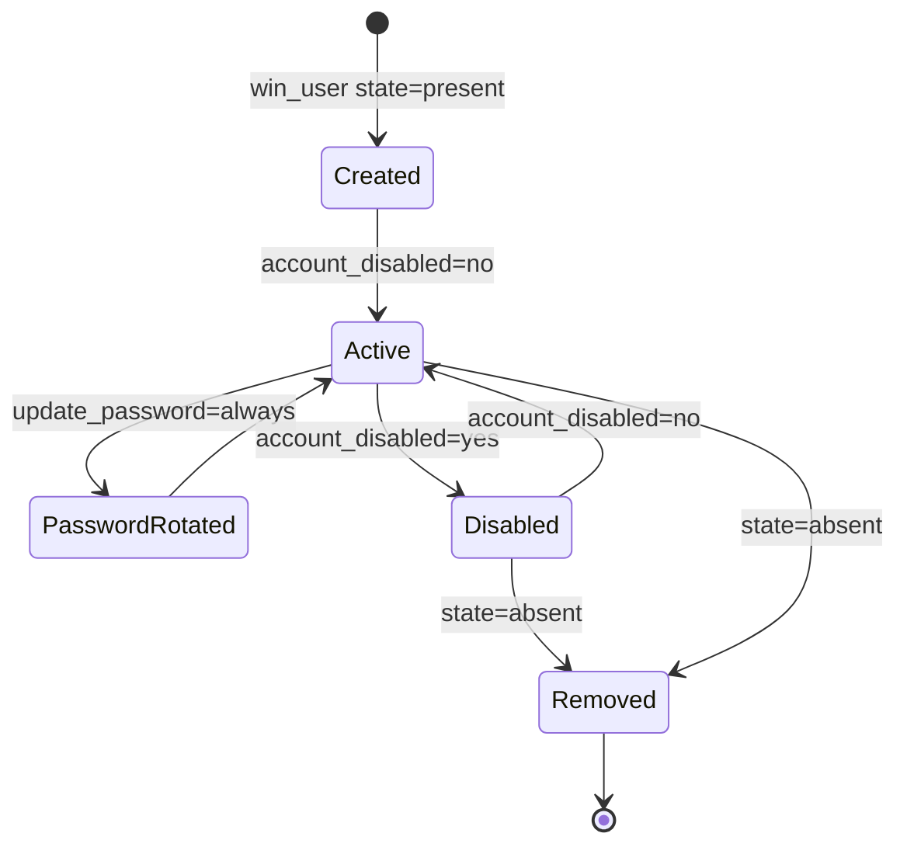

# How to Use Ansible win_user Module

Author: [nawazdhandala](https://www.github.com/nawazdhandala)

Tags: Ansible, Windows, User Management, Security, Automation

Description: Manage local Windows user accounts with the Ansible win_user module including creation, password policies, and group membership.

---

Managing local user accounts across a fleet of Windows servers by hand is tedious and error-prone. The `win_user` module lets you automate the full lifecycle of local Windows accounts: creating users, setting passwords, configuring password policies, managing group memberships, and disabling or removing accounts. This is especially useful for service accounts, local administrators, and compliance requirements.

## Creating a Basic User

The simplest operation is creating a new local user with a password.

```yaml
# create-user.yml - Create a local Windows user
---
- name: Create local users on Windows
  hosts: windows_servers
  tasks:
    # Create a basic user account
    - name: Create application service account
      ansible.windows.win_user:
        name: svc_myapp
        password: "{{ vault_svc_myapp_password }}"
        state: present
        description: "Service account for MyApp application"
```

Always store passwords in Ansible Vault rather than plain text. The `description` field shows up in Computer Management on the Windows host, which helps other admins understand what the account is for.

## Setting Password Policies

You can control how Windows handles the user's password, including whether it expires, whether the user can change it, and whether they must change it at first login.

```yaml
# password-policies.yml - Configure password behavior
---
- name: Configure user password policies
  hosts: windows_servers
  tasks:
    # Create a service account with a password that never expires
    - name: Create service account with non-expiring password
      ansible.windows.win_user:
        name: svc_backup
        password: "{{ vault_svc_backup_password }}"
        state: present
        password_never_expires: yes
        user_cannot_change_password: yes
        description: "Backup service account"

    # Create a user who must set their password on first login
    - name: Create new employee account
      ansible.windows.win_user:
        name: jsmith
        password: "TempPassword123!"
        state: present
        password_expired: yes
        description: "John Smith - Engineering"

    # Update an existing user's password
    - name: Rotate service account password
      ansible.windows.win_user:
        name: svc_myapp
        password: "{{ vault_svc_myapp_new_password }}"
        update_password: always
```

The `update_password` parameter is important. When set to `always` (the default), Ansible updates the password on every run. Set it to `on_create` if you only want the password set when the account is first created.

## Managing Group Membership

You can add users to local groups directly through the `win_user` module using the `groups` parameter.

```yaml
# group-membership.yml - Manage user group membership
---
- name: Manage group membership
  hosts: windows_servers
  tasks:
    # Add user to multiple groups (replace existing memberships)
    - name: Create admin user with group access
      ansible.windows.win_user:
        name: admin_deploy
        password: "{{ vault_admin_deploy_password }}"
        state: present
        groups:
          - Administrators
          - Remote Desktop Users
        groups_action: replace

    # Add to groups without removing existing memberships
    - name: Add user to additional groups
      ansible.windows.win_user:
        name: svc_monitoring
        password: "{{ vault_svc_monitoring_password }}"
        state: present
        groups:
          - Performance Monitor Users
          - Event Log Readers
        groups_action: add

    # Remove user from specific groups
    - name: Remove excessive permissions
      ansible.windows.win_user:
        name: old_admin
        groups:
          - Administrators
        groups_action: remove
```

The `groups_action` parameter controls how groups are handled:
- `replace`: Sets the user's groups to exactly the specified list
- `add`: Adds the specified groups without removing existing ones
- `remove`: Removes the user from the specified groups

## Enabling and Disabling Accounts

You can enable or disable accounts without deleting them. This is useful for temporarily revoking access.

```yaml
# account-status.yml - Enable and disable user accounts
---
- name: Manage account status
  hosts: windows_servers
  tasks:
    # Disable an account (preserves the account but prevents login)
    - name: Disable departed employee account
      ansible.windows.win_user:
        name: jdoe
        account_disabled: yes

    # Re-enable an account
    - name: Re-enable contractor account
      ansible.windows.win_user:
        name: contractor_bob
        account_disabled: no

    # Disable accounts that should not be used
    - name: Disable default Guest account
      ansible.windows.win_user:
        name: Guest
        account_disabled: yes
```

## Removing Users

When an account is no longer needed, remove it entirely.

```yaml
# remove-users.yml - Delete user accounts
---
- name: Remove old user accounts
  hosts: windows_servers
  tasks:
    # Remove a single user
    - name: Remove old service account
      ansible.windows.win_user:
        name: svc_oldapp
        state: absent

    # Remove multiple users
    - name: Clean up departed employee accounts
      ansible.windows.win_user:
        name: "{{ item }}"
        state: absent
      loop:
        - former_emp_1
        - former_emp_2
        - temp_contractor
```

## Real-World Example: Server Provisioning User Setup

Here is a complete playbook that sets up all the user accounts needed when provisioning a new application server.

```yaml
# provision-users.yml - Set up all users for a new app server
---
- name: Provision User Accounts on New Server
  hosts: new_servers
  vars:
    app_service_accounts:
      - name: svc_webapp
        description: "Web application service account"
        password: "{{ vault_svc_webapp_password }}"
        groups:
          - IIS_IUSRS
        password_never_expires: yes
      - name: svc_sqlclient
        description: "SQL client service account"
        password: "{{ vault_svc_sqlclient_password }}"
        groups: []
        password_never_expires: yes
      - name: svc_monitoring
        description: "Monitoring agent account"
        password: "{{ vault_svc_monitoring_password }}"
        groups:
          - Performance Monitor Users
          - Event Log Readers
        password_never_expires: yes

    admin_accounts:
      - name: admin_deploy
        description: "Deployment admin account"
        password: "{{ vault_admin_deploy_password }}"
      - name: admin_oncall
        description: "On-call engineer account"
        password: "{{ vault_admin_oncall_password }}"

  tasks:
    # Create service accounts with non-expiring passwords
    - name: Create application service accounts
      ansible.windows.win_user:
        name: "{{ item.name }}"
        password: "{{ item.password }}"
        state: present
        description: "{{ item.description }}"
        password_never_expires: yes
        user_cannot_change_password: yes
        groups: "{{ item.groups }}"
        groups_action: add
      loop: "{{ app_service_accounts }}"
      loop_control:
        label: "{{ item.name }}"
      no_log: true

    # Create admin accounts with Administrators group access
    - name: Create admin accounts
      ansible.windows.win_user:
        name: "{{ item.name }}"
        password: "{{ item.password }}"
        state: present
        description: "{{ item.description }}"
        groups:
          - Administrators
          - Remote Desktop Users
        groups_action: add
      loop: "{{ admin_accounts }}"
      loop_control:
        label: "{{ item.name }}"
      no_log: true

    # Harden the built-in accounts
    - name: Disable Guest account
      ansible.windows.win_user:
        name: Guest
        account_disabled: yes

    - name: Rename default Administrator account
      ansible.windows.win_user:
        name: Administrator
        fullname: "Local Admin (renamed)"
        account_disabled: no
```

## User Account Lifecycle

Here is how a typical user account moves through its lifecycle in an automated environment.



## Auditing User Accounts

Combine `win_shell` with user management for compliance auditing.

```yaml
# audit-users.yml - Audit local user accounts
---
- name: Audit local user accounts
  hosts: windows_servers
  tasks:
    # List all local users and their status
    - name: Get all local user accounts
      ansible.windows.win_shell: |
        Get-LocalUser | Select-Object Name, Enabled, PasswordLastSet,
          PasswordExpires, LastLogon, Description |
          ConvertTo-Json
      register: user_audit

    - name: Parse user audit data
      ansible.builtin.set_fact:
        local_users: "{{ user_audit.stdout | from_json }}"

    # Find accounts with passwords that never expire
    - name: Report non-expiring password accounts
      ansible.builtin.debug:
        msg: "WARNING: {{ item.Name }} has a non-expiring password"
      loop: "{{ local_users }}"
      when: item.PasswordExpires is none
      loop_control:
        label: "{{ item.Name }}"
```

## Important Notes

A few things to keep in mind when managing Windows users with Ansible:

1. **Domain vs Local**: The `win_user` module only manages local accounts. For Active Directory accounts, use `win_domain_user`.
2. **Password complexity**: Windows enforces password complexity requirements by default. If your password does not meet the policy, the task will fail.
3. **no_log**: Always use `no_log: true` on tasks that handle passwords to prevent them from appearing in Ansible output.
4. **SID stability**: When you delete and recreate a user, they get a new SID. Any NTFS permissions or scheduled tasks tied to the old SID will break. Prefer disabling over deleting when possible.

## Summary

The `win_user` module gives you complete control over local Windows user accounts through Ansible. From initial creation with password policies to group membership management and eventual removal, every step of the account lifecycle can be automated. Combined with Ansible Vault for password storage and `no_log` for output security, you can build a robust, auditable user management workflow for your entire Windows fleet.
