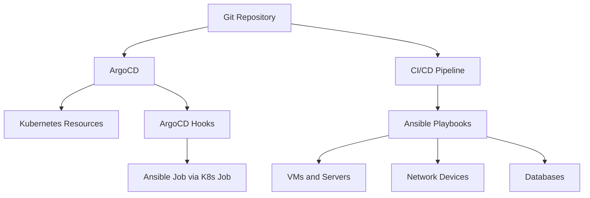
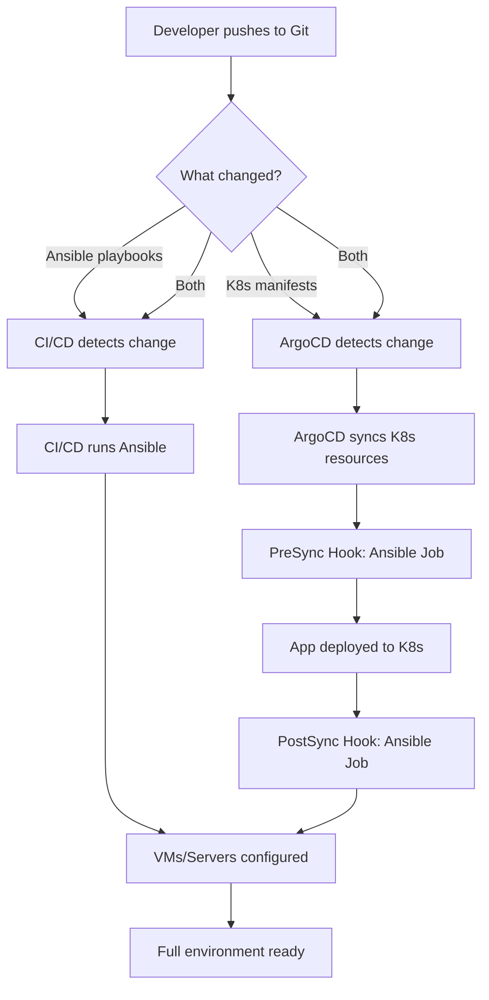

# How to Use Ansible with ArgoCD for GitOps

Author: [nawazdhandala](https://www.github.com/nawazdhandala)

Tags: Ansible, ArgoCD, GitOps, Kubernetes, DevOps

Description: Combine Ansible with ArgoCD for a GitOps workflow that manages both Kubernetes resources and traditional infrastructure from Git.

---

ArgoCD is the leading GitOps tool for Kubernetes, pulling desired state from Git and applying it to your clusters. But most organizations do not run everything in Kubernetes. They have VMs, network devices, databases, and other infrastructure that ArgoCD cannot manage directly. This is where Ansible comes in. By combining the two, you get a GitOps workflow that covers your entire infrastructure, not just what runs in Kubernetes.

This post covers the practical patterns for integrating Ansible with ArgoCD, including using Ansible as a config management plugin, triggering Ansible runs from ArgoCD hooks, and building a unified GitOps pipeline.

## Integration Patterns

There are several ways to combine Ansible and ArgoCD.



### Pattern 1: ArgoCD for K8s, CI/CD Triggers Ansible

The simplest pattern. ArgoCD manages Kubernetes resources, and a separate CI/CD pipeline runs Ansible for non-K8s infrastructure. Both are triggered by Git commits.

### Pattern 2: ArgoCD Resource Hooks Running Ansible

ArgoCD hooks can trigger Kubernetes Jobs that run Ansible playbooks. This keeps everything under ArgoCD's management.

### Pattern 3: Ansible as an ArgoCD Config Management Plugin

ArgoCD supports custom config management plugins. You can write a plugin that runs Ansible and generates Kubernetes manifests.

## Pattern 1: Parallel GitOps Workflows

This is the most common approach. Your Git repository contains both Kubernetes manifests and Ansible playbooks.

```
repo/
  kubernetes/
    apps/
      web-app/
        deployment.yaml
        service.yaml
    argocd/
      application.yaml
  ansible/
    playbooks/
      configure-db.yml
      configure-monitoring.yml
    inventory/
      production.ini
  .github/
    workflows/
      ansible-deploy.yml
```

ArgoCD watches the `kubernetes/` directory and applies changes to the cluster. GitHub Actions watches the `ansible/` directory and runs playbooks.

```yaml
# .github/workflows/ansible-deploy.yml
name: Ansible GitOps

on:
  push:
    branches: [main]
    paths:
      - 'ansible/**'

jobs:
  deploy:
    runs-on: ubuntu-latest
    steps:
      - uses: actions/checkout@v4

      - name: Install Ansible
        run: pip install ansible==8.7.0

      - name: Set up SSH
        run: |
          mkdir -p ~/.ssh
          echo "${{ secrets.SSH_PRIVATE_KEY }}" > ~/.ssh/id_rsa
          chmod 600 ~/.ssh/id_rsa

      - name: Run Ansible
        run: |
          cd ansible
          ansible-playbook -i inventory/production.ini playbooks/site.yml
        env:
          ANSIBLE_HOST_KEY_CHECKING: "false"
```

ArgoCD Application definition for the Kubernetes side.

```yaml
# kubernetes/argocd/application.yaml
apiVersion: argoproj.io/v1alpha1
kind: Application
metadata:
  name: web-app
  namespace: argocd
spec:
  project: default
  source:
    repoURL: https://github.com/your-org/your-repo.git
    targetRevision: main
    path: kubernetes/apps/web-app
  destination:
    server: https://kubernetes.default.svc
    namespace: production
  syncPolicy:
    automated:
      prune: true
      selfHeal: true
```

## Pattern 2: ArgoCD Hooks Running Ansible

Use ArgoCD PreSync or PostSync hooks to run Ansible playbooks as Kubernetes Jobs.

First, create a Docker image with Ansible and your playbooks.

```dockerfile
# Dockerfile.ansible-job
FROM python:3.11-slim

RUN apt-get update && \
    apt-get install -y openssh-client && \
    rm -rf /var/lib/apt/lists/*

RUN pip install --no-cache-dir ansible==8.7.0

# Copy playbooks into the image
COPY ansible/ /ansible/
WORKDIR /ansible

ENTRYPOINT ["ansible-playbook"]
```

Define a Kubernetes Job as an ArgoCD hook.

```yaml
# kubernetes/hooks/ansible-presync-job.yaml
apiVersion: batch/v1
kind: Job
metadata:
  name: ansible-db-configure
  annotations:
    argocd.argoproj.io/hook: PreSync
    argocd.argoproj.io/hook-delete-policy: HookSucceeded
spec:
  template:
    spec:
      containers:
        - name: ansible
          image: registry.example.com/ansible-job:latest
          args:
            - "-i"
            - "inventory/production.ini"
            - "--vault-password-file"
            - "/secrets/vault-pass"
            - "playbooks/configure-db.yml"
          env:
            - name: ANSIBLE_HOST_KEY_CHECKING
              value: "false"
          volumeMounts:
            - name: ssh-key
              mountPath: /root/.ssh
              readOnly: true
            - name: vault-pass
              mountPath: /secrets
              readOnly: true
      volumes:
        - name: ssh-key
          secret:
            secretName: ansible-ssh-key
            defaultMode: 0600
        - name: vault-pass
          secret:
            secretName: ansible-vault-pass
      restartPolicy: Never
  backoffLimit: 1
```

Create the required Kubernetes secrets.

```bash
# Create the SSH key secret
kubectl create secret generic ansible-ssh-key \
  --namespace argocd \
  --from-file=id_rsa=/path/to/ssh/key

# Create the vault password secret
kubectl create secret generic ansible-vault-pass \
  --namespace argocd \
  --from-literal=vault-pass=your-vault-password
```

## Pattern 3: Config Management Plugin

Create an ArgoCD config management plugin that runs Ansible to generate Kubernetes manifests.

```yaml
# argocd-cm ConfigMap - Register the plugin
apiVersion: v1
kind: ConfigMap
metadata:
  name: argocd-cm
  namespace: argocd
data:
  configManagementPlugins: |
    - name: ansible-k8s
      init:
        command: ["/bin/sh", "-c"]
        args: ["pip install ansible && ansible-galaxy collection install -r requirements.yml"]
      generate:
        command: ["/bin/sh", "-c"]
        args: ["ansible-playbook generate-manifests.yml -e 'output_dir=/tmp/manifests' && cat /tmp/manifests/*.yaml"]
```

The Ansible playbook generates Kubernetes manifests.

```yaml
# generate-manifests.yml
---
- name: Generate Kubernetes Manifests
  hosts: localhost
  connection: local
  gather_facts: false

  vars:
    output_dir: /tmp/manifests
    app_name: web-app
    app_version: "1.2.3"
    replicas: 3

  tasks:
    - name: Create output directory
      file:
        path: "{{ output_dir }}"
        state: directory

    - name: Generate deployment manifest
      template:
        src: templates/deployment.yaml.j2
        dest: "{{ output_dir }}/deployment.yaml"

    - name: Generate service manifest
      template:
        src: templates/service.yaml.j2
        dest: "{{ output_dir }}/service.yaml"
```

## Ansible AWX/Tower with ArgoCD

For a more robust setup, use AWX (the open-source version of Ansible Tower) as the execution engine. ArgoCD hooks trigger AWX job templates via its API.

```yaml
# kubernetes/hooks/trigger-awx-job.yaml
apiVersion: batch/v1
kind: Job
metadata:
  name: trigger-ansible-awx
  annotations:
    argocd.argoproj.io/hook: PostSync
    argocd.argoproj.io/hook-delete-policy: HookSucceeded
spec:
  template:
    spec:
      containers:
        - name: awx-trigger
          image: curlimages/curl:latest
          command: ["/bin/sh", "-c"]
          args:
            - |
              # Trigger an AWX job template via API
              curl -X POST \
                -H "Authorization: Bearer $AWX_TOKEN" \
                -H "Content-Type: application/json" \
                -d '{"extra_vars": {"deploy_version": "'"$APP_VERSION"'"}}' \
                https://awx.example.com/api/v2/job_templates/42/launch/

              echo "AWX job triggered"
          env:
            - name: AWX_TOKEN
              valueFrom:
                secretKeyRef:
                  name: awx-credentials
                  key: token
            - name: APP_VERSION
              value: "1.2.3"
      restartPolicy: Never
  backoffLimit: 1
```

## Full GitOps Workflow



## Tips for Ansible with ArgoCD

1. Keep your repository structure clear. Separate Kubernetes manifests from Ansible playbooks so ArgoCD and CI/CD can watch different paths.
2. Use ArgoCD hooks for Ansible tasks that must happen before or after a Kubernetes deployment (like database migrations or cache warming).
3. Store Ansible secrets as Kubernetes secrets when running Ansible as K8s Jobs. This keeps secret management consistent within the cluster.
4. The config management plugin approach is powerful but adds complexity. Use it only when Ansible genuinely needs to generate Kubernetes manifests.
5. Consider AWX/Tower as the Ansible execution engine for production. It provides job history, RBAC, and credential management that a simple K8s Job does not.
6. Tag your Ansible Docker images with specific versions. ArgoCD hooks reference container images, and you want predictable behavior.

Combining Ansible with ArgoCD lets you apply GitOps principles to your entire infrastructure, not just Kubernetes. The key is choosing the right integration pattern based on your team's needs and the complexity of your environment.
