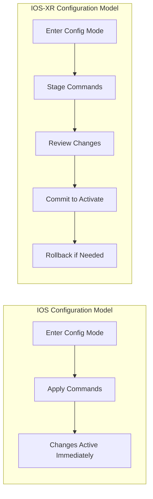

# How to Use Ansible with Cisco IOS-XR Devices

Author: [nawazdhandala](https://www.github.com/nawazdhandala)

Tags: Ansible, Cisco IOS-XR, Service Provider, Network Automation

Description: Automate Cisco IOS-XR routers with Ansible for service provider and large-scale enterprise routing configurations with practical examples.

---

Cisco IOS-XR is the network operating system that runs on Cisco's service provider and high-end enterprise routers, including the ASR 9000, NCS 5000/5500, and CRS series. IOS-XR is fundamentally different from IOS and NX-OS. It uses a commit-based configuration model (similar to JunOS), runs on a Linux-based microkernel architecture, and supports true process isolation and in-service software upgrades.

If you manage service provider infrastructure or large-scale routing environments, automating IOS-XR with Ansible can save significant operational time while reducing the risk of configuration errors.

## Key Differences from IOS

Before diving into automation, understand how IOS-XR differs from classic IOS:



IOS-XR uses a commit model. Configuration changes are staged and do not take effect until you explicitly commit them. This gives you a review step and the ability to roll back entire commits, which is much safer for production networks.

## Prerequisites

```bash
# Install the Cisco IOS-XR collection
ansible-galaxy collection install cisco.iosxr
ansible-galaxy collection install ansible.netcommon

# For NETCONF support
pip install ncclient xmltodict
```

```ini
# inventory/iosxr-devices.ini
# Cisco IOS-XR device inventory
[iosxr_routers]
asr9k-pe-01 ansible_host=10.0.0.1
asr9k-pe-02 ansible_host=10.0.0.2
ncs5500-core-01 ansible_host=10.0.0.10
ncs5500-core-02 ansible_host=10.0.0.11

[iosxr_routers:vars]
ansible_network_os=cisco.iosxr.iosxr
ansible_connection=ansible.netcommon.network_cli
ansible_user=admin
ansible_password={{ vault_iosxr_password }}
```

IOS-XR does not use the `enable` concept. Users are assigned to groups with specific privileges. The user you connect with should have the necessary command authorization.

## Gathering Facts

```yaml
# playbook-iosxr-facts.yml
# Collects system information from IOS-XR devices
- name: Gather IOS-XR facts
  hosts: iosxr_routers
  gather_facts: no

  tasks:
    - name: Collect device facts
      cisco.iosxr.iosxr_facts:
        gather_subset:
          - all
      register: xr_facts

    - name: Display device information
      ansible.builtin.debug:
        msg: |
          Hostname: {{ ansible_net_hostname }}
          Version: {{ ansible_net_version }}
          System: {{ ansible_net_system | default('N/A') }}
          Image: {{ ansible_net_image | default('N/A') }}
```

## Basic Configuration

The `cisco.iosxr.iosxr_config` module handles the commit model automatically. When you push configuration, Ansible stages the changes and commits them.

```yaml
# playbook-iosxr-base-config.yml
# Applies baseline configuration to IOS-XR devices
- name: Configure IOS-XR baseline
  hosts: iosxr_routers
  gather_facts: no

  tasks:
    - name: Configure hostname and domain
      cisco.iosxr.iosxr_config:
        lines:
          - hostname {{ inventory_hostname }}
          - domain name corp.local
          - domain name-server 10.0.0.53
          - domain name-server 10.0.0.54

    - name: Configure NTP
      cisco.iosxr.iosxr_config:
        lines:
          - server 10.0.0.50
          - server 10.0.0.51
          - source Loopback0
          - update-calendar
        parents: ntp

    - name: Configure logging
      cisco.iosxr.iosxr_config:
        lines:
          - logging trap informational
          - logging source-interface Loopback0
          - logging 10.0.100.50 vrf default severity info

    - name: Configure SSH
      cisco.iosxr.iosxr_config:
        lines:
          - ssh server v2
          - ssh server vrf default
          - ssh timeout 60
          - ssh server rate-limit 20

    - name: Configure LLDP
      cisco.iosxr.iosxr_config:
        lines:
          - lldp
```

## Interface Configuration

```yaml
# playbook-iosxr-interfaces.yml
# Configures interfaces on IOS-XR routers
- name: Configure IOS-XR interfaces
  hosts: iosxr_routers
  gather_facts: no

  tasks:
    - name: Configure Loopback interface
      cisco.iosxr.iosxr_interfaces:
        config:
          - name: Loopback0
            description: "Router ID - Management"
            enabled: true
        state: merged

    - name: Configure Loopback IP address
      cisco.iosxr.iosxr_l3_interfaces:
        config:
          - name: Loopback0
            ipv4:
              - address: "{{ router_id }}/32"
        state: merged

    - name: Configure physical interfaces
      cisco.iosxr.iosxr_interfaces:
        config:
          - name: TenGigE0/0/0/0
            description: "Uplink to Core - ncs5500-core-01"
            enabled: true
            mtu: 9216

          - name: TenGigE0/0/0/1
            description: "Uplink to Core - ncs5500-core-02"
            enabled: true
            mtu: 9216

          - name: GigabitEthernet0/0/0/0
            description: "Customer A - PE interface"
            enabled: true
        state: merged

    - name: Assign IP addresses to interfaces
      cisco.iosxr.iosxr_l3_interfaces:
        config:
          - name: TenGigE0/0/0/0
            ipv4:
              - address: 10.0.0.1/30
          - name: TenGigE0/0/0/1
            ipv4:
              - address: 10.0.0.5/30
        state: merged
```

## BGP Configuration

BGP is the core routing protocol for service provider networks. Here is how to configure it on IOS-XR:

```yaml
# playbook-iosxr-bgp.yml
# Configures BGP routing on IOS-XR for a service provider PE router
- name: Configure BGP
  hosts: iosxr_routers
  gather_facts: no

  vars:
    bgp_asn: 65000
    router_id: "10.0.0.1"
    bgp_neighbors:
      - address: 10.0.0.10
        remote_as: 65000
        description: "iBGP to ncs5500-core-01"
        update_source: Loopback0
      - address: 10.0.0.11
        remote_as: 65000
        description: "iBGP to ncs5500-core-02"
        update_source: Loopback0

  tasks:
    - name: Configure BGP process
      cisco.iosxr.iosxr_config:
        lines:
          - bgp router-id {{ router_id }}
          - bgp log neighbor changes detail
          - address-family ipv4 unicast
          - address-family vpnv4 unicast
        parents: router bgp {{ bgp_asn }}

    - name: Configure BGP neighbors
      cisco.iosxr.iosxr_config:
        lines:
          - remote-as {{ item.remote_as }}
          - description {{ item.description }}
          - update-source {{ item.update_source }}
          - address-family ipv4 unicast
          - address-family vpnv4 unicast
        parents:
          - router bgp {{ bgp_asn }}
          - neighbor {{ item.address }}
      loop: "{{ bgp_neighbors }}"
      loop_control:
        label: "{{ item.address }}"
```

## IS-IS Configuration (Common in SP Networks)

```yaml
# playbook-iosxr-isis.yml
# Configures IS-IS routing protocol for the underlay network
- name: Configure IS-IS
  hosts: iosxr_routers
  gather_facts: no

  vars:
    isis_net: "49.0001.{{ router_id | regex_replace('\\.', '') | regex_replace('(..)', '\\1.') }}.00"

  tasks:
    - name: Configure IS-IS process
      cisco.iosxr.iosxr_config:
        lines:
          - is-type level-2-only
          - net {{ isis_net }}
          - log adjacency changes
          - address-family ipv4 unicast
          - metric-style wide
        parents: router isis UNDERLAY

    - name: Add interfaces to IS-IS
      cisco.iosxr.iosxr_config:
        lines:
          - point-to-point
          - address-family ipv4 unicast
          - metric 10
        parents:
          - router isis UNDERLAY
          - interface {{ item }}
      loop:
        - Loopback0
        - TenGigE0/0/0/0
        - TenGigE0/0/0/1
```

## MPLS and VRF Configuration

```yaml
# playbook-iosxr-mpls-vrf.yml
# Configures MPLS and VRF for L3VPN services
- name: Configure MPLS L3VPN
  hosts: iosxr_routers
  gather_facts: no

  tasks:
    - name: Enable MPLS LDP
      cisco.iosxr.iosxr_config:
        lines:
          - router-id {{ router_id }}
          - interface TenGigE0/0/0/0
          - interface TenGigE0/0/0/1
        parents: mpls ldp

    - name: Configure VRF for Customer A
      cisco.iosxr.iosxr_config:
        lines:
          - address-family ipv4 unicast
          - import route-target 65000:100
          - export route-target 65000:100
          - rd 65000:100
        parents: vrf CUSTOMER-A

    - name: Assign interface to VRF
      cisco.iosxr.iosxr_config:
        lines:
          - vrf CUSTOMER-A
          - ipv4 address 192.168.1.1 255.255.255.252
          - no shutdown
        parents: interface GigabitEthernet0/0/0/0

    - name: Configure BGP VRF address family
      cisco.iosxr.iosxr_config:
        lines:
          - rd 65000:100
          - address-family ipv4 unicast
          - redistribute connected
          - redistribute static
        parents:
          - router bgp 65000
          - vrf CUSTOMER-A
```

## Using NETCONF for Structured Configuration

IOS-XR has excellent NETCONF support. Using NETCONF gives you structured XML data instead of CLI text parsing:

```yaml
# playbook-iosxr-netconf.yml
# Uses NETCONF for structured configuration management
- name: Configure via NETCONF
  hosts: iosxr_netconf
  gather_facts: no

  tasks:
    - name: Get interface configuration via NETCONF
      cisco.iosxr.iosxr_command:
        commands:
          - show running-config interface brief
      register: intf_config

    - name: Display interface configuration
      ansible.builtin.debug:
        msg: "{{ intf_config.stdout_lines[0] }}"
```

For NETCONF, update the inventory:

```ini
# NETCONF inventory settings
[iosxr_netconf:vars]
ansible_connection=ansible.netcommon.netconf
ansible_network_os=cisco.iosxr.iosxr
ansible_port=830
```

## Configuration Rollback

One of IOS-XR's best features is configuration rollback. Ansible can leverage this:

```yaml
# playbook-iosxr-rollback.yml
# Demonstrates configuration commit and rollback on IOS-XR
- name: Configuration with rollback safety
  hosts: iosxr_routers
  gather_facts: no

  tasks:
    - name: Show current commit history
      cisco.iosxr.iosxr_command:
        commands:
          - show configuration commit list 5
      register: commit_history

    - name: Display recent commits
      ansible.builtin.debug:
        msg: "{{ commit_history.stdout_lines[0] }}"

    - name: Apply configuration with comment
      cisco.iosxr.iosxr_config:
        lines:
          - description "Updated by Ansible"
        parents: interface Loopback0
        comment: "Ansible automated change - {{ lookup('pipe', 'date +%Y%m%d-%H%M') }}"
```

To roll back a bad change:

```yaml
    - name: Rollback to previous configuration
      cisco.iosxr.iosxr_command:
        commands:
          - rollback configuration last 1
      when: rollback_needed | default(false)
```

## Operational Show Commands

```yaml
# playbook-iosxr-show.yml
# Runs operational commands for health checking and troubleshooting
- name: IOS-XR operational verification
  hosts: iosxr_routers
  gather_facts: no

  tasks:
    - name: Run health check commands
      cisco.iosxr.iosxr_command:
        commands:
          - show bgp summary
          - show isis adjacency
          - show mpls ldp neighbor brief
          - show interface brief
          - show platform
      register: health_check

    - name: Display BGP summary
      ansible.builtin.debug:
        msg: "{{ health_check.stdout[0] }}"

    - name: Display IS-IS adjacencies
      ansible.builtin.debug:
        msg: "{{ health_check.stdout[1] }}"
```

## Tips for IOS-XR Automation

**Understand the commit model.** The `iosxr_config` module automatically commits changes. If you need to batch multiple changes into a single commit, put all the configuration lines in a single task.

**Use commit comments.** The `comment` parameter on `iosxr_config` adds a label to each commit, making it easy to identify Ansible-managed changes in `show configuration commit list`.

**Leverage rollback.** IOS-XR stores up to 100 previous configurations. If an automated change causes issues, you can quickly roll back from the CLI.

**Admin vs non-admin configuration.** IOS-XR has a concept of admin configuration (for hardware-level settings) and regular configuration. Most Ansible tasks work with regular configuration. Admin mode operations require additional handling.

**Process restarts are normal.** IOS-XR can restart individual processes without affecting the entire router. If a module reports "process restart," this is expected behavior and does not mean the router rebooted.

IOS-XR automation with Ansible is particularly valuable in service provider environments where you are managing complex routing configurations across many routers. The commit-based model and rollback capability make it safer than automating traditional IOS devices, and the structured NETCONF support provides a robust alternative to CLI-based automation.
