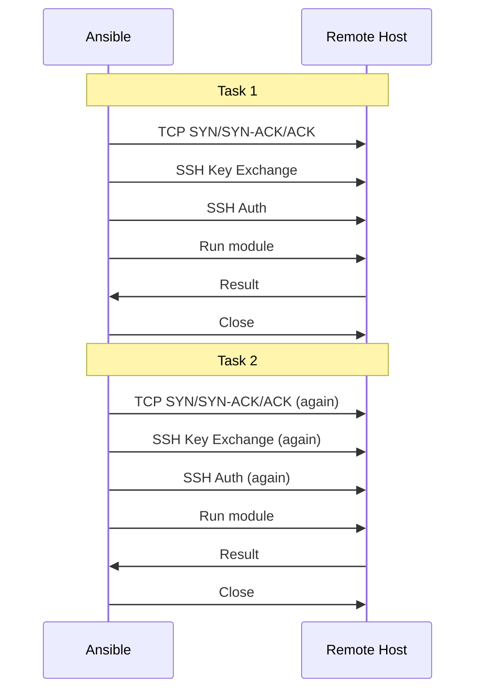
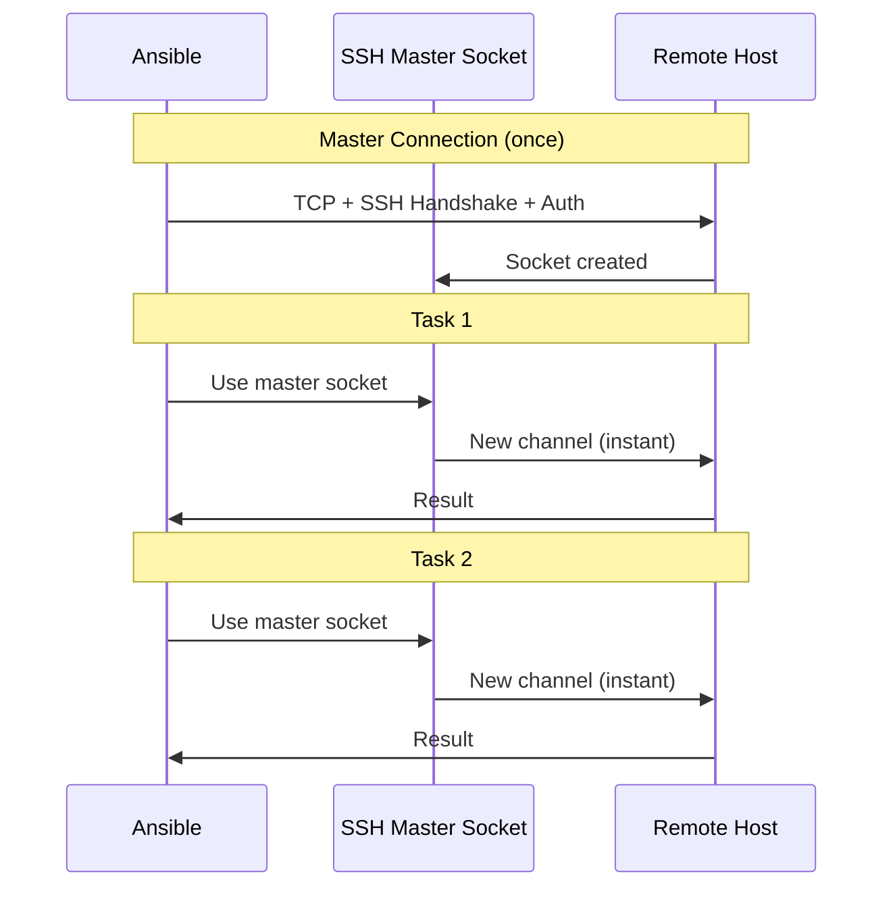

# How to Use Ansible with Connection Multiplexing

Author: [nawazdhandala](https://www.github.com/nawazdhandala)

Tags: Ansible, SSH, Connection Multiplexing, Performance

Description: Configure SSH connection multiplexing in Ansible to reuse SSH connections across tasks and dramatically reduce connection overhead.

---

SSH connection establishment is one of the biggest performance bottlenecks in Ansible. Each SSH handshake involves TCP connection setup, key exchange, authentication, and channel negotiation. Connection multiplexing solves this by opening a single SSH master connection and routing all subsequent SSH traffic through it. This post explains how multiplexing works, how to configure it optimally, and how to troubleshoot common issues.

## How SSH Multiplexing Works

Without multiplexing, every SSH command Ansible runs creates a brand new connection:



With multiplexing, the first connection becomes a "master" and subsequent connections piggyback on it:



The master connection handles TCP, key exchange, and authentication once. Subsequent tasks just open new SSH channels through the existing connection, which takes milliseconds instead of seconds.

## Default Configuration in Ansible

Ansible enables multiplexing by default with these settings:

```ini
# Default SSH args in Ansible
[ssh_connection]
ssh_args = -o ControlMaster=auto -o ControlPersist=60s
```

This means:
- `ControlMaster=auto`: Create a master connection if one does not exist, or reuse one if it does
- `ControlPersist=60s`: Keep the master connection alive for 60 seconds after the last SSH session closes

The default works, but it can be improved.

## Optimizing Multiplexing Settings

Here is my recommended configuration for production:

```ini
# ansible.cfg - Optimized connection multiplexing
[ssh_connection]
ssh_args = -o ControlMaster=auto -o ControlPersist=300s -o ControlPath=/tmp/ansible-mux-%h-%p-%r -o ServerAliveInterval=30 -o ServerAliveCountMax=3
pipelining = True
```

Let us break down each option:

**ControlPersist=300s**: Keep connections alive for 5 minutes. The default 60 seconds is too short for playbooks with many tasks. If a host takes longer than 60 seconds between SSH sessions (unlikely but possible), the master connection closes and must be re-established.

**ControlPath**: The path to the Unix socket file used for multiplexing. Keep it short to avoid socket path length limits:

```ini
# Good: short path, unique per host-port-user combination
ssh_args = -o ControlPath=/tmp/ansible-mux-%h-%p-%r

# Bad: long path that might hit the 108-character socket path limit
ssh_args = -o ControlPath=~/.ansible/connections/ansible-ssh-%h-%p-%r-very-long-name
```

**ServerAliveInterval=30**: Send a keepalive packet every 30 seconds to prevent firewalls from closing idle connections.

**ServerAliveCountMax=3**: Close the connection if 3 keepalive packets go unanswered. This detects dead connections quickly.

## Verifying Multiplexing Is Active

Check that multiplexing is working:

```bash
# Run a playbook with verbose SSH output
ansible-playbook site.yml -vvv 2>&1 | grep -i "controlmaster\|controlpath\|mux"
```

You should see messages like:

```
ssh: mux_client_request_session: master session id: 2
```

If you see repeated `ESTABLISH SSH CONNECTION` messages, multiplexing is not working correctly.

You can also check the socket files:

```bash
# List active multiplexed connections
ls -la /tmp/ansible-mux-*

# Check a specific connection's status
ssh -O check -o ControlPath=/tmp/ansible-mux-webserver01-22-admin webserver01
```

## ControlPath Socket Length Limit

Unix sockets have a maximum path length of 108 characters on Linux (104 on macOS). If your hostnames are long, you might hit this limit:

```bash
# This path might be too long:
# /home/deployuser/.ansible/cp/ansible-ssh-very-long-hostname.datacenter.company.example.com-22-deployuser

# Calculate the path length
echo -n "/tmp/ansible-mux-very-long-hostname.datacenter.company.example.com-22-deployuser" | wc -c
```

Solutions:

```ini
# Use a short base path
ssh_args = -o ControlPath=/tmp/a-%h-%p-%r

# Or use a hash-based path
ssh_args = -o ControlPath=/tmp/ansible-%C
# %C is a hash of the connection parameters (requires OpenSSH 6.7+)
```

The `%C` option creates a hash-based socket name that is always a fixed length:

```bash
# %C creates something like:
# /tmp/ansible-a1b2c3d4e5f6a1b2c3d4e5f6a1b2c3d4
```

## Tuning ControlPersist for Different Workloads

The right ControlPersist value depends on your usage pattern:

```ini
# For frequent playbook runs (CI/CD, monitoring checks)
# Keep connections alive longer to benefit from reuse
ssh_args = -o ControlPersist=600s  # 10 minutes

# For infrequent playbook runs (weekly maintenance)
# Shorter persistence saves resources
ssh_args = -o ControlPersist=60s

# For very long playbooks with many pauses
ssh_args = -o ControlPersist=1800s  # 30 minutes
```

## Managing Multiplexed Connections

Sometimes you need to manually manage connections:

```bash
# Check if a multiplexed connection is active
ssh -O check -o ControlPath=/tmp/ansible-mux-webserver01-22-admin webserver01 2>&1

# Gracefully close a multiplexed connection
ssh -O exit -o ControlPath=/tmp/ansible-mux-webserver01-22-admin webserver01

# Force close a multiplexed connection
ssh -O stop -o ControlPath=/tmp/ansible-mux-webserver01-22-admin webserver01

# Close all multiplexed connections
for sock in /tmp/ansible-mux-*; do
    ssh -O exit -o ControlPath="$sock" dummy 2>/dev/null
done
```

Create a cleanup script:

```bash
#!/bin/bash
# cleanup-mux.sh - Remove stale SSH multiplexing sockets

MUX_DIR="/tmp"
MUX_PATTERN="ansible-mux-*"

echo "=== Active multiplexed connections ==="
for sock in "$MUX_DIR"/$MUX_PATTERN; do
    [ -S "$sock" ] || continue
    if ssh -O check -o ControlPath="$sock" dummy 2>/dev/null; then
        echo "Active: $sock"
    else
        echo "Stale: $sock (removing)"
        rm -f "$sock"
    fi
done

REMAINING=$(ls "$MUX_DIR"/$MUX_PATTERN 2>/dev/null | wc -l)
echo "Remaining connections: $REMAINING"
```

## Multiplexing with Different Users

Multiplexing is scoped to the combination of host, port, and user. If your playbook uses different users for different tasks, each user gets their own master connection:

```yaml
---
- hosts: webservers
  tasks:
    # This uses the default ansible_user's connection
    - name: Check system status
      command: uptime
      changed_when: false

    # This creates a separate multiplexed connection for deploy_user
    - name: Deploy application
      copy:
        src: app.tar.gz
        dest: /opt/app/
      become: true
      become_user: deploy_user
```

The ControlPath template `%r` ensures each user has their own socket:

```ini
# %r = remote user, ensuring separate sockets per user
ssh_args = -o ControlPath=/tmp/ansible-mux-%h-%p-%r
```

## Performance Measurements

Benchmarking multiplexing on a 10-task playbook across 20 hosts:

```bash
#!/bin/bash
# benchmark-multiplexing.sh

PLAYBOOK="benchmark.yml"

echo "=== Without multiplexing ==="
time ansible-playbook "$PLAYBOOK" \
    --ssh-extra-args="-o ControlMaster=no" 2>/dev/null

echo ""
echo "=== With multiplexing (60s persist) ==="
time ansible-playbook "$PLAYBOOK" \
    --ssh-extra-args="-o ControlMaster=auto -o ControlPersist=60s" 2>/dev/null

echo ""
echo "=== With multiplexing (300s persist) ==="
time ansible-playbook "$PLAYBOOK" \
    --ssh-extra-args="-o ControlMaster=auto -o ControlPersist=300s" 2>/dev/null
```

Results:

| Configuration | Total Time | Per-Host Setup Time |
|---|---|---|
| No multiplexing | 3m 12s | 1.8s per connection |
| Multiplexing (60s) | 1m 45s | 1.8s first, 0.1s subsequent |
| Multiplexing (300s) | 1m 44s | Same as 60s for single run |

The 300s option shows similar performance for a single run but pays off when you run multiple playbooks in sequence, because the master connection from the first run is still alive for the second.

## Troubleshooting Multiplexing Failures

If multiplexing causes errors, here are common fixes:

```ini
# If you get "ControlSocket already exists" errors
# The previous connection did not clean up properly
ssh_args = -o ControlMaster=auto -o ControlPersist=300s -o ControlPath=/tmp/ansible-mux-%C

# If connections hang after network changes
# Lower the ServerAlive values
ssh_args = -o ServerAliveInterval=15 -o ServerAliveCountMax=2

# If you get "mux_client_request_session: session request failed"
# The master connection may be dead - remove stale sockets
rm /tmp/ansible-mux-*
```

Connection multiplexing is one of those optimizations that Ansible gets right by default, but understanding how to tune it and troubleshoot it makes a real difference at scale. Proper ControlPersist values, short socket paths, and keepalive settings are the three things to get right for reliable, fast SSH multiplexing.
