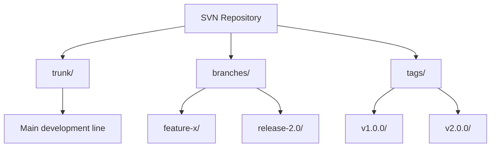

# How to Use Ansible with Git Subversion (svn) Module

Author: [nawazdhandala](https://www.github.com/nawazdhandala)

Tags: Ansible, SVN, Subversion, Version Control

Description: Learn how to use the Ansible subversion module to checkout SVN repositories, manage revisions, handle authentication, and migrate from SVN to Git workflows.

---

While Git dominates modern version control, Subversion (SVN) is still used in many organizations, especially in enterprise environments and legacy codebases. Ansible provides the `ansible.builtin.subversion` module for working with SVN repositories, and it follows the same patterns as the git module.

## Basic SVN Checkout

The `subversion` module checks out a repository to a destination directory:

```yaml
# playbook-svn-checkout.yml
# Checks out an SVN repository to the specified destination
- name: Checkout SVN repository
  hosts: webservers
  become: true

  tasks:
    - name: Install Subversion
      ansible.builtin.apt:
        name: subversion
        state: present

    - name: Checkout repository
      ansible.builtin.subversion:
        repo: "https://svn.example.com/repos/myapp/trunk"
        dest: /opt/myapp
```

## Checkout with Authentication

```yaml
# playbook-svn-auth.yml
# Checks out an SVN repository with username and password authentication
- name: Checkout with authentication
  hosts: webservers
  become: true
  vars:
    svn_user: "{{ lookup('env', 'SVN_USER') }}"
    svn_password: "{{ lookup('env', 'SVN_PASSWORD') }}"

  tasks:
    - name: Checkout with credentials
      ansible.builtin.subversion:
        repo: "https://svn.example.com/repos/myapp/trunk"
        dest: /opt/myapp
        username: "{{ svn_user }}"
        password: "{{ svn_password }}"
      no_log: true
```

## Checkout Specific Revision

Pin to a specific revision for reproducible deployments:

```yaml
# playbook-svn-revision.yml
# Checks out a specific SVN revision for reproducible deployment
- name: Checkout specific revision
  hosts: webservers
  become: true
  vars:
    target_revision: "12345"

  tasks:
    - name: Checkout at specific revision
      ansible.builtin.subversion:
        repo: "https://svn.example.com/repos/myapp/trunk"
        dest: /opt/myapp
        revision: "{{ target_revision }}"
      register: svn_result

    - name: Show checkout info
      ansible.builtin.debug:
        msg: "Checked out revision {{ svn_result.after }}"
```

## SVN Repository Structure

SVN uses a different branching model than Git:



## Checking Out Branches and Tags

```yaml
# playbook-svn-branches.yml
# Demonstrates checking out trunk, branches, and tags from SVN
- name: Checkout SVN branches and tags
  hosts: webservers
  become: true

  tasks:
    - name: Checkout trunk (main development)
      ansible.builtin.subversion:
        repo: "https://svn.example.com/repos/myapp/trunk"
        dest: /opt/myapp-trunk

    - name: Checkout a specific branch
      ansible.builtin.subversion:
        repo: "https://svn.example.com/repos/myapp/branches/release-2.0"
        dest: /opt/myapp-release

    - name: Checkout a specific tag
      ansible.builtin.subversion:
        repo: "https://svn.example.com/repos/myapp/tags/v2.0.0"
        dest: /opt/myapp-v2.0.0
```

## Force Checkout (Revert Local Changes)

```yaml
# playbook-svn-force.yml
# Force checks out SVN content, reverting any local modifications
- name: Force checkout with local change handling
  hosts: webservers
  become: true

  tasks:
    - name: Revert any local changes before update
      ansible.builtin.shell: |
        cd /opt/myapp
        svn revert -R .
        svn cleanup
      changed_when: true
      failed_when: false

    - name: Update to latest
      ansible.builtin.subversion:
        repo: "https://svn.example.com/repos/myapp/trunk"
        dest: /opt/myapp
        force: true
```

## SVN Checkout with Export (No .svn Directories)

If you do not need SVN metadata on the target:

```yaml
# playbook-svn-export.yml
# Exports SVN content without .svn metadata directories
- name: Export SVN repository (no working copy)
  hosts: webservers
  become: true

  tasks:
    - name: Export without SVN metadata
      ansible.builtin.subversion:
        repo: "https://svn.example.com/repos/myapp/trunk"
        dest: /opt/myapp
        export: true
```

The `export: true` parameter creates a clean copy without `.svn` directories, similar to `svn export`.

## Deployment with SVN

```yaml
# playbook-svn-deploy.yml
# Full deployment workflow using SVN checkout with post-deploy steps
- name: Deploy from SVN
  hosts: webservers
  become: true
  vars:
    svn_repo: "https://svn.example.com/repos/myapp"
    deploy_path: "{{ svn_repo }}/tags/v{{ version }}"
    app_dir: /opt/myapp

  tasks:
    - name: Checkout tagged version
      ansible.builtin.subversion:
        repo: "{{ deploy_path }}"
        dest: "{{ app_dir }}"
        force: true
      register: svn_result

    - name: Run post-deploy if code changed
      when: svn_result.changed
      block:
        - name: Install dependencies
          ansible.builtin.shell: "cd {{ app_dir }} && pip install -r requirements.txt"

        - name: Restart application
          ansible.builtin.systemd:
            name: myapp
            state: restarted

        - name: Health check
          ansible.builtin.uri:
            url: "http://localhost:8080/health"
            status_code: 200
          retries: 10
          delay: 3
```

## Migrating from SVN to Git

Ansible can help automate the SVN to Git migration:

```yaml
# playbook-svn-to-git.yml
# Automates migration from SVN to Git using git svn
- name: Migrate SVN repository to Git
  hosts: localhost
  become: false
  vars:
    svn_repo_url: "https://svn.example.com/repos/myapp"
    git_repo_url: "git@github.com:myorg/myapp.git"
    work_dir: /tmp/svn-migration

  tasks:
    - name: Install git-svn
      ansible.builtin.apt:
        name: git-svn
        state: present
      become: true

    - name: Create authors mapping file
      ansible.builtin.copy:
        content: |
          jsmith = John Smith <john@example.com>
          jdoe = Jane Doe <jane@example.com>
          svc_deploy = Deploy Bot <deploy@example.com>
        dest: "{{ work_dir }}/authors.txt"

    - name: Clone SVN repo as Git (this may take a while)
      ansible.builtin.shell: |
        git svn clone \
          --stdlayout \
          --authors-file={{ work_dir }}/authors.txt \
          {{ svn_repo_url }} \
          {{ work_dir }}/migrated-repo
      args:
        creates: "{{ work_dir }}/migrated-repo/.git"

    - name: Convert SVN tags to Git tags
      ansible.builtin.shell: |
        cd {{ work_dir }}/migrated-repo
        for branch in $(git branch -r | grep 'tags/'); do
          tag=$(echo "$branch" | sed 's|tags/||')
          git tag "$tag" "$branch"
          git branch -r -d "$branch"
        done
      changed_when: true

    - name: Add Git remote and push
      ansible.builtin.shell: |
        cd {{ work_dir }}/migrated-repo
        git remote add origin {{ git_repo_url }}
        git push origin --all
        git push origin --tags
```

## Managing Multiple SVN Checkouts

```yaml
# playbook-multi-svn.yml
# Checks out multiple SVN projects with different configurations
- name: Manage multiple SVN projects
  hosts: webservers
  become: true
  vars:
    svn_projects:
      - name: frontend
        url: "https://svn.example.com/repos/frontend/trunk"
        dest: /opt/frontend
      - name: backend
        url: "https://svn.example.com/repos/backend/tags/v3.0"
        dest: /opt/backend
      - name: shared-libs
        url: "https://svn.example.com/repos/shared-libs/trunk"
        dest: /opt/shared-libs

  tasks:
    - name: Checkout all projects
      ansible.builtin.subversion:
        repo: "{{ item.url }}"
        dest: "{{ item.dest }}"
        username: "{{ svn_user }}"
        password: "{{ svn_password }}"
      loop: "{{ svn_projects }}"
      loop_control:
        label: "{{ item.name }}"
      no_log: true
```

## Summary

The Ansible subversion module works just like the git module but for SVN repositories. Use `repo` for the SVN URL, `dest` for the checkout location, `revision` for pinning to a specific revision, and `export: true` for clean copies without SVN metadata. Authentication is handled with `username` and `password` parameters. The deployment patterns are the same as Git-based deployments: checkout the code, run post-deploy steps, and restart services only when the code has changed. If you are planning to migrate from SVN to Git, Ansible can automate the `git svn clone` process, author mapping, tag conversion, and push to the new Git remote.
