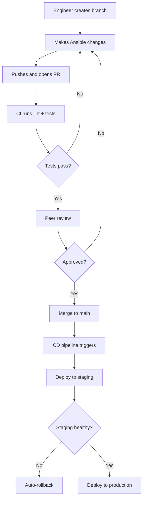

# How to Use Ansible with GitOps Workflow

Author: [nawazdhandala](https://www.github.com/nawazdhandala)

Tags: Ansible, GitOps, CI/CD, DevOps

Description: Learn how to implement a GitOps workflow with Ansible where Git is the single source of truth for infrastructure and deployments are automated.

---

GitOps is a practice where Git is the single source of truth for your infrastructure. Every change goes through a pull request, gets reviewed, and triggers automated deployment when merged. Ansible fits naturally into this model since playbooks and inventories are already declarative code that lives in Git. The challenge is wiring up the automation so changes flow from Git to your infrastructure without manual intervention.

## GitOps Principles Applied to Ansible

The core principles are:
1. All infrastructure configuration lives in Git
2. Changes happen through pull requests, not manual commands
3. Merging to the main branch triggers automated deployment
4. The system can detect and reconcile drift

Here is what the workflow looks like:



## Repository Structure for GitOps

Organize your repo to support automated workflows:

```
ansible-gitops/
├── .github/
│   └── workflows/
│       ├── lint.yml           # Runs on every PR
│       ├── test.yml           # Runs Molecule tests on PR
│       ├── deploy-staging.yml # Runs on merge to main
│       └── deploy-prod.yml    # Runs on release tag
├── inventories/
│   ├── staging/
│   └── production/
├── playbooks/
│   ├── site.yml
│   ├── deploy.yml
│   └── rollback.yml
├── roles/
├── requirements.yml
├── requirements.txt
└── ansible.cfg
```

## CI Pipeline: Validation on Pull Requests

Every PR runs linting and testing:

```yaml
# .github/workflows/lint.yml
name: Ansible Lint and Validate

on:
  pull_request:
    branches: [main]
    paths:
      - 'roles/**'
      - 'playbooks/**'
      - 'inventories/**'
      - 'group_vars/**'

jobs:
  lint:
    runs-on: ubuntu-latest
    steps:
      - uses: actions/checkout@v4

      - name: Set up Python
        uses: actions/setup-python@v5
        with:
          python-version: '3.11'
          cache: 'pip'

      - name: Install dependencies
        run: |
          pip install -r requirements.txt
          ansible-galaxy collection install -r requirements.yml

      - name: Run ansible-lint
        run: ansible-lint playbooks/ roles/ --strict

      - name: Validate playbook syntax
        run: |
          for playbook in playbooks/*.yml; do
            ansible-playbook "$playbook" --syntax-check \
              -i inventories/staging/hosts.yml
          done

      - name: Check vault files are encrypted
        run: |
          find . -name "vault.yml" | while read f; do
            head -1 "$f" | grep -q '^\$ANSIBLE_VAULT' || {
              echo "UNENCRYPTED VAULT: $f"
              exit 1
            }
          done
```

## CD Pipeline: Automatic Deployment on Merge

When code merges to main, deploy to staging automatically:

```yaml
# .github/workflows/deploy-staging.yml
name: Deploy to Staging

on:
  push:
    branches: [main]
    paths:
      - 'roles/**'
      - 'playbooks/**'
      - 'inventories/staging/**'

jobs:
  deploy:
    runs-on: ubuntu-latest
    environment: staging
    concurrency:
      group: staging-deploy
      cancel-in-progress: false

    steps:
      - uses: actions/checkout@v4

      - name: Set up Python
        uses: actions/setup-python@v5
        with:
          python-version: '3.11'

      - name: Install Ansible
        run: |
          pip install -r requirements.txt
          ansible-galaxy collection install -r requirements.yml

      - name: Configure SSH key
        run: |
          mkdir -p ~/.ssh
          echo "${{ secrets.STAGING_SSH_KEY }}" > ~/.ssh/id_rsa
          chmod 600 ~/.ssh/id_rsa
          ssh-keyscan -H ${{ secrets.STAGING_HOST }} >> ~/.ssh/known_hosts

      - name: Write vault password
        run: echo "${{ secrets.VAULT_PASSWORD_STAGING }}" > .vault_pass

      - name: Run playbook against staging
        run: |
          ansible-playbook playbooks/site.yml \
            -i inventories/staging/hosts.yml \
            --vault-password-file .vault_pass \
            --diff

      - name: Run post-deployment verification
        run: |
          ansible-playbook playbooks/verify.yml \
            -i inventories/staging/hosts.yml \
            --vault-password-file .vault_pass

      - name: Clean up secrets
        if: always()
        run: rm -f .vault_pass ~/.ssh/id_rsa
```

## Production Deployment via Tags

Production deploys are triggered by Git tags (releases):

```yaml
# .github/workflows/deploy-prod.yml
name: Deploy to Production

on:
  release:
    types: [published]

jobs:
  deploy:
    runs-on: ubuntu-latest
    environment: production

    steps:
      - uses: actions/checkout@v4
        with:
          ref: ${{ github.event.release.tag_name }}

      - name: Install Ansible
        run: |
          pip install -r requirements.txt
          ansible-galaxy collection install -r requirements.yml

      - name: Configure SSH
        run: |
          mkdir -p ~/.ssh
          echo "${{ secrets.PROD_SSH_KEY }}" > ~/.ssh/id_rsa
          chmod 600 ~/.ssh/id_rsa
          echo "${{ secrets.PROD_KNOWN_HOSTS }}" >> ~/.ssh/known_hosts

      - name: Write vault password
        run: echo "${{ secrets.VAULT_PASSWORD_PROD }}" > .vault_pass

      - name: Deploy to production (rolling)
        run: |
          ansible-playbook playbooks/site.yml \
            -i inventories/production/hosts.yml \
            --vault-password-file .vault_pass \
            --diff \
            -e "deploy_version=${{ github.event.release.tag_name }}"

      - name: Verify production deployment
        run: |
          ansible-playbook playbooks/verify.yml \
            -i inventories/production/hosts.yml \
            --vault-password-file .vault_pass

      - name: Clean up
        if: always()
        run: rm -f .vault_pass ~/.ssh/id_rsa
```

## Drift Detection

GitOps requires detecting when infrastructure drifts from the Git-defined state. Run playbooks in check mode on a schedule:

```yaml
# .github/workflows/drift-check.yml
name: Configuration Drift Detection

on:
  schedule:
    - cron: '0 */6 * * *'  # Every 6 hours

jobs:
  check-drift:
    runs-on: ubuntu-latest
    steps:
      - uses: actions/checkout@v4

      - name: Install Ansible
        run: |
          pip install -r requirements.txt
          ansible-galaxy collection install -r requirements.yml

      - name: Configure SSH
        run: |
          mkdir -p ~/.ssh
          echo "${{ secrets.PROD_SSH_KEY }}" > ~/.ssh/id_rsa
          chmod 600 ~/.ssh/id_rsa
          echo "${{ secrets.PROD_KNOWN_HOSTS }}" >> ~/.ssh/known_hosts

      - name: Check for drift
        id: drift
        run: |
          ansible-playbook playbooks/site.yml \
            -i inventories/production/hosts.yml \
            --vault-password-file .vault_pass \
            --check --diff 2>&1 | tee drift-report.txt

          # Check if any tasks would change
          if grep -q "changed=" drift-report.txt; then
            CHANGES=$(grep "changed=" drift-report.txt | grep -v "changed=0")
            if [ -n "$CHANGES" ]; then
              echo "drift_detected=true" >> $GITHUB_OUTPUT
            fi
          fi

      - name: Notify on drift
        if: steps.drift.outputs.drift_detected == 'true'
        run: |
          # Send alert to Slack or create a GitHub issue
          gh issue create \
            --title "Configuration drift detected $(date +%Y-%m-%d)" \
            --body "$(cat drift-report.txt)" \
            --label "drift,automated"
        env:
          GH_TOKEN: ${{ secrets.GITHUB_TOKEN }}
```

## Rollback Strategy

Include a rollback playbook that can restore the previous state:

```yaml
# playbooks/rollback.yml
# Rollback to a specific Git tag/version
- name: Rollback deployment
  hosts: all
  become: yes
  vars:
    rollback_version: "{{ rollback_to | mandatory }}"
  tasks:
    - name: Display rollback target
      ansible.builtin.debug:
        msg: "Rolling back to version {{ rollback_version }}"
      run_once: true

    - name: Checkout specified version of application
      ansible.builtin.git:
        repo: "{{ app_repo }}"
        dest: "{{ app_dir }}"
        version: "{{ rollback_version }}"
      notify: restart application

    - name: Verify application health after rollback
      ansible.builtin.uri:
        url: "http://localhost:{{ app_port }}/health"
        status_code: 200
      retries: 10
      delay: 5
```

```bash
# Trigger rollback manually
ansible-playbook playbooks/rollback.yml \
  -i inventories/production/hosts.yml \
  -e "rollback_to=v1.4.2"
```

## Summary

GitOps with Ansible means Git drives everything. All changes go through pull requests with CI validation. Merges to main automatically deploy to staging. Tagged releases deploy to production. Scheduled drift checks catch manual changes. Rollback playbooks provide a safety net. The key is that no one runs `ansible-playbook` from their laptop for production changes; every deployment is traceable through Git history and automated through CI/CD pipelines.
