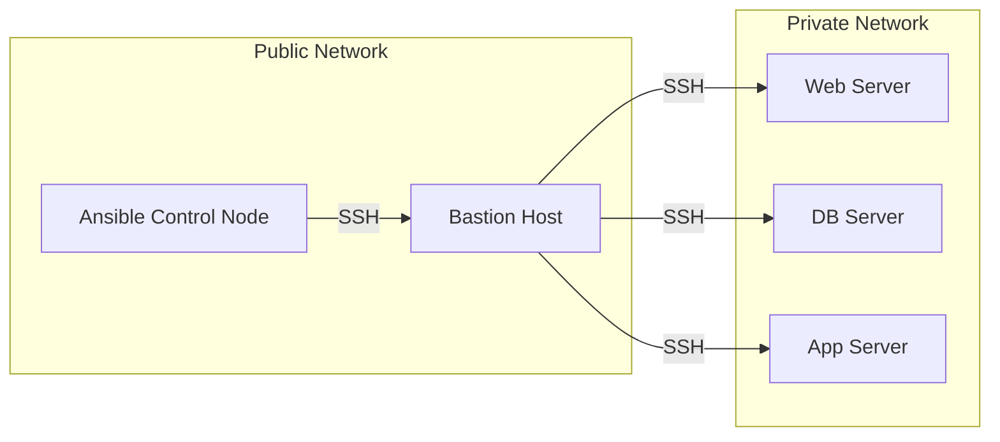

# How to Use Ansible with Jump Hosts (Bastion Hosts)

Author: [nawazdhandala](https://www.github.com/nawazdhandala)

Tags: Ansible, SSH, Bastion Host, Jump Host, Network Security

Description: Configure Ansible to reach servers behind bastion hosts using ProxyJump, ProxyCommand, and SSH config for secure infrastructure access.

---

In most production environments, servers are not directly accessible from the internet. They sit behind a bastion host (also called a jump host) that acts as a gateway. All SSH traffic must pass through this single, hardened entry point. Ansible needs to work through these bastions to manage the internal servers, and fortunately, SSH makes this straightforward.

## What Is a Bastion Host?

A bastion host is a server that sits on the edge of your network, accessible from the outside, and acts as a proxy for SSH connections to internal servers. The architecture looks like this:



Your Ansible control node can reach the bastion, and the bastion can reach the internal servers. The internal servers cannot be reached directly from outside.

## Method 1: ProxyJump (Recommended)

The simplest and most modern approach uses SSH's `ProxyJump` directive. Available in OpenSSH 7.3+, it handles the jump transparently.

### In ansible.cfg

```ini
# ansible.cfg
[ssh_connection]
ssh_args = -o ProxyJump=bastion_user@bastion.example.com
```

### Per Host Group in Inventory

```ini
# inventory/hosts
[bastion]
bastion01 ansible_host=bastion.example.com ansible_user=admin

[webservers]
web01 ansible_host=10.0.1.10
web02 ansible_host=10.0.1.11

[dbservers]
db01 ansible_host=10.0.2.10

[webservers:vars]
ansible_ssh_common_args=-o ProxyJump=admin@bastion.example.com

[dbservers:vars]
ansible_ssh_common_args=-o ProxyJump=admin@bastion.example.com
```

### Per Host

Different servers might use different bastions:

```ini
# inventory/hosts
[internal_servers]
web01 ansible_host=10.0.1.10 ansible_ssh_common_args="-o ProxyJump=admin@bastion-east.example.com"
web02 ansible_host=10.0.1.11 ansible_ssh_common_args="-o ProxyJump=admin@bastion-east.example.com"
db01 ansible_host=10.0.2.10 ansible_ssh_common_args="-o ProxyJump=admin@bastion-west.example.com"
```

## Method 2: ProxyCommand

For older SSH versions (before 7.3), use `ProxyCommand`:

```ini
# inventory/hosts
[webservers:vars]
ansible_ssh_common_args=-o ProxyCommand="ssh -W %h:%p admin@bastion.example.com"
```

The `-W %h:%p` tells SSH to forward the connection to the target host (`%h`) and port (`%p`) through the bastion.

For more control, use `ssh -q` to suppress banners:

```ini
[webservers:vars]
ansible_ssh_common_args=-o ProxyCommand="ssh -q -W %h:%p -i ~/.ssh/bastion_key admin@bastion.example.com"
```

## Method 3: SSH Config File

The cleanest approach for complex setups is using an SSH config file:

```bash
# ~/.ssh/config

# Bastion host configuration
Host bastion
    HostName bastion.example.com
    User admin
    IdentityFile ~/.ssh/bastion_key
    Port 22

# All internal servers go through the bastion
Host 10.0.*
    User deploy
    IdentityFile ~/.ssh/internal_key
    ProxyJump bastion
    StrictHostKeyChecking no

# Specific host overrides
Host web01
    HostName 10.0.1.10
    User deploy
    ProxyJump bastion
```

Then tell Ansible to use your SSH config:

```ini
# ansible.cfg
[ssh_connection]
ssh_args = -F ~/.ssh/config
```

With this setup, your inventory stays clean:

```ini
# inventory/hosts - No SSH configuration needed here
[webservers]
web01 ansible_host=10.0.1.10
web02 ansible_host=10.0.1.11

[dbservers]
db01 ansible_host=10.0.2.10
```

## Method 4: Group Variables

For team environments, use group_vars files:

```yaml
# group_vars/internal_servers.yml
ansible_ssh_common_args: >-
  -o ProxyJump=admin@bastion.example.com
  -o StrictHostKeyChecking=no
ansible_user: deploy
ansible_ssh_private_key_file: ~/.ssh/internal_key
```

## Multiple Jump Hosts

Sometimes you need to chain through multiple bastions:

```bash
# Two jump hosts in sequence
ansible_ssh_common_args="-o ProxyJump=admin@bastion1.example.com,admin@bastion2.internal"
```

Or in SSH config:

```bash
# ~/.ssh/config
Host bastion1
    HostName bastion1.example.com
    User admin

Host bastion2
    HostName bastion2.internal
    User admin
    ProxyJump bastion1

Host 10.0.*
    ProxyJump bastion2
```

## Different Keys for Bastion and Internal Hosts

It is common to use one SSH key for the bastion and a different key for internal servers:

```ini
# inventory/hosts
[webservers:vars]
ansible_ssh_common_args=-o ProxyCommand="ssh -i ~/.ssh/bastion_key -W %h:%p admin@bastion.example.com"
ansible_ssh_private_key_file=~/.ssh/internal_key
ansible_user=deploy
```

The `ProxyCommand` uses the bastion key, while `ansible_ssh_private_key_file` specifies the key for the final host.

## Performance Optimization with ControlMaster

SSH connections through a bastion are slower because each connection requires two SSH handshakes. ControlMaster helps by reusing connections:

```ini
# ansible.cfg
[ssh_connection]
ssh_args = -o ProxyJump=admin@bastion.example.com -o ControlMaster=auto -o ControlPersist=30m
control_path_dir = ~/.ansible/cp
pipelining = True
```

This keeps the SSH connection (including the bastion tunnel) alive for 30 minutes, so subsequent tasks do not need to re-establish the double hop.

## Dynamic Bastion Selection

If your bastion host changes based on environment:

```yaml
# group_vars/production.yml
bastion_host: bastion-prod.example.com
ansible_ssh_common_args: "-o ProxyJump=admin@{{ bastion_host }}"

# group_vars/staging.yml
bastion_host: bastion-staging.example.com
ansible_ssh_common_args: "-o ProxyJump=admin@{{ bastion_host }}"
```

## Complete Working Example

Here is a full setup for a typical production environment:

```ini
# ansible.cfg
[defaults]
inventory = inventory/hosts
remote_user = deploy
private_key_file = ~/.ssh/internal_key
host_key_checking = False

[ssh_connection]
pipelining = True
control_path_dir = ~/.ansible/cp
ssh_args = -o ControlMaster=auto -o ControlPersist=30m
```

```ini
# inventory/hosts
[bastion]
bastion01 ansible_host=bastion.example.com ansible_user=admin ansible_ssh_private_key_file=~/.ssh/bastion_key

[webservers]
web01 ansible_host=10.0.1.10
web02 ansible_host=10.0.1.11
web03 ansible_host=10.0.1.12

[dbservers]
db01 ansible_host=10.0.2.10
db02 ansible_host=10.0.2.11

[internal:children]
webservers
dbservers

[internal:vars]
ansible_ssh_common_args=-o ProxyJump=admin@bastion.example.com
```

```yaml
# test_connectivity.yml - Verify bastion setup works
---
- name: Test connectivity through bastion
  hosts: internal
  gather_facts: no

  tasks:
    - name: Ping through bastion
      ping:

    - name: Get hostname
      command: hostname
      register: host_result

    - name: Show hostname
      debug:
        msg: "Connected to {{ host_result.stdout }} via bastion"
```

```bash
# Run the test
ansible-playbook test_connectivity.yml
```

## Troubleshooting Bastion Connections

When things go wrong, increase verbosity:

```bash
# Maximum verbosity to see SSH connection details
ansible web01 -m ping -vvvv
```

Common issues and fixes:

```bash
# Test the bastion connection directly
ssh -i ~/.ssh/bastion_key admin@bastion.example.com

# Test the full chain manually
ssh -o ProxyJump=admin@bastion.example.com deploy@10.0.1.10

# Check if the bastion can reach the internal host
ssh admin@bastion.example.com "nc -zv 10.0.1.10 22"
```

If you see "Permission denied" errors, verify:
1. The bastion key is correct and has proper permissions
2. The internal key is correct
3. The user exists on both the bastion and target
4. The bastion's SSH config allows TCP forwarding (`AllowTcpForwarding yes` in sshd_config)

## Wrapping Up

Bastion hosts are a reality of production infrastructure, and Ansible handles them well. ProxyJump is the cleanest option for modern SSH installations, ProxyCommand works for older systems, and SSH config files keep things organized for complex multi-bastion setups. Combine your bastion configuration with ControlMaster and pipelining to keep performance acceptable despite the extra network hop. Once configured, the bastion becomes invisible, and your playbooks work exactly as if you had direct access to every server.
