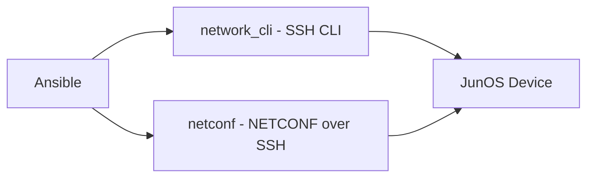

# How to Use Ansible with Juniper JunOS Devices

Author: [nawazdhandala](https://www.github.com/nawazdhandala)

Tags: Ansible, Juniper JunOS, Network Automation, NETCONF

Description: Automate Juniper JunOS devices with Ansible using NETCONF and CLI modules for routing, security, and configuration management tasks.

---

Juniper JunOS is one of the most automation-friendly network operating systems available. It was built from the ground up with a structured configuration model, native NETCONF support, and a commit-based workflow that makes it ideal for automated management. Whether you are running JunOS on SRX firewalls, MX series routers, EX series switches, or QFX data center switches, Ansible provides a comprehensive set of modules to manage them all.

JunOS's structured approach to configuration means that Ansible can work with it at a much deeper level than with many other network operating systems. The combination of NETCONF, structured output, and the commit/rollback model makes Juniper devices a pleasure to automate.

## Prerequisites

```bash
# Install the Juniper JunOS collection
ansible-galaxy collection install junipernetworks.junos
ansible-galaxy collection install ansible.netcommon

# Install Python dependencies for NETCONF
pip install ncclient
pip install jxmlease
pip install xmltodict
```

## Connection Options

JunOS supports multiple connection methods with Ansible:



NETCONF is the preferred connection method for JunOS. It provides structured XML data, proper error handling, and transactional configuration support.

```ini
# inventory/junos-devices.ini
# Juniper JunOS device inventory
[junos_routers]
mx-edge-01 ansible_host=10.0.0.1
mx-edge-02 ansible_host=10.0.0.2

[junos_switches]
ex-access-01 ansible_host=10.0.1.1
qfx-spine-01 ansible_host=10.0.2.1

[junos_firewalls]
srx-fw-01 ansible_host=10.0.3.1
srx-fw-02 ansible_host=10.0.3.2

[junos:children]
junos_routers
junos_switches
junos_firewalls

# NETCONF connection (preferred)
[junos:vars]
ansible_network_os=junipernetworks.junos.junos
ansible_connection=ansible.netcommon.netconf
ansible_user=ansible
ansible_password={{ vault_junos_password }}
ansible_port=830
```

For SSH CLI connection instead:

```ini
# Alternative: SSH CLI connection
[junos_cli:vars]
ansible_network_os=junipernetworks.junos.junos
ansible_connection=ansible.netcommon.network_cli
ansible_user=ansible
ansible_password={{ vault_junos_password }}
```

## Enabling NETCONF on JunOS

NETCONF needs to be enabled on each JunOS device before Ansible can connect via NETCONF:

```
# JunOS CLI commands to enable NETCONF
set system services netconf ssh
set system services netconf rfc-compliant
commit
```

Or with Ansible using the CLI connection first:

```yaml
# playbook-enable-netconf.yml
# Enables NETCONF service on JunOS devices via CLI
- name: Enable NETCONF
  hosts: junos
  gather_facts: no
  vars:
    ansible_connection: ansible.netcommon.network_cli

  tasks:
    - name: Enable NETCONF over SSH
      junipernetworks.junos.junos_config:
        lines:
          - set system services netconf ssh
          - set system services netconf rfc-compliant
```

## Gathering Device Facts

```yaml
# playbook-junos-facts.yml
# Collects system and configuration facts from JunOS devices
- name: Gather JunOS facts
  hosts: junos
  gather_facts: no

  tasks:
    - name: Collect all facts
      junipernetworks.junos.junos_facts:
        gather_subset:
          - all
      register: junos_facts

    - name: Display device information
      ansible.builtin.debug:
        msg: |
          Hostname: {{ ansible_net_hostname }}
          Model: {{ ansible_net_model }}
          JunOS Version: {{ ansible_net_version }}
          Serial: {{ ansible_net_serialnum }}
```

## Configuration Management

JunOS uses a hierarchical configuration format. The `junos_config` module supports both set commands and structured configuration:

### Using Set Commands

```yaml
# playbook-junos-set-config.yml
# Applies configuration using JunOS set commands
- name: Configure JunOS with set commands
  hosts: junos_routers
  gather_facts: no

  tasks:
    - name: Configure system settings
      junipernetworks.junos.junos_config:
        lines:
          - set system host-name {{ inventory_hostname }}
          - set system domain-name corp.local
          - set system name-server 10.0.0.53
          - set system name-server 10.0.0.54
          - set system time-zone America/New_York
          - set system ntp server 10.0.0.50
          - set system ntp server 10.0.0.51

    - name: Configure syslog
      junipernetworks.junos.junos_config:
        lines:
          - set system syslog host 10.0.100.50 any info
          - set system syslog host 10.0.100.50 authorization any
          - set system syslog file messages any info
          - set system syslog file messages authorization any

    - name: Configure login banner
      junipernetworks.junos.junos_config:
        lines:
          - set system login message "Authorized access only. All activity is monitored."
```

### Using Structured Configuration

You can also push configuration blocks in JunOS's curly-brace format:

```yaml
# playbook-junos-structured.yml
# Applies structured configuration using JunOS text format
- name: Configure with structured text
  hosts: junos_routers
  gather_facts: no

  tasks:
    - name: Push structured configuration
      junipernetworks.junos.junos_config:
        src: templates/router-base.conf.j2
        src_format: text
        update: merge
```

Where `templates/router-base.conf.j2` contains:

```
system {
    host-name {{ inventory_hostname }};
    domain-name corp.local;
    services {
        ssh {
            root-login deny;
            protocol-version v2;
            max-sessions-per-connection 32;
        }
        netconf {
            ssh;
        }
    }
}
```

## Interface Configuration

```yaml
# playbook-junos-interfaces.yml
# Configures interfaces on Juniper MX routers
- name: Configure JunOS interfaces
  hosts: junos_routers
  gather_facts: no

  tasks:
    - name: Configure loopback interface
      junipernetworks.junos.junos_l3_interfaces:
        config:
          - name: lo0
            ipv4:
              - address: "{{ router_id }}/32"
            unit: 0
        state: merged

    - name: Configure physical interfaces
      junipernetworks.junos.junos_config:
        lines:
          - set interfaces xe-0/0/0 description "Uplink to Core-01"
          - set interfaces xe-0/0/0 mtu 9192
          - set interfaces xe-0/0/0 unit 0 family inet address 10.0.0.1/30
          - set interfaces xe-0/0/0 unit 0 family mpls

          - set interfaces xe-0/0/1 description "Uplink to Core-02"
          - set interfaces xe-0/0/1 mtu 9192
          - set interfaces xe-0/0/1 unit 0 family inet address 10.0.0.5/30
          - set interfaces xe-0/0/1 unit 0 family mpls

          - set interfaces ge-0/0/0 description "Customer A - CE link"
          - set interfaces ge-0/0/0 unit 0 family inet address 192.168.1.1/30
```

## OSPF Configuration

```yaml
# playbook-junos-ospf.yml
# Configures OSPF routing on JunOS devices
- name: Configure JunOS OSPF
  hosts: junos_routers
  gather_facts: no

  tasks:
    - name: Configure OSPF
      junipernetworks.junos.junos_config:
        lines:
          - set protocols ospf area 0.0.0.0 interface lo0.0 passive
          - set protocols ospf area 0.0.0.0 interface xe-0/0/0.0 interface-type p2p
          - set protocols ospf area 0.0.0.0 interface xe-0/0/0.0 metric 100
          - set protocols ospf area 0.0.0.0 interface xe-0/0/1.0 interface-type p2p
          - set protocols ospf area 0.0.0.0 interface xe-0/0/1.0 metric 100
          - set protocols ospf traffic-engineering
          - set protocols ospf reference-bandwidth 100g
```

## BGP Configuration

```yaml
# playbook-junos-bgp.yml
# Configures BGP on a Juniper MX router
- name: Configure BGP
  hosts: junos_routers
  gather_facts: no

  vars:
    local_as: 65000
    bgp_neighbors:
      - address: 10.0.0.10
        peer_as: 65000
        description: "iBGP to core-01"
      - address: 10.0.0.11
        peer_as: 65000
        description: "iBGP to core-02"

  tasks:
    - name: Configure BGP global settings
      junipernetworks.junos.junos_config:
        lines:
          - set routing-options autonomous-system {{ local_as }}
          - set routing-options router-id {{ router_id }}

    - name: Configure BGP group and neighbors
      junipernetworks.junos.junos_config:
        lines:
          - set protocols bgp group INTERNAL type internal
          - set protocols bgp group INTERNAL local-address {{ router_id }}
          - set protocols bgp group INTERNAL family inet unicast
          - set protocols bgp group INTERNAL family inet-vpn unicast
          - set protocols bgp group INTERNAL export EXPORT-POLICY

    - name: Add BGP neighbors
      junipernetworks.junos.junos_config:
        lines:
          - set protocols bgp group INTERNAL neighbor {{ item.address }} description "{{ item.description }}"
          - set protocols bgp group INTERNAL neighbor {{ item.address }} peer-as {{ item.peer_as }}
      loop: "{{ bgp_neighbors }}"
      loop_control:
        label: "{{ item.address }}"
```

## Firewall Filter (ACL) Configuration

JunOS uses "firewall filters" instead of access control lists:

```yaml
# playbook-junos-firewall.yml
# Configures firewall filters on JunOS for traffic filtering
- name: Configure firewall filters
  hosts: junos_routers
  gather_facts: no

  tasks:
    - name: Configure management access filter
      junipernetworks.junos.junos_config:
        lines:
          - set firewall family inet filter MGMT-ACCESS term ALLOW-SSH from source-address 10.0.0.0/8
          - set firewall family inet filter MGMT-ACCESS term ALLOW-SSH from protocol tcp
          - set firewall family inet filter MGMT-ACCESS term ALLOW-SSH from destination-port ssh
          - set firewall family inet filter MGMT-ACCESS term ALLOW-SSH then accept

          - set firewall family inet filter MGMT-ACCESS term ALLOW-NETCONF from source-address 10.0.0.0/8
          - set firewall family inet filter MGMT-ACCESS term ALLOW-NETCONF from protocol tcp
          - set firewall family inet filter MGMT-ACCESS term ALLOW-NETCONF from destination-port 830
          - set firewall family inet filter MGMT-ACCESS term ALLOW-NETCONF then accept

          - set firewall family inet filter MGMT-ACCESS term ALLOW-SNMP from source-address 10.0.100.0/24
          - set firewall family inet filter MGMT-ACCESS term ALLOW-SNMP from protocol udp
          - set firewall family inet filter MGMT-ACCESS term ALLOW-SNMP from destination-port snmp
          - set firewall family inet filter MGMT-ACCESS term ALLOW-SNMP then accept

          - set firewall family inet filter MGMT-ACCESS term DENY-ALL then log
          - set firewall family inet filter MGMT-ACCESS term DENY-ALL then discard

    - name: Apply filter to loopback
      junipernetworks.junos.junos_config:
        lines:
          - set interfaces lo0 unit 0 family inet filter input MGMT-ACCESS
```

## Configuration Rollback

JunOS maintains up to 50 previous configurations by default. Ansible can leverage this for safe automation:

```yaml
# playbook-junos-rollback.yml
# Demonstrates commit-confirmed and rollback capabilities
- name: Safe configuration changes with rollback
  hosts: junos_routers
  gather_facts: no

  tasks:
    - name: Show rollback history
      junipernetworks.junos.junos_command:
        commands:
          - show system rollback compare 0 1
      register: rollback_diff

    - name: Apply configuration with commit confirm
      junipernetworks.junos.junos_config:
        lines:
          - set interfaces xe-0/0/2 description "New Customer Link"
          - set interfaces xe-0/0/2 unit 0 family inet address 172.16.0.1/30
        confirm_commit: true
        confirm: 5
      register: config_result

    - name: Confirm the commit if everything looks good
      junipernetworks.junos.junos_config:
        confirm_commit: true
      when: config_result.changed
```

The `confirm: 5` parameter means the commit will automatically roll back after 5 minutes unless you send a confirmation. This is a safety net for changes that might break connectivity.

## Backup and Restore

```yaml
# playbook-junos-backup.yml
# Backs up JunOS configuration and stores it locally
- name: Backup JunOS configurations
  hosts: junos
  gather_facts: no

  tasks:
    - name: Backup running configuration
      junipernetworks.junos.junos_config:
        backup: yes
        backup_options:
          dir_path: "./backups/junos/"
          filename: "{{ inventory_hostname }}-{{ lookup('pipe', 'date +%Y%m%d') }}.conf"

    - name: Get configuration in set format
      junipernetworks.junos.junos_command:
        commands:
          - show configuration | display set
      register: set_config

    - name: Save set-format config locally
      ansible.builtin.copy:
        content: "{{ set_config.stdout[0] }}"
        dest: "./backups/junos/{{ inventory_hostname }}-set-format.conf"
      delegate_to: localhost
```

## Operational Commands

```yaml
# playbook-junos-operations.yml
# Runs operational commands for monitoring and troubleshooting
- name: JunOS operational verification
  hosts: junos
  gather_facts: no

  tasks:
    - name: Run health check commands
      junipernetworks.junos.junos_command:
        commands:
          - show system alarms
          - show bgp summary
          - show ospf neighbor
          - show interfaces terse
          - show chassis routing-engine
      register: health_data

    - name: Check for active alarms
      ansible.builtin.debug:
        msg: "ALARMS: {{ health_data.stdout[0] }}"

    - name: Display BGP status
      ansible.builtin.debug:
        msg: "{{ health_data.stdout[1] }}"

    - name: Get structured output via RPC
      junipernetworks.junos.junos_command:
        commands:
          - command: show route summary
            output: json
      register: route_summary

    - name: Display route summary
      ansible.builtin.debug:
        msg: "{{ route_summary.stdout[0] }}"
```

## Tips for JunOS Automation

**NETCONF is the best connection method.** It provides structured data, proper error reporting, and transactional support. Always prefer NETCONF over CLI for JunOS automation.

**Use commit-confirmed for safety.** When making changes that could break connectivity, use the `confirm` parameter. If the commit breaks your SSH/NETCONF connection, the configuration rolls back automatically.

**JunOS set commands are idempotent by nature.** Running `set interfaces xe-0/0/0 description "foo"` twice has the same result. This aligns perfectly with Ansible's declarative model.

**Leverage JunOS's structured output.** Many JunOS commands support `| display json` or `| display xml` for structured output, which is much easier to parse than text.

**Configuration groups are powerful.** JunOS configuration groups let you define reusable configuration blocks. Ansible can apply or remove groups, which is a clean way to manage configuration templates.

**Be mindful of commit timing.** Each task that uses `junos_config` triggers a commit by default. For multiple related changes, put all the set commands in a single task to create a single atomic commit.

JunOS devices are among the most automation-friendly network platforms available. The native NETCONF support, structured configuration model, and robust commit/rollback system make them an ideal target for Ansible automation. Once you set up the NETCONF connection, you have access to a level of control and reliability that is hard to match on other platforms.
