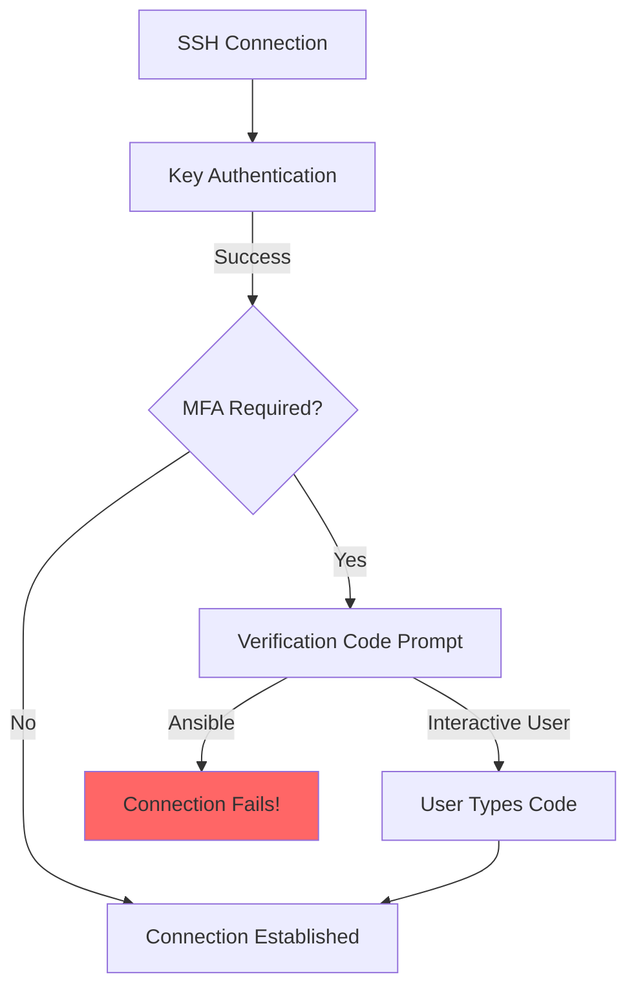

# How to Use Ansible with MFA/2FA SSH Authentication

Author: [nawazdhandala](https://www.github.com/nawazdhandala)

Tags: Ansible, SSH, MFA, Two-Factor Authentication, Security

Description: Configure Ansible to work with multi-factor SSH authentication including TOTP, hardware keys, and PAM-based 2FA solutions.

---

Multi-factor authentication (MFA) for SSH adds a second layer of security beyond SSH keys. But it creates a problem for automation tools like Ansible: how do you provide a one-time code when there is nobody sitting at the keyboard? This post covers several approaches to running Ansible against SSH servers that require MFA, from bypassing MFA for automation accounts (the most common approach) to integrating with hardware security keys and automated TOTP solutions.

## The MFA Challenge for Automation

When SSH MFA is enabled (typically via PAM with Google Authenticator or similar), users must provide both their SSH key and a time-based one-time password (TOTP):

```
$ ssh user@server
Authenticated with partial success.
Verification code: ______
```

Ansible cannot type a verification code interactively. This breaks automation unless you plan for it.



## Approach 1: Exempt Automation Users from MFA

The most common and recommended approach is to create a dedicated Ansible service account that is exempt from MFA. This keeps MFA for human users while allowing automation to work.

### Configure PAM Exemption

On each managed host, modify the PAM configuration to skip MFA for the Ansible user:

```bash
# /etc/pam.d/sshd
# Add this BEFORE the MFA line
auth [success=1 default=ignore] pam_succeed_if.so user = ansible

# Existing MFA line (Google Authenticator)
auth required pam_google_authenticator.so
```

The `success=1` tells PAM to skip the next rule (the MFA check) if the user is `ansible`.

### Automate the PAM Configuration

```yaml
# setup_mfa_exemption.yml
---
- name: Configure MFA exemption for Ansible user
  hosts: all
  become: yes

  vars:
    ansible_service_account: ansible
    pam_sshd_path: /etc/pam.d/sshd

  tasks:
    # Ensure the ansible user exists
    - name: Create ansible service account
      user:
        name: "{{ ansible_service_account }}"
        shell: /bin/bash
        system: yes
        create_home: yes

    # Deploy the SSH key
    - name: Add SSH authorized key
      authorized_key:
        user: "{{ ansible_service_account }}"
        key: "{{ lookup('file', '~/.ssh/ansible_key.pub') }}"
        state: present

    # Configure passwordless sudo
    - name: Configure sudo for ansible user
      copy:
        content: "{{ ansible_service_account }} ALL=(ALL) NOPASSWD: ALL\n"
        dest: "/etc/sudoers.d/{{ ansible_service_account }}"
        mode: '0440'
        validate: 'visudo -cf %s'

    # Add PAM exemption for MFA
    - name: Add MFA exemption for ansible user
      lineinfile:
        path: "{{ pam_sshd_path }}"
        insertbefore: 'pam_google_authenticator'
        line: "auth [success=1 default=ignore] pam_succeed_if.so user = {{ ansible_service_account }}"
```

### Restrict the Exempt Account

Since this account bypasses MFA, lock it down:

```yaml
# Restrict the ansible user's SSH access
- name: Configure SSH restrictions for ansible user
  blockinfile:
    path: /etc/ssh/sshd_config
    block: |
      Match User ansible
          PasswordAuthentication no
          PubkeyAuthentication yes
          AllowAgentForwarding no
          X11Forwarding no
          PermitTTY yes
    marker: "# {mark} ANSIBLE AUTOMATION USER"
  notify: restart sshd
```

## Approach 2: Group-Based MFA Exemption

Instead of exempting a single user, exempt a group:

```bash
# Create the automation group
groupadd automation

# Add the ansible user to it
usermod -aG automation ansible
```

```bash
# /etc/pam.d/sshd
# Skip MFA for members of the automation group
auth [success=1 default=ignore] pam_succeed_if.so user ingroup automation
auth required pam_google_authenticator.so
```

PAM configuration with Ansible:

```yaml
- name: Set up group-based MFA exemption
  hosts: all
  become: yes

  tasks:
    - name: Create automation group
      group:
        name: automation
        state: present

    - name: Add ansible user to automation group
      user:
        name: ansible
        groups: automation
        append: yes

    - name: Configure PAM to exempt automation group
      lineinfile:
        path: /etc/pam.d/sshd
        insertbefore: 'pam_google_authenticator'
        line: 'auth [success=1 default=ignore] pam_succeed_if.so user ingroup automation'
```

## Approach 3: IP-Based MFA Exemption

Exempt connections from specific IPs (like your Ansible control node):

```bash
# /etc/pam.d/sshd
# Skip MFA for connections from the Ansible control node
auth [success=1 default=ignore] pam_access.so accessfile=/etc/security/access-local.conf
auth required pam_google_authenticator.so
```

```bash
# /etc/security/access-local.conf
# Allow without MFA from the Ansible control node
+ : ALL : 10.0.0.50
# Require MFA from everywhere else
- : ALL : ALL
```

```yaml
- name: Configure IP-based MFA exemption
  hosts: all
  become: yes

  vars:
    ansible_control_ip: "10.0.0.50"

  tasks:
    - name: Create access control file
      copy:
        content: |
          + : ALL : {{ ansible_control_ip }}
          - : ALL : ALL
        dest: /etc/security/access-mfa.conf
        mode: '0644'

    - name: Configure PAM for IP-based exemption
      lineinfile:
        path: /etc/pam.d/sshd
        insertbefore: 'pam_google_authenticator'
        line: 'auth [success=1 default=ignore] pam_access.so accessfile=/etc/security/access-mfa.conf'
```

## Approach 4: SSH Certificates with MFA Bypass

SSH certificates can include extensions that bypass MFA for specific certificate holders:

```bash
# Sign the Ansible key with a special extension
ssh-keygen -s ~/ssh-ca/ca_key \
    -I "ansible-no-mfa" \
    -n ansible \
    -V +4w \
    -O no-touch-required \
    ~/.ssh/ansible_key.pub
```

Configure sshd to skip MFA for certificate-authenticated users:

```bash
# /etc/ssh/sshd_config
Match User ansible
    AuthenticationMethods publickey
    # This skips the keyboard-interactive (MFA) step
```

Versus human users who need both:

```bash
# /etc/ssh/sshd_config
Match User *,!ansible
    AuthenticationMethods publickey,keyboard-interactive
```

## Approach 5: FIDO2/Hardware Key Integration

Modern SSH supports FIDO2 hardware security keys (like YubiKeys) as a second factor. These can work with Ansible if the key is physically present:

```bash
# Generate an SSH key tied to a FIDO2 device
ssh-keygen -t ed25519-sk -C "ansible-yubikey" -f ~/.ssh/ansible_sk_key

# -sk means "security key" (FIDO2)
# The key requires physical touch of the hardware key
```

For Ansible, you would need the hardware key present on the control node during playbook execution. This works for manual runs but not for unattended automation like CI/CD.

For resident keys (stored on the hardware key):

```bash
# Generate a resident key
ssh-keygen -t ed25519-sk -O resident -C "ansible-resident" -f ~/.ssh/ansible_resident_key

# The private key material stays on the hardware device
```

## Approach 6: AuthenticationMethods Configuration

SSH supports specifying which authentication methods are required and in what order. Use this to create different requirements for different users:

```bash
# /etc/ssh/sshd_config

# Default: require key + MFA for all users
AuthenticationMethods publickey,keyboard-interactive

# Exception: automation accounts only need a key
Match User ansible
    AuthenticationMethods publickey

# Exception: internal network only needs a key
Match Address 10.0.0.0/8
    AuthenticationMethods publickey
```

```yaml
# configure_auth_methods.yml
---
- name: Configure SSH authentication methods
  hosts: all
  become: yes

  tasks:
    - name: Set default authentication methods
      lineinfile:
        path: /etc/ssh/sshd_config
        regexp: '^AuthenticationMethods'
        line: 'AuthenticationMethods publickey,keyboard-interactive'
        validate: 'sshd -t -f %s'

    - name: Exempt ansible user from MFA
      blockinfile:
        path: /etc/ssh/sshd_config
        block: |
          Match User ansible
              AuthenticationMethods publickey
        insertafter: '^AuthenticationMethods'
        validate: 'sshd -t -f %s'
      notify: restart sshd

  handlers:
    - name: restart sshd
      service:
        name: sshd
        state: restarted
```

## Securing the MFA-Exempt Account

Since the automation account bypasses MFA, compensating controls are essential:

```yaml
# harden_ansible_account.yml
---
- name: Harden the Ansible automation account
  hosts: all
  become: yes

  tasks:
    # Restrict SSH key to specific source IP
    - name: Restrict authorized_key to source IP
      authorized_key:
        user: ansible
        key: "{{ lookup('file', '~/.ssh/ansible_key.pub') }}"
        key_options: 'from="10.0.0.50",no-agent-forwarding,no-port-forwarding,no-X11-forwarding'
        state: present
        exclusive: yes

    # Set up audit logging for the ansible user
    - name: Configure auditd rules for ansible user
      copy:
        content: |
          -a always,exit -F arch=b64 -F euid=ansible -S execve -k ansible_commands
        dest: /etc/audit/rules.d/ansible.rules
        mode: '0640'
      notify: restart auditd

    # Limit sudo commands (if possible)
    - name: Configure restricted sudo
      copy:
        content: |
          ansible ALL=(ALL) NOPASSWD: /usr/bin/apt-get, /usr/bin/systemctl, /usr/bin/cp, /bin/mkdir, /bin/chown, /bin/chmod
        dest: /etc/sudoers.d/ansible
        mode: '0440'
        validate: 'visudo -cf %s'

  handlers:
    - name: restart auditd
      service:
        name: auditd
        state: restarted
```

## Testing MFA Configuration

Verify that MFA works for human users and is bypassed for automation:

```bash
# Test as a human user (should prompt for MFA)
ssh human_user@server
# Expected: Asks for verification code

# Test as the ansible user (should skip MFA)
ssh -i ~/.ssh/ansible_key ansible@server
# Expected: Connects directly

# Test with Ansible
ansible all -m ping -u ansible --private-key=~/.ssh/ansible_key
# Expected: Success without any MFA prompt
```

## Wrapping Up

MFA on SSH is excellent for security, but it requires planning for automation. The most practical approach is exempting your Ansible service account from MFA while compensating with other security controls: source IP restrictions on the authorized key, audit logging, and limited sudo permissions. Group-based or IP-based exemptions offer more flexible alternatives. Whichever approach you choose, make sure the exempted account has the minimal permissions necessary and is monitored closely. The goal is to keep MFA protection for human access while allowing automation to function reliably.
