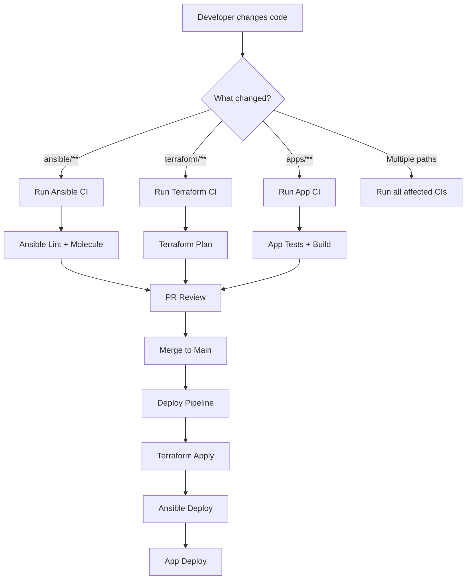

# How to Use Ansible with Monorepo Structure

Author: [nawazdhandala](https://www.github.com/nawazdhandala)

Tags: Ansible, Monorepo, Repository Structure, DevOps

Description: Learn how to organize Ansible automation in a monorepo alongside application code, Terraform, and other infrastructure tools effectively.

---

A monorepo puts all your infrastructure code in a single repository. Ansible playbooks, Terraform modules, application code, CI/CD pipelines, and documentation all live together. This approach has real benefits for teams that want a single source of truth, but it requires careful organization to avoid chaos. Here is how to make it work.

## Monorepo Directory Layout

Structure the repo so each tool has its own directory but shares common configuration:

```
infrastructure/
├── ansible/
│   ├── ansible.cfg
│   ├── requirements.yml
│   ├── inventories/
│   │   ├── production/
│   │   │   ├── hosts.yml
│   │   │   ├── group_vars/
│   │   │   └── host_vars/
│   │   └── staging/
│   │       ├── hosts.yml
│   │       ├── group_vars/
│   │       └── host_vars/
│   ├── playbooks/
│   │   ├── site.yml
│   │   ├── deploy.yml
│   │   └── maintenance.yml
│   └── roles/
│       ├── common/
│       ├── nginx/
│       ├── postgresql/
│       └── app_deploy/
├── terraform/
│   ├── modules/
│   ├── environments/
│   │   ├── production/
│   │   └── staging/
│   └── backend.tf
├── docker/
│   ├── app/
│   │   └── Dockerfile
│   └── nginx/
│       └── Dockerfile
├── apps/
│   ├── api/
│   ├── frontend/
│   └── worker/
├── scripts/
│   ├── deploy.sh
│   └── setup-dev.sh
├── .github/
│   └── workflows/
│       ├── ansible-lint.yml
│       ├── terraform-plan.yml
│       └── deploy.yml
├── Makefile
└── README.md
```

## Ansible Configuration for Monorepo

The `ansible.cfg` needs to reference paths relative to its location within the monorepo:

```ini
# ansible/ansible.cfg
# Configuration relative to the ansible/ directory
[defaults]
roles_path = roles
inventory = inventories/production/hosts.yml
retry_files_enabled = false
host_key_checking = false
stdout_callback = yaml
callbacks_enabled = timer, profile_tasks

# Vault password file at repo root
vault_password_file = ../scripts/vault-password.sh

[privilege_escalation]
become = true
become_method = sudo

[ssh_connection]
pipelining = true
```

## Running Ansible from the Monorepo

Since `ansible.cfg` is in the `ansible/` directory, you need to set the working directory:

```makefile
# Makefile at repository root
# All Ansible commands run from the ansible/ directory

ANSIBLE_DIR = ansible

.PHONY: ansible-lint ansible-deploy-staging ansible-deploy-prod

ansible-lint:
	cd $(ANSIBLE_DIR) && ansible-lint playbooks/ roles/

ansible-deploy-staging:
	cd $(ANSIBLE_DIR) && ansible-playbook playbooks/site.yml \
		-i inventories/staging/hosts.yml

ansible-deploy-prod:
	cd $(ANSIBLE_DIR) && ansible-playbook playbooks/site.yml \
		-i inventories/production/hosts.yml

ansible-ping:
	cd $(ANSIBLE_DIR) && ansible all -m ping \
		-i inventories/$(ENV)/hosts.yml

# Combined infrastructure deployment
deploy-all-staging:
	$(MAKE) terraform-apply-staging
	$(MAKE) ansible-deploy-staging

terraform-plan-staging:
	cd terraform/environments/staging && terraform plan

terraform-apply-staging:
	cd terraform/environments/staging && terraform apply -auto-approve
```

## CI/CD with Path Filters

In a monorepo, you only want to run Ansible CI when Ansible files change:

```yaml
# .github/workflows/ansible-lint.yml
name: Ansible Validation

on:
  pull_request:
    branches: [main]
    paths:
      - 'ansible/**'
      - '!ansible/**.md'

jobs:
  lint:
    runs-on: ubuntu-latest
    defaults:
      run:
        working-directory: ansible
    steps:
      - uses: actions/checkout@v4
      - uses: actions/setup-python@v5
        with:
          python-version: '3.11'
      - run: pip install ansible-lint ansible-core
      - run: ansible-galaxy collection install -r requirements.yml
      - run: ansible-lint playbooks/ roles/ --strict
```

## Sharing Data Between Terraform and Ansible

One of the biggest monorepo benefits is sharing data between tools:

```hcl
# terraform/environments/production/outputs.tf
# Export server IPs for Ansible inventory

output "web_server_ips" {
  value = aws_instance.web[*].private_ip
}

output "db_server_ips" {
  value = aws_instance.db[*].private_ip
}

# Write dynamic inventory for Ansible
resource "local_file" "ansible_inventory" {
  content = templatefile("${path.module}/templates/inventory.yml.tpl", {
    web_servers = aws_instance.web[*]
    db_servers  = aws_instance.db[*]
  })
  filename = "${path.module}/../../../ansible/inventories/production/hosts.yml"
}
```

```yaml
# terraform/environments/production/templates/inventory.yml.tpl
# Terraform-generated Ansible inventory
all:
  children:
    webservers:
      hosts:
%{ for server in web_servers ~}
        ${server.tags["Name"]}:
          ansible_host: ${server.private_ip}
%{ endfor ~}
    dbservers:
      hosts:
%{ for server in db_servers ~}
        ${server.tags["Name"]}:
          ansible_host: ${server.private_ip}
%{ endfor ~}
```

## Application Code and Ansible Integration

When app code and Ansible live together, deployment playbooks can reference application artifacts directly:

```yaml
# ansible/roles/app_deploy/tasks/main.yml
# Deploy application code from the monorepo

- name: Build application Docker image
  community.docker.docker_image:
    name: "{{ app_image_name }}"
    tag: "{{ app_version }}"
    source: build
    build:
      path: "{{ playbook_dir }}/../../apps/{{ app_name }}"
      dockerfile: "../../docker/app/Dockerfile"
  delegate_to: localhost

- name: Push image to registry
  community.docker.docker_image:
    name: "{{ app_image_name }}"
    tag: "{{ app_version }}"
    push: yes
    source: local
  delegate_to: localhost

- name: Deploy new version to server
  community.docker.docker_container:
    name: "{{ app_name }}"
    image: "{{ app_image_name }}:{{ app_version }}"
    state: started
    restart_policy: unless-stopped
    ports:
      - "{{ app_port }}:{{ app_internal_port }}"
```

## Monorepo Workflow



## CODEOWNERS for Monorepo

```
# .github/CODEOWNERS
# Different teams own different parts of the monorepo

# Ansible code owned by platform team
ansible/ @platform-team

# Terraform owned by infrastructure team
terraform/ @infra-team

# Application code owned by app teams
apps/api/ @backend-team
apps/frontend/ @frontend-team
apps/worker/ @backend-team

# Docker configurations
docker/ @platform-team

# CI/CD pipelines need platform team review
.github/ @platform-team
```

## Handling Dependencies

Track all dependencies in a central location:

```yaml
# ansible/requirements.yml
# Ansible-specific dependencies
collections:
  - name: community.general
    version: 8.2.0
  - name: community.docker
    version: 3.6.0
```

```
# requirements.txt at repo root
# Shared Python dependencies
ansible-core==2.16.2
ansible-lint==6.22.1
molecule==6.0.3
```

## Summary

A monorepo for Ansible works well when you organize each tool into its own directory with clear boundaries. Use path filters in CI to only run relevant pipelines. Share data between Terraform and Ansible through generated inventory files. Reference application code directly from deployment playbooks. Set up CODEOWNERS to route reviews to the right teams. The monorepo approach shines when your infrastructure and application lifecycles are tightly coupled, giving you atomic changes across the entire stack in a single pull request.
