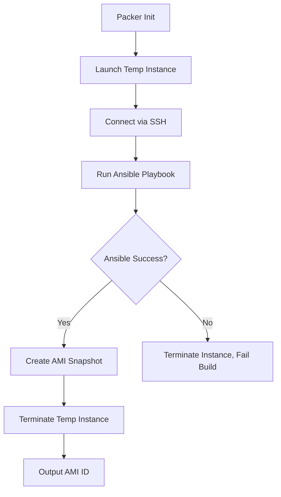

# How to Use Ansible with Packer for AMI Building

Author: [nawazdhandala](https://www.github.com/nawazdhandala)

Tags: Ansible, Packer, AWS, AMI, DevOps

Description: Build custom AWS AMIs using Packer with Ansible as the provisioner for repeatable, version-controlled machine image creation.

---

Building golden AMIs is a foundational practice for any serious AWS deployment. Instead of provisioning a bare EC2 instance and running configuration scripts on every launch, you bake everything into an AMI ahead of time. Packer handles the image building workflow, and Ansible is a natural choice for the provisioning step because you can reuse the same roles and playbooks you already have.

This guide covers setting up Packer with the Ansible provisioner, structuring your builds, and integrating the whole thing into a CI/CD pipeline.

## How It Works

Packer with the Ansible provisioner follows this workflow:

1. Packer launches a temporary EC2 instance from a base AMI
2. Packer connects to the instance via SSH
3. Ansible runs your playbook against the instance
4. Packer creates an AMI from the configured instance
5. Packer terminates the temporary instance



## Installing Packer

```bash
# Install Packer on Ubuntu/Debian
wget -O- https://apt.releases.hashicorp.com/gpg | sudo gpg --dearmor -o /usr/share/keyrings/hashicorp-archive-keyring.gpg
echo "deb [signed-by=/usr/share/keyrings/hashicorp-archive-keyring.gpg] https://apt.releases.hashicorp.com $(lsb_release -cs) main" | sudo tee /etc/apt/sources.list.d/hashicorp.list
sudo apt update && sudo apt install packer

# Verify installation
packer version
```

## Basic Packer Template

Packer uses HCL2 for its template format. Here is a basic template that builds an AMI using Ansible.

```hcl
# packer/web-server.pkr.hcl

# Required Packer plugins
packer {
  required_plugins {
    amazon = {
      version = ">= 1.2.0"
      source  = "github.com/hashicorp/amazon"
    }
    ansible = {
      version = ">= 1.1.0"
      source  = "github.com/hashicorp/ansible"
    }
  }
}

# Variables for customization
variable "aws_region" {
  type    = string
  default = "us-east-1"
}

variable "app_version" {
  type    = string
  default = "latest"
}

variable "base_ami" {
  type    = string
  default = "ami-0c7217cdde317cfec"  # Ubuntu 22.04 LTS
}

# Data source to find the latest Ubuntu AMI
data "amazon-ami" "ubuntu" {
  filters = {
    name                = "ubuntu/images/hvm-ssd/ubuntu-jammy-22.04-amd64-server-*"
    root-device-type    = "ebs"
    virtualization-type = "hvm"
  }
  most_recent = true
  owners      = ["099720109477"]  # Canonical
  region      = var.aws_region
}

# Source block defines the builder
source "amazon-ebs" "web-server" {
  ami_name      = "web-server-${formatdate("YYYYMMDD-hhmmss", timestamp())}"
  instance_type = "t3.medium"
  region        = var.aws_region
  source_ami    = data.amazon-ami.ubuntu.id

  ssh_username = "ubuntu"

  # Tag the AMI
  tags = {
    Name        = "web-server"
    Environment = "production"
    Builder     = "packer"
    AppVersion  = var.app_version
    BuildTime   = timestamp()
  }

  # Tag the snapshot
  snapshot_tags = {
    Name = "web-server-snapshot"
  }
}

# Build block defines what to do
build {
  sources = ["source.amazon-ebs.web-server"]

  # Run Ansible as the provisioner
  provisioner "ansible" {
    playbook_file = "../ansible/playbooks/web-server.yml"
    roles_path    = "../ansible/roles"
    extra_arguments = [
      "--extra-vars", "app_version=${var.app_version}",
      "-v"
    ]
    ansible_env_vars = [
      "ANSIBLE_HOST_KEY_CHECKING=false"
    ]
  }

  # Output the AMI ID
  post-processor "manifest" {
    output     = "manifest.json"
    strip_path = true
  }
}
```

## The Ansible Playbook

Write the playbook that Packer will execute during the image build.

```yaml
# ansible/playbooks/web-server.yml
---
- name: Configure Web Server AMI
  hosts: all
  become: true
  gather_facts: true

  vars:
    app_version: "latest"
    app_user: "webapp"
    app_dir: "/opt/webapp"

  tasks:
    # Update system packages
    - name: Update apt cache and upgrade packages
      apt:
        update_cache: true
        upgrade: dist
        cache_valid_time: 3600

    # Install required packages
    - name: Install system packages
      apt:
        name:
          - nginx
          - python3
          - python3-pip
          - python3-venv
          - curl
          - unzip
          - htop
          - jq
        state: present

    # Create application user
    - name: Create app user
      user:
        name: "{{ app_user }}"
        system: true
        shell: /bin/bash
        home: "{{ app_dir }}"
        create_home: true

    # Install CloudWatch agent for monitoring
    - name: Download CloudWatch agent
      get_url:
        url: "https://s3.amazonaws.com/amazoncloudwatch-agent/ubuntu/amd64/latest/amazon-cloudwatch-agent.deb"
        dest: /tmp/amazon-cloudwatch-agent.deb

    - name: Install CloudWatch agent
      apt:
        deb: /tmp/amazon-cloudwatch-agent.deb

    # Configure Nginx
    - name: Deploy Nginx configuration
      template:
        src: ../templates/nginx.conf.j2
        dest: /etc/nginx/sites-available/default
        mode: '0644'

    - name: Enable Nginx service
      systemd:
        name: nginx
        enabled: true

    # Set up log rotation
    - name: Configure log rotation
      copy:
        content: |
          /var/log/webapp/*.log {
              daily
              missingok
              rotate 14
              compress
              delaycompress
              notifempty
              create 0640 {{ app_user }} adm
          }
        dest: /etc/logrotate.d/webapp

    # Security hardening
    - name: Disable root SSH login
      lineinfile:
        path: /etc/ssh/sshd_config
        regexp: '^PermitRootLogin'
        line: 'PermitRootLogin no'

    - name: Set SSH idle timeout
      lineinfile:
        path: /etc/ssh/sshd_config
        regexp: '^ClientAliveInterval'
        line: 'ClientAliveInterval 300'

    # Clean up for smaller AMI
    - name: Clean apt cache
      apt:
        autoclean: true
        autoremove: true

    - name: Clear temporary files
      file:
        path: "{{ item }}"
        state: absent
      loop:
        - /tmp/amazon-cloudwatch-agent.deb
        - /var/cache/apt/archives
```

## Building the AMI

Run the Packer build locally or in CI/CD.

```bash
# Initialize Packer plugins
cd packer/
packer init web-server.pkr.hcl

# Validate the template
packer validate web-server.pkr.hcl

# Build the AMI
packer build -var "app_version=1.2.3" web-server.pkr.hcl
```

## CI/CD Pipeline for AMI Building

Here is a GitHub Actions workflow that builds AMIs using Packer and Ansible.

```yaml
# .github/workflows/build-ami.yml
name: Build AMI

on:
  push:
    branches: [main]
    paths:
      - 'packer/**'
      - 'ansible/**'
  workflow_dispatch:
    inputs:
      app_version:
        description: 'Application version to bake into AMI'
        required: true
        default: 'latest'

jobs:
  build-ami:
    runs-on: ubuntu-latest

    steps:
      - uses: actions/checkout@v4

      - name: Set up Python
        uses: actions/setup-python@v5
        with:
          python-version: '3.11'

      - name: Install Ansible
        run: |
          pip install ansible==8.7.0
          ansible-galaxy collection install -r ansible/requirements.yml

      - name: Set up Packer
        uses: hashicorp/setup-packer@main
        with:
          version: 'latest'

      - name: Initialize Packer
        run: packer init packer/web-server.pkr.hcl

      - name: Validate Packer template
        run: packer validate packer/web-server.pkr.hcl

      - name: Build AMI
        run: |
          packer build \
            -var "app_version=${{ github.event.inputs.app_version || 'latest' }}" \
            packer/web-server.pkr.hcl
        env:
          AWS_ACCESS_KEY_ID: ${{ secrets.AWS_ACCESS_KEY_ID }}
          AWS_SECRET_ACCESS_KEY: ${{ secrets.AWS_SECRET_ACCESS_KEY }}
          AWS_DEFAULT_REGION: us-east-1

      # Extract AMI ID from Packer manifest
      - name: Get AMI ID
        id: ami
        run: |
          AMI_ID=$(jq -r '.builds[-1].artifact_id' packer/manifest.json | cut -d: -f2)
          echo "ami_id=$AMI_ID" >> $GITHUB_OUTPUT
          echo "Built AMI: $AMI_ID"

      - name: Update deployment config
        run: |
          echo "New AMI ID: ${{ steps.ami.outputs.ami_id }}"
          # Update your Terraform variables or deployment config with the new AMI ID
```

## Using Ansible Roles with Packer

If you already have Ansible roles, reference them in your Packer template.

```hcl
# Reference roles from your existing Ansible structure
provisioner "ansible" {
  playbook_file   = "../ansible/playbooks/ami-build.yml"
  roles_path      = "../ansible/roles"
  collections_path = "../ansible/collections"
  galaxy_file     = "../ansible/requirements.yml"
  galaxy_force_install = true
}
```

## Debugging Failed Builds

When an Ansible run fails during Packer build, you need to debug it. Packer can keep the instance running so you can SSH in.

```bash
# Build with debug mode - Packer will pause on failure
packer build -debug web-server.pkr.hcl

# Or use on-error=ask to choose what to do on failure
packer build -on-error=ask web-server.pkr.hcl
```

## Tips for Packer with Ansible

1. Keep your AMI builds fast by only installing what is necessary. Application code should be deployed separately, not baked into the AMI.
2. Always clean up temporary files and caches at the end of your Ansible playbook. This makes the AMI smaller and reduces snapshot costs.
3. Use the `manifest` post-processor to output the AMI ID. This is essential for CI/CD pipelines that need to reference the new AMI.
4. Test your Ansible playbook on a regular EC2 instance before running it through Packer. Debugging is much easier when you can iterate quickly.
5. Pin your base AMI to a specific version or use a data source to always get the latest. Avoid hardcoding AMI IDs that might get deprecated.
6. Set `-on-error=ask` during development so you can SSH into failed instances and investigate.

Packer with Ansible gives you a repeatable, version-controlled process for building machine images. Every AMI is built from the same code, making your infrastructure truly reproducible.
