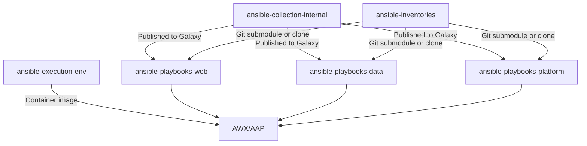

# How to Use Ansible with Polyrepo Structure

Author: [nawazdhandala](https://www.github.com/nawazdhandala)

Tags: Ansible, Polyrepo, Repository Strategy, DevOps

Description: Learn how to organize Ansible code across multiple repositories with shared roles, versioned collections, and cross-repo dependency management.

---

A polyrepo strategy splits your Ansible code into multiple repositories. Shared roles get their own repos, each application team manages their own playbooks, and inventory lives separate from code. This works well for large organizations where teams need independence, but it introduces challenges around versioning, dependency management, and coordination.

## When to Choose Polyrepo

Polyrepo makes sense when:
- Multiple teams contribute Ansible code independently
- Roles need independent release cycles
- You want to enforce strict boundaries between infrastructure components
- Teams are spread across time zones and need autonomous workflows

## Repository Architecture

Here is a typical polyrepo layout:

```
GitHub Organization
├── ansible-shared-roles/        # Shared roles repository
├── ansible-inventories/         # Inventory and variables
├── ansible-playbooks-web/       # Web team's playbooks
├── ansible-playbooks-data/      # Data team's playbooks
├── ansible-playbooks-platform/  # Platform team's playbooks
├── ansible-collection-internal/ # Internal Ansible collection
└── ansible-execution-env/       # Execution environment definition
```

## The Shared Roles Repository

Shared roles live in a central repo with versioned releases:

```yaml
# ansible-shared-roles/roles/nginx/meta/main.yml
galaxy_info:
  author: platform-team
  description: Nginx reverse proxy with SSL termination
  min_ansible_version: "2.14"
  platforms:
    - name: Ubuntu
      versions: [jammy, focal]

# Version tracked via Git tags: v1.0.0, v1.1.0, etc.
```

```yaml
# ansible-shared-roles/roles/nginx/defaults/main.yml
nginx_worker_processes: auto
nginx_worker_connections: 1024
nginx_ssl_enabled: true
nginx_ssl_protocols: "TLSv1.2 TLSv1.3"
```

Consume shared roles from team repositories:

```yaml
# ansible-playbooks-web/requirements.yml
# Pin specific versions of shared roles
roles:
  - src: git+https://github.com/company/ansible-shared-roles.git
    version: v2.3.0
    name: shared_roles
    scm: git

# Or reference individual roles
  - src: git+https://github.com/company/ansible-shared-roles.git//roles/nginx
    version: v2.3.0
    name: nginx

  - src: git+https://github.com/company/ansible-shared-roles.git//roles/common
    version: v2.3.0
    name: common
```

## Building an Internal Collection

Package shared roles and plugins into an Ansible collection for cleaner distribution:

```
ansible-collection-internal/
├── galaxy.yml
├── roles/
│   ├── common/
│   ├── nginx/
│   ├── postgresql/
│   ├── monitoring/
│   └── security_baseline/
├── plugins/
│   ├── filter/
│   │   └── custom_filters.py
│   ├── modules/
│   │   └── company_deploy.py
│   └── callback/
│       └── slack_notify.py
├── playbooks/
│   └── shared_preflight.yml
└── docs/
```

```yaml
# ansible-collection-internal/galaxy.yml
namespace: company
name: infrastructure
version: 3.2.0
readme: README.md
authors:
  - Platform Team <platform@company.com>
description: Internal infrastructure collection
license: proprietary
dependencies:
  community.general: ">=8.0.0"
  ansible.posix: ">=1.5.0"
repository: https://github.com/company/ansible-collection-internal
```

Build and publish:

```bash
# Build the collection
ansible-galaxy collection build

# Publish to internal Galaxy or Automation Hub
ansible-galaxy collection publish company-infrastructure-3.2.0.tar.gz \
  --server https://galaxy.internal.company.com/api/
```

Consume in team repos:

```yaml
# ansible-playbooks-web/requirements.yml
collections:
  - name: company.infrastructure
    version: 3.2.0
    source: https://galaxy.internal.company.com/api/

  - name: community.general
    version: 8.2.0
```

## Inventory Repository

Keep inventory separate so it can be managed independently:

```yaml
# ansible-inventories/production/hosts.yml
all:
  children:
    webservers:
      hosts:
        web01.prod.example.com:
          ansible_host: 10.0.1.10
        web02.prod.example.com:
          ansible_host: 10.0.1.11
    dbservers:
      hosts:
        db01.prod.example.com:
          ansible_host: 10.0.2.10
```

```yaml
# ansible-inventories/production/group_vars/all.yml
env_name: production
domain: example.com
monitoring_endpoint: https://metrics.example.com
```

Clone the inventory repo into your playbook project:

```bash
# In your team's playbook directory
git clone git@github.com:company/ansible-inventories.git inventories

# Or use Git submodules
git submodule add git@github.com:company/ansible-inventories.git inventories
```

## Polyrepo Dependency Flow



## Team Playbook Repository

Each team has their own playbook repository that pulls in shared dependencies:

```yaml
# ansible-playbooks-web/requirements.yml
collections:
  - name: company.infrastructure
    version: ">=3.0.0,<4.0.0"
  - name: community.general
    version: 8.2.0
  - name: community.docker
    version: 3.6.0
```

```yaml
# ansible-playbooks-web/playbooks/deploy.yml
# Uses roles from the shared collection
- name: Deploy web application
  hosts: webservers
  become: yes
  roles:
    - role: company.infrastructure.common
      tags: [common]
    - role: company.infrastructure.nginx
      tags: [nginx]
    - role: web_app_deploy
      tags: [deploy]
```

```makefile
# ansible-playbooks-web/Makefile
# Setup and run targets

setup:
	pip install -r requirements.txt
	ansible-galaxy collection install -r requirements.yml --force
	git submodule update --init --recursive

lint:
	ansible-lint playbooks/ roles/

deploy-staging:
	ansible-playbook playbooks/deploy.yml \
		-i inventories/staging/hosts.yml

deploy-production:
	ansible-playbook playbooks/deploy.yml \
		-i inventories/production/hosts.yml
```

## Versioning Strategy

Use semantic versioning for the shared collection:

```bash
# In the collection repo
# Patch release: bug fixes only
git tag v3.2.1

# Minor release: new features, backwards compatible
git tag v3.3.0

# Major release: breaking changes
git tag v4.0.0
```

Team repos pin versions with flexibility:

```yaml
# Pin to exact version for production stability
- name: company.infrastructure
  version: 3.2.0

# Allow patch updates
- name: company.infrastructure
  version: ">=3.2.0,<3.3.0"

# Allow minor updates
- name: company.infrastructure
  version: ">=3.0.0,<4.0.0"
```

## Cross-Repo CI

Each repo has its own CI, but shared roles get tested in the context of consuming repos:

```yaml
# ansible-collection-internal/.github/workflows/release.yml
name: Release Collection

on:
  push:
    tags: ['v*']

jobs:
  test:
    runs-on: ubuntu-latest
    steps:
      - uses: actions/checkout@v4
      - name: Run Molecule tests for all roles
        run: |
          pip install molecule molecule-docker ansible-core
          for role in roles/*/; do
            echo "Testing $role"
            cd "$role" && molecule test && cd ../..
          done

  publish:
    needs: test
    runs-on: ubuntu-latest
    steps:
      - uses: actions/checkout@v4
      - name: Build collection
        run: ansible-galaxy collection build
      - name: Publish to internal Galaxy
        run: |
          ansible-galaxy collection publish \
            company-infrastructure-*.tar.gz \
            --server https://galaxy.internal.company.com/api/ \
            --token ${{ secrets.GALAXY_TOKEN }}

  notify-consumers:
    needs: publish
    runs-on: ubuntu-latest
    steps:
      - name: Notify consuming repositories
        run: |
          # Trigger CI in consuming repos to test compatibility
          for repo in ansible-playbooks-web ansible-playbooks-data; do
            gh workflow run test.yml -R company/$repo
          done
        env:
          GH_TOKEN: ${{ secrets.CROSS_REPO_TOKEN }}
```

## Summary

The polyrepo strategy gives teams independence at the cost of coordination complexity. Package shared Ansible code as collections with semantic versioning. Use a separate inventory repository that consuming repos reference via submodules or cloning. Let each team manage their own playbook repository with pinned dependency versions. Automate cross-repo testing so collection updates are validated against consuming repos. This approach scales well for organizations with many teams, but requires discipline around versioning and dependency management.
