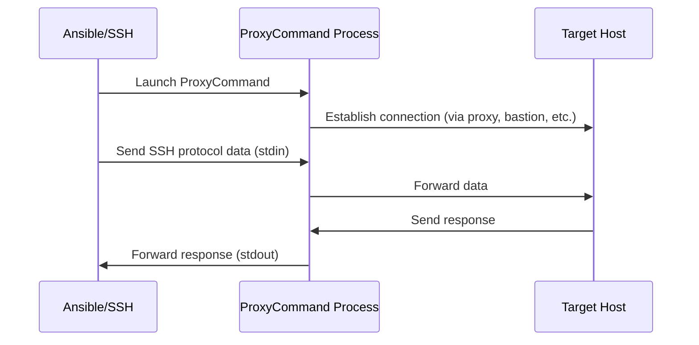

# How to Use Ansible with ProxyCommand for SSH

Author: [nawazdhandala](https://www.github.com/nawazdhandala)

Tags: Ansible, SSH, ProxyCommand, Network Routing

Description: Configure Ansible to use SSH ProxyCommand for routing connections through intermediary hosts, SOCKS proxies, and custom scripts.

---

SSH ProxyCommand is a powerful mechanism that lets you specify an arbitrary command to establish the connection to a remote host. Instead of SSH connecting directly to the target, it runs your ProxyCommand and uses its stdin/stdout as the transport. This is useful for connecting through bastion hosts, SOCKS proxies, HTTP proxies, or any other intermediary. Ansible fully supports ProxyCommand through its SSH connection settings.

## How ProxyCommand Works

Normally, SSH opens a TCP connection directly to the target host. With ProxyCommand, SSH delegates the connection establishment to an external command:



The ProxyCommand just needs to provide a bidirectional pipe to the target host. How it gets there is entirely up to you.

## Basic ProxyCommand with Ansible

The simplest use of ProxyCommand is connecting through a bastion host:

```ini
# ansible.cfg
[ssh_connection]
ssh_args = -o ProxyCommand="ssh -W %h:%p bastion_user@bastion.example.com"
```

The `-W %h:%p` flag tells the intermediate SSH to forward the connection to the final target host (`%h`) on the specified port (`%p`).

## Setting ProxyCommand Per Host Group

Different server groups might need different proxy configurations:

```ini
# inventory/hosts
[webservers]
web01 ansible_host=10.0.1.10
web02 ansible_host=10.0.1.11

[dbservers]
db01 ansible_host=10.0.2.10

[webservers:vars]
ansible_ssh_common_args=-o ProxyCommand="ssh -W %h:%p admin@bastion-web.example.com"

[dbservers:vars]
ansible_ssh_common_args=-o ProxyCommand="ssh -W %h:%p admin@bastion-db.example.com -i ~/.ssh/db_bastion_key"
```

## Setting ProxyCommand Per Host

For individual hosts with unique proxy requirements:

```ini
# inventory/hosts
[servers]
app01 ansible_host=10.0.1.10 ansible_ssh_common_args='-o ProxyCommand="ssh -W %h:%p admin@proxy1.example.com"'
app02 ansible_host=10.0.1.11 ansible_ssh_common_args='-o ProxyCommand="ssh -W %h:%p admin@proxy2.example.com"'
app03 ansible_host=10.0.1.12
```

Note that `app03` has no ProxyCommand and connects directly.

## Using Group Variables Files

For cleaner configuration, use group_vars:

```yaml
# group_vars/datacenter_east.yml
ansible_ssh_common_args: >-
  -o ProxyCommand="ssh -q -W %h:%p
  -i ~/.ssh/bastion_east_key
  admin@bastion-east.example.com"
```

```yaml
# group_vars/datacenter_west.yml
ansible_ssh_common_args: >-
  -o ProxyCommand="ssh -q -W %h:%p
  -i ~/.ssh/bastion_west_key
  admin@bastion-west.example.com"
```

## ProxyCommand with Netcat

On older SSH versions that do not support `-W`, use netcat:

```ini
# Using netcat through a bastion
ansible_ssh_common_args=-o ProxyCommand="ssh admin@bastion.example.com nc %h %p"
```

Or using the newer `ncat`:

```ini
ansible_ssh_common_args=-o ProxyCommand="ssh admin@bastion.example.com ncat %h %p"
```

## ProxyCommand with SOCKS Proxy

If you have a SOCKS proxy (common with VPNs or SSH tunnels), connect through it:

```ini
# Connect through a SOCKS5 proxy
ansible_ssh_common_args=-o ProxyCommand="nc -X 5 -x socks-proxy.example.com:1080 %h %p"

# Using ncat for SOCKS5
ansible_ssh_common_args=-o ProxyCommand="ncat --proxy-type socks5 --proxy socks-proxy.example.com:1080 %h %p"
```

First, set up the SOCKS proxy if needed:

```bash
# Create a SOCKS proxy via SSH tunnel
ssh -D 1080 -f -N -q user@proxy-server.example.com

# Now Ansible can route through it
ANSIBLE_SSH_ARGS='-o ProxyCommand="nc -X 5 -x localhost:1080 %h %p"' ansible-playbook site.yml
```

## ProxyCommand with HTTP CONNECT Proxy

For environments behind corporate HTTP proxies:

```ini
# Using corkscrew for HTTP proxy tunneling
ansible_ssh_common_args=-o ProxyCommand="corkscrew http-proxy.company.com 8080 %h %p"

# With proxy authentication
ansible_ssh_common_args=-o ProxyCommand="corkscrew http-proxy.company.com 8080 %h %p ~/.ssh/proxy_auth"
```

The `~/.ssh/proxy_auth` file contains `username:password` for the HTTP proxy.

Install corkscrew:

```bash
# Ubuntu/Debian
sudo apt-get install corkscrew

# macOS
brew install corkscrew

# RHEL/CentOS
sudo yum install corkscrew
```

## Chaining Multiple ProxyCommands

For multi-hop scenarios where you need to traverse several intermediaries:

```bash
# ~/.ssh/config
Host bastion1
    HostName bastion1.example.com
    User admin

Host bastion2
    HostName 10.0.0.5
    User admin
    ProxyCommand ssh -W %h:%p bastion1

Host 10.0.1.*
    ProxyCommand ssh -W %h:%p bastion2
```

Then tell Ansible to use this config:

```ini
# ansible.cfg
[ssh_connection]
ssh_args = -F ~/.ssh/config
```

## Custom ProxyCommand Scripts

You can use any script as a ProxyCommand. This is useful for complex routing logic:

```bash
#!/bin/bash
# /usr/local/bin/ansible-proxy.sh
# Dynamic proxy selection based on target network

TARGET_HOST=$1
TARGET_PORT=$2

# Determine which bastion to use based on the target IP
case "$TARGET_HOST" in
    10.0.1.*)
        BASTION="bastion-web.example.com"
        ;;
    10.0.2.*)
        BASTION="bastion-db.example.com"
        ;;
    10.0.3.*)
        BASTION="bastion-cache.example.com"
        ;;
    *)
        # Direct connection for everything else
        exec nc "$TARGET_HOST" "$TARGET_PORT"
        ;;
esac

exec ssh -q -W "$TARGET_HOST:$TARGET_PORT" "admin@$BASTION"
```

```bash
# Make it executable
chmod +x /usr/local/bin/ansible-proxy.sh
```

```ini
# ansible.cfg
[ssh_connection]
ssh_args = -o ProxyCommand="/usr/local/bin/ansible-proxy.sh %h %p"
```

## ProxyCommand with Different Keys

Specify a separate key for the proxy hop:

```ini
# Use a specific key for the proxy connection
ansible_ssh_common_args=-o ProxyCommand="ssh -i ~/.ssh/proxy_key -W %h:%p proxy_user@proxy.example.com"
```

And a different key for the final host:

```ini
# inventory/hosts
[internal_servers:vars]
ansible_ssh_common_args=-o ProxyCommand="ssh -i ~/.ssh/proxy_key -W %h:%p admin@proxy.example.com"
ansible_ssh_private_key_file=~/.ssh/internal_key
```

## Performance Tuning ProxyCommand

Combine ProxyCommand with ControlMaster for better performance:

```ini
# ansible.cfg
[ssh_connection]
ssh_args = -o ProxyCommand="ssh -W %h:%p admin@bastion.example.com" -o ControlMaster=auto -o ControlPersist=120s
control_path_dir = ~/.ansible/cp
control_path = %(directory)s/%%C
pipelining = True
```

The ControlMaster will keep both the proxy connection and the final connection alive, so subsequent tasks do not need to re-establish the full chain.

## Debugging ProxyCommand Issues

When your ProxyCommand is not working, add verbose output:

```bash
# Test the proxy command directly
ssh -v -o ProxyCommand="ssh -v -W %h:%p admin@bastion.example.com" deploy@10.0.1.10

# Test with maximum verbosity
ansible web01 -m ping -vvvv
```

Common errors and their causes:

```bash
# "ssh_exchange_identification: Connection closed by remote host"
# The proxy command connected but the target rejected the SSH handshake
# Check: target host sshd is running, correct port

# "ssh: connect to host bastion.example.com port 22: Connection refused"
# Cannot reach the proxy host itself
# Check: bastion is reachable, port 22 is open

# "Permission denied (publickey)"
# Authentication failed at either the proxy or target
# Check: correct keys are specified for each hop
```

## ProxyCommand vs ProxyJump

ProxyCommand and ProxyJump both achieve similar results, but they differ:

| Feature | ProxyCommand | ProxyJump |
|---------|-------------|-----------|
| SSH Version | Any | 7.3+ |
| Flexibility | High (any command) | SSH-only |
| Syntax | More verbose | Cleaner |
| SOCKS/HTTP Proxy | Yes | No |
| Custom Scripts | Yes | No |
| Multiple Hops | Manual chaining | Comma-separated |

Use ProxyJump when you just need to hop through SSH servers. Use ProxyCommand when you need SOCKS proxies, HTTP proxies, custom scripts, or compatibility with older SSH versions.

## Wrapping Up

ProxyCommand gives you complete control over how Ansible establishes SSH connections. Whether you need to route through bastion hosts, SOCKS proxies, HTTP proxies, or custom routing logic, ProxyCommand handles it. Set it globally in `ansible.cfg` for uniform environments, per-group in your inventory for mixed environments, or in a custom script for complex routing decisions. Combine it with ControlMaster to avoid the performance overhead of re-establishing proxy connections for every task.
