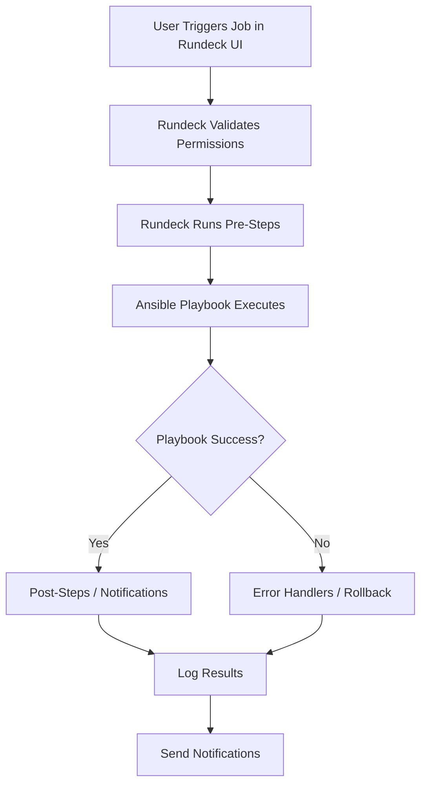

# How to Use Ansible with Rundeck

Author: [nawazdhandala](https://www.github.com/nawazdhandala)

Tags: Ansible, Rundeck, Automation, DevOps

Description: Integrate Ansible with Rundeck for a web-based job execution platform with RBAC, scheduling, and self-service automation for operations teams.

---

Rundeck is an open-source operations automation platform that provides a web UI for running jobs across your infrastructure. While it has its own execution model, Rundeck integrates well with Ansible, letting you use your existing playbooks and roles while adding Rundeck's RBAC, scheduling, notification, and workflow capabilities on top.

This guide covers setting up the Rundeck-Ansible integration, configuring jobs that run Ansible playbooks, and building self-service workflows for your team.

## Why Rundeck with Ansible

Rundeck adds several things on top of plain Ansible that operations teams value:

- Fine-grained RBAC (who can run what, on which hosts)
- Job scheduling with cron support
- Self-service execution for non-Ansible users
- Webhook and API triggers
- Built-in notifications (email, Slack, PagerDuty)
- Workflow orchestration (multi-step jobs)
- Key storage for credentials
- Activity log and audit trail

## Installing Rundeck

### Docker Installation

The quickest way to get started is Docker.

```yaml
# docker-compose.yml
version: '3.8'

services:
  rundeck:
    image: rundeck/rundeck:5.0.0
    ports:
      - "4440:4440"
    environment:
      RUNDECK_GRAILS_URL: http://localhost:4440
      RUNDECK_DATABASE_DRIVER: org.postgresql.Driver
      RUNDECK_DATABASE_URL: jdbc:postgresql://postgres:5432/rundeck
      RUNDECK_DATABASE_USERNAME: rundeck
      RUNDECK_DATABASE_PASSWORD: rundeck-db-pass
    volumes:
      - rundeck-data:/home/rundeck/server/data
      - rundeck-logs:/home/rundeck/var/logs
      # Mount Ansible configuration
      - ./ansible:/home/rundeck/ansible
      - ~/.ssh:/home/rundeck/.ssh:ro
    depends_on:
      - postgres

  postgres:
    image: postgres:15
    environment:
      POSTGRES_USER: rundeck
      POSTGRES_PASSWORD: rundeck-db-pass
      POSTGRES_DB: rundeck
    volumes:
      - postgres-data:/var/lib/postgresql/data

volumes:
  rundeck-data:
  rundeck-logs:
  postgres-data:
```

```bash
# Start Rundeck
docker compose up -d

# Wait for it to fully start (takes about a minute)
docker compose logs -f rundeck

# Access Rundeck at http://localhost:4440
# Default credentials: admin / admin
```

### Installing Ansible in the Rundeck Container

The official Rundeck Docker image does not include Ansible. You need to add it.

```dockerfile
# Dockerfile.rundeck-ansible
FROM rundeck/rundeck:5.0.0

USER root

# Install Python and Ansible
RUN apt-get update && \
    apt-get install -y python3 python3-pip openssh-client && \
    pip3 install ansible==8.7.0 && \
    rm -rf /var/lib/apt/lists/*

# Install Ansible collections
RUN ansible-galaxy collection install community.general ansible.posix

USER rundeck
```

Update your docker-compose.yml to use the custom image.

```yaml
services:
  rundeck:
    build:
      context: .
      dockerfile: Dockerfile.rundeck-ansible
    # ... rest of config
```

## Installing the Ansible Plugin

Rundeck has an official Ansible plugin for better integration.

```bash
# Download the Ansible plugin
# Place it in the Rundeck plugins directory
wget https://github.com/Batix/rundeck-ansible-plugin/releases/download/3.2.4/ansible-plugin-3.2.4.jar \
  -O /home/rundeck/libext/ansible-plugin.jar
```

Or for Docker, mount it as a volume.

```yaml
volumes:
  - ./plugins/ansible-plugin.jar:/home/rundeck/libext/ansible-plugin.jar
```

## Configuring the Ansible Integration

### Project Configuration

Create a new Rundeck project and configure it to use Ansible.

In the Rundeck UI:
1. Go to System Menu > Projects > Create New Project
2. Name: "Infrastructure"
3. Default Node Executor: Ansible Ad-Hoc Node Executor
4. Default File Copier: Ansible File Copier

Or configure via the project properties file.

```properties
# /home/rundeck/projects/infrastructure/etc/project.properties
project.ansible.executable=/usr/local/bin/ansible
project.ansible-playbook.executable=/usr/local/bin/ansible-playbook
project.ansible.config-file-path=/home/rundeck/ansible/ansible.cfg

# Node source from Ansible inventory
resources.source.1.type=com.batix.rundeck.plugins.AnsibleResourceModelSourceFactory
resources.source.1.config.ansible-inventory=/home/rundeck/ansible/inventory/production.ini
resources.source.1.config.ansible-gather-facts=true

# Default node executor
service.NodeExecutor.default.provider=com.batix.rundeck.plugins.AnsibleNodeExecutor
service.FileCopier.default.provider=com.batix.rundeck.plugins.AnsibleFileCopier
```

### Using Ansible Inventory as Node Source

The Ansible plugin can read your Ansible inventory and present it as Rundeck nodes.

1. Go to Project Settings > Edit Nodes
2. Add a new Node Source
3. Select "Ansible Resource Model Source"
4. Configure:
   - Ansible Inventory: `/home/rundeck/ansible/inventory/production.ini`
   - Gather Facts: Yes (provides OS and hardware info)

## Creating an Ansible Playbook Job

Create a Rundeck job that runs an Ansible playbook.

### Via the Web UI

1. Go to Jobs > New Job
2. Name: "Deploy Web Application"
3. Description: "Deploy the web application to production servers"
4. Add a Step:
   - Type: Ansible Playbook
   - Playbook: `/home/rundeck/ansible/playbooks/deploy.yml`
   - Inventory: `/home/rundeck/ansible/inventory/production.ini`
   - Extra Arguments: `--diff`

### Via Job Definition File

Export and version control your jobs as YAML.

```yaml
# jobs/deploy-web.yml
- defaultTab: output
  description: Deploy web application to production
  executionEnabled: true
  group: deployments
  loglevel: INFO
  name: Deploy Web Application
  nodeFilterEditable: true
  scheduleEnabled: true
  sequence:
    commands:
      - configuration:
          ansible-playbook: /home/rundeck/ansible/playbooks/deploy.yml
          ansible-extra-vars: "deploy_version=${option.version}"
          ansible-inventory: /home/rundeck/ansible/inventory/production.ini
          ansible-vault-password-path: /home/rundeck/secrets/vault_pass.txt
        nodeStep: false
        type: com.batix.rundeck.plugins.AnsiblePlaybookWorkflowStep
    keepgoing: false
    strategy: node-first
  options:
    - name: version
      description: Application version to deploy
      required: true
      enforced: false
      value: latest
    - name: environment
      description: Target environment
      required: true
      enforced: true
      values:
        - staging
        - production
      value: staging
```

Import jobs via the CLI.

```bash
# Import job definitions
rd jobs load -p infrastructure -f jobs/deploy-web.yml --format yaml
```

## Multi-Step Workflows

Rundeck workflows let you chain multiple steps together, mixing Ansible playbooks with other actions.

```yaml
# jobs/full-deployment.yml
- name: Full Deployment Pipeline
  description: Complete deployment workflow with pre and post checks
  group: deployments
  sequence:
    commands:
      # Step 1: Run pre-deployment checks
      - configuration:
          ansible-playbook: /home/rundeck/ansible/playbooks/pre-deploy-checks.yml
          ansible-inventory: /home/rundeck/ansible/inventory/${option.environment}.ini
        type: com.batix.rundeck.plugins.AnsiblePlaybookWorkflowStep

      # Step 2: Create a backup
      - configuration:
          ansible-playbook: /home/rundeck/ansible/playbooks/backup.yml
          ansible-inventory: /home/rundeck/ansible/inventory/${option.environment}.ini
        type: com.batix.rundeck.plugins.AnsiblePlaybookWorkflowStep

      # Step 3: Deploy the application
      - configuration:
          ansible-playbook: /home/rundeck/ansible/playbooks/deploy.yml
          ansible-inventory: /home/rundeck/ansible/inventory/${option.environment}.ini
          ansible-extra-vars: "deploy_version=${option.version}"
        type: com.batix.rundeck.plugins.AnsiblePlaybookWorkflowStep

      # Step 4: Run smoke tests
      - exec: curl -f https://${option.environment}.example.com/health

      # Step 5: Notify team
      - configuration:
          ansible-playbook: /home/rundeck/ansible/playbooks/notify.yml
          ansible-extra-vars: "message=Deployment of ${option.version} to ${option.environment} completed"
        type: com.batix.rundeck.plugins.AnsiblePlaybookWorkflowStep
    keepgoing: false
    strategy: node-first
```

## Rundeck Ansible Workflow



## Setting Up RBAC

One of Rundeck's strongest features is fine-grained access control.

```yaml
# etc/acl/deploy-team.aclpolicy
description: Deployment team can run deploy jobs but not modify them
context:
  project: infrastructure
for:
  job:
    - match:
        group: deployments
      allow: [read, run]
    - match:
        group: admin
      deny: [read, run, create, update, delete]
  node:
    - allow: [read, run]
by:
  group: deploy-team
```

```yaml
# etc/acl/ops-admin.aclpolicy
description: Ops admins have full access
context:
  project: infrastructure
for:
  job:
    - allow: [read, run, create, update, delete]
  node:
    - allow: [read, run]
by:
  group: ops-admin
```

## Scheduling Jobs

Schedule recurring Ansible runs through the Rundeck UI or job definitions.

```yaml
# Job with schedule
- name: Nightly Compliance Check
  schedule:
    time:
      hour: '2'
      minute: '0'
      seconds: '0'
    month: '*'
    dayofmonth:
      day: '*'
    year: '*'
    weekday:
      day: '*'
  sequence:
    commands:
      - configuration:
          ansible-playbook: /home/rundeck/ansible/playbooks/compliance-check.yml
          ansible-inventory: /home/rundeck/ansible/inventory/all.ini
        type: com.batix.rundeck.plugins.AnsiblePlaybookWorkflowStep
```

## Triggering Jobs via API

Rundeck's API lets you trigger Ansible jobs programmatically.

```bash
# Run a job via the Rundeck API
curl -X POST \
  -H "X-Rundeck-Auth-Token: your-api-token" \
  -H "Content-Type: application/json" \
  http://rundeck.example.com:4440/api/41/job/JOB-UUID/executions \
  -d '{
    "options": {
      "version": "1.2.3",
      "environment": "production"
    }
  }'

# Check job execution status
curl -H "X-Rundeck-Auth-Token: your-api-token" \
  http://rundeck.example.com:4440/api/41/execution/123
```

## Tips for Rundeck with Ansible

1. Keep your Ansible playbooks in a Git repository and pull them into Rundeck via SCM integration. Do not edit playbooks directly on the Rundeck server.
2. Use Rundeck's Key Storage for SSH keys and vault passwords instead of files on disk. This provides encryption and access control.
3. Define job options for anything that changes between runs (version numbers, environments, host groups). This makes your jobs reusable.
4. Set up RBAC policies before giving the team access. It is easier to start restrictive and open up than to lock down later.
5. Use Rundeck's webhook endpoint to trigger jobs from CI/CD pipelines, monitoring alerts, or ChatOps tools.
6. Export your job definitions as YAML and version control them. This way you can recreate your Rundeck setup if needed.

Rundeck with Ansible gives you a professional self-service automation platform. Your team gets a web UI for running playbooks, you get audit trails and access control, and everyone benefits from not having to maintain individual SSH access and Ansible installations on their workstations.
