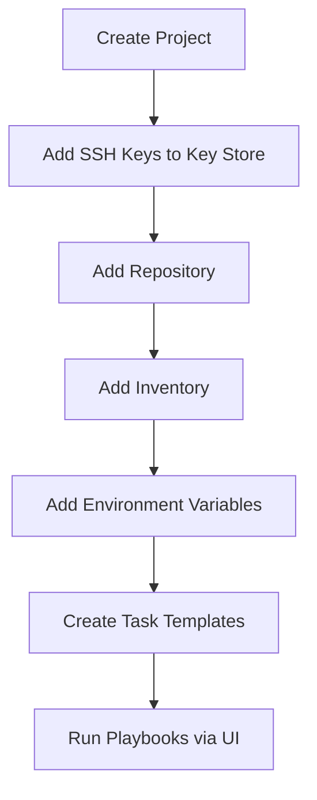

# How to Use Ansible with Semaphore UI

Author: [nawazdhandala](https://www.github.com/nawazdhandala)

Tags: Ansible, Semaphore, Web UI, DevOps

Description: Set up Semaphore UI as an open-source web interface for running Ansible playbooks with job scheduling, access control, and audit logs.

---

Semaphore is an open-source web UI for Ansible that gives your team a way to run playbooks without needing terminal access. It provides a clean interface for managing inventories, credentials, and playbook runs, along with job history and basic RBAC. Think of it as a lightweight alternative to AWX/Ansible Tower for teams that want a GUI without the overhead.

This guide covers installing Semaphore, configuring it for your Ansible projects, and setting up workflows that your team can use.

## Why Semaphore

Not everyone on an operations team is comfortable running Ansible from the command line. Semaphore provides:

- A web UI for triggering playbook runs
- Job history with output logs
- Credential management (SSH keys, vault passwords)
- Inventory management
- Template-based execution (predefined playbook + inventory + credentials)
- Basic scheduling
- Webhook triggers for automation

## Installing Semaphore

### Docker Installation (Recommended)

The fastest way to get Semaphore running is with Docker Compose.

```yaml
# docker-compose.yml
version: '3.8'

services:
  semaphore:
    image: semaphoreui/semaphore:latest
    ports:
      - "3000:3000"
    environment:
      SEMAPHORE_DB_DIALECT: bolt
      SEMAPHORE_ADMIN_PASSWORD: your-admin-password
      SEMAPHORE_ADMIN_NAME: admin
      SEMAPHORE_ADMIN_EMAIL: admin@example.com
      SEMAPHORE_ADMIN: admin
      SEMAPHORE_ACCESS_KEY_ENCRYPTION: your-encryption-key-32chars
    volumes:
      - semaphore-data:/var/lib/semaphore
      # Mount your SSH keys for access to target hosts
      - ~/.ssh:/home/semaphore/.ssh:ro

volumes:
  semaphore-data:
```

Start Semaphore.

```bash
# Start the service
docker compose up -d

# Check logs
docker compose logs -f semaphore

# Semaphore is now available at http://localhost:3000
```

### Docker with PostgreSQL

For production use, use PostgreSQL as the backend database.

```yaml
# docker-compose.yml - Production setup with PostgreSQL
version: '3.8'

services:
  postgres:
    image: postgres:15
    environment:
      POSTGRES_USER: semaphore
      POSTGRES_PASSWORD: semaphore-db-pass
      POSTGRES_DB: semaphore
    volumes:
      - postgres-data:/var/lib/postgresql/data
    healthcheck:
      test: ["CMD-SHELL", "pg_isready -U semaphore"]
      interval: 10s
      timeout: 5s
      retries: 5

  semaphore:
    image: semaphoreui/semaphore:latest
    ports:
      - "3000:3000"
    environment:
      SEMAPHORE_DB_DIALECT: postgres
      SEMAPHORE_DB_HOST: postgres
      SEMAPHORE_DB_PORT: 5432
      SEMAPHORE_DB_USER: semaphore
      SEMAPHORE_DB_PASS: semaphore-db-pass
      SEMAPHORE_DB: semaphore
      SEMAPHORE_ADMIN_PASSWORD: your-admin-password
      SEMAPHORE_ADMIN_NAME: admin
      SEMAPHORE_ADMIN_EMAIL: admin@example.com
      SEMAPHORE_ADMIN: admin
      SEMAPHORE_ACCESS_KEY_ENCRYPTION: your-32-character-encryption-key!
      SEMAPHORE_PLAYBOOK_PATH: /ansible
    volumes:
      - semaphore-data:/var/lib/semaphore
      # Mount your Ansible project
      - /path/to/ansible:/ansible:ro
    depends_on:
      postgres:
        condition: service_healthy

volumes:
  postgres-data:
  semaphore-data:
```

### Binary Installation

You can also install Semaphore as a standalone binary.

```bash
# Download the latest release (check GitHub for current version)
wget https://github.com/semaphoreui/semaphore/releases/download/v2.9.0/semaphore_2.9.0_linux_amd64.deb

# Install the package
sudo dpkg -i semaphore_2.9.0_linux_amd64.deb

# Run the setup wizard
semaphore setup

# Start Semaphore
semaphore server --config /etc/semaphore/config.json
```

## Configuring Semaphore

After installation, log in to the web UI at `http://localhost:3000` and set up your project.

### Step 1: Create a Project

A project in Semaphore maps to one Ansible repository.

1. Click "New Project"
2. Give it a name (e.g., "Infrastructure")
3. This creates a workspace for your inventories, credentials, and templates

### Step 2: Add Credentials (Key Store)

Add the credentials Semaphore needs to connect to your Git repo and target hosts.

For SSH access to target hosts:
1. Go to Key Store > New Key
2. Type: SSH Key
3. Paste your private key
4. Name it "server-ssh-key"

For Git repository access:
1. Go to Key Store > New Key
2. Type: SSH Key or Login with Password
3. Configure for your Git hosting service

For Ansible Vault:
1. Go to Key Store > New Key
2. Type: Login with Password
3. Put the vault password in the Password field
4. Name it "vault-password"

### Step 3: Add Repository

1. Go to Repositories > New Repository
2. URL: Your Git repository URL
3. Branch: main
4. Access Key: Select the Git SSH key you created

### Step 4: Add Inventory

1. Go to Inventory > New Inventory
2. Type: Static or File
3. For File type, specify the path relative to your repo (e.g., `inventory/production.ini`)

You can also paste a static inventory directly.

```ini
# Static inventory pasted into Semaphore
[webservers]
web01 ansible_host=10.0.1.10
web02 ansible_host=10.0.1.11

[dbservers]
db01 ansible_host=10.0.2.10

[all:vars]
ansible_user=deploy
```

### Step 5: Add Environment

Environments let you define extra variables passed to the playbook.

1. Go to Environment > New Environment
2. Add JSON variables:

```json
{
  "deploy_version": "latest",
  "app_env": "production",
  "enable_monitoring": true
}
```

### Step 6: Create Task Templates

Templates are the main way to define runnable playbooks.

1. Go to Task Templates > New Template
2. Configure:
   - Name: "Deploy Web Servers"
   - Playbook: `playbooks/web-deploy.yml`
   - Inventory: Select your inventory
   - Repository: Select your repo
   - Environment: Select your environment
   - Vault Password: Select from Key Store
   - Extra CLI Arguments: `--diff` (optional)

## Semaphore Setup Flow



## Running Playbooks

Once templates are configured, running a playbook is simple:

1. Go to Task Templates
2. Click the "Run" button next to your template
3. Optionally override variables
4. Watch the real-time output in the web UI

## Scheduling Tasks

Semaphore supports cron-based scheduling for recurring tasks.

1. Edit a Task Template
2. Go to the Schedule tab
3. Add a cron expression:

```
# Run every day at 2 AM
0 2 * * *

# Run every Monday at 6 AM
0 6 * * 1

# Run every hour
0 * * * *
```

This is useful for:
- Nightly compliance checks
- Regular configuration drift detection
- Scheduled maintenance tasks
- Certificate renewal checks

## Webhook Triggers

Semaphore supports webhook triggers for integration with other tools.

```bash
# Trigger a task template via webhook
curl -X POST \
  -H "Authorization: Bearer YOUR_API_TOKEN" \
  -H "Content-Type: application/json" \
  http://semaphore.example.com/api/project/1/tasks \
  -d '{
    "template_id": 1,
    "environment": "{\"deploy_version\": \"1.2.3\"}"
  }'
```

Integrate with GitHub webhooks to trigger deployments on push.

```yaml
# GitHub Actions - Trigger Semaphore
- name: Trigger Semaphore deployment
  run: |
    curl -X POST \
      -H "Authorization: Bearer ${{ secrets.SEMAPHORE_TOKEN }}" \
      -H "Content-Type: application/json" \
      https://semaphore.example.com/api/project/1/tasks \
      -d '{"template_id": 1}'
```

## Using the Semaphore API

Semaphore has a REST API for full programmatic control.

```bash
# Authenticate and get a token
TOKEN=$(curl -s -X POST \
  -H "Content-Type: application/json" \
  http://localhost:3000/api/auth/login \
  -d '{"auth": "admin", "password": "your-password"}' | jq -r '.token')

# List projects
curl -H "Authorization: Bearer $TOKEN" \
  http://localhost:3000/api/projects

# List task templates for a project
curl -H "Authorization: Bearer $TOKEN" \
  http://localhost:3000/api/project/1/templates

# Get task history
curl -H "Authorization: Bearer $TOKEN" \
  http://localhost:3000/api/project/1/tasks
```

## Putting Semaphore Behind a Reverse Proxy

For production, put Semaphore behind Nginx with SSL.

```nginx
# /etc/nginx/sites-available/semaphore
server {
    listen 443 ssl;
    server_name semaphore.example.com;

    ssl_certificate /etc/ssl/certs/semaphore.crt;
    ssl_certificate_key /etc/ssl/private/semaphore.key;

    location / {
        proxy_pass http://localhost:3000;
        proxy_set_header Host $host;
        proxy_set_header X-Real-IP $remote_addr;
        proxy_set_header X-Forwarded-For $proxy_add_x_forwarded_for;
        proxy_set_header X-Forwarded-Proto $scheme;

        # WebSocket support for real-time task output
        proxy_http_version 1.1;
        proxy_set_header Upgrade $http_upgrade;
        proxy_set_header Connection "upgrade";
    }
}
```

## Tips for Using Semaphore

1. Use the PostgreSQL backend for production. The BoltDB backend is fine for testing but does not handle concurrent users well.
2. Create separate projects for different teams or environments to keep things organized.
3. Use environment variables in templates to pass deployment-specific settings without modifying playbooks.
4. Set up webhook triggers from your Git hosting platform for automated deployments on push.
5. Semaphore stores task output, so you get a built-in audit trail of what was run and when.
6. Back up the PostgreSQL database and the Semaphore encryption key. Losing the encryption key means losing access to all stored credentials.

Semaphore fills a nice gap between running Ansible from the command line and deploying a full AWX/Tower instance. It gives your team a self-service deployment UI without the complexity of managing a Kubernetes-based AWX deployment.
