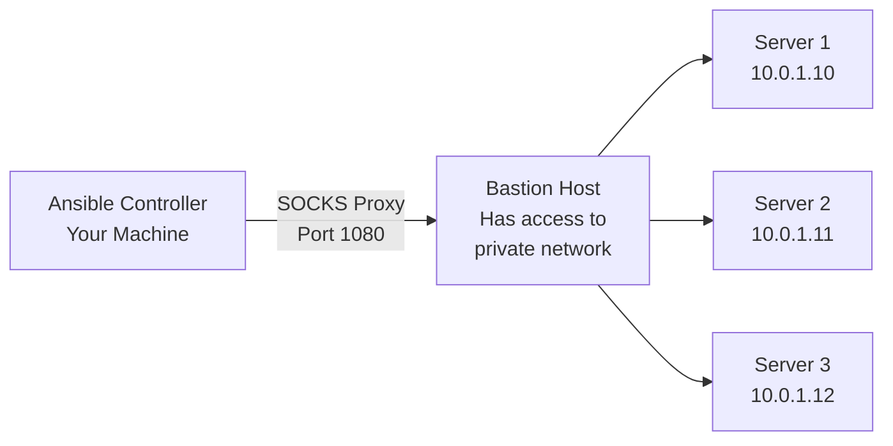

# How to Use Ansible with SOCKS Proxy for SSH

Author: [nawazdhandala](https://www.github.com/nawazdhandala)

Tags: Ansible, SSH, SOCKS Proxy, Networking, DevOps

Description: Route Ansible SSH connections through a SOCKS proxy to reach hosts behind firewalls or in restricted networks

---

Sometimes the servers you need to manage with Ansible are not directly reachable from your workstation. They sit behind firewalls, in isolated network segments, or in cloud VPCs without public IP addresses. A SOCKS proxy provides a way to tunnel your Ansible SSH connections through an intermediary host that does have access to those servers.

This guide covers setting up a SOCKS proxy, configuring Ansible to use it, and handling the various edge cases you will encounter in practice.

## What is a SOCKS Proxy?

SOCKS is a network protocol that routes traffic through a proxy server. When you set up a SOCKS proxy via SSH, you are creating a tunnel on your local machine that forwards connections through the SSH server to their final destination. Your local machine connects to the proxy, the proxy connects to the target, and the target sees the connection as coming from the proxy.



## Setting Up the SOCKS Proxy

The simplest way to create a SOCKS proxy is with SSH's built-in dynamic port forwarding.

```bash
# Create a SOCKS5 proxy through the bastion host on local port 1080
ssh -D 1080 -f -N -q bastion-user@bastion.example.com

# Flags explained:
# -D 1080: Open a SOCKS proxy on local port 1080
# -f: Run in the background after authentication
# -N: Do not execute any remote commands
# -q: Quiet mode (suppress warnings)
```

Verify the proxy is running.

```bash
# Check that the SOCKS proxy is listening
ss -tlnp | grep 1080
# Or on macOS
lsof -i :1080
```

## Configuring Ansible to Use the SOCKS Proxy

Ansible uses SSH for connections, and SSH supports SOCKS proxies through the `ProxyCommand` option with `nc` (netcat) or `ncat`.

```ini
# ansible.cfg
# Route all SSH connections through the SOCKS proxy
[ssh_connection]
ssh_args = -o ProxyCommand="nc -X 5 -x 127.0.0.1:1080 %h %p"
```

The `nc` flags:
- `-X 5`: Use SOCKS5 protocol
- `-x 127.0.0.1:1080`: Connect through the SOCKS proxy at localhost:1080
- `%h %p`: Ansible substitutes the target hostname and port

If your system does not have `nc` with SOCKS support (common on some Linux distributions), use `ncat` from the nmap package.

```ini
# ansible.cfg with ncat instead of nc
[ssh_connection]
ssh_args = -o ProxyCommand="ncat --proxy 127.0.0.1:1080 --proxy-type socks5 %h %p"
```

## Inventory for SOCKS Proxy Access

Your inventory uses the private IP addresses of the target hosts since the SOCKS proxy handles routing.

```ini
# inventory/private_hosts.ini
# These hosts are only reachable through the SOCKS proxy
[webservers]
web1 ansible_host=10.0.1.10
web2 ansible_host=10.0.1.11

[databases]
db1 ansible_host=10.0.1.20

[all:vars]
ansible_user=deploy
ansible_ssh_private_key_file=~/.ssh/deploy_key
```

## Per-Host SOCKS Proxy Configuration

Sometimes only certain hosts need the SOCKS proxy while others are directly reachable. Use per-host or per-group SSH arguments.

```ini
# inventory/mixed_hosts.ini
# Some hosts need the proxy, others are direct
[direct_hosts]
public1 ansible_host=54.123.45.67

[proxied_hosts]
private1 ansible_host=10.0.1.10
private2 ansible_host=10.0.1.11

[proxied_hosts:vars]
ansible_ssh_common_args=-o ProxyCommand="nc -X 5 -x 127.0.0.1:1080 %h %p"
```

With this setup, hosts in `direct_hosts` connect normally, while hosts in `proxied_hosts` route through the SOCKS proxy.

## Using SSH Config Instead

You can configure the SOCKS proxy in your SSH config file and keep the Ansible configuration clean.

```
# ~/.ssh/config
# Route connections to the 10.0.1.x subnet through the SOCKS proxy

Host 10.0.1.*
    ProxyCommand nc -X 5 -x 127.0.0.1:1080 %h %p
    User deploy
    IdentityFile ~/.ssh/deploy_key
    StrictHostKeyChecking no
```

Then ansible.cfg just needs to reference the SSH config.

```ini
# ansible.cfg
[ssh_connection]
ssh_args = -F ~/.ssh/config
```

## Automating SOCKS Proxy Startup

Here is a wrapper script that starts the SOCKS proxy before running an Ansible playbook.

```bash
#!/bin/bash
# scripts/ansible-via-socks.sh
# Start a SOCKS proxy and run an Ansible playbook through it

BASTION="bastion-user@bastion.example.com"
SOCKS_PORT=1080
PLAYBOOK="$1"
INVENTORY="${2:-inventory/private_hosts.ini}"

# Check if SOCKS proxy is already running
if ! ss -tlnp 2>/dev/null | grep -q ":$SOCKS_PORT " && \
   ! lsof -i :$SOCKS_PORT >/dev/null 2>&1; then
    echo "Starting SOCKS proxy on port $SOCKS_PORT through $BASTION..."
    ssh -D $SOCKS_PORT -f -N -q -o ServerAliveInterval=30 "$BASTION"
    sleep 2
fi

# Verify the proxy is up
if ! nc -z 127.0.0.1 $SOCKS_PORT 2>/dev/null; then
    echo "ERROR: SOCKS proxy failed to start on port $SOCKS_PORT"
    exit 1
fi

echo "SOCKS proxy active. Running playbook..."
ANSIBLE_SSH_ARGS="-o ProxyCommand='nc -X 5 -x 127.0.0.1:$SOCKS_PORT %h %p'" \
    ansible-playbook -i "$INVENTORY" "$PLAYBOOK"
```

## SOCKS Proxy with Connection Multiplexing

You can combine the SOCKS proxy with SSH connection multiplexing for better performance.

```ini
# ansible.cfg - SOCKS proxy with multiplexing
[ssh_connection]
ssh_args = -o ProxyCommand="nc -X 5 -x 127.0.0.1:1080 %h %p" -o ControlMaster=auto -o ControlPersist=300s -o ServerAliveInterval=30
control_path_dir = ~/.ansible/cp
pipelining = true
```

This sets up multiplexing on top of the SOCKS tunnel, so the initial connection goes through the proxy, and subsequent commands to the same host reuse the established connection.

## A Complete Playbook Example

Here is a playbook that works through the SOCKS proxy.

```yaml
# playbooks/deploy-via-proxy.yml
# Deploy to private hosts accessible through SOCKS proxy
---
- name: Deploy to private network
  hosts: proxied_hosts
  become: true
  gather_facts: true

  tasks:
    - name: Verify connectivity
      ansible.builtin.ping:

    - name: Show network info
      ansible.builtin.debug:
        msg: "Host {{ ansible_hostname }} at {{ ansible_default_ipv4.address }}"

    - name: Update packages
      ansible.builtin.apt:
        update_cache: true
        cache_valid_time: 3600

    - name: Install monitoring agent
      ansible.builtin.apt:
        name: node-exporter
        state: present

    - name: Ensure monitoring agent is running
      ansible.builtin.systemd:
        name: node-exporter
        state: started
        enabled: true
```

## Using a SOCKS Proxy with Dynamic Inventory

Dynamic inventory plugins work fine with SOCKS proxies. The inventory plugin queries the cloud API directly (not through the SOCKS proxy), and only the SSH connections to the instances go through the proxy.

```yaml
# inventory/aws_private.yml
# Discover private EC2 instances and route SSH through SOCKS proxy
plugin: amazon.aws.aws_ec2
regions:
  - us-east-1
filters:
  tag:Network: private
  instance-state-name: running
hostnames:
  - private-ip-address
compose:
  ansible_ssh_common_args: "'-o ProxyCommand=\"nc -X 5 -x 127.0.0.1:1080 %h %p\"'"
  ansible_user: "'ubuntu'"
```

## Troubleshooting SOCKS Proxy Issues

When Ansible cannot connect through the SOCKS proxy, debug each layer.

```bash
# Test 1: Is the SOCKS proxy running?
nc -z 127.0.0.1 1080 && echo "Proxy is up" || echo "Proxy is down"

# Test 2: Can you reach a host through the proxy using curl?
curl --socks5 127.0.0.1:1080 http://10.0.1.10:80 -v

# Test 3: Can SSH connect through the proxy?
ssh -o ProxyCommand="nc -X 5 -x 127.0.0.1:1080 %h %p" deploy@10.0.1.10

# Test 4: Run Ansible with verbose output
ansible proxied_hosts -m ping -vvvv
```

Common problems:

- The `nc` binary does not support SOCKS (install `ncat` or `netcat-openbsd`)
- The bastion host's SSH session timed out, killing the SOCKS proxy
- The target host's firewall blocks connections from the bastion's IP
- DNS resolution fails because the proxy does not resolve internal hostnames (use IP addresses)

## Security Notes

Running a SOCKS proxy has security implications:

1. The SOCKS proxy is only bound to localhost (127.0.0.1) by default, which is the correct behavior. Never bind it to 0.0.0.0.
2. The bastion host sees all traffic passing through the proxy, so it needs to be a trusted host.
3. Use SSH key authentication for the bastion connection to avoid password exposure.
4. Consider adding `-o ServerAliveInterval=30` to the SSH command that creates the proxy to prevent it from dying silently.

A SOCKS proxy is a practical solution for reaching isolated networks with Ansible. It requires minimal setup on the target hosts (just normal SSH access) and all the configuration lives on your Ansible controller.
