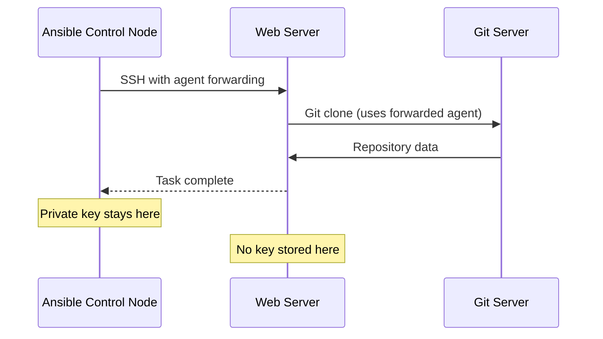

# How to Use Ansible with SSH Agent Forwarding

Author: [nawazdhandala](https://www.github.com/nawazdhandala)

Tags: Ansible, SSH, Agent Forwarding, Security

Description: Configure SSH agent forwarding with Ansible to securely access remote resources through managed hosts without copying private keys.

---

SSH agent forwarding lets you use your local SSH keys on remote servers without actually copying those keys to the remote machine. This is incredibly useful when your managed hosts need to authenticate to other services, like pulling code from a private Git repository or accessing another server in a chain. Ansible supports agent forwarding natively, and setting it up is straightforward.

## Why Agent Forwarding Matters

Consider this common scenario: your Ansible playbook deploys code to a web server by cloning a private Git repository. The Git server requires SSH key authentication. Without agent forwarding, you would need to either put a deploy key on every web server or copy your private key there. Both approaches have drawbacks. Deploy keys add management overhead, and copying private keys to servers is a security risk.

Agent forwarding solves this by letting the remote server use your local SSH agent to authenticate. Your private key never leaves your control node.



## Setting Up the SSH Agent

First, ensure your SSH agent is running and your key is loaded on the control node:

```bash
# Start the SSH agent if not already running
eval $(ssh-agent -s)

# Add your key to the agent
ssh-add ~/.ssh/id_ed25519

# Verify the key is loaded
ssh-add -l
```

You should see output like:

```
256 SHA256:abc123... user@control-node (ED25519)
```

## Enabling Agent Forwarding in Ansible

There are several ways to enable agent forwarding in Ansible.

### Method 1: ansible.cfg

The most common approach is setting it in your Ansible configuration file:

```ini
# ansible.cfg
[ssh_connection]
ssh_args = -o ForwardAgent=yes
```

If you already have `ssh_args` set, append the ForwardAgent option:

```ini
[ssh_connection]
ssh_args = -o ForwardAgent=yes -o ControlMaster=auto -o ControlPersist=60s
```

### Method 2: Environment Variable

Set it via the Ansible environment variable:

```bash
# Enable agent forwarding via environment variable
export ANSIBLE_SSH_ARGS="-o ForwardAgent=yes"

# Then run your playbook
ansible-playbook deploy.yml
```

### Method 3: Inventory Variables

Enable it per host or per group:

```ini
# inventory/hosts
[webservers:vars]
ansible_ssh_extra_args=-o ForwardAgent=yes

[webservers]
web01 ansible_host=10.0.1.10
web02 ansible_host=10.0.1.11
```

### Method 4: In the Playbook

Use the `environment` or `ssh` connection parameters in your playbook:

```yaml
# deploy.yml
---
- name: Deploy application
  hosts: webservers
  vars:
    ansible_ssh_extra_args: "-o ForwardAgent=yes"

  tasks:
    - name: Clone private repository
      git:
        repo: "git@github.com:company/private-app.git"
        dest: /opt/app
        version: main
        accept_hostkey: yes
```

## Practical Use Case: Git Deployment

Here is a complete example of using agent forwarding to deploy from a private repository:

```yaml
# deploy.yml
---
- name: Deploy from private Git repo
  hosts: webservers
  become: yes
  vars:
    ansible_ssh_extra_args: "-o ForwardAgent=yes"
    app_dir: /opt/myapp
    repo_url: "git@github.com:mycompany/myapp.git"
    branch: main

  tasks:
    # Ensure git is installed
    - name: Install git
      apt:
        name: git
        state: present

    # Ensure the app directory exists with correct ownership
    - name: Create app directory
      file:
        path: "{{ app_dir }}"
        state: directory
        owner: "{{ ansible_user }}"
        group: "{{ ansible_user }}"

    # Clone using the forwarded SSH agent
    - name: Clone the repository
      git:
        repo: "{{ repo_url }}"
        dest: "{{ app_dir }}"
        version: "{{ branch }}"
        accept_hostkey: yes
      become: no  # Run as the SSH user, not root, to use the forwarded agent
```

Notice the `become: no` on the git task. This is critical. Agent forwarding works for the user who established the SSH connection. If you `become` root, the forwarded agent socket is not accessible by default.

## Handling become with Agent Forwarding

The most common pitfall with agent forwarding is losing access to the agent when using `become`. Here is how to handle it:

```yaml
# Preserve the SSH agent socket when using become
- name: Deploy with become support
  hosts: webservers
  become: yes
  vars:
    ansible_ssh_extra_args: "-o ForwardAgent=yes"

  tasks:
    # This task runs as root but needs the SSH agent
    - name: Clone repo as deploy user
      git:
        repo: "git@github.com:company/app.git"
        dest: /opt/app
        version: main
        accept_hostkey: yes
      become_user: "{{ ansible_user }}"
      become: no
```

If you absolutely need root access to the forwarded agent, configure sudo to preserve the `SSH_AUTH_SOCK` environment variable:

```bash
# On the remote host, add to /etc/sudoers.d/ssh-agent
Defaults    env_keep += "SSH_AUTH_SOCK"
```

Or automate it with Ansible:

```yaml
- name: Allow sudo to preserve SSH agent socket
  copy:
    content: 'Defaults    env_keep += "SSH_AUTH_SOCK"'
    dest: /etc/sudoers.d/ssh-agent
    mode: '0440'
    validate: 'visudo -cf %s'
  become: yes
```

## Testing Agent Forwarding

Before running complex playbooks, verify that agent forwarding works:

```bash
# Test with an ad hoc command
ansible web01 -m shell -a "ssh-add -l" -e "ansible_ssh_extra_args='-o ForwardAgent=yes'"
```

If it works, you will see your key fingerprint. If not, you will see "Could not open a connection to your authentication agent."

You can also test Git access specifically:

```bash
# Test Git SSH access through the forwarded agent
ansible web01 -m shell -a "ssh -T git@github.com" \
  -e "ansible_ssh_extra_args='-o ForwardAgent=yes'"
```

## Security Considerations

Agent forwarding is convenient but comes with security implications. When you enable agent forwarding, anyone with root access on the remote server can use your agent socket to authenticate as you for the duration of your connection.

To minimize risk:

```yaml
# Only forward the agent for tasks that need it
- name: Deploy application
  hosts: webservers
  tasks:
    # This task does not need agent forwarding
    - name: Install packages
      apt:
        name: "{{ item }}"
        state: present
      loop:
        - nginx
        - python3
      become: yes

    # Only enable forwarding for the git task
    - name: Clone repository
      git:
        repo: "git@github.com:company/app.git"
        dest: /opt/app
        accept_hostkey: yes
      environment:
        SSH_AUTH_SOCK: "{{ ansible_env.SSH_AUTH_SOCK | default('') }}"
      vars:
        ansible_ssh_extra_args: "-o ForwardAgent=yes"
```

Additional security recommendations:

1. Use agent forwarding only when necessary
2. Add keys to the agent with a lifetime: `ssh-add -t 3600 ~/.ssh/key` (expires after 1 hour)
3. Use `ssh-add -c` to require confirmation for each use of the key
4. Consider using ProxyJump instead of agent forwarding when possible

## Limiting Agent Key Lifetime

For better security, add your key with an expiration time:

```bash
# Key is removed from agent after 1 hour (3600 seconds)
ssh-add -t 3600 ~/.ssh/id_ed25519

# Key requires confirmation for each use
ssh-add -c ~/.ssh/id_ed25519

# Both: expires after 1 hour and requires confirmation
ssh-add -c -t 3600 ~/.ssh/id_ed25519
```

## Troubleshooting Agent Forwarding

```bash
# Check if the agent is running
echo $SSH_AUTH_SOCK

# Check if keys are loaded
ssh-add -l

# Test forwarding with verbose SSH
ansible web01 -m ping -vvvv -e "ansible_ssh_extra_args='-o ForwardAgent=yes'"

# On the remote host, check the agent socket
ansible web01 -m shell -a "ls -la \$SSH_AUTH_SOCK" \
  -e "ansible_ssh_extra_args='-o ForwardAgent=yes'"
```

If forwarding is not working, common causes include:
- SSH agent not running on the control node
- No keys loaded in the agent
- Remote sshd has `AllowAgentForwarding no` in sshd_config
- Using `become` without preserving the SSH_AUTH_SOCK variable

## Wrapping Up

SSH agent forwarding is a clean way to give managed hosts access to your SSH credentials without distributing private keys. Enable it in `ansible.cfg` for broad use or in specific playbook tasks for tighter security. Watch out for the `become` gotcha, where root cannot access the forwarded agent by default. For production, always set key lifetimes on your agent and limit forwarding to only the tasks that actually need it.
