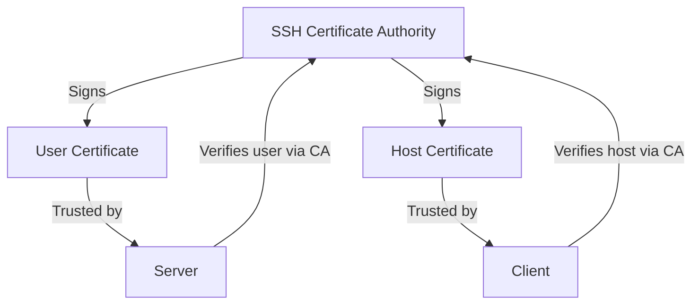

# How to Use Ansible with SSH Certificates

Author: [nawazdhandala](https://www.github.com/nawazdhandala)

Tags: Ansible, SSH, Certificates, Security

Description: Implement SSH certificate-based authentication with Ansible for scalable, time-limited access control across your infrastructure.

---

SSH keys work great until you have hundreds of servers and dozens of engineers. At that scale, distributing and managing authorized_keys files becomes a maintenance nightmare. SSH certificates solve this by introducing a Certificate Authority (CA) model. Instead of trusting individual keys, servers trust the CA. Any key signed by the CA is automatically accepted. This integrates beautifully with Ansible and fundamentally changes how you manage SSH access.

## How SSH Certificates Work

Traditional SSH key authentication requires every server to have every user's public key in its authorized_keys file. SSH certificates replace this with a trust hierarchy:



1. You create an SSH CA (just a regular SSH key pair used for signing)
2. Servers are configured to trust the CA's public key
3. User keys are signed by the CA to create certificates
4. When a user connects, the server verifies the certificate against the CA

No more managing authorized_keys files on hundreds of servers.

## Setting Up an SSH Certificate Authority

### Create the CA Key Pair

```bash
# Create a dedicated directory for the CA
mkdir -p ~/ssh-ca && chmod 700 ~/ssh-ca

# Generate the CA key (this is the crown jewel - protect it!)
ssh-keygen -t ed25519 -f ~/ssh-ca/ca_key -C "SSH CA Key"

# You now have:
# ~/ssh-ca/ca_key       - CA private key (keep this SECRET)
# ~/ssh-ca/ca_key.pub   - CA public key (distribute to servers)
```

### Create a Separate CA for Host Certificates (Optional but Recommended)

```bash
# Separate CA for signing host keys
ssh-keygen -t ed25519 -f ~/ssh-ca/host_ca_key -C "SSH Host CA Key"
```

## Signing User Keys

Sign an existing user's public key to create a certificate:

```bash
# Sign the Ansible automation user's key
ssh-keygen -s ~/ssh-ca/ca_key \
    -I "ansible-automation" \
    -n ansible,deploy \
    -V +52w \
    -z 1 \
    ~/.ssh/ansible_key.pub
```

Flags explained:
- `-s ~/ssh-ca/ca_key` - Sign with this CA key
- `-I "ansible-automation"` - Certificate identity (for logging)
- `-n ansible,deploy` - Valid principals (usernames this cert can authenticate as)
- `-V +52w` - Valid for 52 weeks
- `-z 1` - Certificate serial number

This creates `~/.ssh/ansible_key-cert.pub` alongside the original public key.

Verify the certificate:

```bash
# Inspect the certificate
ssh-keygen -L -f ~/.ssh/ansible_key-cert.pub
```

Output shows the certificate details:

```
/home/user/.ssh/ansible_key-cert.pub:
        Type: ssh-ed25519-cert-v01@openssh.com user certificate
        Public key: ED25519-CERT SHA256:...
        Signing CA: ED25519 SHA256:...
        Key ID: "ansible-automation"
        Serial: 1
        Valid: from 2026-02-21T00:00:00 to 2027-02-20T23:59:59
        Principals:
                ansible
                deploy
        Critical Options: (none)
        Extensions:
                permit-agent-forwarding
                permit-port-forwarding
                permit-pty
                permit-user-rc
```

## Configuring Servers to Trust the CA

On each managed host, configure the SSH daemon to trust certificates signed by your CA:

```bash
# Copy the CA public key to each server
# (This is the CA's PUBLIC key, not the private key)
scp ~/ssh-ca/ca_key.pub root@server:/etc/ssh/ca_key.pub

# On the server, add to sshd_config
echo "TrustedUserCAKeys /etc/ssh/ca_key.pub" >> /etc/ssh/sshd_config

# Restart sshd
systemctl restart sshd
```

Automate this with Ansible (using traditional key auth for the bootstrap):

```yaml
# setup_ssh_ca.yml - Bootstrap CA trust on all servers
---
- name: Configure SSH CA trust
  hosts: all
  become: yes

  vars:
    ca_public_key: "{{ lookup('file', '~/ssh-ca/ca_key.pub') }}"

  tasks:
    # Deploy the CA public key
    - name: Copy CA public key to server
      copy:
        content: "{{ ca_public_key }}"
        dest: /etc/ssh/ca_key.pub
        owner: root
        group: root
        mode: '0644'

    # Configure sshd to trust the CA
    - name: Add TrustedUserCAKeys to sshd_config
      lineinfile:
        path: /etc/ssh/sshd_config
        regexp: '^TrustedUserCAKeys'
        line: 'TrustedUserCAKeys /etc/ssh/ca_key.pub'
        validate: 'sshd -t -f %s'
      notify: restart sshd

    # Optionally restrict principals
    - name: Create AuthorizedPrincipalsFile
      copy:
        content: |
          ansible
          deploy
        dest: /etc/ssh/auth_principals
        mode: '0644'

    - name: Configure AuthorizedPrincipalsFile
      lineinfile:
        path: /etc/ssh/sshd_config
        regexp: '^AuthorizedPrincipalsFile'
        line: 'AuthorizedPrincipalsFile /etc/ssh/auth_principals'
        validate: 'sshd -t -f %s'
      notify: restart sshd

  handlers:
    - name: restart sshd
      service:
        name: sshd
        state: restarted
```

## Configuring Ansible to Use Certificates

Ansible uses SSH certificates automatically when they exist alongside the private key:

```ini
# ansible.cfg
[defaults]
private_key_file = ~/.ssh/ansible_key
remote_user = ansible
```

SSH automatically looks for `~/.ssh/ansible_key-cert.pub` when using `~/.ssh/ansible_key`. No additional Ansible configuration is needed.

If the certificate is in a different location:

```ini
# ansible.cfg
[ssh_connection]
ssh_args = -o CertificateFile=~/.ssh/ansible_key-cert.pub
```

## Signing Host Keys

Host certificates let clients verify server identity without TOFU (Trust On First Use):

```bash
# On each server, find the host key
# Usually /etc/ssh/ssh_host_ed25519_key.pub

# Sign the host key with the host CA
ssh-keygen -s ~/ssh-ca/host_ca_key \
    -I "web01.company.com" \
    -h \
    -n web01.company.com,10.0.1.10 \
    -V +52w \
    /etc/ssh/ssh_host_ed25519_key.pub
```

The `-h` flag indicates this is a host certificate. The `-n` flag lists valid hostnames/IPs.

Configure the server to present the host certificate:

```bash
# On the server, add to sshd_config
echo "HostCertificate /etc/ssh/ssh_host_ed25519_key-cert.pub" >> /etc/ssh/sshd_config
systemctl restart sshd
```

On the client (Ansible control node), trust the host CA:

```bash
# Add the host CA to known_hosts
echo "@cert-authority * $(cat ~/ssh-ca/host_ca_key.pub)" >> ~/.ssh/known_hosts
```

Now Ansible will trust any server with a certificate signed by the host CA, and you can enable strict host key checking:

```ini
# ansible.cfg
[defaults]
host_key_checking = True
```

## Certificate Renewal Automation

Certificates expire, so automate renewal:

```bash
#!/bin/bash
# renew_ansible_cert.sh - Renew the Ansible user certificate
CA_KEY=~/ssh-ca/ca_key
USER_KEY=~/.ssh/ansible_key.pub
VALIDITY="+4w"  # 4 weeks

# Get next serial number
SERIAL_FILE=~/ssh-ca/serial
SERIAL=$(cat "$SERIAL_FILE" 2>/dev/null || echo 1)
echo $((SERIAL + 1)) > "$SERIAL_FILE"

# Sign the key
ssh-keygen -s "$CA_KEY" \
    -I "ansible-automation-$(date +%Y%m%d)" \
    -n ansible,deploy \
    -V "$VALIDITY" \
    -z "$SERIAL" \
    "$USER_KEY"

echo "Certificate renewed. Valid for 4 weeks."
echo "Serial: $SERIAL"
ssh-keygen -L -f "${USER_KEY%.pub}-cert.pub" | grep -E "Valid|Serial|Principals"
```

Set up a cron job:

```bash
# Renew certificate every 3 weeks (before 4-week expiry)
0 0 * * 0 /home/ansible/renew_ansible_cert.sh
```

## Restricting Certificate Capabilities

You can limit what a certificate holder can do:

```bash
# Create a certificate that only allows command execution (no port forwarding, etc.)
ssh-keygen -s ~/ssh-ca/ca_key \
    -I "ansible-restricted" \
    -n ansible \
    -V +4w \
    -O clear \
    -O permit-pty \
    ~/.ssh/ansible_key.pub
```

Available options:
- `clear` - Remove all permissions
- `permit-pty` - Allow terminal allocation
- `permit-agent-forwarding` - Allow agent forwarding
- `permit-port-forwarding` - Allow port forwarding
- `permit-user-rc` - Allow running ~/.ssh/rc
- `force-command=/path/to/script` - Only allow a specific command
- `source-address=10.0.0.0/8` - Restrict source IP range

For Ansible, you typically need at least `permit-pty` and want to restrict source addresses:

```bash
ssh-keygen -s ~/ssh-ca/ca_key \
    -I "ansible-production" \
    -n ansible \
    -V +2w \
    -O source-address=10.0.0.50/32 \
    ~/.ssh/ansible_key.pub
```

## Wrapping Up

SSH certificates bring enterprise-grade access management to Ansible. Instead of managing authorized_keys on every server, you manage a single CA trust relationship. Certificates expire automatically, so revocation is less of a concern. Combined with principal restrictions and source address limits, you get fine-grained access control without the complexity of LDAP or external identity providers. The initial setup takes some effort, but the ongoing management is dramatically simpler, especially as your infrastructure grows. Start with user certificates for your Ansible automation account, then add host certificates to eliminate the TOFU problem entirely.
