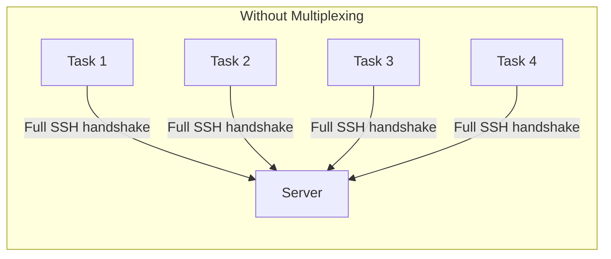
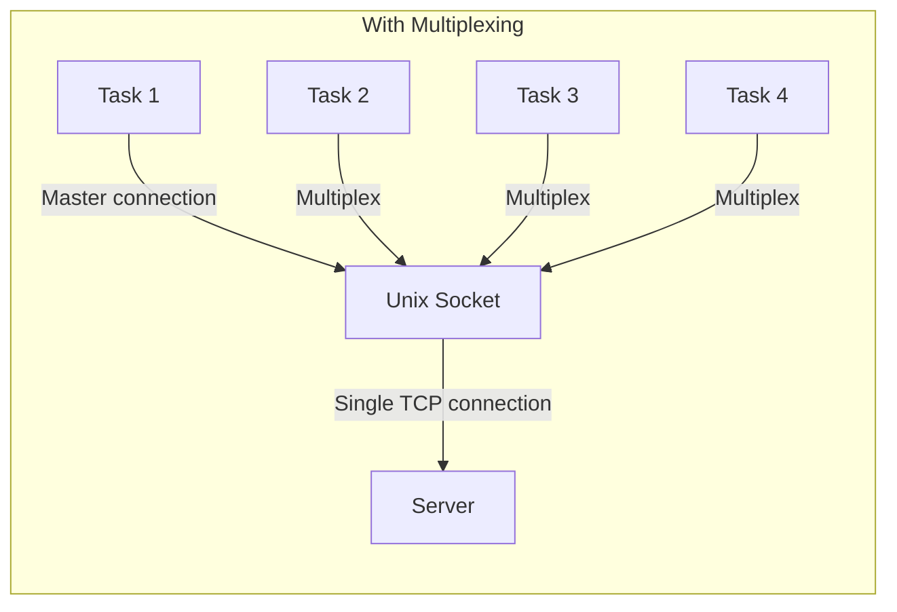

# How to Use Ansible with SSH Multiplexing

Author: [nawazdhandala](https://www.github.com/nawazdhandala)

Tags: Ansible, SSH, Multiplexing, Performance

Description: Configure SSH multiplexing with Ansible to reuse connections across tasks and dramatically improve playbook execution speed.

---

SSH multiplexing is the practice of running multiple SSH sessions over a single TCP connection. Instead of establishing a new connection for every command (which involves TCP handshake, key exchange, and authentication), subsequent sessions piggyback on the first connection through a shared Unix socket. For Ansible, which may execute dozens of SSH commands per host per playbook run, multiplexing can cut execution time by 50% or more.

## How SSH Multiplexing Works

Without multiplexing, every SSH command creates a full connection:



With multiplexing, the first connection creates a master that shares its channel:



The first connection goes through the full SSH handshake. Every subsequent connection detects the Unix socket and tunnels through the existing connection instantly.

## Enabling SSH Multiplexing in Ansible

Ansible uses three SSH options to control multiplexing:

```ini
# ansible.cfg
[ssh_connection]
ssh_args = -o ControlMaster=auto -o ControlPersist=60s
control_path_dir = ~/.ansible/cp
control_path = %(directory)s/%%C
```

### ControlMaster

Controls whether to create or use a multiplexed connection:

- `auto` - Create a master if one does not exist, reuse if it does (recommended)
- `yes` - Always create a new master (not useful for Ansible)
- `no` - Never multiplex
- `autoask` - Like auto but ask before creating (not useful for automation)

### ControlPersist

How long the master connection stays alive after the last session disconnects:

```ini
# Keep alive for 60 seconds (good for most playbooks)
ssh_args = -o ControlMaster=auto -o ControlPersist=60s

# Keep alive for 10 minutes (good for interactive development)
ssh_args = -o ControlMaster=auto -o ControlPersist=10m

# Keep alive for 1 hour
ssh_args = -o ControlMaster=auto -o ControlPersist=1h
```

Without ControlPersist (or with it set to `no`), the master connection closes as soon as the first SSH session ends, which defeats the purpose for Ansible.

### control_path

The file path for the Unix socket used for multiplexing:

```ini
# Using a hash of connection parameters (short, avoids path length issues)
control_path = %(directory)s/%%C

# Using hostname, user, and port (more readable)
control_path = %(directory)s/%%h-%%r-%%p

# Fallback for older systems
control_path = %(directory)s/ansible-ssh-%%h-%%p-%%r
```

## Complete Multiplexing Configuration

Here is a production-ready configuration:

```ini
# ansible.cfg
[defaults]
forks = 20
timeout = 30

[ssh_connection]
ssh_args = -o ControlMaster=auto -o ControlPersist=120s -o ServerAliveInterval=30
control_path_dir = ~/.ansible/cp
control_path = %(directory)s/%%C
pipelining = True
```

Make sure the control path directory exists:

```bash
mkdir -p ~/.ansible/cp
chmod 700 ~/.ansible/cp
```

## Verifying Multiplexing Is Active

Run a playbook and check for socket files:

```bash
# Run a playbook in the background
ansible-playbook site.yml &

# Check for multiplexing sockets
ls -la ~/.ansible/cp/
```

You should see socket files:

```
srw------- 1 user user 0 Feb 21 10:30 abcdef1234567890
srw------- 1 user user 0 Feb 21 10:30 fedcba0987654321
```

Each socket represents a master connection to a different host.

Check a specific connection:

```bash
# Check status of multiplexed connection
ssh -O check -S ~/.ansible/cp/abcdef1234567890 user@host 2>&1

# Expected output:
# Master running (pid=12345)
```

## Measuring Performance Impact

Create a benchmark playbook:

```yaml
# benchmark.yml
---
- name: SSH Multiplexing Benchmark
  hosts: all
  gather_facts: no

  tasks:
    - name: "Command {{ item }}"
      command: "echo task {{ item }}"
      loop: "{{ range(1, 26) | list }}"
      changed_when: false
```

```bash
# Benchmark without multiplexing
echo "--- Without multiplexing ---"
time ANSIBLE_SSH_ARGS="-o ControlMaster=no" ansible-playbook benchmark.yml

# Benchmark with multiplexing
echo "--- With multiplexing ---"
time ANSIBLE_SSH_ARGS="-o ControlMaster=auto -o ControlPersist=60s" ansible-playbook benchmark.yml
```

Typical results with 5 hosts and 25 tasks:
- Without multiplexing: ~60 seconds
- With multiplexing: ~25 seconds

The improvement grows with more tasks per host because each additional task saves one full SSH handshake.

## Multiplexing with Bastion Hosts

Multiplexing is even more valuable when connecting through a bastion host, since each connection involves two SSH handshakes:

```ini
# ansible.cfg - Bastion with multiplexing
[ssh_connection]
ssh_args = -o ProxyJump=admin@bastion.example.com -o ControlMaster=auto -o ControlPersist=300s -o ServerAliveInterval=30
control_path_dir = ~/.ansible/cp
control_path = %(directory)s/%%C
pipelining = True
```

The higher ControlPersist (300 seconds) compensates for the longer connection setup time through the bastion.

## Managing Multiplexed Connections

### Listing Active Connections

```bash
# List all active multiplex sockets
ls -la ~/.ansible/cp/

# Check each socket
for sock in ~/.ansible/cp/*; do
    echo "Socket: $sock"
    ssh -O check -S "$sock" dummy 2>&1
done
```

### Stopping Connections

```bash
# Stop a specific connection
ssh -O stop -S ~/.ansible/cp/abcdef1234567890 user@host

# Exit a connection immediately
ssh -O exit -S ~/.ansible/cp/abcdef1234567890 user@host

# Remove all sockets (force cleanup)
rm -f ~/.ansible/cp/*
```

### Automatic Cleanup

Create a cleanup script for CI/CD pipelines:

```bash
#!/bin/bash
# cleanup_ssh_mux.sh
# Clean up stale SSH multiplexing sockets

SOCKET_DIR="${HOME}/.ansible/cp"

# Remove sockets older than 2 hours
find "$SOCKET_DIR" -type s -mmin +120 -delete 2>/dev/null

# Remove sockets that are no longer connected
for sock in "$SOCKET_DIR"/*; do
    [ -e "$sock" ] || continue
    if ! ssh -O check -S "$sock" dummy 2>/dev/null; then
        rm -f "$sock"
    fi
done

echo "Cleanup complete. Active sockets:"
ls -la "$SOCKET_DIR/" 2>/dev/null || echo "No active sockets"
```

## Troubleshooting Multiplexing Issues

### Socket Path Too Long

Unix domain sockets have a maximum path length (usually 104-108 characters). If your control_path is too long:

```
ControlPath "/home/very-long-username/.ansible/cp/very-long-hostname-very-long-username-22" too long for Unix domain socket
```

Fix by using the hashed path:

```ini
control_path = %(directory)s/%%C
```

### Stale Sockets

If Ansible hangs or connections fail after a server reboot:

```bash
# Remove all stale sockets
rm -f ~/.ansible/cp/*

# Run the playbook again
ansible-playbook site.yml
```

### Permission Denied on Socket

The socket directory and files need correct permissions:

```bash
# Fix permissions
chmod 700 ~/.ansible/cp
```

### Multiplexing with Sudo

When using `become: yes`, the multiplexed connection still works because privilege escalation happens after the SSH connection is established. No special configuration is needed.

## Multiplexing with Parallel Forks

Multiplexing works alongside Ansible's fork-based parallelism. Each fork creates its own master connection to its assigned host:

```ini
# ansible.cfg
[defaults]
forks = 20  # 20 hosts in parallel

[ssh_connection]
# Each of the 20 forks gets its own multiplexed connection
ssh_args = -o ControlMaster=auto -o ControlPersist=120s
```

With 20 forks and 20 hosts, you get 20 multiplexed connections. Each host has one master connection that all tasks for that host share.

## Multiplexing and Connection Limits

Be aware of server-side connection limits:

```bash
# Check MaxSessions setting on the remote server
# (default is 10, which is usually fine for Ansible)
grep MaxSessions /etc/ssh/sshd_config
```

If `MaxSessions` is set too low, you might see errors when Ansible tries to multiplex too many sessions. Increase it:

```ini
# On the remote server's /etc/ssh/sshd_config
MaxSessions 20
```

## Quick Reference Configuration

```ini
# ansible.cfg - Standard multiplexing setup
[ssh_connection]
ssh_args = -o ControlMaster=auto -o ControlPersist=60s
control_path_dir = ~/.ansible/cp
control_path = %(directory)s/%%C

# High performance setup (add pipelining)
[ssh_connection]
ssh_args = -o ControlMaster=auto -o ControlPersist=120s -o ServerAliveInterval=30
control_path_dir = ~/.ansible/cp
control_path = %(directory)s/%%C
pipelining = True

# Bastion host setup
[ssh_connection]
ssh_args = -o ProxyJump=admin@bastion.example.com -o ControlMaster=auto -o ControlPersist=300s
control_path_dir = ~/.ansible/cp
control_path = %(directory)s/%%C
pipelining = True
```

## Wrapping Up

SSH multiplexing is one of the simplest and most effective performance optimizations for Ansible. Three lines in `ansible.cfg` give you automatic connection reuse across all tasks for each host. The first task pays the full SSH handshake cost, and every subsequent task connects instantly through the multiplexed socket. Combined with pipelining and increased forks, multiplexing can reduce playbook execution time by 50% or more. Always use `ControlMaster=auto`, set a reasonable `ControlPersist` value, and use the hashed `%%C` control path to avoid socket path length issues.
