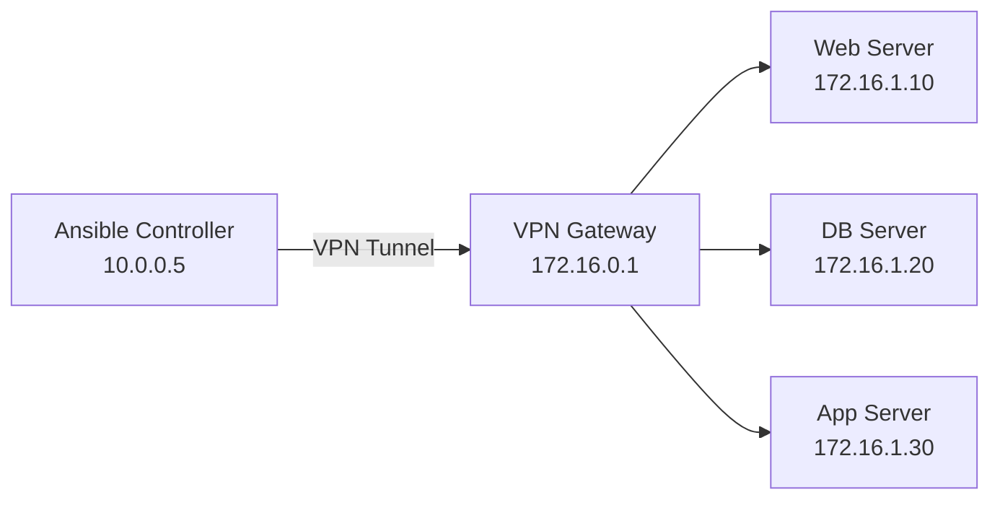

# How to Use Ansible with SSH Over a VPN Tunnel

Author: [nawazdhandala](https://www.github.com/nawazdhandala)

Tags: Ansible, SSH, VPN, Networking, DevOps

Description: Configure Ansible to manage remote hosts through VPN tunnels including WireGuard, OpenVPN, and IPSec connections

---

Managing servers behind a VPN is a common scenario in enterprise environments. Your Ansible controller sits on one network, your target servers sit on another, and a VPN tunnel bridges the gap. While the concept is simple, the actual configuration can trip you up if you do not account for routing, DNS resolution, and the quirks of running SSH over a VPN.

This guide covers configuring Ansible with the most common VPN setups: WireGuard, OpenVPN, and IPSec tunnels.

## Network Architecture Overview

Here is the typical setup when running Ansible over a VPN.



The Ansible controller has a local IP on your office or home network. The VPN assigns it an IP on the remote network (or routes the remote subnet through the tunnel). The target servers have IPs on the remote network that are only reachable through the VPN.

## WireGuard VPN Setup

WireGuard is the most straightforward VPN for Ansible because it creates a standard network interface. Once the WireGuard tunnel is up, Ansible connects as if the remote hosts were on the local network.

```ini
# /etc/wireguard/wg0.conf on the Ansible controller
# WireGuard configuration to reach the remote network
[Interface]
PrivateKey = <your_private_key>
Address = 172.16.0.2/24
DNS = 172.16.0.1

[Peer]
PublicKey = <server_public_key>
Endpoint = vpn.example.com:51820
AllowedIPs = 172.16.0.0/16
PersistentKeepalive = 25
```

```bash
# Bring up the WireGuard tunnel
sudo wg-quick up wg0

# Verify connectivity to the remote network
ping -c 3 172.16.1.10
```

With WireGuard active, your Ansible inventory is straightforward.

```ini
# inventory/vpn_hosts.ini
# Standard inventory using private IPs reachable over WireGuard
[webservers]
web1 ansible_host=172.16.1.10
web2 ansible_host=172.16.1.11

[databases]
db1 ansible_host=172.16.1.20

[all:vars]
ansible_user=deploy
ansible_ssh_private_key_file=~/.ssh/deploy_key
```

## OpenVPN Setup

OpenVPN works similarly. Once the tunnel is established, you get a tun interface with routes to the remote network.

```bash
# Connect to the OpenVPN server
sudo openvpn --config /etc/openvpn/client.ovpn --daemon

# Verify the tun interface is up
ip addr show tun0

# Check that routes to the remote network exist
ip route | grep 172.16
```

The Ansible configuration is identical to the WireGuard example since both create standard network interfaces. The only difference is that OpenVPN tends to have higher latency, so you may want to adjust timeouts.

```ini
# ansible.cfg tuned for OpenVPN connections
[defaults]
inventory = inventory/vpn_hosts.ini
timeout = 60

[ssh_connection]
ssh_args = -o ConnectTimeout=30 -o ServerAliveInterval=15 -o ServerAliveCountMax=10
retries = 3
```

## SSH Over an Already-Running VPN

If someone else manages the VPN and you just need to use it, the main thing is making sure your SSH traffic routes correctly through the VPN interface.

```bash
# Check if the remote subnet routes through the VPN
ip route get 172.16.1.10
# Expected output: 172.16.1.10 via 172.16.0.1 dev wg0 ...

# If routing is not set up, add a route manually
sudo ip route add 172.16.0.0/16 via 172.16.0.1 dev wg0
```

## Handling Split-Tunnel VPN

In a split-tunnel configuration, only traffic destined for specific subnets goes through the VPN. The rest goes through your normal internet connection. This is actually the ideal setup for Ansible because it does not route unrelated traffic through the VPN.

```ini
# inventory/split-tunnel.ini
# Hosts reachable over the VPN tunnel (private IPs)
[vpn_hosts]
server1 ansible_host=10.10.0.5
server2 ansible_host=10.10.0.6

# Hosts reachable over the internet (public IPs)
[public_hosts]
cloud1 ansible_host=54.123.45.67
cloud2 ansible_host=54.123.45.68

[vpn_hosts:vars]
ansible_ssh_common_args=-o ConnectTimeout=30

[public_hosts:vars]
ansible_ssh_common_args=-o ConnectTimeout=10
```

## DNS Resolution Over VPN

A common gotcha is DNS. Your VPN might provide access to internal DNS servers that resolve hostnames for the remote network. If Ansible cannot resolve hostnames, you have a few options.

```ini
# Option 1: Use IP addresses directly in inventory
[webservers]
web1 ansible_host=172.16.1.10

# Option 2: Add entries to /etc/hosts on the controller
# 172.16.1.10 web1.internal.example.com

# Option 3: Configure systemd-resolved to use the VPN's DNS for the internal domain
```

```bash
# Configure split DNS with systemd-resolved
sudo resolvectl dns wg0 172.16.0.1
sudo resolvectl domain wg0 internal.example.com

# Verify DNS resolution works for internal domains
dig web1.internal.example.com
```

## Playbook for VPN-Connected Hosts

Here is a practical playbook that accounts for VPN-specific considerations.

```yaml
# playbooks/vpn-deploy.yml
# Deploy to hosts behind a VPN with appropriate timeouts
---
- name: Deploy to VPN-connected hosts
  hosts: vpn_hosts
  gather_facts: true
  any_errors_fatal: false

  pre_tasks:
    - name: Wait for VPN connectivity
      ansible.builtin.wait_for_connection:
        delay: 5
        timeout: 60

  tasks:
    - name: Gather system information
      ansible.builtin.setup:
        gather_subset:
          - hardware
          - network

    - name: Display network interfaces
      ansible.builtin.debug:
        msg: "Host {{ inventory_hostname }} has interfaces: {{ ansible_interfaces }}"

    - name: Update system packages
      ansible.builtin.apt:
        update_cache: true
        upgrade: safe
      become: true

    - name: Deploy application configuration
      ansible.builtin.template:
        src: templates/app.conf.j2
        dest: /etc/myapp/app.conf
        owner: root
        mode: '0644'
      become: true
      notify: restart application

  handlers:
    - name: restart application
      ansible.builtin.systemd:
        name: myapp
        state: restarted
      become: true
```

The `wait_for_connection` task at the beginning is important. VPN connections can be flaky, and this gives the tunnel a chance to stabilize before Ansible starts running tasks.

## Automating VPN Connection Before Playbook Run

You can wrap your Ansible run in a script that ensures the VPN is connected first.

```bash
#!/bin/bash
# scripts/run-over-vpn.sh
# Ensure VPN is connected before running the Ansible playbook

VPN_INTERFACE="wg0"
REMOTE_HOST="172.16.1.10"
PLAYBOOK="$1"

# Check if VPN interface exists
if ! ip link show "$VPN_INTERFACE" &>/dev/null; then
    echo "VPN interface $VPN_INTERFACE not found. Connecting..."
    sudo wg-quick up wg0
    sleep 3
fi

# Verify connectivity
if ! ping -c 1 -W 5 "$REMOTE_HOST" &>/dev/null; then
    echo "Cannot reach $REMOTE_HOST over VPN. Check your connection."
    exit 1
fi

echo "VPN is active. Running playbook..."
ansible-playbook -i inventory/vpn_hosts.ini "$PLAYBOOK"
EXIT_CODE=$?

echo "Playbook finished with exit code $EXIT_CODE"
exit $EXIT_CODE
```

## Performance Considerations

VPN tunnels add latency and reduce throughput compared to direct connections. Here are some tweaks to help.

```ini
# ansible.cfg optimized for VPN connections
[defaults]
forks = 5
gathering = smart
fact_caching = jsonfile
fact_caching_connection = /tmp/ansible_facts
fact_caching_timeout = 7200

[ssh_connection]
ssh_args = -o ControlMaster=auto -o ControlPersist=600s -o ServerAliveInterval=15 -o ServerAliveCountMax=10 -o Compression=yes
pipelining = true
retries = 3
```

Key settings:

- **Compression=yes**: Compresses SSH traffic, which helps over slower VPN connections
- **Lower forks**: Running fewer parallel connections reduces VPN bandwidth pressure
- **Longer ControlPersist**: Reuses SSH connections longer to avoid re-establishing them over the VPN
- **Fact caching**: Avoids re-gathering facts on every run, saving time on slow connections

## Troubleshooting VPN and Ansible Issues

When things go wrong, diagnose in layers: VPN first, then SSH, then Ansible.

```bash
# Layer 1: Is the VPN tunnel up?
sudo wg show        # For WireGuard
ip addr show tun0   # For OpenVPN

# Layer 2: Can you route to the remote network?
ping -c 3 172.16.1.10
traceroute 172.16.1.10

# Layer 3: Does SSH work directly?
ssh -v deploy@172.16.1.10

# Layer 4: Does Ansible work?
ansible all -i inventory/vpn_hosts.ini -m ping -vvv
```

Common issues include MTU mismatches (VPN tunnels reduce the effective MTU), DNS failures for internal hostnames, and firewall rules on the remote network that block SSH from VPN-assigned IPs. For MTU issues, try reducing the MTU on the VPN interface:

```bash
# Reduce MTU on the WireGuard interface to avoid fragmentation
sudo ip link set mtu 1380 dev wg0
```

Running Ansible over a VPN adds a layer of complexity, but once the tunnel is stable and your routing is correct, it works just like managing hosts on a local network. The key is to account for the extra latency in your timeouts and to verify each layer independently when troubleshooting.
