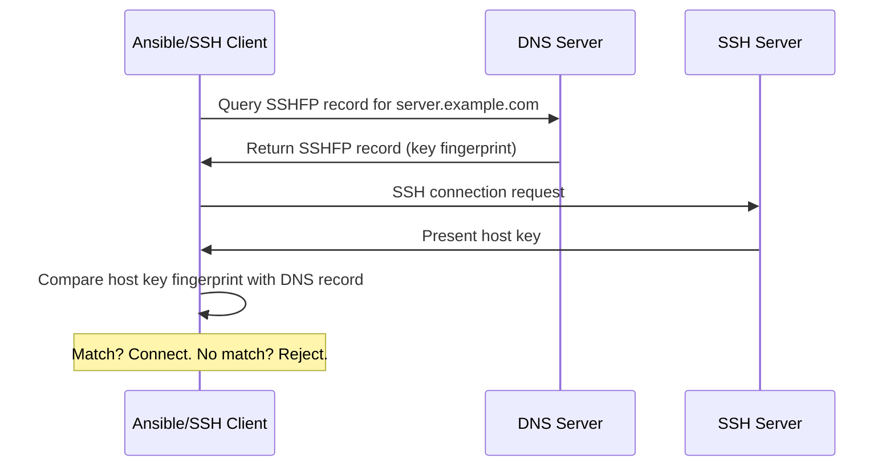

# How to Use Ansible with SSHFP DNS Records

Author: [nawazdhandala](https://www.github.com/nawazdhandala)

Tags: Ansible, SSH, SSHFP, DNS, Security

Description: Configure SSHFP DNS records to automatically verify SSH host keys with Ansible, eliminating manual host key verification prompts.

---

Every time you connect to a new SSH server, you see the dreaded "authenticity of host can't be established" warning. Most people type "yes" without verifying the fingerprint, which defeats the entire purpose of host key checking. SSHFP (SSH Fingerprint) DNS records solve this by publishing SSH host key fingerprints in DNS. When configured correctly, SSH clients (and by extension Ansible) can verify host keys automatically through DNS lookups, eliminating both the manual verification step and the security risk of blindly accepting keys.

## What Are SSHFP Records?

SSHFP is a DNS record type (RFC 4255) that stores SSH public key fingerprints. When an SSH client connects to a server, it can look up the server's SSHFP record and compare it to the key the server presents. If they match, the connection proceeds without prompting.



## SSHFP Record Format

An SSHFP record has three components:

```
server.example.com. IN SSHFP <algorithm> <fingerprint-type> <fingerprint>
```

Algorithm values:
- 1 = RSA
- 2 = DSA
- 3 = ECDSA
- 4 = Ed25519

Fingerprint type:
- 1 = SHA-1
- 2 = SHA-256

Example record:

```
web01.example.com. IN SSHFP 4 2 a1b2c3d4e5f6a1b2c3d4e5f6a1b2c3d4e5f6a1b2c3d4e5f6a1b2c3d4e5f6a1b2
```

This says: "web01.example.com has an Ed25519 key with this SHA-256 fingerprint."

## Generating SSHFP Records

### From the Server

The easiest way to generate SSHFP records is on the server itself:

```bash
# Generate SSHFP records for all host keys
ssh-keygen -r $(hostname -f)
```

Output:

```
web01.example.com IN SSHFP 1 1 abc123...
web01.example.com IN SSHFP 1 2 def456...
web01.example.com IN SSHFP 3 1 ghi789...
web01.example.com IN SSHFP 3 2 jkl012...
web01.example.com IN SSHFP 4 1 mno345...
web01.example.com IN SSHFP 4 2 pqr678...
```

### From a Remote Machine

```bash
# Scan a remote host and generate SSHFP records
ssh-keyscan web01.example.com 2>/dev/null | ssh-keygen -r web01.example.com -f /dev/stdin
```

### Using Ansible to Generate SSHFP Records

Gather SSHFP data from all your hosts:

```yaml
# generate_sshfp.yml
---
- name: Generate SSHFP records for all hosts
  hosts: all
  gather_facts: no

  tasks:
    - name: Generate SSHFP records
      command: "ssh-keygen -r {{ inventory_hostname }}"
      register: sshfp_records
      changed_when: false

    - name: Display SSHFP records
      debug:
        msg: "{{ sshfp_records.stdout_lines }}"

    - name: Save SSHFP records to local file
      lineinfile:
        path: /tmp/sshfp_records.txt
        line: "{{ item }}"
        create: yes
      loop: "{{ sshfp_records.stdout_lines }}"
      delegate_to: localhost
```

## Publishing SSHFP Records in DNS

### Manual Zone File Entry

Add the records to your DNS zone file:

```
; /etc/bind/zones/example.com.zone
$TTL 3600
@   IN  SOA ns1.example.com. admin.example.com. (
        2026022101  ; Serial
        3600        ; Refresh
        900         ; Retry
        604800      ; Expire
        86400       ; Minimum TTL
)

; Regular A records
web01   IN  A       10.0.1.10
web02   IN  A       10.0.1.11
db01    IN  A       10.0.2.10

; SSHFP records for web01
web01   IN  SSHFP   4 2 a1b2c3d4e5f6...

; SSHFP records for web02
web02   IN  SSHFP   4 2 b2c3d4e5f6a1...

; SSHFP records for db01
db01    IN  SSHFP   4 2 c3d4e5f6a1b2...
```

### Using Ansible to Manage SSHFP Records in Route53

```yaml
# publish_sshfp_route53.yml
---
- name: Gather host keys and publish SSHFP records
  hosts: all
  gather_facts: no

  tasks:
    - name: Get host Ed25519 key fingerprint
      shell: |
        ssh-keygen -r {{ inventory_hostname }} | grep "SSHFP 4 2"
      register: sshfp_output
      changed_when: false

    - name: Parse SSHFP data
      set_fact:
        sshfp_fingerprint: "{{ sshfp_output.stdout.split()[-1] }}"

- name: Publish SSHFP records to Route53
  hosts: localhost
  connection: local
  gather_facts: no

  tasks:
    - name: Create SSHFP records in Route53
      amazon.aws.route53:
        state: present
        zone: example.com
        record: "{{ item }}.example.com"
        type: SSHFP
        value: "4 2 {{ hostvars[item]['sshfp_fingerprint'] }}"
        ttl: 3600
        overwrite: yes
      loop: "{{ groups['all'] }}"
```

### Using nsupdate for Dynamic DNS

```yaml
# publish_sshfp_nsupdate.yml
---
- name: Publish SSHFP records via dynamic DNS
  hosts: all
  gather_facts: no

  tasks:
    - name: Generate SSHFP records
      command: "ssh-keygen -r {{ inventory_hostname }}.example.com"
      register: sshfp_data
      changed_when: false

    - name: Create nsupdate script
      copy:
        content: |
          server dns.example.com
          zone example.com
          
          update add {{ line }} 3600
          
          send
        dest: /tmp/nsupdate_{{ inventory_hostname }}.txt
      delegate_to: localhost

    - name: Run nsupdate
      command: "nsupdate -k /etc/dns/update.key /tmp/nsupdate_{{ inventory_hostname }}.txt"
      delegate_to: localhost
```

## Configuring SSH to Use SSHFP Records

On the Ansible control node, enable SSHFP verification:

```ini
# ansible.cfg
[ssh_connection]
ssh_args = -o VerifyHostKeyDNS=yes
```

Or in the SSH config:

```bash
# ~/.ssh/config
Host *.example.com
    VerifyHostKeyDNS yes
```

The `VerifyHostKeyDNS` option has three values:
- `yes` - Verify and trust SSHFP records
- `no` - Ignore SSHFP records (default)
- `ask` - Show SSHFP verification result but still prompt

## DNSSEC: The Security Requirement

SSHFP records are only truly secure when combined with DNSSEC. Without DNSSEC, an attacker could spoof DNS responses and provide false SSHFP records. With DNSSEC, DNS responses are cryptographically signed and verified.

```bash
# Check if a domain has DNSSEC enabled
dig +dnssec example.com DNSKEY

# Verify SSHFP records with DNSSEC
dig +dnssec web01.example.com SSHFP
```

If DNSSEC is not available, SSH will still use SSHFP records but will downgrade to "ask" mode, showing you the result but still prompting for confirmation.

Configure the resolver to validate DNSSEC:

```bash
# /etc/resolv.conf - Use a DNSSEC-validating resolver
nameserver 1.1.1.1
nameserver 8.8.8.8
options edns0
```

## Automating SSHFP Record Management

Here is a complete playbook that generates and publishes SSHFP records whenever host keys change:

```yaml
# manage_sshfp.yml
---
- name: Manage SSHFP DNS records
  hosts: all
  become: yes

  tasks:
    # Generate SSHFP records for this host
    - name: Generate SSHFP records
      command: "ssh-keygen -r {{ inventory_hostname }}.example.com"
      register: new_sshfp
      changed_when: false

    # Check existing DNS records
    - name: Query existing SSHFP records
      command: "dig +short {{ inventory_hostname }}.example.com SSHFP"
      register: existing_sshfp
      delegate_to: localhost
      changed_when: false

    # Compare and update if different
    - name: Update SSHFP records if changed
      command: >
        nsupdate -k /etc/dns/update.key -v <<EOF
        server dns.example.com
        zone example.com
        update delete {{ inventory_hostname }}.example.com SSHFP
        
        update add {{ line }} 3600
        
        send
        EOF
      delegate_to: localhost
      when: existing_sshfp.stdout != new_sshfp.stdout
```

## Verifying SSHFP Setup

Test that everything works:

```bash
# Check SSHFP records exist in DNS
dig web01.example.com SSHFP +short

# Verify SSH uses SSHFP records
ssh -v -o VerifyHostKeyDNS=yes web01.example.com 2>&1 | grep -i "dns"

# Expected output includes:
# debug1: found 1 secure fingerprint(s) in DNS
# debug1: matching host key fingerprint found in DNS

# Test with Ansible
ansible web01 -m ping -e "ansible_ssh_extra_args='-o VerifyHostKeyDNS=yes'" -vvvv
```

## Handling Host Key Rotation

When you rotate host keys, update the SSHFP records:

```yaml
# rotate_host_keys.yml
---
- name: Rotate SSH host keys and update SSHFP
  hosts: all
  become: yes
  serial: 1  # One host at a time to avoid mass disruption

  tasks:
    - name: Generate new host keys
      command: "ssh-keygen -t ed25519 -f /etc/ssh/ssh_host_ed25519_key -N '' -q"
      args:
        creates: /etc/ssh/ssh_host_ed25519_key.new

    - name: Generate new SSHFP records
      command: "ssh-keygen -r {{ inventory_hostname }}.example.com -f /etc/ssh/ssh_host_ed25519_key.pub"
      register: new_sshfp

    - name: Update DNS with new SSHFP records
      command: "nsupdate -k /etc/dns/update.key /tmp/sshfp_update.txt"
      delegate_to: localhost

    - name: Restart SSH daemon
      service:
        name: sshd
        state: restarted

    - name: Verify connectivity
      wait_for_connection:
        timeout: 30
```

## Wrapping Up

SSHFP DNS records bring automated host key verification to SSH and, by extension, to Ansible. Instead of disabling host key checking (which is a security risk) or manually verifying fingerprints (which nobody does reliably), SSHFP lets DNS do the verification automatically. The catch is that you really need DNSSEC for this to be secure. If you already have DNSSEC on your internal DNS, adding SSHFP records is a relatively small effort that eliminates an entire class of security concerns. Generate the records from your hosts, publish them in DNS, set `VerifyHostKeyDNS=yes` in your Ansible SSH config, and you get transparent, automated host verification for every connection.
