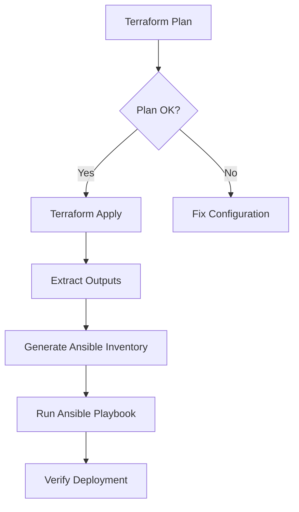

# How to Use Ansible with Terraform in CI/CD

Author: [nawazdhandala](https://www.github.com/nawazdhandala)

Tags: Ansible, Terraform, CI/CD, Infrastructure as Code, DevOps

Description: Learn how to combine Terraform for infrastructure provisioning with Ansible for configuration management in a unified CI/CD pipeline.

---

Terraform and Ansible solve different problems and they work best together. Terraform handles infrastructure provisioning (creating VMs, networks, load balancers), while Ansible handles configuration management (installing software, deploying applications, managing services). Combining them in a CI/CD pipeline gives you a complete infrastructure-as-code workflow where a single pipeline can both create and configure your infrastructure.

This guide covers the patterns for integrating Terraform and Ansible in CI/CD, passing outputs between them, and building pipelines that handle the full lifecycle.

## Why Combine Them

The reason to use both tools instead of picking one is simple: each tool excels at different things.

Terraform is great at:
- Creating cloud resources (EC2, RDS, VPCs)
- Managing resource dependencies
- Tracking infrastructure state
- Handling multi-cloud provisioning

Ansible is great at:
- Installing and configuring software
- Managing files and templates
- Application deployment
- Post-provisioning configuration

## The Integration Pattern

The typical workflow looks like this:



## Passing Terraform Outputs to Ansible

The key challenge is getting Terraform's output (like IP addresses and hostnames) into Ansible's inventory. Here are the main approaches.

### Approach 1: Dynamic Inventory from Terraform State

Use a script that reads Terraform state and generates Ansible inventory.

```python
#!/usr/bin/env python3
# terraform_inventory.py - Generate Ansible inventory from Terraform state
import json
import subprocess
import sys

def get_terraform_output():
    """Run terraform output and return the results as a dict."""
    result = subprocess.run(
        ["terraform", "output", "-json"],
        capture_output=True, text=True,
        cwd="terraform/"
    )
    return json.loads(result.stdout)

def main():
    outputs = get_terraform_output()

    inventory = {
        "webservers": {
            "hosts": outputs.get("web_server_ips", {}).get("value", []),
            "vars": {
                "ansible_user": "ubuntu",
                "ansible_ssh_private_key_file": "~/.ssh/deploy_key"
            }
        },
        "dbservers": {
            "hosts": outputs.get("db_server_ips", {}).get("value", []),
            "vars": {
                "ansible_user": "ubuntu",
                "ansible_ssh_private_key_file": "~/.ssh/deploy_key"
            }
        },
        "_meta": {
            "hostvars": {}
        }
    }

    # Add host-specific variables
    for host in outputs.get("web_server_ips", {}).get("value", []):
        inventory["_meta"]["hostvars"][host] = {
            "db_host": outputs.get("db_endpoint", {}).get("value", ""),
            "app_version": outputs.get("app_version", {}).get("value", "latest")
        }

    print(json.dumps(inventory, indent=2))

if __name__ == "__main__":
    main()
```

### Approach 2: Generate a Static Inventory File

A simpler approach is to generate a static inventory file from Terraform outputs.

```bash
#!/bin/bash
# generate_inventory.sh - Create Ansible inventory from Terraform output

cd terraform/

# Get outputs
WEB_IPS=$(terraform output -json web_server_ips | jq -r '.[]')
DB_IP=$(terraform output -raw db_server_ip)
LB_DNS=$(terraform output -raw lb_dns_name)

# Generate inventory file
cat > ../ansible/inventory/dynamic.ini << EOF
[webservers]
$(echo "$WEB_IPS" | while read ip; do echo "$ip ansible_user=ubuntu"; done)

[dbservers]
$DB_IP ansible_user=ubuntu

[all:vars]
ansible_ssh_private_key_file=~/.ssh/deploy_key
lb_dns_name=$LB_DNS
EOF

echo "Inventory generated at ansible/inventory/dynamic.ini"
```

## GitHub Actions Pipeline

Here is a complete GitHub Actions workflow that runs Terraform, then Ansible.

```yaml
# .github/workflows/infra-deploy.yml
name: Infrastructure Deployment

on:
  push:
    branches: [main]
  workflow_dispatch:

jobs:
  terraform:
    name: Terraform Apply
    runs-on: ubuntu-latest
    outputs:
      web_ips: ${{ steps.tf-output.outputs.web_ips }}
      db_ip: ${{ steps.tf-output.outputs.db_ip }}

    steps:
      - uses: actions/checkout@v4

      - name: Set up Terraform
        uses: hashicorp/setup-terraform@v3
        with:
          terraform_version: 1.7.0
          terraform_wrapper: false

      - name: Terraform Init
        run: terraform init
        working-directory: terraform/
        env:
          AWS_ACCESS_KEY_ID: ${{ secrets.AWS_ACCESS_KEY_ID }}
          AWS_SECRET_ACCESS_KEY: ${{ secrets.AWS_SECRET_ACCESS_KEY }}

      - name: Terraform Plan
        run: terraform plan -out=tfplan
        working-directory: terraform/
        env:
          AWS_ACCESS_KEY_ID: ${{ secrets.AWS_ACCESS_KEY_ID }}
          AWS_SECRET_ACCESS_KEY: ${{ secrets.AWS_SECRET_ACCESS_KEY }}

      - name: Terraform Apply
        run: terraform apply -auto-approve tfplan
        working-directory: terraform/
        env:
          AWS_ACCESS_KEY_ID: ${{ secrets.AWS_ACCESS_KEY_ID }}
          AWS_SECRET_ACCESS_KEY: ${{ secrets.AWS_SECRET_ACCESS_KEY }}

      # Capture Terraform outputs for Ansible
      - name: Get Terraform Outputs
        id: tf-output
        run: |
          cd terraform/
          echo "web_ips=$(terraform output -json web_server_ips)" >> $GITHUB_OUTPUT
          echo "db_ip=$(terraform output -raw db_server_ip)" >> $GITHUB_OUTPUT
        env:
          AWS_ACCESS_KEY_ID: ${{ secrets.AWS_ACCESS_KEY_ID }}
          AWS_SECRET_ACCESS_KEY: ${{ secrets.AWS_SECRET_ACCESS_KEY }}

  ansible:
    name: Ansible Configure
    runs-on: ubuntu-latest
    needs: terraform

    steps:
      - uses: actions/checkout@v4

      - name: Set up Python
        uses: actions/setup-python@v5
        with:
          python-version: '3.11'

      - name: Install Ansible
        run: |
          pip install ansible==8.7.0
          ansible-galaxy collection install -r ansible/requirements.yml

      - name: Set up SSH
        run: |
          mkdir -p ~/.ssh
          echo "${{ secrets.SSH_PRIVATE_KEY }}" > ~/.ssh/id_rsa
          chmod 600 ~/.ssh/id_rsa

      # Generate inventory from Terraform outputs
      - name: Generate Ansible Inventory
        run: |
          WEB_IPS='${{ needs.terraform.outputs.web_ips }}'
          DB_IP='${{ needs.terraform.outputs.db_ip }}'

          cat > ansible/inventory/ci.ini << EOF
          [webservers]
          $(echo $WEB_IPS | jq -r '.[]' | while read ip; do echo "$ip ansible_user=ubuntu"; done)

          [dbservers]
          $DB_IP ansible_user=ubuntu

          [all:vars]
          ansible_ssh_private_key_file=~/.ssh/id_rsa
          EOF

      # Wait for instances to be reachable
      - name: Wait for SSH
        run: |
          WEB_IPS='${{ needs.terraform.outputs.web_ips }}'
          for ip in $(echo $WEB_IPS | jq -r '.[]'); do
            echo "Waiting for $ip..."
            for i in $(seq 1 30); do
              ssh -o StrictHostKeyChecking=no -o ConnectTimeout=5 ubuntu@$ip "echo ready" && break
              sleep 10
            done
          done

      - name: Run Ansible Playbook
        run: |
          cd ansible
          ansible-playbook \
            -i inventory/ci.ini \
            playbooks/site.yml
        env:
          ANSIBLE_HOST_KEY_CHECKING: "false"
```

## GitLab CI/CD Pipeline

```yaml
# .gitlab-ci.yml - Terraform + Ansible pipeline
stages:
  - plan
  - provision
  - configure
  - verify

variables:
  TF_ROOT: "terraform"
  ANSIBLE_HOST_KEY_CHECKING: "false"

terraform-plan:
  stage: plan
  image: hashicorp/terraform:1.7.0
  script:
    - cd $TF_ROOT
    - terraform init
    - terraform plan -out=tfplan
  artifacts:
    paths:
      - $TF_ROOT/tfplan
      - $TF_ROOT/.terraform

terraform-apply:
  stage: provision
  image: hashicorp/terraform:1.7.0
  script:
    - cd $TF_ROOT
    - terraform apply -auto-approve tfplan
    # Save outputs for Ansible stage
    - terraform output -json > ../tf_outputs.json
  artifacts:
    paths:
      - tf_outputs.json
  dependencies:
    - terraform-plan
  rules:
    - if: $CI_COMMIT_BRANCH == "main"

ansible-configure:
  stage: configure
  image: python:3.11-slim
  script:
    - apt-get update && apt-get install -y openssh-client jq
    - pip install ansible==8.7.0
    # Generate inventory from Terraform outputs
    - |
      WEB_IPS=$(cat tf_outputs.json | jq -r '.web_server_ips.value[]')
      cat > ansible/inventory/ci.ini << EOF
      [webservers]
      $(echo "$WEB_IPS" | while read ip; do echo "$ip ansible_user=ubuntu"; done)
      EOF
    # Set up SSH
    - mkdir -p ~/.ssh
    - echo "$SSH_PRIVATE_KEY" > ~/.ssh/id_rsa
    - chmod 600 ~/.ssh/id_rsa
    # Run Ansible
    - cd ansible && ansible-playbook -i inventory/ci.ini playbooks/site.yml
  dependencies:
    - terraform-apply
  rules:
    - if: $CI_COMMIT_BRANCH == "main"
```

## Terraform Local-Exec Provisioner

For simpler setups, you can call Ansible directly from Terraform using the `local-exec` provisioner.

```hcl
# terraform/main.tf
resource "aws_instance" "web" {
  count         = 2
  ami           = "ami-0123456789"
  instance_type = "t3.medium"
  key_name      = "deploy-key"

  tags = {
    Name = "web-${count.index + 1}"
  }

  # Run Ansible after the instance is created
  provisioner "local-exec" {
    command = <<-EOT
      # Wait for SSH to be ready
      sleep 30

      # Run Ansible against the new instance
      ANSIBLE_HOST_KEY_CHECKING=false ansible-playbook \
        -i '${self.public_ip},' \
        -u ubuntu \
        --private-key ~/.ssh/deploy_key \
        ../ansible/playbooks/web.yml
    EOT
  }
}
```

Note: I generally avoid this approach for production because it ties Ansible execution to Terraform's state management. If Ansible fails, Terraform considers the resource tainted.

## Tips for Terraform + Ansible in CI/CD

1. Always run Terraform before Ansible. Infrastructure must exist before you can configure it.
2. Add a wait step between Terraform apply and Ansible run. New instances need time to boot and accept SSH connections.
3. Use Terraform outputs as the single source of truth for IP addresses and endpoints. Do not hardcode them in Ansible inventory.
4. Keep Terraform state in a remote backend (S3, Azure Blob, etc.) so your CI/CD pipeline can access it.
5. Avoid `local-exec` provisioners in Terraform for running Ansible. It creates a tight coupling that is hard to debug.
6. Store both Terraform and Ansible code in the same repository when they deploy the same system. This makes it easier to coordinate changes.

Combining Terraform and Ansible in CI/CD gives you the best of both worlds: declarative infrastructure provisioning and procedural configuration management, all driven by code changes in your repository.
