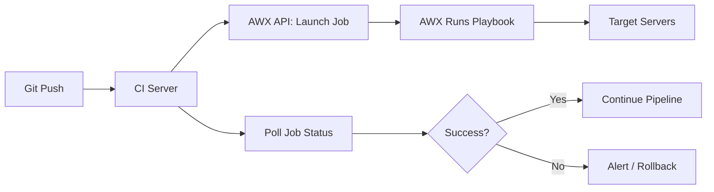

# How to Use AWX API for Automation

Author: [nawazdhandala](https://www.github.com/nawazdhandala)

Tags: Ansible, AWX, API, Automation, DevOps

Description: Learn how to use the AWX REST API to launch jobs, manage inventories, and integrate AWX into your CI/CD pipelines programmatically.

---

AWX ships with a full REST API that mirrors every action available in the web UI. If you have ever wanted to launch a job template from a build pipeline, pull inventory data into a custom dashboard, or create resources on the fly, the API is how you do it. This post walks through authentication, common endpoints, and practical examples you can drop straight into scripts.

## Finding the API Root

Every AWX installation exposes its API at `/api/v2/`. You can browse it in a web browser because AWX returns JSON by default but also supports a browsable HTML renderer.

```bash
# Quick check that the API is reachable
curl -s https://awx.example.com/api/v2/ | python3 -m json.tool
```

The response lists all top-level endpoints: job templates, inventories, projects, credentials, and more. Bookmark this page while you are learning the API because it serves as live documentation.

## Authentication Options

AWX supports three main authentication methods for API calls: session tokens, personal access tokens (PATs), and OAuth2 application tokens.

For scripting, personal access tokens are the simplest approach. You create one in the AWX UI under your user profile, then pass it as a Bearer token.

```bash
# Create a personal access token via the API itself
curl -s -X POST \
  -H "Content-Type: application/json" \
  -u admin:password \
  https://awx.example.com/api/v2/users/1/personal_tokens/ \
  -d '{"scope": "write"}'
```

The response includes a `token` field. Store that securely, because AWX will not show it again.

```bash
# Use the token for subsequent requests
export AWX_TOKEN="your-token-here"

curl -s -H "Authorization: Bearer ${AWX_TOKEN}" \
  https://awx.example.com/api/v2/me/
```

For CI/CD systems that need scoped access, OAuth2 application tokens give you more control. You register an application in AWX, then exchange client credentials for a token with a defined expiry.

## Launching a Job Template

This is the most common API task. You need the job template ID (visible in the URL when you open it in the UI) and any extra variables you want to pass.

```bash
# Launch job template ID 7 with extra variables
curl -s -X POST \
  -H "Authorization: Bearer ${AWX_TOKEN}" \
  -H "Content-Type: application/json" \
  https://awx.example.com/api/v2/job_templates/7/launch/ \
  -d '{
    "extra_vars": {
      "target_env": "staging",
      "version": "2.4.1"
    }
  }'
```

The response gives you a job object with its `id` and a `url` field you can poll to check progress.

## Polling Job Status

After launching a job, you usually need to wait for it to finish before proceeding in your pipeline. Here is a simple Bash loop that does that.

```bash
# Poll a job until it reaches a terminal state
JOB_ID=42

while true; do
  STATUS=$(curl -s \
    -H "Authorization: Bearer ${AWX_TOKEN}" \
    https://awx.example.com/api/v2/jobs/${JOB_ID}/ \
    | python3 -c "import sys,json; print(json.load(sys.stdin)['status'])")

  echo "Job ${JOB_ID} status: ${STATUS}"

  case "${STATUS}" in
    successful) echo "Job passed"; exit 0 ;;
    failed|error|canceled) echo "Job did not succeed"; exit 1 ;;
    *) sleep 10 ;;
  esac
done
```

Terminal states in AWX are `successful`, `failed`, `error`, and `canceled`. Anything else (like `pending`, `waiting`, or `running`) means the job is still in progress.

## Working with Inventories

You can create inventories and add hosts entirely through the API. This is useful when a provisioning tool spins up new servers and you need AWX to know about them immediately.

```bash
# Create a new inventory
curl -s -X POST \
  -H "Authorization: Bearer ${AWX_TOKEN}" \
  -H "Content-Type: application/json" \
  https://awx.example.com/api/v2/inventories/ \
  -d '{
    "name": "dynamic-servers",
    "organization": 1,
    "description": "Servers created by Terraform"
  }'
```

```bash
# Add a host to inventory ID 3
curl -s -X POST \
  -H "Authorization: Bearer ${AWX_TOKEN}" \
  -H "Content-Type: application/json" \
  https://awx.example.com/api/v2/inventories/3/hosts/ \
  -d '{
    "name": "web-prod-04.example.com",
    "variables": "ansible_host: 10.0.5.14\nhttp_port: 8080"
  }'
```

## Python Script for Bulk Operations

When you are doing more than a few API calls, Python with the `requests` library is more maintainable than chaining curl commands.

```python
#!/usr/bin/env python3
"""Launch multiple AWX job templates and collect results."""

import requests
import time
import sys

AWX_URL = "https://awx.example.com"
TOKEN = "your-token-here"
HEADERS = {
    "Authorization": f"Bearer {TOKEN}",
    "Content-Type": "application/json",
}

def launch_job(template_id, extra_vars=None):
    """Launch a job template and return the job ID."""
    payload = {}
    if extra_vars:
        payload["extra_vars"] = extra_vars

    resp = requests.post(
        f"{AWX_URL}/api/v2/job_templates/{template_id}/launch/",
        headers=HEADERS,
        json=payload,
    )
    resp.raise_for_status()
    job_id = resp.json()["id"]
    print(f"Launched template {template_id} -> job {job_id}")
    return job_id

def wait_for_job(job_id, timeout=600):
    """Poll until the job finishes or timeout is reached."""
    terminal = {"successful", "failed", "error", "canceled"}
    start = time.time()

    while time.time() - start < timeout:
        resp = requests.get(
            f"{AWX_URL}/api/v2/jobs/{job_id}/",
            headers=HEADERS,
        )
        resp.raise_for_status()
        status = resp.json()["status"]

        if status in terminal:
            return status
        time.sleep(10)

    return "timeout"

# Launch three templates in sequence
templates = [
    (7, {"target_env": "staging"}),
    (12, {"service": "api"}),
    (15, None),
]

results = {}
for tmpl_id, vars_ in templates:
    job_id = launch_job(tmpl_id, vars_)
    status = wait_for_job(job_id)
    results[tmpl_id] = status
    print(f"Template {tmpl_id} finished with status: {status}")

# Exit non-zero if any job failed
if any(s != "successful" for s in results.values()):
    sys.exit(1)
```

## Pagination

AWX paginates list endpoints. The default page size is 25. You handle it by following the `next` field in the response.

```python
def get_all_pages(endpoint):
    """Fetch all pages of a paginated AWX endpoint."""
    url = f"{AWX_URL}{endpoint}"
    all_results = []

    while url:
        resp = requests.get(url, headers=HEADERS)
        resp.raise_for_status()
        data = resp.json()
        all_results.extend(data["results"])
        url = data.get("next")  # None when on the last page

    return all_results

# Get every host across all inventories
hosts = get_all_pages("/api/v2/hosts/")
print(f"Total hosts: {len(hosts)}")
```

## Integration Architecture

Here is how the API fits into a typical deployment pipeline.



## Searching and Filtering

Most list endpoints accept query parameters for filtering. This is much faster than fetching everything and filtering client-side.

```bash
# Find hosts whose name starts with "web-prod"
curl -s -H "Authorization: Bearer ${AWX_TOKEN}" \
  "https://awx.example.com/api/v2/hosts/?name__startswith=web-prod"

# Find failed jobs from the last 24 hours
curl -s -H "Authorization: Bearer ${AWX_TOKEN}" \
  "https://awx.example.com/api/v2/jobs/?status=failed&created__gt=2026-02-20T00:00:00Z"
```

AWX supports Django-style lookups: `__exact`, `__startswith`, `__contains`, `__gt`, `__lt`, and `__in` among others. Chain multiple filters with `&`.

## Error Handling

The API returns standard HTTP status codes. A 400 means your request body is wrong, 401 means bad credentials, 403 means insufficient permissions, and 404 means the resource does not exist. Always check the response body on errors because AWX includes detailed messages.

```python
resp = requests.post(
    f"{AWX_URL}/api/v2/job_templates/999/launch/",
    headers=HEADERS,
)
if resp.status_code == 404:
    print("Template not found - check the ID")
elif resp.status_code == 400:
    print(f"Bad request: {resp.json()}")
elif resp.status_code == 403:
    print("Permission denied - check your token scope")
```

## Wrapping Up

The AWX API is the backbone of any serious AWX integration. Once you move past clicking buttons in the UI and start treating AWX as an API-first platform, you unlock the ability to chain deployments, build self-service portals, and wire AWX into whatever tooling your team already uses. Start with the job launch and polling pattern since that covers 80% of integration needs, then explore inventory management and credential handling as your automation grows.
