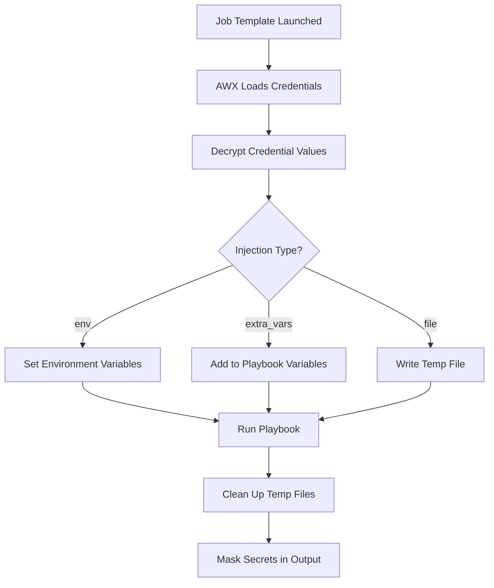

# How to Use AWX Custom Credential Types

Author: [nawazdhandala](https://www.github.com/nawazdhandala)

Tags: Ansible, AWX, Credentials, Security, Custom Types

Description: Create custom credential types in AWX to securely manage API keys, tokens, and service credentials with reusable injection patterns.

---

AWX ships with built-in credential types for SSH, cloud providers, and version control. But what about your internal APIs, SaaS platforms, or custom services that need authentication? Custom credential types let you define new credential schemas with their own fields, and control exactly how those credentials get injected into playbooks. The credentials are encrypted at rest and never exposed in job logs.

## Why Custom Credential Types

Say you have a playbook that calls your company's internal deployment API. It needs an API URL, an API key, and a project ID. Without custom credentials, you would store these as extra variables (unencrypted, visible in logs) or as Ansible Vault files (better, but harder to manage across templates).

Custom credential types solve this by:
- Storing sensitive values encrypted in the AWX database
- Injecting values as environment variables or extra variables at runtime
- Hiding sensitive values from job output
- Allowing credential reuse across multiple job templates

## Anatomy of a Custom Credential Type

A custom credential type has two parts:

1. **Input Configuration** - Defines the fields that make up the credential (what the user fills in).
2. **Injector Configuration** - Defines how the credential values are passed to the playbook at runtime.

## Creating a Simple API Key Credential Type

Let us create a credential type for a generic REST API that needs a URL and an API key.

```bash
# Create a custom credential type for a REST API
curl -s -X POST \
  -H "Authorization: Bearer ${AWX_TOKEN}" \
  -H "Content-Type: application/json" \
  https://awx.example.com/api/v2/credential_types/ \
  -d '{
    "name": "REST API Credential",
    "description": "Credential for authenticating with a REST API",
    "kind": "cloud",
    "inputs": {
      "fields": [
        {
          "id": "api_url",
          "type": "string",
          "label": "API URL",
          "help_text": "Base URL of the API (e.g., https://api.example.com)"
        },
        {
          "id": "api_key",
          "type": "string",
          "label": "API Key",
          "secret": true
        },
        {
          "id": "api_version",
          "type": "string",
          "label": "API Version",
          "default": "v1"
        }
      ],
      "required": ["api_url", "api_key"]
    },
    "injectors": {
      "extra_vars": {
        "api_url": "{{ api_url }}",
        "api_version": "{{ api_version }}"
      },
      "env": {
        "API_KEY": "{{ api_key }}"
      }
    }
  }'
```

Breaking down the key parts:

- Fields with `"secret": true` are encrypted and masked in logs.
- The `injectors` section controls how values reach the playbook. `extra_vars` adds Ansible variables, `env` sets environment variables.
- `required` lists which fields must be filled in.

## Injection Methods

AWX supports three injection methods for custom credentials.

### Environment Variables

Values injected as environment variables are accessible in playbooks via the `lookup('env', ...)` plugin or in shell/command tasks.

```json
"injectors": {
  "env": {
    "SLACK_WEBHOOK_URL": "{{ webhook_url }}",
    "SLACK_TOKEN": "{{ token }}"
  }
}
```

```yaml
# Using the injected environment variable in a playbook
- name: Send Slack notification
  ansible.builtin.uri:
    url: "{{ lookup('env', 'SLACK_WEBHOOK_URL') }}"
    method: POST
    body_format: json
    body:
      text: "Deployment complete"
    headers:
      Authorization: "Bearer {{ lookup('env', 'SLACK_TOKEN') }}"
```

### Extra Variables

Values injected as extra variables become regular Ansible variables.

```json
"injectors": {
  "extra_vars": {
    "database_host": "{{ db_host }}",
    "database_port": "{{ db_port }}",
    "database_name": "{{ db_name }}"
  }
}
```

```yaml
# Using injected extra variables directly
- name: Connect to database
  community.postgresql.postgresql_query:
    db: "{{ database_name }}"
    login_host: "{{ database_host }}"
    login_port: "{{ database_port }}"
    login_user: "{{ database_user }}"
    login_password: "{{ database_password }}"
    query: "SELECT version();"
```

### File Injection

For credentials that need to be written to a file (like certificates or kubeconfigs), use the `file` injector.

```json
"injectors": {
  "file": {
    "template": "{{ kubeconfig_content }}"
  },
  "env": {
    "KUBECONFIG": "{{ tower.filename.kubeconfig_content }}"
  }
}
```

AWX writes the content to a temporary file and sets the environment variable to point at it. The file is cleaned up after the job finishes.

## Practical Examples

### HashiCorp Vault Credential

```bash
# Custom credential type for HashiCorp Vault
curl -s -X POST \
  -H "Authorization: Bearer ${AWX_TOKEN}" \
  -H "Content-Type: application/json" \
  https://awx.example.com/api/v2/credential_types/ \
  -d '{
    "name": "HashiCorp Vault",
    "kind": "cloud",
    "inputs": {
      "fields": [
        {"id": "vault_addr", "type": "string", "label": "Vault Address"},
        {"id": "vault_token", "type": "string", "label": "Vault Token", "secret": true},
        {"id": "vault_namespace", "type": "string", "label": "Vault Namespace", "default": ""}
      ],
      "required": ["vault_addr", "vault_token"]
    },
    "injectors": {
      "env": {
        "VAULT_ADDR": "{{ vault_addr }}",
        "VAULT_TOKEN": "{{ vault_token }}",
        "VAULT_NAMESPACE": "{{ vault_namespace }}"
      }
    }
  }'
```

### Docker Registry Credential

```bash
# Custom credential type for a private Docker registry
curl -s -X POST \
  -H "Authorization: Bearer ${AWX_TOKEN}" \
  -H "Content-Type: application/json" \
  https://awx.example.com/api/v2/credential_types/ \
  -d '{
    "name": "Docker Registry",
    "kind": "cloud",
    "inputs": {
      "fields": [
        {"id": "registry_url", "type": "string", "label": "Registry URL"},
        {"id": "registry_user", "type": "string", "label": "Username"},
        {"id": "registry_password", "type": "string", "label": "Password", "secret": true}
      ],
      "required": ["registry_url", "registry_user", "registry_password"]
    },
    "injectors": {
      "extra_vars": {
        "docker_registry_url": "{{ registry_url }}",
        "docker_registry_user": "{{ registry_user }}"
      },
      "env": {
        "DOCKER_REGISTRY_PASSWORD": "{{ registry_password }}"
      }
    }
  }'
```

### PagerDuty Integration Credential

```bash
# Custom credential for PagerDuty
curl -s -X POST \
  -H "Authorization: Bearer ${AWX_TOKEN}" \
  -H "Content-Type: application/json" \
  https://awx.example.com/api/v2/credential_types/ \
  -d '{
    "name": "PagerDuty",
    "kind": "cloud",
    "inputs": {
      "fields": [
        {"id": "pd_api_key", "type": "string", "label": "API Key", "secret": true},
        {"id": "pd_service_id", "type": "string", "label": "Service ID"},
        {"id": "pd_escalation_policy", "type": "string", "label": "Escalation Policy ID"}
      ],
      "required": ["pd_api_key", "pd_service_id"]
    },
    "injectors": {
      "env": {
        "PAGERDUTY_API_KEY": "{{ pd_api_key }}"
      },
      "extra_vars": {
        "pagerduty_service_id": "{{ pd_service_id }}",
        "pagerduty_escalation_policy": "{{ pd_escalation_policy }}"
      }
    }
  }'
```

## Creating a Credential Instance

After defining the credential type, create actual credentials from it.

```bash
# Create a credential using the REST API custom type (type ID 20)
curl -s -X POST \
  -H "Authorization: Bearer ${AWX_TOKEN}" \
  -H "Content-Type: application/json" \
  https://awx.example.com/api/v2/credentials/ \
  -d '{
    "name": "Production API - Deployment Service",
    "organization": 1,
    "credential_type": 20,
    "inputs": {
      "api_url": "https://deploy.example.com",
      "api_key": "sk_live_abc123def456",
      "api_version": "v2"
    }
  }'
```

## Attaching Credentials to Job Templates

A job template can use multiple credentials, including multiple custom credentials of different types.

```bash
# Add credential ID 15 to job template ID 10
curl -s -X POST \
  -H "Authorization: Bearer ${AWX_TOKEN}" \
  -H "Content-Type: application/json" \
  https://awx.example.com/api/v2/job_templates/10/credentials/ \
  -d '{"id": 15}'
```

## Credential Injection Flow



## Input Validation

Custom credential types support basic input validation.

```json
"inputs": {
  "fields": [
    {
      "id": "port",
      "type": "string",
      "label": "Port Number",
      "help_text": "Must be between 1 and 65535",
      "format": "text"
    },
    {
      "id": "region",
      "type": "string",
      "label": "Region",
      "choices": ["us-east-1", "us-west-2", "eu-west-1", "ap-southeast-1"]
    }
  ]
}
```

The `choices` field creates a dropdown in the UI. This prevents typos and standardizes values.

## Wrapping Up

Custom credential types extend AWX's built-in credential system to handle any authentication mechanism. Define the fields, choose injection methods (environment variables for secrets, extra variables for non-sensitive configuration, files for certificates), and let AWX handle the encryption and lifecycle. Once you start using custom credentials, you will stop hard-coding API keys in playbooks and stop passing secrets through surveys or extra variables.
