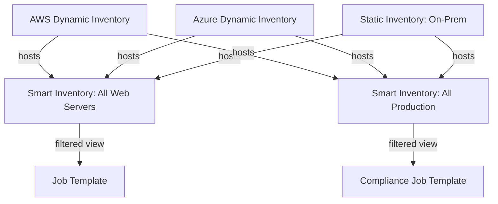

# How to Use AWX Smart Inventories

Author: [nawazdhandala](https://www.github.com/nawazdhandala)

Tags: Ansible, AWX, Inventories, Smart Inventories, Dynamic Infrastructure

Description: Create AWX smart inventories that dynamically group hosts from multiple inventory sources using filter expressions for flexible targeting.

---

Smart inventories in AWX are virtual inventories that pull hosts from other inventories based on filter criteria. Instead of manually maintaining separate inventory files for "all Linux servers" or "all hosts in us-east-1," you define a filter and AWX builds the inventory dynamically. When hosts are added or removed from your source inventories, the smart inventory updates automatically.

## When to Use Smart Inventories

Regular inventories work well when you have a clear, static mapping of hosts to groups. But real infrastructure is messy. You might have:

- Hosts that span multiple cloud accounts, each with its own dynamic inventory source
- A need to target "all production web servers across all regions" without duplicating host entries
- Compliance playbooks that need to run against every host matching a certain tag, regardless of which team owns it

Smart inventories handle these cross-cutting concerns by querying across all your existing inventories.

## Creating a Smart Inventory

Smart inventories use the same filter syntax as the AWX host search. The `host_filter` field accepts a query string that filters across all hosts AWX knows about.

```bash
# Create a smart inventory that finds all hosts with "web" in the name
curl -s -X POST \
  -H "Authorization: Bearer ${AWX_TOKEN}" \
  -H "Content-Type: application/json" \
  https://awx.example.com/api/v2/inventories/ \
  -d '{
    "name": "All Web Servers",
    "organization": 1,
    "kind": "smart",
    "host_filter": "name__contains=web"
  }'
```

The `kind` field set to `smart` is what makes this a smart inventory instead of a regular one.

## Filter Syntax

Smart inventory filters use Django-style query syntax. You can filter on host name, group membership, variables, and more.

```bash
# Hosts whose name starts with "prod"
"host_filter": "name__startswith=prod"

# Hosts in the "database" group
"host_filter": "group__name=database"

# Hosts from a specific inventory (inventory ID 3)
"host_filter": "inventory__id=3"

# Hosts with a specific Ansible variable
"host_filter": "ansible_facts__os_family=RedHat"

# Combine multiple filters with AND (use & separator)
"host_filter": "name__contains=web&group__name=production"

# OR logic (use | separator)
"host_filter": "group__name=webservers|group__name=loadbalancers"
```

## Practical Examples

Here are smart inventories you might actually build in a real environment.

### All Production Hosts

```bash
# Smart inventory for everything in production
curl -s -X POST \
  -H "Authorization: Bearer ${AWX_TOKEN}" \
  -H "Content-Type: application/json" \
  https://awx.example.com/api/v2/inventories/ \
  -d '{
    "name": "Production - All Hosts",
    "organization": 1,
    "kind": "smart",
    "host_filter": "group__name=production"
  }'
```

### Linux Servers Across All Inventories

```bash
# Smart inventory for Linux hosts regardless of source inventory
curl -s -X POST \
  -H "Authorization: Bearer ${AWX_TOKEN}" \
  -H "Content-Type: application/json" \
  https://awx.example.com/api/v2/inventories/ \
  -d '{
    "name": "All Linux Servers",
    "organization": 1,
    "kind": "smart",
    "host_filter": "ansible_facts__os_family=Debian|ansible_facts__os_family=RedHat|ansible_facts__os_family=Suse"
  }'
```

### Hosts Missing a Recent Scan

```bash
# Hosts that have not been scanned in the last 7 days
# Uses the last_job field to find potentially stale hosts
curl -s -X POST \
  -H "Authorization: Bearer ${AWX_TOKEN}" \
  -H "Content-Type: application/json" \
  https://awx.example.com/api/v2/inventories/ \
  -d '{
    "name": "Hosts Needing Scan",
    "organization": 1,
    "kind": "smart",
    "host_filter": "last_job__lt=2026-02-14T00:00:00"
  }'
```

## How Smart Inventories Relate to Source Inventories

Smart inventories do not own hosts. They reference hosts from existing inventories. Here is how the relationship works.



A single host can appear in multiple smart inventories if it matches multiple filters. The host data (variables, facts) always comes from the source inventory.

## Using Smart Inventories with Job Templates

Assign a smart inventory to a job template just like a regular inventory.

```bash
# Set job template ID 10 to use smart inventory ID 8
curl -s -X PATCH \
  -H "Authorization: Bearer ${AWX_TOKEN}" \
  -H "Content-Type: application/json" \
  https://awx.example.com/api/v2/job_templates/10/ \
  -d '{"inventory": 8}'
```

When the job runs, AWX evaluates the filter, builds the host list, and passes it to the playbook. The playbook has no idea it is running against a smart inventory versus a regular one.

## Refreshing Smart Inventories

Smart inventories update their host list when:

1. A source inventory is synced (for dynamic inventory sources)
2. A host is manually added or removed from a source inventory
3. Host facts change (if the filter uses `ansible_facts`)

You do not need to manually refresh a smart inventory. But you can force a refresh by triggering a sync on the underlying inventory sources.

```bash
# Sync all inventory sources for inventory ID 3
curl -s -X POST \
  -H "Authorization: Bearer ${AWX_TOKEN}" \
  https://awx.example.com/api/v2/inventories/3/update_inventory_sources/
```

## Checking Smart Inventory Contents

After creating a smart inventory, verify it contains the hosts you expect.

```bash
# List hosts in smart inventory ID 8
curl -s -H "Authorization: Bearer ${AWX_TOKEN}" \
  "https://awx.example.com/api/v2/inventories/8/hosts/" \
  | python3 -c "
import sys, json
data = json.load(sys.stdin)
print(f'Total hosts: {data[\"count\"]}')
for host in data['results']:
    print(f'  {host[\"name\"]} (from inventory: {host[\"summary_fields\"][\"inventory\"][\"name\"]})')
"
```

## Smart Inventory Limitations

There are a few things to keep in mind:

**No host variables override** - You cannot set host-specific variables on a smart inventory. Variables come from the source inventory. If you need to add variables, add them to the source.

**No group structure** - Smart inventories flatten everything into a single group. If your playbook relies on group hierarchy (`webservers:children`), a smart inventory will not preserve that structure. You can still use `group__name` in the filter to select hosts, but the group memberships themselves are not carried over.

**Performance with large host counts** - If your smart inventory filter matches thousands of hosts, the evaluation can be slow. Keep your filters specific.

**Filter complexity** - The filter syntax is powerful but not as flexible as raw SQL. You cannot do nested OR/AND combinations easily. For complex logic, consider using a custom inventory script instead.

## Combining Smart Inventories with Schedules

A common pattern is to pair a smart inventory with a scheduled job template. For example, a nightly compliance scan that automatically targets every host matching your filter, even as new hosts are added to your infrastructure.

```bash
# Create a scheduled compliance scan using a smart inventory
# Step 1: Create the smart inventory (ID returned: 8)
# Step 2: Create the job template using that inventory
# Step 3: Add a schedule
curl -s -X POST \
  -H "Authorization: Bearer ${AWX_TOKEN}" \
  -H "Content-Type: application/json" \
  https://awx.example.com/api/v2/job_templates/25/schedules/ \
  -d '{
    "name": "Nightly Compliance Scan",
    "rrule": "DTSTART:20260221T030000Z RRULE:FREQ=DAILY;INTERVAL=1",
    "enabled": true
  }'
```

New hosts that match the smart inventory filter will automatically be included in the next scheduled run with zero manual intervention.

## Wrapping Up

Smart inventories are one of those AWX features that you do not realize you need until you have 10 different inventory sources and a playbook that needs to target hosts across all of them. They eliminate the duplication and manual maintenance that comes with trying to keep separate inventories in sync. Define your filter once, and let AWX figure out which hosts match. Just remember the limitations around group structure and plan your playbooks accordingly.
