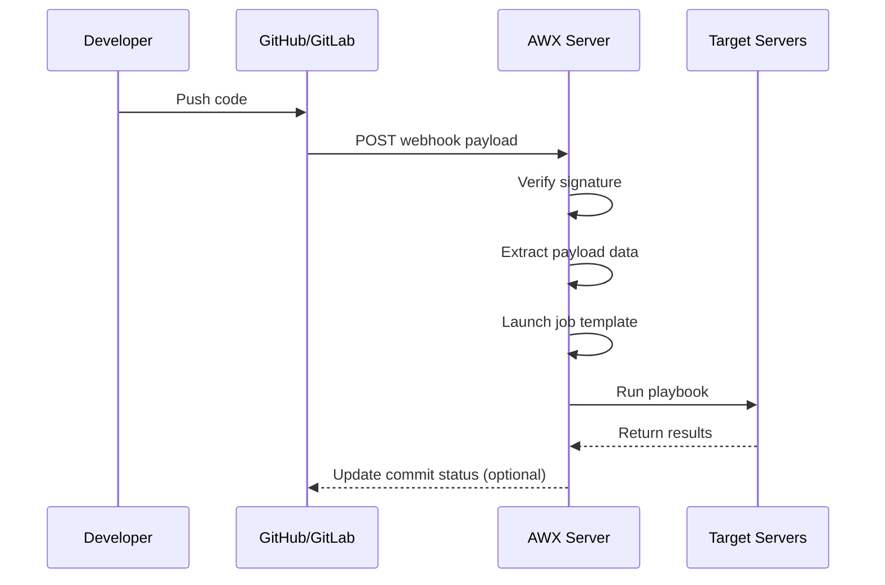

# How to Use AWX Webhook Triggers

Author: [nawazdhandala](https://www.github.com/nawazdhandala)

Tags: Ansible, AWX, Webhooks, CI/CD, GitOps

Description: Configure AWX webhook triggers to automatically launch job templates in response to events from GitHub, GitLab, and other systems.

---

AWX webhook triggers let external systems launch job templates by sending HTTP POST requests to a webhook URL. When a developer pushes code to GitHub, when a GitLab pipeline finishes, or when a monitoring tool detects a threshold breach, a webhook can kick off the corresponding AWX automation. This removes the human from the loop and makes your automation truly event-driven.

## How AWX Webhooks Work

AWX can receive webhooks from GitHub and GitLab natively. When you enable a webhook on a job template, AWX generates a unique webhook URL and a webhook key. You configure your Git provider to send events to that URL. When an event arrives, AWX verifies the signature using the webhook key, extracts relevant data from the payload, and launches the job template.

The webhook payload data is available to your playbook as the `awx_webhook_payload` extra variable.

## Enabling Webhooks on a Job Template

You can enable webhooks through the API or the UI. Here is the API approach.

```bash
# Enable GitHub webhook on job template ID 10
curl -s -X PATCH \
  -H "Authorization: Bearer ${AWX_TOKEN}" \
  -H "Content-Type: application/json" \
  https://awx.example.com/api/v2/job_templates/10/ \
  -d '{
    "webhook_service": "github",
    "webhook_credential": null
  }'
```

After enabling the webhook, retrieve the generated webhook URL and key.

```bash
# Get the webhook details
curl -s -H "Authorization: Bearer ${AWX_TOKEN}" \
  https://awx.example.com/api/v2/job_templates/10/ \
  | python3 -c "
import sys, json
data = json.load(sys.stdin)
print(f'Webhook URL: {data.get(\"related\", {}).get(\"webhook_receiver\", \"N/A\")}')
print(f'Webhook Key: {data.get(\"webhook_key\", \"N/A\")}')
print(f'Webhook Service: {data.get(\"webhook_service\", \"N/A\")}')
"
```

The webhook URL will look like: `https://awx.example.com/api/v2/job_templates/10/github/`

## Configuring the Webhook Key

AWX auto-generates a webhook key, but you can set your own.

```bash
# Set a custom webhook key
curl -s -X PATCH \
  -H "Authorization: Bearer ${AWX_TOKEN}" \
  -H "Content-Type: application/json" \
  https://awx.example.com/api/v2/job_templates/10/ \
  -d '{"webhook_key": "my-secure-webhook-secret-12345"}'
```

This key is used by the sender (GitHub/GitLab) to sign the payload so AWX can verify it came from a trusted source.

## Setting Up the GitHub Webhook

In your GitHub repository, go to Settings > Webhooks > Add webhook.

- **Payload URL**: `https://awx.example.com/api/v2/job_templates/10/github/`
- **Content type**: `application/json`
- **Secret**: The webhook key from AWX
- **Events**: Select the events you want to trigger on (typically "Just the push event" or "Pull requests")

You can also configure it using the GitHub API.

```bash
# Create a webhook in a GitHub repository
curl -s -X POST \
  -H "Authorization: token ${GITHUB_TOKEN}" \
  -H "Content-Type: application/json" \
  https://api.github.com/repos/myorg/myrepo/hooks \
  -d '{
    "name": "web",
    "active": true,
    "events": ["push", "pull_request"],
    "config": {
      "url": "https://awx.example.com/api/v2/job_templates/10/github/",
      "content_type": "json",
      "secret": "my-secure-webhook-secret-12345",
      "insecure_ssl": "0"
    }
  }'
```

## Setting Up a GitLab Webhook

For GitLab, the process is similar but the webhook service must be set to `gitlab`.

```bash
# Enable GitLab webhook on job template ID 12
curl -s -X PATCH \
  -H "Authorization: Bearer ${AWX_TOKEN}" \
  -H "Content-Type: application/json" \
  https://awx.example.com/api/v2/job_templates/12/ \
  -d '{"webhook_service": "gitlab"}'
```

In GitLab, go to your project > Settings > Webhooks and add:

- **URL**: `https://awx.example.com/api/v2/job_templates/12/gitlab/`
- **Secret token**: The webhook key from AWX
- **Trigger**: Push events, Merge request events, etc.

## Webhook Event Flow



## Using Webhook Payload in Playbooks

The webhook payload is available as `awx_webhook_payload`. For a GitHub push event, this contains the commit info, branch, repository URL, and more.

```yaml
# deploy-on-push.yml
---
- name: Deploy on webhook trigger
  hosts: webservers
  become: true

  vars:
    # Extract branch name from the webhook payload
    branch: "{{ awx_webhook_payload.ref | regex_replace('^refs/heads/', '') }}"
    repo_url: "{{ awx_webhook_payload.repository.clone_url }}"
    commit_sha: "{{ awx_webhook_payload.after }}"
    commit_message: "{{ awx_webhook_payload.head_commit.message }}"

  tasks:
    - name: Print deployment info
      ansible.builtin.debug:
        msg: |
          Deploying branch: {{ branch }}
          Commit: {{ commit_sha[:8] }}
          Message: {{ commit_message }}

    - name: Only deploy from main branch
      ansible.builtin.meta: end_play
      when: branch != "main"

    - name: Pull latest code
      ansible.builtin.git:
        repo: "{{ repo_url }}"
        dest: /opt/app
        version: "{{ commit_sha }}"
        force: true

    - name: Restart application
      ansible.builtin.systemd:
        name: myapp
        state: restarted
```

## Filtering by Branch or Event Type

Since the webhook fires for all events you selected in GitHub/GitLab, you might want the playbook to only act on specific branches or event types.

```yaml
# Conditional execution based on webhook event
- name: Handle webhook events
  hosts: localhost
  connection: local

  tasks:
    - name: Set event facts
      ansible.builtin.set_fact:
        git_branch: "{{ awx_webhook_payload.ref | default('') | regex_replace('^refs/heads/', '') }}"
        event_type: "{{ awx_webhook_event_type | default('push') }}"

    - name: Skip non-main branches
      ansible.builtin.meta: end_play
      when: git_branch != "main" and event_type == "push"

    - name: Handle pull request events
      ansible.builtin.debug:
        msg: "PR #{{ awx_webhook_payload.pull_request.number }} - {{ awx_webhook_payload.action }}"
      when: event_type == "pull_request"

    - name: Handle push events
      ansible.builtin.debug:
        msg: "Push to {{ git_branch }} by {{ awx_webhook_payload.pusher.name }}"
      when: event_type == "push"
```

## Using Webhook Credentials

If your AWX instance is behind authentication or your webhook endpoint needs additional verification, you can create a webhook credential.

```bash
# Create a GitHub personal access token credential
curl -s -X POST \
  -H "Authorization: Bearer ${AWX_TOKEN}" \
  -H "Content-Type: application/json" \
  https://awx.example.com/api/v2/credentials/ \
  -d '{
    "name": "GitHub Webhook Token",
    "organization": 1,
    "credential_type": 12,
    "inputs": {
      "token": "ghp_your_github_token_here"
    }
  }'
```

Then reference this credential on the job template.

```bash
# Set the webhook credential on the template
curl -s -X PATCH \
  -H "Authorization: Bearer ${AWX_TOKEN}" \
  -H "Content-Type: application/json" \
  https://awx.example.com/api/v2/job_templates/10/ \
  -d '{"webhook_credential": 8}'
```

With a webhook credential configured, AWX can also update the commit status in GitHub/GitLab to show whether the triggered job passed or failed.

## Testing Webhooks

You can test webhooks without pushing actual code by using curl to simulate a GitHub event.

```bash
# Simulate a GitHub push event
PAYLOAD='{"ref":"refs/heads/main","after":"abc123","repository":{"clone_url":"https://github.com/myorg/myrepo.git"},"head_commit":{"message":"test commit"},"pusher":{"name":"testuser"}}'

# Calculate the HMAC signature
SIGNATURE=$(echo -n "${PAYLOAD}" | openssl dgst -sha256 -hmac "my-secure-webhook-secret-12345" | awk '{print "sha256="$2}')

curl -s -X POST \
  -H "Content-Type: application/json" \
  -H "X-GitHub-Event: push" \
  -H "X-Hub-Signature-256: ${SIGNATURE}" \
  https://awx.example.com/api/v2/job_templates/10/github/ \
  -d "${PAYLOAD}"
```

## Troubleshooting

**Webhook returns 403** - The signature verification failed. Double-check that the webhook key in AWX matches the secret configured in GitHub/GitLab.

**Webhook returns 404** - The URL is wrong or webhooks are not enabled on the template. Verify the template ID in the URL and that `webhook_service` is set.

**Job launches but fails** - The playbook is running but the payload variables might not be what you expect. Add a debug task that prints `awx_webhook_payload` to inspect the full payload.

**Webhook accepted but no job launches** - Check the AWX activity stream for any error messages. The AWX user associated with the webhook needs Execute permission on the template.

## Wrapping Up

Webhooks turn AWX from a tool you log into and click buttons on into an event-driven automation platform. Push to main and the deployment happens automatically. Open a pull request and a test environment spins up. The setup takes about 10 minutes per template, and the payoff is eliminating manual deployment steps entirely.
