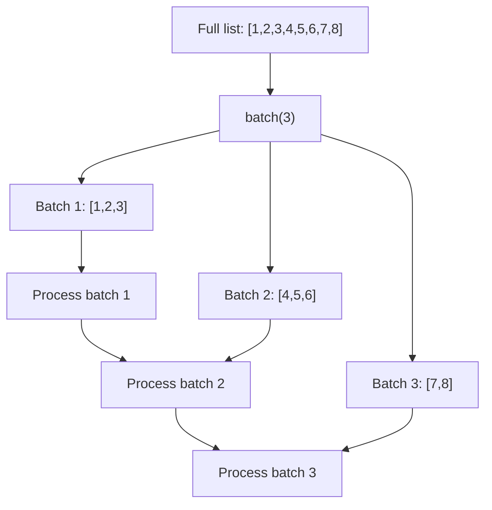

# How to Use batch Filter to Chunk Lists in Ansible

Author: [nawazdhandala](https://www.github.com/nawazdhandala)

Tags: Ansible, Filters, Jinja2, Batch Processing

Description: Learn how to use the batch filter in Ansible to split lists into fixed-size chunks for parallel processing, pagination, and staged deployments.

---

The `batch` filter splits a list into smaller groups of a specified size. This is useful for staged deployments, parallel processing, generating tabular output, and any scenario where you need to process items in groups rather than all at once or one at a time.

## Basic batch Usage

The `batch` filter takes a number as argument and splits the list into chunks of that size:

```yaml
# playbook-basic-batch.yml
# Splits a list of servers into groups of 3 for staged processing
- name: Basic batch example
  hosts: localhost
  gather_facts: false
  vars:
    servers:
      - web-01
      - web-02
      - web-03
      - web-04
      - web-05
      - web-06
      - web-07
      - web-08

  tasks:
    - name: Split into batches of 3
      ansible.builtin.debug:
        msg: "{{ servers | batch(3) | list }}"
```

Output:

```json
[
    ["web-01", "web-02", "web-03"],
    ["web-04", "web-05", "web-06"],
    ["web-07", "web-08"]
]
```

Notice that the last batch has only 2 items since 8 is not evenly divisible by 3.

## Filling Incomplete Batches

You can pass a fill value to pad the last batch to the full size:

```yaml
# playbook-batch-fill.yml
# Splits a list into even batches, padding the last one with a fill value
- name: Batch with fill value
  hosts: localhost
  gather_facts: false
  vars:
    items:
      - a
      - b
      - c
      - d
      - e

  tasks:
    - name: Batch into groups of 3 with padding
      ansible.builtin.debug:
        msg: "{{ items | batch(3, 'N/A') | list }}"
```

Output: `[["a", "b", "c"], ["d", "e", "N/A"]]`

## Staged Deployments

The most practical use case for batch is rolling deployments where you update a few servers at a time:

```yaml
# playbook-staged-deploy.yml
# Deploys to servers in batches of 2, pausing between each batch
- name: Staged deployment with batch
  hosts: localhost
  gather_facts: false
  vars:
    all_servers:
      - web-01
      - web-02
      - web-03
      - web-04
      - web-05
      - web-06
    batch_size: 2

  tasks:
    - name: Deploy in batches
      ansible.builtin.debug:
        msg: "Deploying batch {{ batch_index + 1 }}: {{ batch | join(', ') }}"
      loop: "{{ all_servers | batch(batch_size) | list }}"
      loop_control:
        loop_var: batch
        index_var: batch_index

    - name: Show deployment plan
      ansible.builtin.debug:
        msg: |
          Deployment plan:
          
          Batch {{ loop.index }}: {{ batch | join(', ') }}
          
          Total batches: {{ (all_servers | length / batch_size) | round(0, 'ceil') | int }}
```

## Batch Processing Flow



## Generating Tabular Output

Batch is great for formatting data into rows and columns:

```yaml
# playbook-tabular.yml
# Formats a flat list into a multi-column table layout
- name: Generate tabular output
  hosts: localhost
  gather_facts: false
  vars:
    packages:
      - nginx
      - postgresql
      - redis
      - docker
      - git
      - vim
      - curl
      - wget
      - htop
      - tmux

  tasks:
    - name: Display as 3-column table
      ansible.builtin.debug:
        msg: |
          Installed Packages:
          
          {{ "%-20s %-20s %-20s" | format(row[0], row[1], row[2]) }}
          
```

## Parallel Task Execution

Use batch to split work across parallel executions:

```yaml
# playbook-parallel.yml
# Splits DNS records into batches for parallel API calls
- name: Parallel batch processing
  hosts: localhost
  gather_facts: false
  vars:
    dns_records:
      - name: www
        type: A
        value: 93.184.216.34
      - name: api
        type: A
        value: 93.184.216.35
      - name: mail
        type: MX
        value: mail.example.com
      - name: ftp
        type: A
        value: 93.184.216.36
      - name: cdn
        type: CNAME
        value: cdn.example.com

  tasks:
    - name: Process DNS updates in batches of 2
      ansible.builtin.debug:
        msg: |
          Processing batch {{ batch_num + 1 }}:
          
          - {{ record.name }}.example.com {{ record.type }} {{ record.value }}
          
      loop: "{{ dns_records | batch(2) | list }}"
      loop_control:
        loop_var: batch
        index_var: batch_num
```

## Batch with async for True Parallel Execution

Combine batch with async tasks for actual parallel processing:

```yaml
# playbook-async-batch.yml
# Runs health checks in parallel batches using async
- name: Async batch processing
  hosts: localhost
  gather_facts: false
  vars:
    endpoints:
      - http://service-a:8080/health
      - http://service-b:8080/health
      - http://service-c:8080/health
      - http://service-d:8080/health
      - http://service-e:8080/health
      - http://service-f:8080/health

  tasks:
    - name: Check endpoints in batches of 3
      ansible.builtin.uri:
        url: "{{ item }}"
        method: GET
        timeout: 5
      loop: "{{ batch }}"
      async: 30
      poll: 0
      register: health_checks
      vars:
        batch: "{{ endpoints | batch(3) | list | first }}"
```

## Batch Size Calculation

Sometimes you want a specific number of batches rather than a specific batch size:

```yaml
# playbook-calc-batch.yml
# Calculates batch size to divide items into a target number of groups
- name: Calculate batch size for target number of groups
  hosts: localhost
  gather_facts: false
  vars:
    items: "{{ range(20) | list }}"
    target_groups: 4

  tasks:
    - name: Calculate batch size
      ansible.builtin.set_fact:
        batch_size: "{{ (items | length / target_groups) | round(0, 'ceil') | int }}"

    - name: Split into target number of groups
      ansible.builtin.debug:
        msg: |
          {{ items | length }} items split into groups of {{ batch_size }}:
          
          Group {{ loop.index }}: {{ batch }}
          
```

## Practical Example: Staged Kubernetes Deployment

```yaml
# playbook-k8s-staged.yml
# Deploys to Kubernetes pods in staged batches with health checks between batches
- name: Staged K8s pod replacement
  hosts: localhost
  gather_facts: false
  vars:
    pods:
      - myapp-pod-1
      - myapp-pod-2
      - myapp-pod-3
      - myapp-pod-4
      - myapp-pod-5
      - myapp-pod-6
      - myapp-pod-7
      - myapp-pod-8
      - myapp-pod-9
      - myapp-pod-10
    batch_size: 3
    new_image: "myapp:2.1.0"

  tasks:
    - name: Show deployment plan
      ansible.builtin.debug:
        msg: |
          Rolling deployment plan for {{ new_image }}:
          Total pods: {{ pods | length }}
          Batch size: {{ batch_size }}
          Number of batches: {{ (pods | length / batch_size) | round(0, 'ceil') | int }}

          
          Wave {{ loop.index }}: {{ batch | join(', ') }}
          

    - name: Execute rolling deployment
      ansible.builtin.debug:
        msg: "Wave {{ wave_num + 1 }}: Updating {{ wave | join(', ') }} to {{ new_image }}"
      loop: "{{ pods | batch(batch_size) | list }}"
      loop_control:
        loop_var: wave
        index_var: wave_num
        pause: 5
```

## Combining batch with Other Filters

```yaml
# playbook-batch-combined.yml
# Sorts items before batching and processes each batch with aggregation
- name: Combine batch with other operations
  hosts: localhost
  gather_facts: false
  vars:
    numbers: [5, 12, 8, 3, 19, 7, 15, 1, 11, 4]

  tasks:
    - name: Sort then batch
      ansible.builtin.debug:
        msg: "{{ numbers | sort | batch(3) | list }}"

    - name: Batch then sum each batch
      ansible.builtin.debug:
        msg: |
          
          Batch {{ loop.index }}: {{ chunk }} (sum: {{ chunk | sum }})
          
```

## Summary

The `batch` filter is the go-to tool for splitting lists into fixed-size chunks. Use it for staged deployments where you update groups of servers sequentially, for parallel processing where you want to control concurrency, for formatting data into tabular layouts, and for any pagination-style processing. Combine it with loop controls like `pause` for time-gated execution, with `async` for true parallel processing within each batch, and with other filters like `sort` to order items before chunking.
