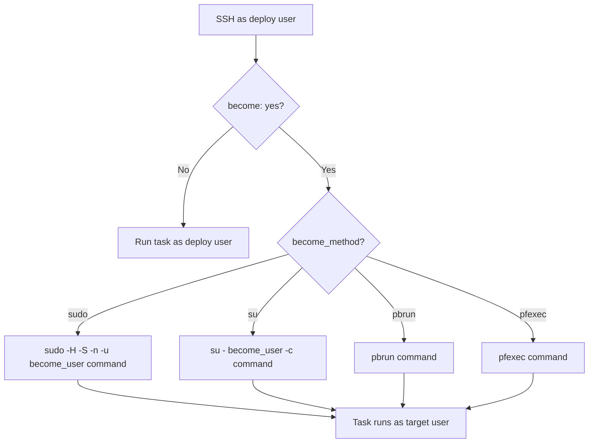

# How to Use become and become_user for Privilege Escalation

Author: [nawazdhandala](https://www.github.com/nawazdhandala)

Tags: Ansible, Security, Privilege Escalation, DevOps

Description: Learn how to use become and become_user in Ansible to run tasks with elevated privileges and switch between different system users.

---

Most infrastructure tasks require root or other elevated privileges. Installing packages, managing services, editing system configuration files, and creating users all need permissions beyond what a regular SSH user has. Ansible's `become` system handles privilege escalation cleanly, letting you specify which tasks need elevated access and which user to escalate to.

## Understanding become

The `become` directive tells Ansible to execute a task with elevated privileges. By default, this means using `sudo` to become the `root` user. But Ansible's become system is flexible and supports multiple escalation methods and target users.

Here are the key directives:

- `become: yes` - Enable privilege escalation
- `become_user: username` - Which user to become (default: root)
- `become_method: sudo` - How to escalate (default: sudo)
- `become_flags: '-H -S'` - Additional flags for the escalation command

## Basic Usage

The simplest case is enabling become at the play level:

```yaml
# basic-become.yml - Install packages as root
---
- name: Setup web server
  hosts: webservers
  become: yes  # All tasks in this play run as root

  tasks:
    - name: Install nginx
      apt:
        name: nginx
        state: present

    - name: Start nginx service
      systemd:
        name: nginx
        state: started
        enabled: yes

    - name: Create web directory
      file:
        path: /var/www/myapp
        state: directory
        owner: www-data
        group: www-data
        mode: '0755'
```

## Task-Level become

You can enable become on individual tasks instead of the entire play. This follows the principle of least privilege:

```yaml
# task-level-become.yml - Only escalate when needed
---
- name: Deploy application
  hosts: app_servers

  tasks:
    # This task runs as the SSH user (no escalation)
    - name: Clone application repository
      git:
        repo: https://github.com/example/myapp.git
        dest: /home/deploy/myapp
        version: main

    # This task needs root to install system packages
    - name: Install system dependencies
      apt:
        name:
          - python3-pip
          - libpq-dev
          - gcc
        state: present
      become: yes

    # Back to running as the SSH user
    - name: Install Python dependencies
      pip:
        requirements: /home/deploy/myapp/requirements.txt
        virtualenv: /home/deploy/myapp/venv

    # Need root again for the service file
    - name: Install systemd service
      template:
        src: myapp.service.j2
        dest: /etc/systemd/system/myapp.service
      become: yes
      notify: Restart myapp

  handlers:
    - name: Restart myapp
      systemd:
        name: myapp
        state: restarted
        daemon_reload: yes
      become: yes
```

## Using become_user to Switch Users

The `become_user` directive lets you run tasks as any user, not just root. This is essential for applications that run under specific service accounts:

```yaml
# become-user.yml - Run tasks as different users
---
- name: Configure application as service user
  hosts: app_servers
  become: yes  # We need root first to switch to other users

  tasks:
    - name: Run database migration as postgres user
      command: psql -d myapp -f /opt/migrations/latest.sql
      become_user: postgres

    - name: Configure application as the app user
      template:
        src: app-config.yml.j2
        dest: /opt/myapp/config.yml
        owner: appuser
        group: appuser
        mode: '0640'
      become_user: appuser

    - name: Build application assets as app user
      command: npm run build
      args:
        chdir: /opt/myapp
      become_user: appuser

    - name: Restart application service as root
      systemd:
        name: myapp
        state: restarted
      become_user: root  # Explicit root, same as default
```

## How Privilege Escalation Works

Here is the flow of what happens when you use `become`:



## Configuring become in ansible.cfg

Set defaults in your configuration file:

```ini
# ansible.cfg - Default privilege escalation settings
[privilege_escalation]
become = False
become_method = sudo
become_user = root
become_ask_pass = False

[defaults]
remote_user = deploy
```

## Become Methods

Ansible supports several privilege escalation methods:

```yaml
# become-methods.yml - Different escalation methods
---
# Method 1: sudo (most common on Linux)
- name: Using sudo
  hosts: linux_servers
  become: yes
  become_method: sudo

  tasks:
    - name: Install package via sudo
      apt:
        name: htop
        state: present

# Method 2: su (switch user)
- name: Using su
  hosts: legacy_servers
  become: yes
  become_method: su

  tasks:
    - name: Run as root via su
      command: whoami
      register: current_user

# Method 3: pbrun (PowerBroker)
- name: Using PowerBroker
  hosts: enterprise_servers
  become: yes
  become_method: pbrun

  tasks:
    - name: Run privileged command via pbrun
      command: /opt/scripts/admin-task.sh
```

## Practical Example: Multi-User Application Deployment

Here is a realistic deployment playbook that uses multiple users:

```yaml
# multi-user-deploy.yml - Full deployment with proper user contexts
---
- name: Deploy multi-tier application
  hosts: app_servers
  become: yes

  vars:
    app_user: myapp
    app_dir: /opt/myapp
    deploy_version: "{{ version | default('latest') }}"

  tasks:
    # System-level tasks as root
    - name: Create application user
      user:
        name: "{{ app_user }}"
        system: yes
        shell: /bin/bash
        home: "{{ app_dir }}"
        create_home: yes

    - name: Install system dependencies
      apt:
        name:
          - python3
          - python3-venv
          - libpq-dev
          - redis-tools
        state: present

    # Application tasks as the app user
    - name: Download application release
      get_url:
        url: "https://releases.example.com/myapp/{{ deploy_version }}.tar.gz"
        dest: "{{ app_dir }}/releases/{{ deploy_version }}.tar.gz"
      become_user: "{{ app_user }}"

    - name: Extract release
      unarchive:
        src: "{{ app_dir }}/releases/{{ deploy_version }}.tar.gz"
        dest: "{{ app_dir }}/current"
        remote_src: yes
      become_user: "{{ app_user }}"

    - name: Create Python virtual environment
      command: python3 -m venv {{ app_dir }}/venv
      args:
        creates: "{{ app_dir }}/venv/bin/python"
      become_user: "{{ app_user }}"

    - name: Install Python dependencies
      pip:
        requirements: "{{ app_dir }}/current/requirements.txt"
        virtualenv: "{{ app_dir }}/venv"
      become_user: "{{ app_user }}"

    - name: Run database migrations
      command: "{{ app_dir }}/venv/bin/python manage.py migrate --noinput"
      args:
        chdir: "{{ app_dir }}/current"
      become_user: "{{ app_user }}"
      register: migration_result
      changed_when: "'No migrations to apply' not in migration_result.stdout"

    - name: Collect static files
      command: "{{ app_dir }}/venv/bin/python manage.py collectstatic --noinput"
      args:
        chdir: "{{ app_dir }}/current"
      become_user: "{{ app_user }}"
      register: static_result
      changed_when: "'0 static files' not in static_result.stdout"

    # Back to root for service management
    - name: Deploy systemd service file
      template:
        src: myapp.service.j2
        dest: /etc/systemd/system/myapp.service
      notify: Restart application

    - name: Enable application service
      systemd:
        name: myapp
        enabled: yes
        daemon_reload: yes

  handlers:
    - name: Restart application
      systemd:
        name: myapp
        state: restarted
```

## Sudo Without a Password

For automated environments, configure passwordless sudo for the Ansible user:

```bash
# On the target server, add this to /etc/sudoers.d/ansible
# deploy user can sudo without password for all commands
deploy ALL=(ALL) NOPASSWD: ALL
```

Or restrict it to specific commands:

```bash
# More restrictive: only allow specific commands
deploy ALL=(ALL) NOPASSWD: /usr/bin/apt-get, /usr/bin/systemctl, /usr/bin/cp
```

## become_flags

You can pass additional flags to the become method:

```yaml
# become-flags.yml - Custom sudo flags
---
- name: Use custom become flags
  hosts: all
  become: yes
  become_flags: '-H -S'  # Preserve HOME, read password from stdin

  tasks:
    - name: Run task with custom sudo flags
      command: whoami

    # Login shell for the target user
    - name: Run as postgres with login shell
      command: psql -c "SELECT version();"
      become_user: postgres
      become_flags: '-i'  # Simulate login shell
```

## Troubleshooting become Issues

Common problems and their solutions:

```yaml
# troubleshoot-become.yml - Diagnose privilege escalation issues
---
- name: Troubleshoot become
  hosts: all

  tasks:
    - name: Check who we are
      command: whoami
      register: normal_user
      changed_when: false

    - name: Check who we become
      command: whoami
      register: become_user_check
      become: yes
      changed_when: false

    - name: Check sudo configuration
      command: sudo -l
      register: sudo_config
      changed_when: false

    - name: Display results
      debug:
        msg:
          - "Normal user: {{ normal_user.stdout }}"
          - "Become user: {{ become_user_check.stdout }}"
          - "Sudo config: {{ sudo_config.stdout_lines }}"
```

Run with verbosity to see the exact sudo commands being executed:

```bash
# High verbosity shows the become commands
ansible-playbook -vvv deploy.yml
```

## Summary

The `become` system gives you fine-grained control over privilege escalation. Use play-level `become: yes` when most tasks need root, task-level `become` for minimal privilege, and `become_user` to switch between service accounts. Always prefer passwordless sudo in automated environments, and use `become_flags` when you need custom escalation behavior. The principle of least privilege applies here: only escalate when a task genuinely requires it.
