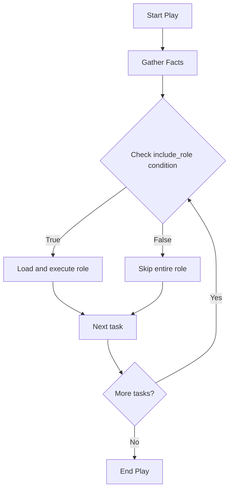

# How to Use Conditional Roles with when in Ansible

Author: [nawazdhandala](https://www.github.com/nawazdhandala)

Tags: Ansible, Roles, Conditionals, Playbook Logic

Description: Learn how to conditionally apply Ansible roles using when clauses based on facts, variables, group membership, and more.

---

Not every role should run on every host. You might want a database role only on database servers, a monitoring role only in production, or a Windows-specific role only on Windows hosts. Ansible's `when` clause lets you conditionally apply roles based on facts, variables, group membership, and custom conditions. This post covers every way to make role execution conditional and the gotchas you need to watch out for.

## Conditional Roles with include_role

The cleanest way to conditionally apply a role is with `include_role` and `when`. Since `include_role` is dynamic, the `when` condition is evaluated once, and if it is false, the entire role is skipped:

```yaml
# site.yml
# Conditionally include roles based on runtime conditions
---
- hosts: all
  tasks:
    - name: Apply PostgreSQL role on database servers
      ansible.builtin.include_role:
        name: postgresql
      when: "'db_servers' in group_names"

    - name: Apply Nginx on web servers
      ansible.builtin.include_role:
        name: nginx
      when: "'web_servers' in group_names"

    - name: Apply monitoring only in production
      ansible.builtin.include_role:
        name: monitoring
      when: deployment_env == "production"
```

## Conditional Roles in the roles: Section

You can also use `when` with the `roles:` keyword, but the behavior is different:

```yaml
# site.yml
# when in the roles section is applied to every task inside the role
---
- hosts: all
  roles:
    - role: postgresql
      when: "'db_servers' in group_names"

    - role: nginx
      when: "'web_servers' in group_names"
```

Here is the important difference: when you use `when` with the `roles:` keyword, the condition is copied to every task inside the role. This means every task is evaluated and skipped individually. The role's variables and handlers are still loaded, and you see "skipping" messages for each task in the output. With `include_role`, the whole role is bypassed entirely.

## Conditions Based on Ansible Facts

Ansible gathers facts about every host at the start of a play. You can use these facts to apply roles conditionally:

```yaml
# site.yml
# Apply roles based on operating system facts
---
- hosts: all
  tasks:
    - name: Apply Debian-specific hardening
      ansible.builtin.include_role:
        name: hardening_debian
      when: ansible_os_family == "Debian"

    - name: Apply RedHat-specific hardening
      ansible.builtin.include_role:
        name: hardening_redhat
      when: ansible_os_family == "RedHat"

    - name: Install Docker only on 64-bit systems
      ansible.builtin.include_role:
        name: docker
      when: ansible_architecture == "x86_64"

    - name: Apply high-memory optimization
      ansible.builtin.include_role:
        name: memory_tuning
      when: ansible_memtotal_mb >= 16384
```

## Conditions Based on Group Membership

The `group_names` variable contains a list of all groups the current host belongs to:

```yaml
# site.yml
# Apply roles based on inventory group membership
---
- hosts: all
  tasks:
    - name: Deploy application on app servers
      ansible.builtin.include_role:
        name: app_deploy
      when: "'app_servers' in group_names"

    - name: Configure load balancer
      ansible.builtin.include_role:
        name: haproxy
      when: "'loadbalancers' in group_names"

    - name: Set up Redis cache
      ansible.builtin.include_role:
        name: redis
      when: "'cache_servers' in group_names"
```

## Combining Multiple Conditions

You can combine conditions with `and`, `or`, and parentheses:

```yaml
# site.yml
# Complex conditional logic for role application
---
- hosts: all
  tasks:
    # Both conditions must be true
    - name: Apply production monitoring
      ansible.builtin.include_role:
        name: monitoring
      when:
        - deployment_env == "production"
        - monitoring_enabled | default(true) | bool

    # Either condition can be true
    - name: Apply TLS configuration
      ansible.builtin.include_role:
        name: tls_setup
      when: >
        enable_tls | default(false) | bool
        or deployment_env == "production"

    # Complex condition with OS and environment checks
    - name: Apply kernel tuning
      ansible.builtin.include_role:
        name: kernel_tuning
      when:
        - ansible_os_family == "Debian"
        - ansible_kernel is version('5.4', '>=')
        - "'production' in group_names or 'staging' in group_names"
```

When `when` is a list, all conditions must be true (implicit AND).

## Conditions Based on Custom Variables

Use custom variables as feature flags to control role application:

```yaml
# group_vars/all.yml
# Feature flags for conditional role application
---
enable_monitoring: true
enable_backup: true
enable_firewall: true
enable_log_shipping: false
```

```yaml
# site.yml
---
- hosts: all
  tasks:
    - name: Apply monitoring
      ansible.builtin.include_role:
        name: monitoring
      when: enable_monitoring | bool

    - name: Apply backup configuration
      ansible.builtin.include_role:
        name: backup
      when: enable_backup | bool

    - name: Configure firewall
      ansible.builtin.include_role:
        name: firewall
      when: enable_firewall | bool

    - name: Configure log shipping
      ansible.builtin.include_role:
        name: log_shipping
      when: enable_log_shipping | bool
```

## Conditions Based on Previous Task Results

You can use `register` to capture task output and use it in conditions:

```yaml
# site.yml
# Apply roles based on the result of a check
---
- hosts: all
  tasks:
    - name: Check if Docker is installed
      ansible.builtin.command: docker --version
      register: docker_check
      failed_when: false
      changed_when: false

    - name: Install Docker if not present
      ansible.builtin.include_role:
        name: docker
      when: docker_check.rc != 0

    - name: Check available disk space
      ansible.builtin.shell: df -BG /var | tail -1 | awk '{print $4}' | tr -d 'G'
      register: disk_space
      changed_when: false

    - name: Apply log rotation if disk space is low
      ansible.builtin.include_role:
        name: logrotate
      when: disk_space.stdout | int < 20
```

## Conditions with import_role Gotcha

As mentioned earlier, `when` on `import_role` is applied to every task individually. This can cause unexpected behavior if tasks inside the role change the variable used in the condition:

```yaml
# Risky: the condition is evaluated per task, not once
- name: Deploy application
  ansible.builtin.import_role:
    name: app_deploy
  when: app_should_deploy | bool
```

If a task inside `app_deploy` uses `set_fact` to change `app_should_deploy`, subsequent tasks in the role will see the new value. This rarely happens in practice, but it is worth knowing about.

## Pattern: Role Selection Based on Variables

A powerful pattern is selecting which role to apply based on a variable:

```yaml
# site.yml
# Choose the database role based on a variable
---
- hosts: db_servers
  vars:
    database_engine: postgresql
  tasks:
    - name: Apply the selected database role
      ansible.builtin.include_role:
        name: "{{ database_engine }}"
      when: database_engine is defined
```

Or with a mapping:

```yaml
# site.yml
# Map web server names to role names
---
- hosts: web_servers
  vars:
    webserver_roles:
      nginx: nginx_role
      apache: apache_role
      caddy: caddy_role
    selected_webserver: nginx
  tasks:
    - name: Apply the selected web server role
      ansible.builtin.include_role:
        name: "{{ webserver_roles[selected_webserver] }}"
      when: selected_webserver in webserver_roles
```

## Flow Diagram



## Testing Conditions Before Running

Use `--check` mode with conditionals to see what would happen:

```bash
# Dry run to see which roles would be applied
ansible-playbook site.yml --check --diff -v
```

The verbose output shows which conditions evaluated to true and which roles were skipped.

## Best Practices

1. **Prefer `include_role` over the `roles:` keyword for conditional roles.** The behavior is cleaner and more intuitive.

2. **Use the `bool` filter when testing variables as booleans.** The expression `when: my_var | bool` handles strings like "true", "yes", "1" correctly.

3. **Use `default()` for variables that might not be defined.** The expression `when: my_var | default(false) | bool` prevents undefined variable errors.

4. **Do not over-complicate conditions.** If a role has complex conditions, consider using a single feature flag variable instead.

5. **Document your conditions.** Add comments explaining why a role is conditional, not just what the condition checks.

## Wrapping Up

Conditional role application gives you fine-grained control over what runs where. The `when` clause combined with `include_role` lets you target roles at specific host groups, operating systems, environments, and even runtime conditions. The main thing to remember is that `include_role` skips the entire role when the condition is false, while `import_role` and the `roles:` keyword apply the condition to each task individually. For most conditional role scenarios, `include_role` with `when` gives you the cleanest and most predictable behavior.
