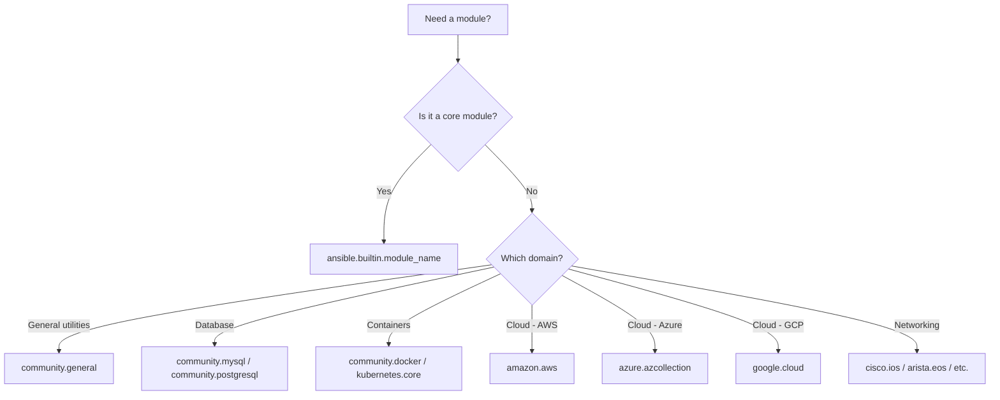

# How to Use FQCN (Fully Qualified Collection Names) in Ansible

Author: [nawazdhandala](https://www.github.com/nawazdhandala)

Tags: Ansible, FQCN, Collections, Best Practices

Description: Learn how to use Fully Qualified Collection Names in Ansible to avoid module conflicts, improve clarity, and future-proof your playbooks.

---

Starting with Ansible 2.10, the project split its modules into separate collections. This change introduced Fully Qualified Collection Names (FQCNs), and using them is now the recommended practice. If you are still writing `apt` instead of `ansible.builtin.apt`, your playbooks will eventually break or behave unexpectedly. Let me walk through why FQCNs matter and how to adopt them.

## What Are FQCNs?

A Fully Qualified Collection Name identifies a module by its namespace, collection, and module name:

```
namespace.collection.module_name
```

For example:
- `ansible.builtin.apt` instead of `apt`
- `ansible.builtin.copy` instead of `copy`
- `community.general.ufw` instead of `ufw`
- `community.mysql.mysql_db` instead of `mysql_db`

## Why FQCNs Are Necessary

Before collections, all modules lived in a single Ansible package. If two modules had the same name, you had a conflict. With collections, multiple collections can define modules with the same name, and FQCNs disambiguate them.

Here is a real scenario:

```yaml
# AMBIGUOUS: Which 'docker_container' module is this?
# Could be community.docker.docker_container
# Could be a custom module in your library/ directory
- name: Start application container
  docker_container:
    name: myapp
    image: myapp:latest
```

```yaml
# CLEAR: Explicitly using the community docker collection
- name: Start application container
  community.docker.docker_container:
    name: myapp
    image: myapp:latest
    state: started
```

## The ansible.builtin Namespace

Core Ansible modules live in the `ansible.builtin` collection. These are the modules that ship with `ansible-core`:

```yaml
# Common ansible.builtin modules with FQCNs
- name: Install packages
  ansible.builtin.apt:
    name: nginx
    state: present

- name: Copy configuration file
  ansible.builtin.copy:
    src: app.conf
    dest: /etc/app/app.conf
    mode: '0644'

- name: Create a directory
  ansible.builtin.file:
    path: /opt/myapp
    state: directory
    owner: deploy
    mode: '0755'

- name: Execute a command
  ansible.builtin.command:
    cmd: /opt/myapp/bin/healthcheck

- name: Manage a service
  ansible.builtin.service:
    name: nginx
    state: started
    enabled: yes

- name: Deploy a template
  ansible.builtin.template:
    src: config.j2
    dest: /etc/myapp/config.yml
    owner: myapp
    mode: '0640'

- name: Add a cron job
  ansible.builtin.cron:
    name: "backup database"
    minute: "0"
    hour: "2"
    job: "/opt/scripts/backup.sh"

- name: Gather facts
  ansible.builtin.setup:
    gather_subset:
      - hardware
      - network
```

## Community and Third-Party Collections

Many modules moved to community collections. Here are common ones:

```yaml
# community.general - general purpose modules
- name: Manage UFW firewall
  community.general.ufw:
    rule: allow
    port: '443'
    proto: tcp

# community.mysql - MySQL management
- name: Create database
  community.mysql.mysql_db:
    name: appdb
    state: present

# community.postgresql - PostgreSQL management
- name: Create PostgreSQL user
  community.postgresql.postgresql_user:
    name: appuser
    password: "{{ db_password }}"
    state: present

# community.docker - Docker management
- name: Build Docker image
  community.docker.docker_image:
    name: myapp
    source: build
    build:
      path: /opt/myapp

# community.crypto - Cryptographic operations
- name: Generate private key
  community.crypto.openssl_privatekey:
    path: /etc/ssl/private/myapp.key
    size: 4096

# ansible.posix - POSIX modules
- name: Set SELinux to enforcing
  ansible.posix.selinux:
    policy: targeted
    state: enforcing

# amazon.aws - AWS modules
- name: Create S3 bucket
  amazon.aws.s3_bucket:
    name: myapp-assets
    region: us-east-1
    state: present
```

## Installing Collections

Before using non-builtin FQCNs, you need to install the collections:

```yaml
# requirements.yml
# Declare all collection dependencies with pinned versions
collections:
  - name: community.general
    version: 8.2.0
  - name: community.mysql
    version: 3.8.0
  - name: community.postgresql
    version: 3.3.0
  - name: community.docker
    version: 3.6.0
  - name: community.crypto
    version: 2.16.0
  - name: ansible.posix
    version: 1.5.4
  - name: amazon.aws
    version: 7.2.0
```

```bash
# Install all collections from requirements file
ansible-galaxy collection install -r requirements.yml
```

## Migrating Existing Playbooks to FQCN

Here is a before-and-after comparison of a typical playbook:

```yaml
# BEFORE: Short module names (deprecated style)
- name: Configure web server
  hosts: webservers
  become: yes
  tasks:
    - name: Install nginx
      apt:
        name: nginx
        state: present

    - name: Copy nginx config
      template:
        src: nginx.conf.j2
        dest: /etc/nginx/nginx.conf
      notify: restart nginx

    - name: Ensure nginx is running
      service:
        name: nginx
        state: started
        enabled: yes

    - name: Open firewall port
      ufw:
        rule: allow
        port: '80'

  handlers:
    - name: restart nginx
      service:
        name: nginx
        state: restarted
```

```yaml
# AFTER: Full FQCNs for every module
- name: Configure web server
  hosts: webservers
  become: yes
  tasks:
    - name: Install nginx
      ansible.builtin.apt:
        name: nginx
        state: present

    - name: Copy nginx config
      ansible.builtin.template:
        src: nginx.conf.j2
        dest: /etc/nginx/nginx.conf
      notify: restart nginx

    - name: Ensure nginx is running
      ansible.builtin.service:
        name: nginx
        state: started
        enabled: yes

    - name: Open firewall port
      community.general.ufw:
        rule: allow
        port: '80'

  handlers:
    - name: restart nginx
      ansible.builtin.service:
        name: nginx
        state: restarted
```

## FQCN Lookup Reference



## Enforcing FQCNs with ansible-lint

Configure ansible-lint to enforce FQCN usage:

```yaml
# .ansible-lint
# Require FQCNs for all modules
enable_list:
  - fqcn[action-core]
  - fqcn[action]

# Treat FQCN violations as errors, not warnings
warn_list: []
```

Running it:

```bash
# Check all playbooks and roles for non-FQCN module usage
ansible-lint playbooks/ roles/ --strict

# Example output for violations:
# roles/nginx/tasks/main.yml:3: fqcn[action-core]: Use FQCN for builtin module actions
# Use 'ansible.builtin.apt' instead of 'apt'
```

## Using collections Keyword in Playbooks

If you find FQCNs too verbose, you can declare collections at the playbook or block level. However, this is less explicit and not recommended for shared code:

```yaml
# Using collections keyword to shorten module names
# Only use this as a transitional measure
- name: Configure web server
  hosts: webservers
  become: yes
  collections:
    - ansible.builtin
    - community.general
  tasks:
    - name: Install nginx
      apt:  # Resolves to ansible.builtin.apt
        name: nginx
        state: present
```

I recommend using full FQCNs in all cases. The extra typing pays for itself in clarity and maintainability.

## Summary

FQCNs are not optional anymore. They prevent module name collisions, make dependencies explicit, and prepare your playbooks for the future. Use `ansible.builtin.` for core modules, install community collections via `requirements.yml`, and enforce FQCNs with ansible-lint. Migrating existing playbooks is straightforward and the result is code that is unambiguous about which module it is calling.
