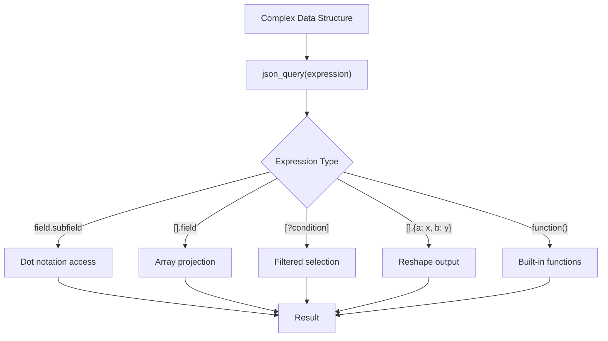

# How to Use json_query (JMESPath) Filter in Ansible

Author: [nawazdhandala](https://www.github.com/nawazdhandala)

Tags: Ansible, JMESPath, JSON, Data Querying

Description: Learn how to use the json_query filter with JMESPath expressions in Ansible for powerful data querying, filtering, and transformation of complex data structures.

---

The `json_query` filter is one of the most powerful data manipulation tools in Ansible. It uses JMESPath (JSON Matching Expression paths), a query language specifically designed for JSON data. If you have ever wished for SQL-like querying on your Ansible data structures, `json_query` is the closest thing you will get.

## Prerequisites

The `json_query` filter requires the `jmespath` Python library. Install it on your Ansible controller:

```bash
# Install the jmespath library required by json_query
pip install jmespath
```

## Basic Queries

The simplest JMESPath expressions access nested fields:

```yaml
# playbook-basic-query.yml
# Demonstrates basic JMESPath field access on nested data
- name: Basic json_query usage
  hosts: localhost
  gather_facts: false
  vars:
    server:
      name: web-01
      network:
        public_ip: 54.23.10.5
        private_ip: 10.0.1.10
      tags:
        environment: production
        team: platform

  tasks:
    - name: Query nested field
      ansible.builtin.debug:
        msg: "{{ server | json_query('network.public_ip') }}"

    - name: Query tag value
      ansible.builtin.debug:
        msg: "{{ server | json_query('tags.environment') }}"
```

## Querying Arrays

JMESPath shines when querying arrays (lists):

```yaml
# playbook-array-query.yml
# Queries a list of instances to extract specific fields
- name: Query arrays with json_query
  hosts: localhost
  gather_facts: false
  vars:
    instances:
      - id: i-001
        type: t3.medium
        state: running
        tags:
          Name: web-01
          env: prod
      - id: i-002
        type: t3.large
        state: stopped
        tags:
          Name: web-02
          env: staging
      - id: i-003
        type: r5.xlarge
        state: running
        tags:
          Name: db-01
          env: prod

  tasks:
    - name: Get all instance IDs
      ansible.builtin.debug:
        msg: "{{ instances | json_query('[].id') }}"

    - name: Get all instance types
      ansible.builtin.debug:
        msg: "{{ instances | json_query('[].type') }}"

    - name: Get IDs and types together
      ansible.builtin.debug:
        msg: "{{ instances | json_query('[].[id, type]') }}"
```

## Filtering with Conditions

JMESPath supports filtering with bracket notation:

```yaml
# playbook-filter-query.yml
# Uses JMESPath filter expressions to select specific instances
- name: Filter data with json_query
  hosts: localhost
  gather_facts: false
  vars:
    instances:
      - id: i-001
        type: t3.medium
        state: running
        cpu: 45
        tags:
          Name: web-01
          env: prod
      - id: i-002
        type: t3.large
        state: stopped
        cpu: 0
        tags:
          Name: web-02
          env: staging
      - id: i-003
        type: r5.xlarge
        state: running
        cpu: 82
        tags:
          Name: db-01
          env: prod

  tasks:
    - name: Get only running instances
      ansible.builtin.debug:
        msg: "{{ instances | json_query(\"[?state=='running']\") }}"

    - name: Get production instances
      ansible.builtin.debug:
        msg: "{{ instances | json_query(\"[?tags.env=='prod'].id\") }}"

    - name: Get instances with high CPU
      ansible.builtin.debug:
        msg: "{{ instances | json_query('[?cpu>`80`].tags.Name') }}"

    - name: Combine multiple conditions
      ansible.builtin.debug:
        msg: "{{ instances | json_query(\"[?state=='running' && tags.env=='prod'].id\") }}"
```

## Projection and Reshaping

You can reshape the output with multi-select expressions:

```yaml
# playbook-projection.yml
# Uses JMESPath multi-select to reshape query output
- name: Reshape data with json_query
  hosts: localhost
  gather_facts: false
  vars:
    employees:
      - name: Alice
        department: engineering
        salary: 120000
        skills:
          - python
          - ansible
          - terraform
      - name: Bob
        department: sales
        salary: 95000
        skills:
          - negotiation
          - crm
      - name: Carol
        department: engineering
        salary: 130000
        skills:
          - go
          - kubernetes
          - ansible

  tasks:
    - name: Select specific fields into new objects
      ansible.builtin.debug:
        msg: "{{ employees | json_query('[].{person: name, dept: department}') }}"

    - name: Get engineering team members
      ansible.builtin.debug:
        msg: "{{ employees | json_query(\"[?department=='engineering'].name\") }}"

    - name: Flatten all skills
      ansible.builtin.debug:
        msg: "{{ employees | json_query('[].skills[]') }}"
```

## JMESPath Built-in Functions

JMESPath has several useful built-in functions:

```yaml
# playbook-functions.yml
# Demonstrates JMESPath functions like length, sort, max, min, contains
- name: JMESPath functions
  hosts: localhost
  gather_facts: false
  vars:
    data:
      servers:
        - name: web-01
          memory_gb: 16
        - name: web-02
          memory_gb: 8
        - name: db-01
          memory_gb: 64
        - name: cache-01
          memory_gb: 32

  tasks:
    - name: Count servers
      ansible.builtin.debug:
        msg: "{{ data | json_query('length(servers)') }}"

    - name: Get max memory
      ansible.builtin.debug:
        msg: "{{ data | json_query('max_by(servers, &memory_gb)') }}"

    - name: Get min memory
      ansible.builtin.debug:
        msg: "{{ data | json_query('min_by(servers, &memory_gb)') }}"

    - name: Sort by memory
      ansible.builtin.debug:
        msg: "{{ data | json_query('sort_by(servers, &memory_gb)[].name') }}"

    - name: Get server names sorted
      ansible.builtin.debug:
        msg: "{{ data | json_query('sort(servers[].name)') }}"
```

## Complex Nested Queries

For deeply nested data like cloud API responses:

```yaml
# playbook-complex.yml
# Queries deeply nested cloud infrastructure data
- name: Complex nested queries
  hosts: localhost
  gather_facts: false
  vars:
    cloud_infra:
      regions:
        - name: us-east-1
          vpcs:
            - id: vpc-001
              subnets:
                - id: subnet-001
                  cidr: 10.0.1.0/24
                  instances:
                    - id: i-001
                      state: running
                    - id: i-002
                      state: stopped
                - id: subnet-002
                  cidr: 10.0.2.0/24
                  instances:
                    - id: i-003
                      state: running
        - name: eu-west-1
          vpcs:
            - id: vpc-002
              subnets:
                - id: subnet-003
                  cidr: 172.16.1.0/24
                  instances:
                    - id: i-004
                      state: running

  tasks:
    - name: Get all instance IDs across all regions
      ansible.builtin.debug:
        msg: "{{ cloud_infra | json_query('regions[].vpcs[].subnets[].instances[].id') }}"

    - name: Get all running instance IDs
      ansible.builtin.debug:
        msg: "{{ cloud_infra | json_query(\"regions[].vpcs[].subnets[].instances[?state=='running'].id[]\") }}"

    - name: Get all subnet CIDRs
      ansible.builtin.debug:
        msg: "{{ cloud_infra | json_query('regions[].vpcs[].subnets[].cidr') }}"
```

## Query Flow



## Using Variables in Queries

When you need to use Ansible variables inside a JMESPath expression, use string concatenation:

```yaml
# playbook-dynamic-query.yml
# Builds JMESPath expressions dynamically using Ansible variables
- name: Dynamic json_query expressions
  hosts: localhost
  gather_facts: false
  vars:
    target_env: prod
    target_state: running
    instances:
      - id: i-001
        state: running
        env: prod
      - id: i-002
        state: stopped
        env: staging
      - id: i-003
        state: running
        env: prod

  tasks:
    - name: Build query dynamically
      ansible.builtin.set_fact:
        query: "[?state=='{{ target_state }}' && env=='{{ target_env }}'].id"

    - name: Execute dynamic query
      ansible.builtin.debug:
        msg: "{{ instances | json_query(query) }}"
```

## Practical Example: Processing AWS API Response

```yaml
# playbook-aws-query.yml
# Parses a simulated AWS EC2 describe-instances API response
- name: Process AWS-style API response
  hosts: localhost
  gather_facts: false
  vars:
    ec2_response:
      Reservations:
        - Instances:
            - InstanceId: i-001
              InstanceType: t3.medium
              State:
                Name: running
              Tags:
                - Key: Name
                  Value: web-01
                - Key: Environment
                  Value: production
        - Instances:
            - InstanceId: i-002
              InstanceType: t3.large
              State:
                Name: running
              Tags:
                - Key: Name
                  Value: db-01
                - Key: Environment
                  Value: production

  tasks:
    - name: Get all running instance IDs
      ansible.builtin.debug:
        msg: >-
          {{ ec2_response | json_query("Reservations[].Instances[?State.Name=='running'].InstanceId[]") }}

    - name: Get instance types
      ansible.builtin.debug:
        msg: "{{ ec2_response | json_query('Reservations[].Instances[].{id: InstanceId, type: InstanceType}') }}"
```

## Summary

The `json_query` filter with JMESPath gives you a concise, expressive way to query complex data structures. Use dot notation for field access, `[]` for array projection, `[?condition]` for filtering, and built-in functions like `sort_by`, `max_by`, and `length` for computation. For dynamic queries, build the expression string with Ansible variable interpolation. While `selectattr` and `map` handle simple cases well, `json_query` becomes essential when you are dealing with deeply nested structures or need to combine multiple operations in a single expression.
