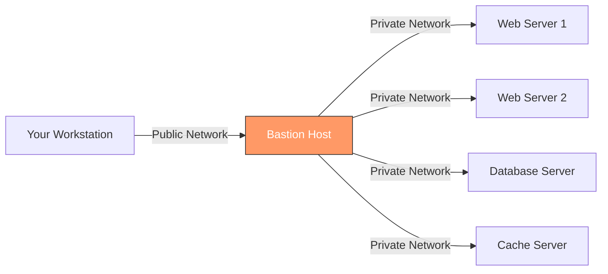

# How to Use Jump Hosts (Bastion Hosts) in Ansible Inventory

Author: [nawazdhandala](https://www.github.com/nawazdhandala)

Tags: Ansible, Bastion Host, Jump Host, SSH, Security, DevOps

Description: Configure Ansible to reach private network hosts through bastion or jump hosts using SSH ProxyJump, ProxyCommand, and inventory-based connection settings.

---

In most production environments, servers sit on private networks that are not directly accessible from the internet or your workstation. To reach them, you SSH through a bastion host (also called a jump host or jump box) that has one network interface on the public network and another on the private network. Configuring Ansible to work through a bastion host requires the right SSH arguments in your inventory.

## The Network Layout

A typical bastion host setup looks like this:



Your workstation can only reach the bastion host. The bastion host can reach all servers on the private network. Ansible needs to tunnel through the bastion to manage those private servers.

## Method 1: ProxyJump (Recommended)

The simplest and most modern approach uses SSH's `ProxyJump` option (`-J` flag). This is available in OpenSSH 7.3 and later.

```ini
# inventory.ini
# Bastion host (accessible directly)
[bastion]
bastion.example.com ansible_host=203.0.113.10 ansible_user=jumpuser

# Private hosts (only accessible through bastion)
[webservers]
web1.internal ansible_host=10.0.1.10
web2.internal ansible_host=10.0.1.11

[databases]
db1.internal ansible_host=10.0.2.10

# Connection settings for private hosts
[webservers:vars]
ansible_user=deploy
ansible_ssh_common_args=-o ProxyJump=jumpuser@203.0.113.10

[databases:vars]
ansible_user=dbadmin
ansible_ssh_common_args=-o ProxyJump=jumpuser@203.0.113.10
```

That is it. When Ansible connects to `web1.internal`, SSH automatically tunnels through `203.0.113.10` first.

Test the connection:

```bash
# Test connectivity through the bastion
ansible web1.internal -i inventory.ini -m ping

# Verbose output shows the SSH proxy connection
ansible web1.internal -i inventory.ini -m ping -vvvv
```

## Method 2: ProxyCommand

For older SSH versions that do not support ProxyJump, use ProxyCommand:

```ini
# inventory.ini
[webservers]
web1.internal ansible_host=10.0.1.10
web2.internal ansible_host=10.0.1.11

[webservers:vars]
ansible_user=deploy
ansible_ssh_common_args=-o ProxyCommand="ssh -W %h:%p jumpuser@203.0.113.10"
```

The `-W %h:%p` option tells SSH to forward the connection to the target host and port through the proxy.

## Using host_vars for Per-Host Bastion Configuration

When different hosts use different bastion servers (common in multi-region setups):

```yaml
# host_vars/web-us-east-01.internal.yml
# US East server goes through US East bastion
ansible_host: 10.0.1.10
ansible_user: deploy
ansible_ssh_common_args: "-o ProxyJump=jumpuser@bastion-us-east.example.com"

# host_vars/web-eu-west-01.internal.yml
# EU West server goes through EU West bastion
ansible_host: 10.1.1.10
ansible_user: deploy
ansible_ssh_common_args: "-o ProxyJump=jumpuser@bastion-eu-west.example.com"
```

## Using group_vars for Bastion Configuration

For cleaner organization, set the bastion connection in group_vars:

```yaml
# group_vars/us_east_private.yml
# All US East private hosts go through the US East bastion
ansible_ssh_common_args: >-
  -o ProxyJump=jumpuser@bastion-us-east.example.com:22
  -o StrictHostKeyChecking=no
  -o UserKnownHostsFile=/dev/null
```

```yaml
# group_vars/eu_west_private.yml
# All EU West private hosts go through the EU West bastion
ansible_ssh_common_args: >-
  -o ProxyJump=jumpuser@bastion-eu-west.example.com:22
  -o StrictHostKeyChecking=no
  -o UserKnownHostsFile=/dev/null
```

```ini
# inventory.ini
[us_east_web]
web-use-01.internal ansible_host=10.0.1.10
web-use-02.internal ansible_host=10.0.1.11

[eu_west_web]
web-euw-01.internal ansible_host=10.1.1.10
web-euw-02.internal ansible_host=10.1.1.11

[us_east_private:children]
us_east_web

[eu_west_private:children]
eu_west_web
```

## Using SSH Config File

Instead of putting SSH options in the inventory, you can define them in your SSH config file and keep the inventory clean:

```
# ~/.ssh/config
# Bastion host configuration
Host bastion
    HostName 203.0.113.10
    User jumpuser
    IdentityFile ~/.ssh/bastion_key
    ControlMaster auto
    ControlPersist 10m
    ControlPath ~/.ssh/sockets/%r@%h-%p

# All hosts on the 10.0.* network go through the bastion
Host 10.0.*
    User deploy
    ProxyJump bastion
    IdentityFile ~/.ssh/internal_key
    StrictHostKeyChecking no
```

With this SSH config, your Ansible inventory needs no special SSH arguments:

```ini
# inventory.ini
# Clean inventory - SSH config handles the proxy
[webservers]
web1 ansible_host=10.0.1.10
web2 ansible_host=10.0.1.11

[databases]
db1 ansible_host=10.0.2.10
```

```bash
# Ansible uses SSH config automatically
ansible webservers -i inventory.ini -m ping
```

This is the cleanest approach because it separates SSH configuration from Ansible configuration.

## Multi-Hop Bastion (Chained Jump Hosts)

Some environments require jumping through multiple hosts:


```ini
# inventory.ini
[secure_servers]
secure-db.isolated ansible_host=10.10.1.10

[secure_servers:vars]
ansible_user=secadmin
ansible_ssh_common_args=-o ProxyJump=jumpuser@external-bastion.example.com,intuser@10.0.0.5
```

The comma-separated list in ProxyJump creates a chain: your workstation connects to the external bastion, which connects to the internal bastion (10.0.0.5), which connects to the target.

With SSH config:

```
# ~/.ssh/config
Host external-bastion
    HostName 203.0.113.10
    User jumpuser

Host internal-bastion
    HostName 10.0.0.5
    User intuser
    ProxyJump external-bastion

Host 10.10.*
    ProxyJump internal-bastion
    User secadmin
```

## SSH Key Forwarding

If the bastion host does not have the private keys for the internal servers (and it should not, for security reasons), use SSH agent forwarding:

```bash
# Add your keys to the SSH agent
ssh-add ~/.ssh/bastion_key
ssh-add ~/.ssh/internal_key
```

```yaml
# group_vars/private_servers.yml
ansible_ssh_common_args: >-
  -o ProxyJump=jumpuser@bastion.example.com
  -o ForwardAgent=yes
```

However, agent forwarding has security implications. If the bastion host is compromised, an attacker can use your forwarded agent. The ProxyJump method is safer because it does not expose your agent on the bastion.

## Performance: SSH Connection Multiplexing

Bastion connections are slower because every command goes through an extra hop. SSH multiplexing reuses connections to avoid repeated authentication:

```ini
# ansible.cfg
[ssh_connection]
ssh_args = -o ControlMaster=auto -o ControlPersist=60s -o ControlPath=/tmp/ansible-ssh-%h-%p-%r
pipelining = true
```

Or set it per host:

```yaml
# group_vars/private_servers.yml
ansible_ssh_common_args: >-
  -o ProxyJump=jumpuser@bastion.example.com
  -o ControlMaster=auto
  -o ControlPersist=60s
  -o ControlPath=/tmp/ansible-ssh-%h-%p-%r
```

This makes the first connection slower (two hops), but subsequent connections reuse the established tunnel.

## Complete Production Example

Here is a full setup for a multi-region infrastructure behind bastion hosts:

```ini
# inventory.ini
# Bastion hosts (for direct management if needed)
[bastion_hosts]
bastion-east.example.com ansible_host=203.0.113.10
bastion-west.example.com ansible_host=203.0.113.20

# US East servers
[us_east_web]
web-east-01 ansible_host=10.0.1.10
web-east-02 ansible_host=10.0.1.11
web-east-03 ansible_host=10.0.1.12

[us_east_db]
db-east-primary ansible_host=10.0.2.10
db-east-replica ansible_host=10.0.2.11

# US West servers
[us_west_web]
web-west-01 ansible_host=10.1.1.10
web-west-02 ansible_host=10.1.1.11

[us_west_db]
db-west-primary ansible_host=10.1.2.10

# Region grouping
[us_east:children]
us_east_web
us_east_db

[us_west:children]
us_west_web
us_west_db
```

```yaml
# group_vars/us_east.yml
# All US East hosts go through the east bastion
ansible_ssh_common_args: >-
  -o ProxyJump=jumpuser@203.0.113.10
  -o StrictHostKeyChecking=accept-new
```

```yaml
# group_vars/us_west.yml
# All US West hosts go through the west bastion
ansible_ssh_common_args: >-
  -o ProxyJump=jumpuser@203.0.113.20
  -o StrictHostKeyChecking=accept-new
```

```yaml
# group_vars/bastion_hosts.yml
# Bastion hosts are accessed directly, no proxy
ansible_user: jumpuser
ansible_ssh_private_key_file: ~/.ssh/bastion_key
```

## Troubleshooting

When bastion connections fail, debug systematically:

```bash
# Step 1: Can you SSH to the bastion directly?
ssh jumpuser@203.0.113.10

# Step 2: Can you SSH through the bastion manually?
ssh -J jumpuser@203.0.113.10 deploy@10.0.1.10

# Step 3: Test with Ansible in verbose mode
ansible web-east-01 -i inventory.ini -m ping -vvvv

# Step 4: Check SSH agent
ssh-add -l
```

Common issues:
- **Bastion firewall blocks SSH**: Check security groups and firewall rules
- **Key not in agent**: Run `ssh-add` with the right key
- **Bastion SSH config rejects the proxy**: Check the bastion's `sshd_config` for `AllowTcpForwarding yes`
- **Timeout errors**: Increase `ConnectTimeout` in `ansible_ssh_common_args`

Bastion hosts are a security fundamental for production infrastructure. Getting the Ansible configuration right means you can manage your entire private network without exposing any servers to the internet, while keeping your inventory clean and your playbooks unchanged.
