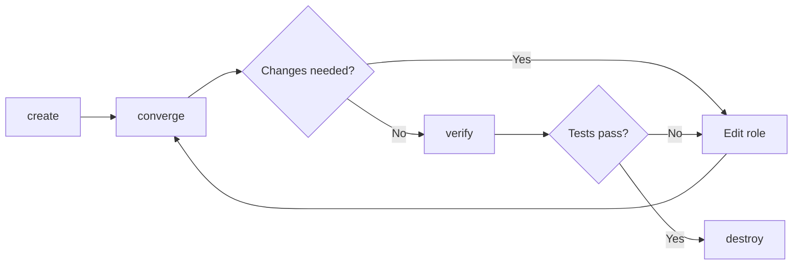

# How to Use Molecule create, converge, and verify

Author: [nawazdhandala](https://www.github.com/nawazdhandala)

Tags: Ansible, Molecule, Testing, Development Workflow

Description: Master the three most-used Molecule commands for daily Ansible development with create, converge, and verify for fast iterative testing.

---

If you use Molecule every day, three commands make up 90% of your workflow: `molecule create`, `molecule converge`, and `molecule verify`. The full `molecule test` lifecycle is great for CI pipelines, but during development you want fast feedback. Create your instances once, converge repeatedly as you make changes, and verify when you think things are right. This post goes deep on each of these three commands and how to use them effectively.

## The Iterative Development Loop

The development loop with Molecule looks like this:



You create instances once, then iterate between editing your role and converging until things work. Only then do you run verification. When everything passes, you destroy the instances.

## molecule create

The `create` command provisions test instances using the configured driver. It reads your `molecule.yml` platforms definition and brings up the containers or VMs.

```bash
# Create test instances
molecule create
```

What happens during create:

1. Molecule reads the `platforms` section of `molecule.yml`
2. It generates or uses a `create.yml` playbook
3. The playbook provisions instances (pulls Docker images, creates containers, starts VMs, etc.)
4. Molecule records the instance state in `.molecule/` directory

After creating, check the instance status.

```bash
# See which instances are running
molecule list
```

Output:

```
Instance Name    Driver Name    Provisioner Name    Scenario Name    Created    Converged
--------------   -----------    ----------------    -------------    -------    ---------
ubuntu2204       docker         ansible             default          true       false
rocky9           docker         ansible             default          true       false
```

### Common create Options

```bash
# Create with verbose output to debug issues
molecule create -- -vvv

# Create for a specific scenario
molecule create --scenario-name tls

# Create all scenarios
molecule create --all
```

### What to Do When create Fails

If `molecule create` fails, common causes include:

```bash
# Docker not running
systemctl status docker

# Image not found (check the image name in molecule.yml)
docker pull geerlingguy/docker-ubuntu2204-ansible:latest

# Port conflict (another container using the same port)
docker ps -a

# Clean up stale Molecule state
molecule reset
molecule create
```

### Custom create Playbooks

For advanced use cases, you can write a custom `create.yml` playbook. This is useful when the built-in driver does not support a specific feature you need.

```yaml
# molecule/default/create.yml - custom instance creation
- name: Create
  hosts: localhost
  gather_facts: false
  tasks:
    - name: Create Docker container with custom settings
      community.docker.docker_container:
        name: "{{ item.name }}"
        image: "{{ item.image }}"
        state: started
        privileged: "{{ item.privileged | default(false) }}"
        volumes: "{{ item.volumes | default([]) }}"
        ports: "{{ item.published_ports | default([]) }}"
        env: "{{ item.env | default({}) }}"
        command: "{{ item.command | default('sleep infinity') }}"
        networks:
          - name: molecule
      loop: "{{ molecule_yml.platforms }}"

    - name: Wait for containers to be ready
      ansible.builtin.wait_for:
        host: "{{ item.name }}"
        port: 22
        delay: 5
        timeout: 30
      loop: "{{ molecule_yml.platforms }}"
      when: item.wait_for_ssh | default(false)
```

## molecule converge

The `converge` command runs your role against the test instances. This is the command you run most frequently during development.

```bash
# Run the converge playbook
molecule converge
```

What happens during converge:

1. Molecule connects to the running instances
2. It runs the `converge.yml` playbook, which typically applies your role
3. Task output is displayed in real time
4. The converged state is recorded

### The converge.yml Playbook

The converge playbook is usually simple, just applying your role with the desired variables.

```yaml
# molecule/default/converge.yml - apply the role under test
- name: Converge
  hosts: all
  become: true
  vars:
    nginx_port: 8080
    nginx_worker_processes: 2
    nginx_sites:
      - name: myapp
        server_name: test.example.com
        document_root: /var/www/myapp
  roles:
    - role: my_nginx_role
```

### Running converge Multiple Times

One of the biggest advantages of the create/converge workflow is that converge is re-runnable. After making changes to your role, just run converge again.

```bash
# Make changes to your role
vim tasks/main.yml

# Re-converge (much faster than molecule test)
molecule converge
```

Since the instance is already running, converge skips the creation step and goes straight to applying the role. This typically takes 20-60 seconds instead of the 2-5 minutes a full `molecule test` would take.

### Passing Extra Variables

Override variables at converge time.

```bash
# Pass extra variables
molecule converge -- -e "nginx_port=9090"

# Increase verbosity
molecule converge -- -vvv

# Run only specific tags
molecule converge -- --tags "configuration"

# Skip specific tags
molecule converge -- --skip-tags "packages"

# Limit to specific hosts
molecule converge -- --limit "ubuntu2204"
```

### Converge with Step Mode

For debugging, run converge in step mode to pause between tasks.

```bash
# Step through tasks one by one
molecule converge -- --step
```

### Partial Converge

If your converge playbook has multiple plays, you can target specific ones using tags.

```yaml
# molecule/default/converge.yml - tagged plays for partial converge
- name: Install packages
  hosts: all
  become: true
  tags: [packages]
  tasks:
    - name: Install nginx
      ansible.builtin.apt:
        name: nginx
        state: present

- name: Configure application
  hosts: all
  become: true
  tags: [configuration]
  roles:
    - role: my_nginx_role
```

```bash
# Only run the configuration play
molecule converge -- --tags "configuration"
```

## molecule verify

The `verify` command runs your test assertions against the converged instances.

```bash
# Run verification tests
molecule verify
```

What happens during verify:

1. Molecule connects to the running instances
2. It runs the verifier (Ansible playbook or Testinfra tests)
3. Test results are displayed
4. Molecule reports pass or fail

### Ansible Verifier

```yaml
# molecule/default/verify.yml - Ansible-based verification
- name: Verify
  hosts: all
  become: true
  tasks:
    - name: Check nginx is installed
      ansible.builtin.package:
        name: nginx
        state: present
      check_mode: true
      register: result
      failed_when: result.changed

    - name: Check nginx is listening
      ansible.builtin.wait_for:
        port: 8080
        timeout: 5
```

### Testinfra Verifier

```python
# molecule/default/test_default.py - Testinfra tests
def test_nginx_installed(host):
    assert host.package("nginx").is_installed

def test_nginx_running(host):
    assert host.service("nginx").is_running

def test_nginx_listening(host):
    assert host.socket("tcp://0.0.0.0:8080").is_listening
```

### Selective Verification

Run specific tests during development.

```bash
# Run only tests matching a pattern (Testinfra)
molecule verify -- -k "test_nginx"

# Run with verbose output
molecule verify -- -v

# Run with very verbose output
molecule verify -- -vvv
```

### Verify Without Converging

You can run verify at any time, even if you have not converged yet (though it will likely fail). This is useful for checking that your tests themselves are syntactically correct.

```bash
# Create, then immediately try verify (to check test syntax)
molecule create
molecule verify  # will fail on assertions, but catches test syntax errors
```

## Putting It All Together: A Development Session

Here is what a typical development session looks like.

```bash
# Start by creating instances
molecule create

# Run the initial converge
molecule converge

# Something failed? Check the error, fix the role, try again
vim tasks/main.yml
molecule converge

# The nginx config template has an error
vim templates/nginx.conf.j2
molecule converge

# Looking good, run verification
molecule verify

# Two tests fail. Fix the role to address the failures
vim tasks/configure.yml
molecule converge
molecule verify

# All tests pass. Run idempotency check
molecule idempotence

# Idempotency fails on one task. Fix it
vim tasks/main.yml
molecule converge
molecule idempotence

# Everything passes. Run the full test sequence to be sure
molecule destroy
molecule test

# All green. Commit and push
git add -A && git commit -m "Fix nginx role"
```

## Speeding Up the Loop

A few tricks to make the create/converge/verify loop faster.

### Cache Facts

```yaml
# molecule/default/molecule.yml - cache Ansible facts
provisioner:
  name: ansible
  config_options:
    defaults:
      gathering: smart
      fact_caching: jsonfile
      fact_caching_connection: /tmp/molecule-facts
      fact_caching_timeout: 3600
```

### Use Pipelining

```yaml
# molecule/default/molecule.yml - enable SSH pipelining
provisioner:
  name: ansible
  config_options:
    ssh_connection:
      pipelining: true
```

### Skip Unnecessary Steps

```bash
# During development, skip dependency installation
molecule converge --no-dependency
```

## When to Use molecule test Instead

Use the full `molecule test` command when:

- Running in CI/CD pipelines
- Before merging a pull request
- When you want a clean-room validation
- When you need to verify the full lifecycle including create and destroy

Use `create/converge/verify` when:

- Developing and iterating on a role
- Debugging a specific failure
- Running quick smoke tests
- Exploring how the role behaves with different variables

The create/converge/verify workflow is the backbone of productive Ansible role development. It gives you fast feedback without the overhead of recreating instances on every iteration.
