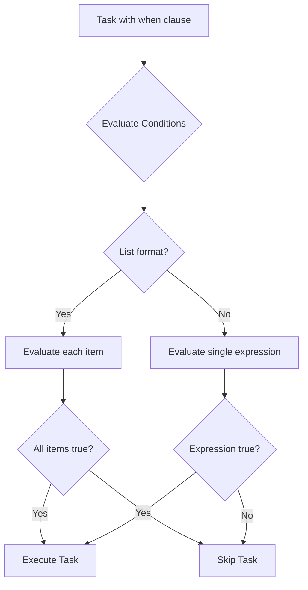

# How to Use Multiple Conditions with and/or in Ansible when

Author: [nawazdhandala](https://www.github.com/nawazdhandala)

Tags: Ansible, Conditionals, when Clause, Boolean Logic, Playbooks

Description: Learn how to combine multiple conditions using AND and OR logic in Ansible when clauses for precise task control.

---

A single condition in a `when` clause covers simple cases, but real-world automation often requires combining multiple checks. You might need a task that runs only on Ubuntu production servers with more than 4GB of RAM. Or a task that runs on either Debian or RedHat systems. Ansible supports both AND and OR logic in `when` clauses, with two different syntaxes for each.

## AND Logic: List Syntax (Recommended)

The cleanest way to combine conditions with AND is to use a YAML list. Each item in the list is a separate condition, and all of them must be true for the task to execute.

```yaml
# and-list-syntax.yml - AND conditions using a YAML list
---
- name: AND conditions with list syntax
  hosts: all
  gather_facts: true
  vars:
    deploy_env: production
    enable_ssl: true
  tasks:
    - name: Configure production SSL (all conditions must be true)
      ansible.builtin.debug:
        msg: "Setting up SSL for production"
      when:
        - deploy_env == "production"
        - enable_ssl | bool
        - ansible_os_family == "Debian"
        - ansible_memtotal_mb >= 2048

    - name: Install monitoring on large production servers
      ansible.builtin.debug:
        msg: "Installing full monitoring stack"
      when:
        - deploy_env == "production"
        - ansible_memtotal_mb >= 8192
        - ansible_processor_vcpus >= 4
```

Each condition on its own line is readable and easy to modify. Adding or removing a condition is a one-line change.

## AND Logic: Inline Syntax

You can also use the `and` keyword inline:

```yaml
# and-inline-syntax.yml - AND conditions inline
---
- name: AND conditions inline
  hosts: all
  gather_facts: true
  vars:
    deploy_env: production
  tasks:
    - name: Production Debian configuration
      ansible.builtin.debug:
        msg: "Applying production Debian settings"
      when: deploy_env == "production" and ansible_os_family == "Debian"

    - name: High-memory production check
      ansible.builtin.debug:
        msg: "High-memory production server detected"
      when: deploy_env == "production" and ansible_memtotal_mb >= 8192 and ansible_processor_vcpus >= 4
```

The inline syntax works but gets hard to read with more than two conditions. Prefer the list syntax when you have three or more conditions.

## OR Logic

For OR conditions, use the `or` keyword. Unlike AND, there is no list shorthand for OR.

```yaml
# or-syntax.yml - OR conditions
---
- name: OR condition examples
  hosts: all
  gather_facts: true
  vars:
    emergency_mode: false
  tasks:
    - name: Install on Debian OR RedHat
      ansible.builtin.package:
        name: curl
        state: present
      become: true
      when: ansible_os_family == "Debian" or ansible_os_family == "RedHat"

    - name: Alert if low memory OR low disk
      ansible.builtin.debug:
        msg: "Resource warning on {{ inventory_hostname }}"
      when: ansible_memtotal_mb < 1024 or ansible_mounts[0].size_available < 1073741824

    - name: Skip deployment in emergency OR maintenance
      ansible.builtin.debug:
        msg: "Deployment blocked"
      when: emergency_mode or maintenance_mode | default(false)
```

## Combining AND and OR

When you need both AND and OR in the same condition, use parentheses to make the logic explicit:

```yaml
# combined-logic.yml - Mixing AND and OR
---
- name: Combined AND/OR conditions
  hosts: all
  gather_facts: true
  vars:
    deploy_env: production
    force_deploy: false
  tasks:
    # Must be production AND (Debian OR RedHat)
    - name: Deploy on production Linux systems
      ansible.builtin.debug:
        msg: "Deploying to production {{ ansible_os_family }}"
      when:
        - deploy_env == "production"
        - ansible_os_family == "Debian" or ansible_os_family == "RedHat"

    # Deploy if production with enough memory, OR if force_deploy is set
    - name: Conditional deployment with override
      ansible.builtin.debug:
        msg: "Proceeding with deployment"
      when: >
        (deploy_env == "production" and ansible_memtotal_mb >= 4096)
        or force_deploy | bool

    # Complex: (production AND Debian) OR (staging AND any OS)
    - name: Complex multi-environment logic
      ansible.builtin.debug:
        msg: "Matched complex condition"
      when: >
        (deploy_env == "production" and ansible_os_family == "Debian")
        or deploy_env == "staging"
```

## List Items with OR

When you use the list syntax, remember that each list item is ANDed. If you need OR within a list, put the OR expression on a single line:

```yaml
# list-with-or.yml - OR inside AND list
---
- name: OR inside AND list
  hosts: all
  gather_facts: true
  vars:
    deploy_env: production
    app_tier: web
  tasks:
    # All three conditions must be true (AND)
    # The second condition uses OR internally
    - name: Mixed AND/OR in list format
      ansible.builtin.debug:
        msg: "Matched"
      when:
        - deploy_env == "production"                              # AND
        - ansible_os_family == "Debian" or ansible_os_family == "RedHat"  # AND (with internal OR)
        - app_tier == "web" or app_tier == "api"                  # AND (with internal OR)
```

This reads as: production AND (Debian or RedHat) AND (web or api).

## Using in for Simplified OR

When you are checking if a variable matches one of several values, the `in` operator is cleaner than chaining OR:

```yaml
# in-vs-or.yml - Using 'in' instead of multiple OR conditions
---
- name: Simplify OR with in operator
  hosts: all
  gather_facts: true
  tasks:
    # Instead of this:
    - name: Verbose OR chain
      ansible.builtin.debug:
        msg: "Supported OS"
      when: >
        ansible_distribution == "Ubuntu"
        or ansible_distribution == "Debian"
        or ansible_distribution == "CentOS"
        or ansible_distribution == "Rocky"

    # Use this:
    - name: Clean in operator
      ansible.builtin.debug:
        msg: "Supported OS"
      when: ansible_distribution in ["Ubuntu", "Debian", "CentOS", "Rocky"]

    # Works with variables too
    - name: Check environment
      ansible.builtin.debug:
        msg: "Non-production environment"
      when: deploy_env | default('development') in ["development", "staging", "testing"]
```

## Negating Complex Conditions

Use `not` with parentheses for negating compound conditions:

```yaml
# negation.yml - Negating conditions
---
- name: Negation examples
  hosts: all
  gather_facts: true
  vars:
    deploy_env: staging
  tasks:
    # NOT production
    - name: Run only outside production
      ansible.builtin.debug:
        msg: "Non-production task"
      when: deploy_env != "production"

    # NOT (Debian OR RedHat) - runs on everything else
    - name: Run on non-Linux systems
      ansible.builtin.debug:
        msg: "Non-standard OS family: {{ ansible_os_family }}"
      when: ansible_os_family not in ["Debian", "RedHat"]

    # NOT in the excluded list
    - name: Run on all hosts except specific ones
      ansible.builtin.debug:
        msg: "Running on {{ inventory_hostname }}"
      when: inventory_hostname not in ["db1", "db2"]
```

## Practical Example: Deployment Pipeline Logic

```yaml
# deployment-conditions.yml - Real-world deployment conditionals
---
- name: Application deployment with conditional logic
  hosts: app_servers
  gather_facts: true
  vars:
    deploy_env: production
    deploy_branch: main
    rollback_mode: false
    canary_percentage: 10
  tasks:
    - name: Validate deployment prerequisites
      ansible.builtin.assert:
        that:
          - deploy_env is defined
          - deploy_branch is defined
        fail_msg: "Missing deployment variables"

    # Only deploy main branch to production
    - name: Block non-main deployments to production
      ansible.builtin.fail:
        msg: "Only the main branch can be deployed to production"
      when:
        - deploy_env == "production"
        - deploy_branch != "main"
        - not rollback_mode | bool

    # Canary deployment: first batch gets special treatment
    - name: Apply canary configuration
      ansible.builtin.template:
        src: canary-config.j2
        dest: /opt/app/config/canary.yml
        mode: '0644'
      when:
        - deploy_env == "production"
        - canary_percentage > 0
        - ansible_play_batch.index(inventory_hostname) < (ansible_play_batch | length * canary_percentage / 100) | int
      become: true

    # Skip heavy tasks in development
    - name: Run database migrations
      ansible.builtin.command:
        cmd: /opt/app/bin/migrate
      when: deploy_env != "development" or force_migrate | default(false) | bool
      become: true
      become_user: app
      changed_when: true

    # Platform-specific binary deployment
    - name: Deploy binary
      ansible.builtin.copy:
        src: "releases/{{ deploy_branch }}/app-{{ 'amd64' if ansible_architecture == 'x86_64' else 'arm64' }}"
        dest: /opt/app/bin/app
        mode: '0755'
      when:
        - ansible_architecture in ["x86_64", "aarch64"]
        - not rollback_mode | bool
      become: true
```

## Condition Evaluation Flow



## Common Mistakes

Do not mix list AND syntax with the `and` keyword unnecessarily:

```yaml
# Redundant - list already implies AND
when:
  - condition_a and condition_b  # Don't do this
  - condition_c

# Better
when:
  - condition_a
  - condition_b
  - condition_c
```

Watch out for operator precedence. `and` binds tighter than `or`, so `a or b and c` means `a or (b and c)`, not `(a or b) and c`:

```yaml
# Ambiguous - what does this mean?
when: is_production or is_staging and has_ssl

# Explicit with parentheses
when: (is_production or is_staging) and has_ssl
```

## Best Practices

Use the list syntax for AND conditions with more than two items. Use the `in` operator instead of long OR chains when checking against a list of values. Always use parentheses when mixing AND and OR to make precedence explicit. Break complex conditions into `set_fact` tasks for readability. Use blocks to apply shared conditions to groups of related tasks. Test both the true and false paths of complex conditionals before deploying.

Mastering multiple conditions in `when` clauses lets you write playbooks that handle every edge case your infrastructure throws at you, without duplicating tasks or creating spaghetti logic.
