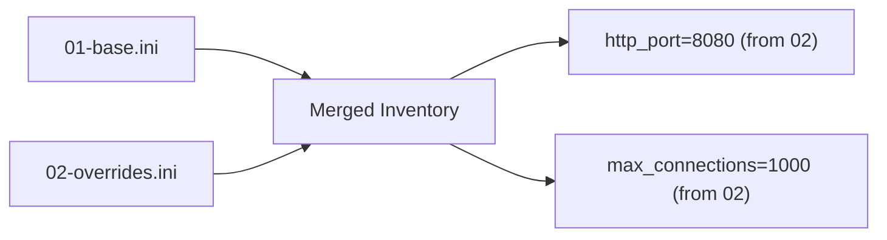

# How to Use Multiple Inventory Files in Ansible

Author: [nawazdhandala](https://www.github.com/nawazdhandala)

Tags: Ansible, Inventory, DevOps, Multi-Environment, Infrastructure

Description: Learn how to use multiple inventory files and directories in Ansible to manage different environments, teams, and infrastructure layers separately.

---

As your Ansible project grows, a single inventory file becomes a bottleneck. Different teams manage different servers, production and staging need separate configurations, and cloud resources live alongside on-premises hardware. Ansible handles this by letting you use multiple inventory files, either by passing several `-i` flags or by pointing to a directory that contains multiple inventory sources.

## Passing Multiple Inventory Files with -i

The simplest approach is passing multiple `-i` arguments on the command line.

```bash
# Use two separate inventory files
ansible-playbook -i inventory/webservers.ini -i inventory/databases.ini site.yml

# Mix formats - one INI, one YAML
ansible-playbook -i inventory/static.ini -i inventory/cloud.yml site.yml
```

Ansible merges all the inventories together. Hosts from all files are available, and you can target any group from any file.

```ini
# inventory/webservers.ini
[webservers]
web1.example.com ansible_host=10.0.1.10
web2.example.com ansible_host=10.0.1.11
```

```ini
# inventory/databases.ini
[databases]
db1.example.com ansible_host=10.0.2.10
db2.example.com ansible_host=10.0.2.11
```

A playbook can now target either group:

```yaml
# site.yml
- hosts: webservers
  tasks:
    - name: Install nginx
      apt:
        name: nginx
        state: present

- hosts: databases
  tasks:
    - name: Install postgresql
      apt:
        name: postgresql-16
        state: present
```

## Using an Inventory Directory

Instead of listing every file with `-i`, point Ansible at a directory. It will load every file inside that directory as an inventory source.

```
inventory/
  01-static-hosts.ini
  02-cloud-hosts.yml
  03-containers.yml
```

```bash
# Load all inventory files from the directory
ansible-playbook -i inventory/ site.yml
```

Ansible processes files in alphabetical order. The numeric prefix (`01-`, `02-`, `03-`) controls the load order, which matters when the same host appears in multiple files (later files can override variables from earlier ones).

```ini
# inventory/01-static-hosts.ini
# On-premises servers that rarely change
[onprem_web]
web-onprem-01.dc.local ansible_host=192.168.1.10
web-onprem-02.dc.local ansible_host=192.168.1.11

[onprem_db]
db-onprem-01.dc.local ansible_host=192.168.1.20
```

```yaml
# inventory/02-cloud-hosts.yml
# AWS cloud servers
all:
  children:
    cloud_web:
      hosts:
        web-aws-01.example.com:
          ansible_host: 10.0.1.10
        web-aws-02.example.com:
          ansible_host: 10.0.1.11
    cloud_db:
      hosts:
        db-aws-01.example.com:
          ansible_host: 10.0.2.10
```

Now a playbook can reference groups from any file:

```yaml
# site.yml
# Target groups from different inventory files
- hosts: onprem_web:cloud_web
  tasks:
    - name: Deploy application to all web servers
      include_role:
        name: webapp
```

## Setting Default Inventory in ansible.cfg

Save yourself from typing `-i` every time by configuring the default inventory path:

```ini
# ansible.cfg
[defaults]
# Point to a directory to load all files inside it
inventory = ./inventory

# Or point to a specific file
# inventory = ./inventory/production.ini
```

With this setting, running `ansible-playbook site.yml` automatically loads everything in the `./inventory` directory.

## Organizing by Environment

The most common pattern is separating inventories by environment.

```
inventories/
  production/
    hosts.ini
    group_vars/
      all.yml
      webservers.yml
      databases.yml
    host_vars/
      web1.example.com.yml
  staging/
    hosts.ini
    group_vars/
      all.yml
      webservers.yml
      databases.yml
    host_vars/
      web-stg-01.example.com.yml
  development/
    hosts.ini
    group_vars/
      all.yml
```

Each environment is self-contained with its own hosts, group_vars, and host_vars. Switch between environments by changing the `-i` path:

```bash
# Deploy to staging
ansible-playbook -i inventories/staging site.yml

# Deploy to production
ansible-playbook -i inventories/production site.yml
```

This prevents accidental cross-environment deployments because the inventories are completely separate.

The environment-specific `group_vars` can have different values:

```yaml
# inventories/production/group_vars/all.yml
env: production
log_level: warn
debug_mode: false
monitoring_enabled: true
```

```yaml
# inventories/staging/group_vars/all.yml
env: staging
log_level: debug
debug_mode: true
monitoring_enabled: false
```

## Organizing by Team or Service

Another pattern splits inventory by team ownership.

```
inventory/
  platform-team/
    hosts.yml
    group_vars/
      kubernetes.yml
      monitoring.yml
  app-team/
    hosts.yml
    group_vars/
      webservers.yml
      workers.yml
  data-team/
    hosts.yml
    group_vars/
      databases.yml
      analytics.yml
```

Load all of them together:

```bash
# Load all team inventories
ansible-playbook -i inventory/ site.yml
```

Or target a specific team's servers:

```bash
# Only load the data team's inventory
ansible-playbook -i inventory/data-team site.yml
```

## Merging Behavior

When multiple inventory sources define the same host or group, Ansible merges them.

```ini
# inventory/01-base.ini
[webservers]
web1.example.com

[webservers:vars]
http_port=80
```

```ini
# inventory/02-overrides.ini
[webservers]
web1.example.com

[webservers:vars]
http_port=8080
max_connections=1000
```

After merging:
- `web1.example.com` is in `webservers` (no duplicates)
- `http_port` is `8080` (later file wins)
- `max_connections` is `1000` (added from second file)

The merge order follows alphabetical filename ordering within the directory.



## Excluding Files from Inventory Directories

Ansible ignores certain file patterns in inventory directories by default:

- Files ending in `~` (backup files)
- Files ending in `.retry`
- Files ending in `.pyc`

You can configure additional exclusion patterns in `ansible.cfg`:

```ini
# ansible.cfg
[inventory]
# Ignore files matching these patterns
ignore_extensions = .bak, .old, .orig, .swp
```

This is important because editors often create backup files that could be accidentally loaded as inventory.

## Combining with Dynamic Inventory

You can mix static files and dynamic inventory scripts in the same directory:

```
inventory/
  01-static.ini           # Static hosts
  02-aws_ec2.yml          # AWS EC2 dynamic inventory plugin
  03-azure_rm.yml         # Azure dynamic inventory plugin
  group_vars/
    all.yml
    webservers.yml
```

Ansible loads everything: static hosts from the INI file, AWS instances from the EC2 plugin, and Azure VMs from the Azure plugin. All hosts are merged and available to your playbooks.

```bash
# All inventory sources are loaded together
ansible-playbook -i inventory/ site.yml
```

## Checking What Gets Loaded

Always verify your merged inventory looks right:

```bash
# List all hosts from all inventory sources
ansible-inventory -i inventory/ --list

# Show the group tree
ansible-inventory -i inventory/ --graph

# Check a specific host's variables after merging
ansible-inventory -i inventory/ --host web1.example.com
```

## Best Practices

1. **Use directories over multiple -i flags.** Directories are easier to manage and do not require remembering command-line arguments.

2. **Prefix files with numbers for ordering.** `01-static.ini`, `02-cloud.yml` makes the load order explicit.

3. **Keep environments separate.** Production and staging should never share an inventory directory. One wrong `--limit` away from disaster.

4. **Document the inventory layout.** When someone new joins the team, they need to know which files exist and why. A simple comment at the top of each file goes a long way.

5. **Test the merged result.** Run `ansible-inventory --list` after making changes to confirm the merge looks correct before running any playbooks.

Multiple inventory files give you the flexibility to grow your Ansible project without turning your inventory into an unmanageable monolith. Split by environment, by team, or by infrastructure type, and let Ansible handle the merging.
