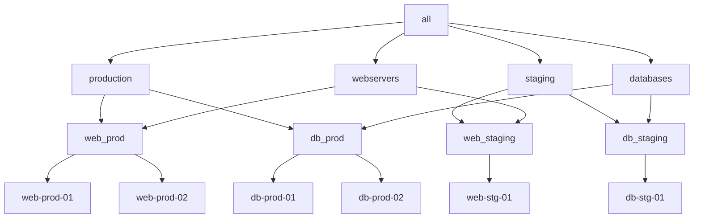

# How to Use Nested Groups in Ansible Inventory

Author: [nawazdhandala](https://www.github.com/nawazdhandala)

Tags: Ansible, Inventory, Nested Groups, DevOps, Infrastructure

Description: Learn how to build multi-level group hierarchies in Ansible inventory for organizing hosts by environment, location, and role with variable inheritance.

---

Nested groups (also called parent-child groups) let you create hierarchical relationships between groups in your Ansible inventory. A parent group automatically includes all hosts from its child groups and passes its variables down the chain. This is essential for organizing infrastructure that has multiple dimensions, like environments, data centers, and application tiers.

## The Basics of Children Groups

In INI format, you use the `:children` suffix to declare that a group contains other groups rather than hosts directly.

```ini
# inventory.ini
# Basic nested group structure

[web_prod]
web-prod-01.example.com
web-prod-02.example.com

[web_staging]
web-stg-01.example.com

[db_prod]
db-prod-01.example.com
db-prod-02.example.com

[db_staging]
db-stg-01.example.com

# Parent group: all production servers
[production:children]
web_prod
db_prod

# Parent group: all staging servers
[staging:children]
web_staging
db_staging

# Parent group: all web servers regardless of environment
[webservers:children]
web_prod
web_staging

# Parent group: all database servers regardless of environment
[databases:children]
db_prod
db_staging
```

Now you can target hosts in multiple ways:

```bash
# Target all production servers
ansible production -i inventory.ini -m ping

# Target all web servers across all environments
ansible webservers -i inventory.ini -m ping

# Target only production web servers
ansible web_prod -i inventory.ini -m ping
```

## Nested Groups in YAML Format

The same structure in YAML is cleaner and easier to scan visually.

```yaml
# inventory.yml
# Multi-dimensional group hierarchy
all:
  children:
    production:
      children:
        web_prod:
          hosts:
            web-prod-01.example.com:
              ansible_host: 10.0.1.10
            web-prod-02.example.com:
              ansible_host: 10.0.1.11
        db_prod:
          hosts:
            db-prod-01.example.com:
              ansible_host: 10.0.2.10
            db-prod-02.example.com:
              ansible_host: 10.0.2.11
      vars:
        env: production
        monitoring_enabled: true

    staging:
      children:
        web_staging:
          hosts:
            web-stg-01.example.com:
              ansible_host: 10.1.1.10
        db_staging:
          hosts:
            db-stg-01.example.com:
              ansible_host: 10.1.2.10
      vars:
        env: staging
        monitoring_enabled: false

    webservers:
      children:
        web_prod:
        web_staging:
      vars:
        ansible_user: webdeploy
        http_port: 80

    databases:
      children:
        db_prod:
        db_staging:
      vars:
        ansible_user: dbadmin
        pg_port: 5432
```

## Visualizing the Group Hierarchy

Use `ansible-inventory --graph` to see the tree:

```bash
# Display the full group hierarchy as a tree
ansible-inventory -i inventory.yml --graph
```

Output:

```
@all:
  |--@production:
  |  |--@web_prod:
  |  |  |--web-prod-01.example.com
  |  |  |--web-prod-02.example.com
  |  |--@db_prod:
  |  |  |--db-prod-01.example.com
  |  |  |--db-prod-02.example.com
  |--@staging:
  |  |--@web_staging:
  |  |  |--web-stg-01.example.com
  |  |--@db_staging:
  |  |  |--db-stg-01.example.com
  |--@webservers:
  |  |--@web_prod:
  |  |  |--web-prod-01.example.com
  |  |  |--web-prod-02.example.com
  |  |--@web_staging:
  |  |  |--web-stg-01.example.com
  |--@databases:
  |  |--@db_prod:
  |  |  |--db-prod-01.example.com
  |  |  |--db-prod-02.example.com
  |  |--@db_staging:
  |  |  |--db-stg-01.example.com
```

Notice that hosts appear under multiple parent groups. `web-prod-01.example.com` shows up under both `production` and `webservers`, which is exactly what we want.

Here is the same hierarchy as a diagram:



## Variable Inheritance in Nested Groups

Variables flow downward from parent to child groups. Child group variables override parent group variables.

```yaml
# group_vars/all.yml
# Global defaults
log_level: info
monitoring_agent: node-exporter

# group_vars/production.yml
# Overrides for production
log_level: warn
backup_enabled: true

# group_vars/staging.yml
# Overrides for staging
log_level: debug
backup_enabled: false

# group_vars/webservers.yml
# Role-specific settings
app_server: nginx
app_port: 80
```

For `web-prod-01.example.com`, which belongs to both `production` and `webservers`, the final variable set merges values from both groups:

```bash
# Check what variables web-prod-01 actually receives
ansible-inventory -i inventory.yml --host web-prod-01.example.com
```

The result includes variables from `all`, `production`, `web_prod`, and `webservers`. When the same variable is defined in multiple groups at the same level, alphabetical order determines which wins (unless you set `ansible_group_priority`).

## Three-Level Nesting for Multi-Region Deployments

Real-world infrastructure often needs three or more levels of nesting.

```yaml
# inventory.yml
# Three-level hierarchy: region -> environment -> role
all:
  children:
    us_east:
      children:
        us_east_prod:
          children:
            us_east_prod_web:
              hosts:
                web-use-prod-01.example.com:
                web-use-prod-02.example.com:
            us_east_prod_db:
              hosts:
                db-use-prod-01.example.com:
          vars:
            env: production
        us_east_staging:
          children:
            us_east_staging_web:
              hosts:
                web-use-stg-01.example.com:
            us_east_staging_db:
              hosts:
                db-use-stg-01.example.com:
          vars:
            env: staging
      vars:
        region: us-east-1
        vpc_cidr: "10.0.0.0/16"

    eu_west:
      children:
        eu_west_prod:
          children:
            eu_west_prod_web:
              hosts:
                web-euw-prod-01.example.com:
                web-euw-prod-02.example.com:
            eu_west_prod_db:
              hosts:
                db-euw-prod-01.example.com:
          vars:
            env: production
      vars:
        region: eu-west-1
        vpc_cidr: "10.1.0.0/16"
```

With this structure you can target hosts at any level:

```bash
# All servers in US East
ansible us_east -i inventory.yml -m ping

# Only production servers in US East
ansible us_east_prod -i inventory.yml -m ping

# Only production web servers in EU West
ansible eu_west_prod_web -i inventory.yml -m ping
```

## Using Nested Groups in Playbooks

Playbooks can reference any group in the hierarchy.

```yaml
# site.yml
# Multi-play playbook targeting different levels of the hierarchy

# Apply base configuration to everything
- hosts: all
  become: true
  roles:
    - common
    - security-baseline

# Configure web servers regardless of environment
- hosts: webservers
  become: true
  roles:
    - nginx
    - app-deploy

# Production-specific hardening
- hosts: production
  become: true
  roles:
    - production-hardening
    - monitoring-full

# Staging gets a lighter monitoring stack
- hosts: staging
  become: true
  roles:
    - monitoring-basic
```

## Combining Group Patterns with Nested Groups

You can use set operations (intersection, union, exclusion) with nested groups for precise targeting.

```bash
# Target hosts that are in BOTH production AND webservers (intersection)
ansible 'production:&webservers' -i inventory.yml -m ping

# Target all production OR all staging servers (union)
ansible 'production:staging' -i inventory.yml -m ping

# Target production servers but NOT database servers (exclusion)
ansible 'production:!databases' -i inventory.yml -m ping
```

These patterns work in playbooks too:

```yaml
# Only run on production web servers using intersection
- hosts: production:&webservers
  become: true
  tasks:
    - name: Deploy production application
      include_role:
        name: app-deploy
      vars:
        deploy_env: production
```

## Common Mistakes with Nested Groups

**Circular references**: Ansible will error if group A is a child of group B and group B is a child of group A. Always build tree structures, not loops.

**Too many levels**: If you go beyond three or four levels of nesting, the inventory becomes hard to reason about. Flatten things out using cross-cutting groups (like `webservers` and `databases`) alongside your hierarchy.

**Forgetting variable precedence**: A child group's variables override the parent's. If you set `log_level: warn` in `production` and `log_level: debug` in `web_prod`, the `web_prod` value wins because it is more specific.

**Naming collisions**: If two groups at the same level define the same variable, Ansible uses alphabetical order. This is confusing. Avoid it by using `ansible_group_priority` or by structuring your groups so that collisions do not happen.

## Best Practices

1. **Design your hierarchy around how you target hosts.** If you frequently need to deploy to "all production web servers," make sure that is a single group target.

2. **Use cross-cutting groups.** Have both environment-based (`production`, `staging`) and role-based (`webservers`, `databases`) hierarchies. Hosts belong to both.

3. **Keep leaf groups small.** The bottom-level groups should contain the actual hosts. Parent groups should only contain children.

4. **Use group_vars directories.** Put variables in `group_vars/production.yml` and `group_vars/webservers.yml` rather than inline in the inventory file.

Nested groups are the key to scaling your Ansible inventory from a handful of servers to hundreds across multiple regions and environments. Get the hierarchy right, and everything else in your automation becomes simpler.
