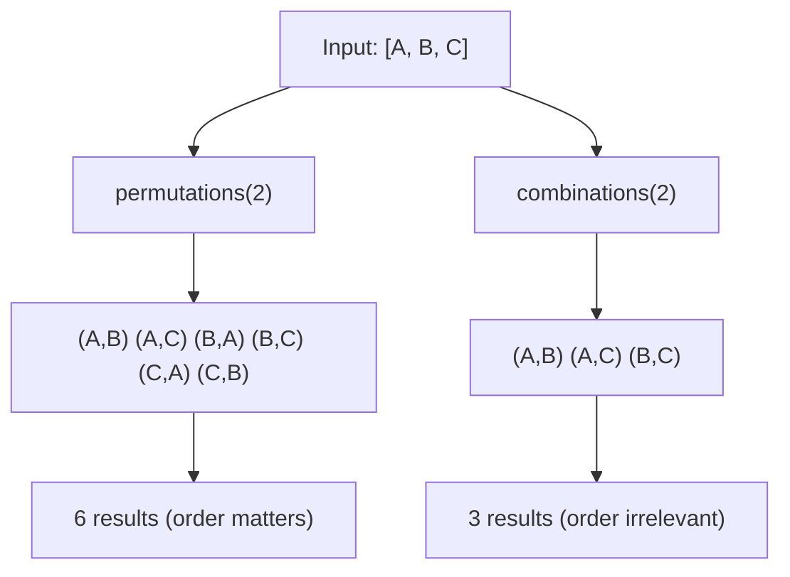

# How to Use permutations and combinations Filters in Ansible

Author: [nawazdhandala](https://www.github.com/nawazdhandala)

Tags: Ansible, Filters, Jinja2, Combinatorics

Description: Learn how to use permutations and combinations filters in Ansible to generate all possible arrangements and selections from lists for testing and configuration.

---

The `permutations` and `combinations` filters in Ansible generate all possible arrangements and selections from a list. These are not everyday filters, but they are remarkably useful for generating test matrices, exhaustive configuration combinations, network connectivity tests, and similar scenarios where you need every possible pairing or grouping.

## Understanding the Difference

Before diving in, let me clarify the difference between permutations and combinations:

- **Permutations**: Order matters. (A, B) is different from (B, A)
- **Combinations**: Order does not matter. (A, B) and (B, A) are the same



## Using the combinations Filter

The `combinations` filter generates all possible unordered selections of a given size:

```yaml
# playbook-combinations.yml
# Generates all possible pairs from a list of servers for connectivity testing
- name: Generate combinations
  hosts: localhost
  gather_facts: false
  vars:
    servers:
      - web-01
      - db-01
      - cache-01
      - monitor-01

  tasks:
    - name: All possible pairs (combinations of 2)
      ansible.builtin.debug:
        msg: "{{ servers | combinations(2) | list }}"

    - name: All possible triples (combinations of 3)
      ansible.builtin.debug:
        msg: "{{ servers | combinations(3) | list }}"

    - name: Count of pairs
      ansible.builtin.debug:
        msg: "{{ servers | combinations(2) | list | length }} unique pairs from {{ servers | length }} servers"
```

Output for pairs:

```json
[
    ["web-01", "db-01"],
    ["web-01", "cache-01"],
    ["web-01", "monitor-01"],
    ["db-01", "cache-01"],
    ["db-01", "monitor-01"],
    ["cache-01", "monitor-01"]
]
```

## Using the permutations Filter

The `permutations` filter generates all possible ordered arrangements:

```yaml
# playbook-permutations.yml
# Generates all possible orderings for a failover priority list
- name: Generate permutations
  hosts: localhost
  gather_facts: false
  vars:
    priorities:
      - primary
      - secondary
      - tertiary

  tasks:
    - name: All possible orderings (permutations of all elements)
      ansible.builtin.debug:
        msg: "{{ priorities | permutations | list }}"

    - name: All ordered pairs (permutations of size 2)
      ansible.builtin.debug:
        msg: "{{ priorities | permutations(2) | list }}"
```

All orderings of 3 elements (3! = 6):

```json
[
    ["primary", "secondary", "tertiary"],
    ["primary", "tertiary", "secondary"],
    ["secondary", "primary", "tertiary"],
    ["secondary", "tertiary", "primary"],
    ["tertiary", "primary", "secondary"],
    ["tertiary", "secondary", "primary"]
]
```

## Practical Example: Network Connectivity Testing

Test connectivity between every pair of servers:

```yaml
# playbook-connectivity.yml
# Tests network connectivity between all server pairs using combinations
- name: Test all pairwise connections
  hosts: localhost
  gather_facts: false
  vars:
    endpoints:
      - name: web-01
        ip: 10.0.1.10
      - name: db-01
        ip: 10.0.2.10
      - name: cache-01
        ip: 10.0.3.10

  tasks:
    - name: Generate all server pairs for testing
      ansible.builtin.set_fact:
        test_pairs: "{{ endpoints | combinations(2) | list }}"

    - name: Show connectivity test plan
      ansible.builtin.debug:
        msg: "Test: {{ item.0.name }} ({{ item.0.ip }}) <-> {{ item.1.name }} ({{ item.1.ip }})"
      loop: "{{ test_pairs }}"
      loop_control:
        label: "{{ item.0.name }} <-> {{ item.1.name }}"
```

## Generating Test Matrices

Use combinations to generate test configurations:

```yaml
# playbook-test-matrix.yml
# Generates a test matrix by creating all 2-element combinations from test parameters
- name: Generate test matrix
  hosts: localhost
  gather_facts: false
  vars:
    python_versions:
      - "3.9"
      - "3.10"
      - "3.11"
      - "3.12"
    os_versions:
      - ubuntu-22.04
      - ubuntu-24.04
      - debian-12

  tasks:
    - name: All OS pair combinations for cross-testing
      ansible.builtin.set_fact:
        os_pairs: "{{ os_versions | combinations(2) | list }}"

    - name: Show OS migration test pairs
      ansible.builtin.debug:
        msg: "Test migration from {{ item.0 }} to {{ item.1 }}"
      loop: "{{ os_pairs }}"

    - name: Show Python version pairs for compatibility testing
      ansible.builtin.debug:
        msg: "Test compatibility: Python {{ item.0 }} vs {{ item.1 }}"
      loop: "{{ python_versions | combinations(2) | list }}"
```

## Directional vs Bidirectional Testing

This is where the choice between permutations and combinations matters:

```yaml
# playbook-directional.yml
# Shows when to use permutations (directional) vs combinations (bidirectional)
- name: Directional vs bidirectional
  hosts: localhost
  gather_facts: false
  vars:
    regions:
      - us-east-1
      - eu-west-1
      - ap-south-1

  tasks:
    - name: Bidirectional latency tests (combinations - test each pair once)
      ansible.builtin.debug:
        msg: "Latency test between {{ item.0 }} and {{ item.1 }}"
      loop: "{{ regions | combinations(2) | list }}"

    - name: Directional replication tests (permutations - direction matters)
      ansible.builtin.debug:
        msg: "Replicate FROM {{ item.0 }} TO {{ item.1 }}"
      loop: "{{ regions | permutations(2) | list }}"
```

Combinations gives 3 pairs (us-eu, us-ap, eu-ap).
Permutations gives 6 pairs (us->eu, eu->us, us->ap, ap->us, eu->ap, ap->eu).

## Load Balancer Configuration

Generate all possible failover configurations:

```yaml
# playbook-failover.yml
# Generates failover priority orderings for load balancer configuration
- name: Generate failover configurations
  hosts: localhost
  gather_facts: false
  vars:
    backend_servers:
      - server-a
      - server-b
      - server-c

  tasks:
    - name: All possible failover orderings
      ansible.builtin.debug:
        msg: |
          Failover Configuration {{ loop_idx + 1 }}:
          
          {{ loop.index }}. {{ server }}
          
      loop: "{{ backend_servers | permutations | list }}"
      loop_control:
        loop_var: ordering
        index_var: loop_idx

    - name: All possible 2-server active-standby pairs
      ansible.builtin.debug:
        msg: "Active: {{ item.0 }}, Standby: {{ item.1 }}"
      loop: "{{ backend_servers | permutations(2) | list }}"
```

## Scaling Considerations

Be careful with large lists. The number of results grows rapidly:

```yaml
# playbook-scaling.yml
# Calculates the size of permutation and combination results before generating them
- name: Understand scaling
  hosts: localhost
  gather_facts: false
  vars:
    items_5: [a, b, c, d, e]
    items_10: [a, b, c, d, e, f, g, h, i, j]

  tasks:
    - name: Show combination counts
      ansible.builtin.debug:
        msg: |
          5 items, choose 2: {{ items_5 | combinations(2) | list | length }} combinations
          5 items, choose 3: {{ items_5 | combinations(3) | list | length }} combinations
          10 items, choose 2: {{ items_10 | combinations(2) | list | length }} combinations

    - name: Show permutation counts
      ansible.builtin.debug:
        msg: |
          5 items, arrange 2: {{ items_5 | permutations(2) | list | length }} permutations
          5 items, all: {{ items_5 | permutations | list | length }} permutations
```

Formula reference:
- Combinations of n choose k: n! / (k! * (n-k)!)
- Permutations of n choose k: n! / (n-k)!

10 items choose 2 gives 45 combinations but 90 permutations. 10 items full permutations gives 3,628,800. Think twice before generating full permutations of large lists.

## Practical Example: Security Audit Pairs

```yaml
# playbook-security-audit.yml
# Creates security audit pairs ensuring every system is audited by every other
- name: Generate security audit schedule
  hosts: localhost
  gather_facts: false
  vars:
    systems:
      - web-tier
      - api-tier
      - database-tier
      - cache-tier
      - monitoring-tier

  tasks:
    - name: Generate audit pairs (each system audits each other system)
      ansible.builtin.set_fact:
        audit_schedule: "{{ systems | combinations(2) | list }}"

    - name: Display audit schedule
      ansible.builtin.debug:
        msg: |
          Security Cross-Audit Schedule:
          Total audits needed: {{ audit_schedule | length }}
          
          Audit {{ loop.index }}: {{ pair.0 }} reviews {{ pair.1 }}
          
```

## Summary

Use `combinations` when order does not matter, like bidirectional network tests or unique pair generation. Use `permutations` when order matters, like failover priorities or directional data flows. Always be mindful of the output size, as these filters can generate large numbers of results from even modest input lists. The most common practical applications are connectivity testing between server pairs, test matrix generation, failover configuration enumeration, and security audit scheduling.
