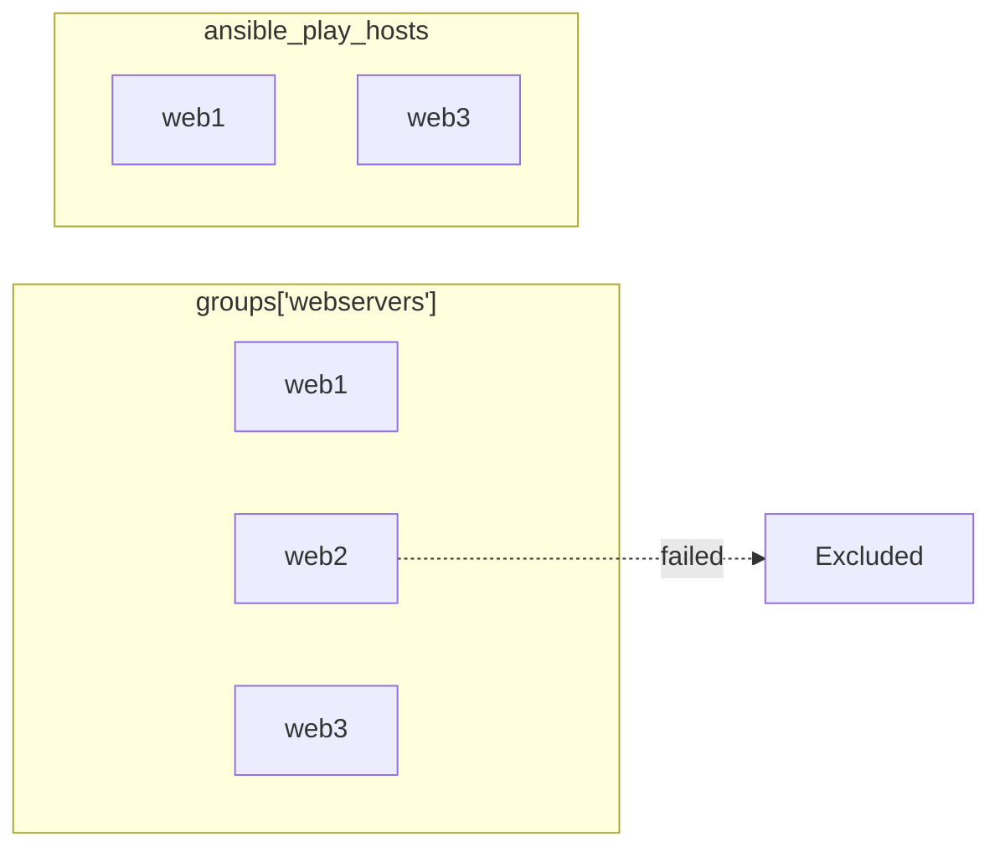

# How to Use play_hosts vs groups in Ansible

Author: [nawazdhandala](https://www.github.com/nawazdhandala)

Tags: Ansible, Special Variables, play_hosts, groups, Inventory

Description: Understand the difference between play_hosts and groups variables in Ansible and learn when to use each for host targeting.

---

When you need to reference a list of hosts inside your Ansible tasks, two variables come up constantly: `ansible_play_hosts` (often shortened to `play_hosts`) and `groups`. They both give you lists of hostnames, but they represent fundamentally different things. Confusing them leads to tasks that target the wrong hosts or break when hosts fail during execution.

## What groups Contains

The `groups` variable is a dictionary that maps group names to lists of hostnames from your inventory. It reflects the static inventory regardless of what is happening during playbook execution. Hosts that have failed, hosts that are unreachable, hosts in other plays that you are not currently targeting - they all show up in `groups`.

```yaml
# inventory/hosts.yml
all:
  children:
    webservers:
      hosts:
        web1:
        web2:
        web3:
    databases:
      hosts:
        db1:
        db2:
    caches:
      hosts:
        cache1:
```

```yaml
# show-groups.yml - Display the groups variable
---
- name: Show groups dictionary
  hosts: webservers
  gather_facts: false
  tasks:
    - name: Print all groups
      ansible.builtin.debug:
        msg:
          - "webservers: {{ groups['webservers'] }}"
          - "databases: {{ groups['databases'] }}"
          - "caches: {{ groups['caches'] }}"
          - "all: {{ groups['all'] }}"
      run_once: true
```

Even though this play targets only `webservers`, the `groups` variable contains every group and every host from the entire inventory.

## What play_hosts Contains

The `ansible_play_hosts` variable contains only the hosts that are active in the current play. "Active" means they matched the `hosts` directive and have not failed or become unreachable during the current play execution.

```yaml
# show-play-hosts.yml - Display play_hosts
---
- name: Show play_hosts
  hosts: webservers
  gather_facts: false
  tasks:
    - name: Print play hosts
      ansible.builtin.debug:
        msg: "play_hosts: {{ ansible_play_hosts }}"
      run_once: true
    # Output: play_hosts: [web1, web2, web3]
```

If `web2` fails on a task, it drops out of `ansible_play_hosts` for all subsequent tasks:

```yaml
# failure-demo.yml - Watch play_hosts change after failure
---
- name: Demonstrate play_hosts with failures
  hosts: webservers
  gather_facts: false
  tasks:
    - name: Hosts before failure
      ansible.builtin.debug:
        msg: "Before: {{ ansible_play_hosts }}"
      run_once: true
    # Output: Before: [web1, web2, web3]

    - name: Simulate failure on web2
      ansible.builtin.fail:
        msg: "Simulated failure"
      when: inventory_hostname == 'web2'

    - name: Hosts after failure
      ansible.builtin.debug:
        msg: "After: {{ ansible_play_hosts }}"
      run_once: true
    # Output: After: [web1, web3]
```

## Side-by-Side Comparison



| Aspect | `groups` | `ansible_play_hosts` |
|---|---|---|
| Source | Static inventory | Current play execution |
| Scope | All groups, all hosts | Current play only |
| Reflects failures | No | Yes |
| Changes during play | No | Yes (hosts drop on failure) |
| Available without gather_facts | Yes | Yes |

## When to Use groups

Use `groups` when you need to reference hosts that are not part of the current play. This is common when configuring services that need to know about other parts of the infrastructure.

```yaml
# cross-group-config.yml - Web servers need to know about database servers
---
- name: Configure web servers with database info
  hosts: webservers
  gather_facts: true
  tasks:
    - name: Template database connection config
      ansible.builtin.template:
        src: db-config.yml.j2
        dest: /opt/app/config/database.yml
        mode: '0640'
      become: true
```

```jinja2
# templates/db-config.yml.j2 - Reference database hosts from groups
database:
  hosts:

    - host: {{ hostvars[db_host]['ansible_default_ipv4']['address'] | default(db_host) }}
      port: 5432
      role: {{ hostvars[db_host].get('db_role', 'replica') }}

  pool_size: 10
```

Also use `groups` when building configuration that needs to list all members of a cluster, regardless of whether they are currently being processed:

```yaml
# etcd-cluster.yml - All etcd members need to know about each other
---
- name: Configure etcd cluster
  hosts: etcd_cluster
  gather_facts: true
  tasks:
    - name: Generate etcd member list
      ansible.builtin.set_fact:
        etcd_initial_cluster: >-
          {{ groups['etcd_cluster'] | map('regex_replace', '^(.*)$',
             '\1=https://\1:2380') | join(',') }}

    - name: Template etcd configuration
      ansible.builtin.template:
        src: etcd.conf.j2
        dest: /etc/etcd/etcd.conf
        mode: '0644'
      become: true
```

## When to Use play_hosts

Use `ansible_play_hosts` when you need to coordinate actions only among hosts that are still healthy in the current play. This is essential for tasks like leader election, quorum checks, or conditional deployment stops.

```yaml
# quorum-check.yml - Only proceed if enough hosts are healthy
---
- name: Rolling update with quorum check
  hosts: app_cluster
  serial: 1
  gather_facts: false
  tasks:
    - name: Check cluster quorum
      ansible.builtin.assert:
        that:
          - ansible_play_hosts | length >= (groups['app_cluster'] | length * 0.5) | int
        fail_msg: >
          Quorum lost! Only {{ ansible_play_hosts | length }} of
          {{ groups['app_cluster'] | length }} hosts are healthy.
          Stopping deployment.
      run_once: true

    - name: Deploy update
      ansible.builtin.copy:
        src: /releases/latest/
        dest: /opt/app/
        mode: '0755'
      become: true

    - name: Restart service
      ansible.builtin.systemd:
        name: myapp
        state: restarted
      become: true
```

## Combining groups and play_hosts

Sometimes you need both. For example, generating a configuration file that lists all cluster members but marks the currently failing ones:

```yaml
# combined-usage.yml - Use both variables together
---
- name: Generate status-aware configuration
  hosts: app_cluster
  gather_facts: true
  tasks:
    - name: Build member status list
      ansible.builtin.set_fact:
        cluster_status: >-
          {{ groups['app_cluster'] | map('regex_replace', '^(.*)$',
             '{"host": "\1", "active": ' +
             (('\1' in ansible_play_hosts) | string | lower) + '}')
             | map('from_json') | list }}
      run_once: true

    - name: Display cluster status
      ansible.builtin.debug:
        var: cluster_status
      run_once: true
```

## Using group_names (the Host Perspective)

While `groups` gives you a top-down view (group to hosts), `group_names` gives you the bottom-up view (which groups does this host belong to):

```yaml
# group-names.yml - Check which groups the current host belongs to
---
- name: Conditional tasks based on group membership
  hosts: all
  gather_facts: false
  tasks:
    - name: Show my groups
      ansible.builtin.debug:
        msg: "{{ inventory_hostname }} belongs to: {{ group_names }}"

    - name: Run only on database servers
      ansible.builtin.debug:
        msg: "This host is a database server"
      when: "'databases' in group_names"

    - name: Run on hosts that are both web and monitoring
      ansible.builtin.debug:
        msg: "This host handles both web and monitoring"
      when:
        - "'webservers' in group_names"
        - "'monitoring' in group_names"
```

## Delegated Tasks: Which Variable to Use

When using `delegate_to`, be careful about which host list variable you reference. Inside a delegated task, `inventory_hostname` is still the original host, not the delegate target. Similarly, `ansible_play_hosts` reflects the original play targets.

```yaml
# delegation-clarity.yml
---
- name: Delegation with host references
  hosts: webservers
  gather_facts: false
  tasks:
    - name: Register each webserver in the load balancer
      ansible.builtin.uri:
        url: "http://lb.internal/api/register"
        method: POST
        body_format: json
        body:
          hostname: "{{ inventory_hostname }}"
          all_backends: "{{ ansible_play_hosts }}"
      delegate_to: localhost
      # inventory_hostname = current web server (web1, web2, etc.)
      # ansible_play_hosts = all active web servers
      # This task runs on localhost but references web server data
```

## Best Practices

Use `groups` for cross-group references and static infrastructure knowledge. Use `ansible_play_hosts` for runtime awareness of which hosts are still operational. Use `group_names` when you need to check group membership from a host's perspective. Never assume `groups['some_group']` and `ansible_play_hosts` contain the same list since they only overlap when the play targets that exact group and no hosts have failed. When building cluster configurations, prefer `groups` for the member list since you usually want all intended members, not just the currently reachable ones.

Getting this distinction right is the difference between a deployment that gracefully handles failures and one that generates broken configurations when a single host goes down.
