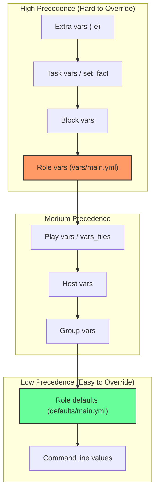
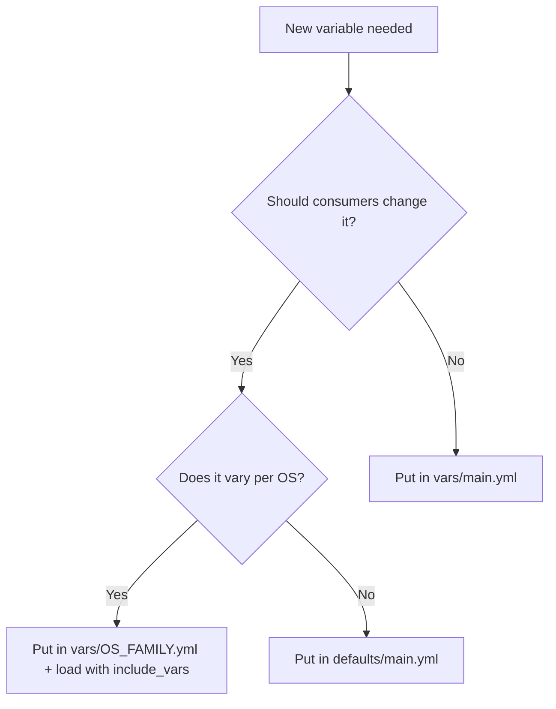

# How to Use Role Defaults vs Role Vars Best Practices

Author: [nawazdhandala](https://www.github.com/nawazdhandala)

Tags: Ansible, Roles, Variables, Best Practices

Description: Understand the critical differences between role defaults and role vars in Ansible with practical guidelines for when to use each.

---

The distinction between `defaults/main.yml` and `vars/main.yml` in an Ansible role trips up a lot of people. Both files define variables, both are auto-loaded, and both are YAML. But they sit at completely different positions in Ansible's variable precedence hierarchy, which means using the wrong one can make your role either impossible to customize or impossible to control. This post lays out clear rules for deciding where each variable belongs.

## The Fundamental Difference

The entire difference comes down to precedence:

- **defaults/main.yml**: Precedence level 2 (near the bottom). Almost anything overrides these.
- **vars/main.yml**: Precedence level 18 (near the top). Almost nothing overrides these.



## The Rule of Thumb

**Defaults = public API. Vars = private internals.**

If a consumer of your role should be able to change a value, put it in `defaults/`. If a value is an internal implementation detail that should not change, put it in `vars/`.

## What Belongs in defaults/main.yml

These are settings the role consumer should configure:

```yaml
# roles/postgresql/defaults/main.yml
# PUBLIC API - consumers of this role can override these
---
# Application-level settings
postgresql_version: "15"
postgresql_port: 5432
postgresql_listen_addresses: "localhost"

# Performance tuning
postgresql_max_connections: 100
postgresql_shared_buffers: "256MB"
postgresql_effective_cache_size: "1GB"
postgresql_work_mem: "4MB"

# Replication settings
postgresql_replication_enabled: false
postgresql_replication_user: "replicator"

# Authentication
postgresql_hba_entries:
  - type: local
    database: all
    user: all
    method: peer
  - type: host
    database: all
    user: all
    address: "127.0.0.1/32"
    method: scram-sha-256

# Feature flags
postgresql_install_contrib: true
postgresql_configure_logrotate: true
postgresql_enable_pg_stat_statements: false
```

## What Belongs in vars/main.yml

These are internal constants that should stay fixed:

```yaml
# roles/postgresql/vars/main.yml
# INTERNAL CONSTANTS - do not override these externally
---
# System paths (derived from version)
postgresql_config_path: "/etc/postgresql/{{ postgresql_version }}/main"
postgresql_data_path: "/var/lib/postgresql/{{ postgresql_version }}/main"
postgresql_bin_path: "/usr/lib/postgresql/{{ postgresql_version }}/bin"

# Service name
postgresql_service_name: "postgresql"

# Config file names (these never change)
postgresql_config_file: "{{ postgresql_config_path }}/postgresql.conf"
postgresql_hba_file: "{{ postgresql_config_path }}/pg_hba.conf"
postgresql_ident_file: "{{ postgresql_config_path }}/pg_ident.conf"

# System user (must match what the package creates)
postgresql_system_user: "postgres"
postgresql_system_group: "postgres"
```

## Real-World Decision Examples

Let's walk through some common variables and decide where they belong:

### Port Number -> defaults/

```yaml
# Different environments need different ports
# Put in defaults/ so consumers can change it
myapp_port: 8080
```

A DBA might run PostgreSQL on port 5433 in dev to avoid conflicting with a local instance. A web admin might run Nginx on 8080 behind a reverse proxy. Ports are always configurable.

### Package Names -> vars/

```yaml
# Package names are facts about the OS, not configuration choices
# Put in vars/ because they must match what the repo provides
nginx_packages:
  - nginx
  - nginx-common
```

Nobody should override the package name. If they need a different package (like `nginx-extras`), that should be a separate variable in defaults with a flag.

### File Paths -> vars/ (usually)

```yaml
# Paths determined by the package manager - put in vars/
postgresql_config_dir: "/etc/postgresql/{{ postgresql_version }}/main"
```

Exception: install directories for custom software can go in defaults:

```yaml
# Custom software install path - user might want /opt or /usr/local
# Put in defaults/
myapp_install_dir: "/opt/myapp"
```

### Feature Flags -> defaults/

```yaml
# Boolean flags that control optional behavior - always defaults/
myapp_enable_monitoring: true
myapp_enable_tls: false
myapp_configure_firewall: true
```

### Computed Values -> vars/

```yaml
# Values derived from other variables - vars/
myapp_download_url: "https://releases.example.com/{{ myapp_version }}/myapp.tar.gz"
myapp_binary_path: "{{ myapp_install_dir }}/bin/myapp"
myapp_systemd_unit: "/etc/systemd/system/{{ myapp_service_name }}.service"
```

## The Override Test

Ask yourself: "If a consumer overrides this variable, will it break the role?"

- If yes -> `vars/main.yml`
- If no -> `defaults/main.yml`

Examples:

| Variable | Override breaks role? | Location |
|----------|----------------------|----------|
| app_port | No | defaults/ |
| app_config_file_path | Yes (tasks reference this) | vars/ |
| app_version | No | defaults/ |
| app_service_name | Yes (handlers reference this) | vars/ |
| app_max_connections | No | defaults/ |
| app_package_name | Yes (install task needs it) | vars/ |

Wait, actually `app_service_name` could be an interesting case. If users might need to change it (maybe they renamed the service), it belongs in defaults. If it is determined by the package and must not change, it belongs in vars. Context matters.

## OS-Specific Variables in vars/

One of the strongest use cases for `vars/` is platform-specific values:

```yaml
# roles/nginx/vars/Debian.yml
---
nginx_package: nginx
nginx_user: www-data
nginx_modules_path: /etc/nginx/modules-enabled

# roles/nginx/vars/RedHat.yml
---
nginx_package: nginx
nginx_user: nginx
nginx_modules_path: /usr/share/nginx/modules
```

These are loaded with `include_vars` based on `ansible_os_family`:

```yaml
# roles/nginx/tasks/main.yml
- name: Load OS-specific variables
  ansible.builtin.include_vars: "{{ ansible_os_family }}.yml"
```

Variables loaded by `include_vars` have even higher precedence than `vars/main.yml`, which makes them perfect for platform-specific overrides.

## Anti-Pattern: Everything in defaults/

Some role authors put everything in `defaults/main.yml` for "maximum flexibility":

```yaml
# defaults/main.yml - BAD: internal constants exposed as defaults
---
postgresql_version: "15"
postgresql_port: 5432
postgresql_config_path: "/etc/postgresql/15/main"    # BAD
postgresql_service_name: "postgresql"                  # BAD
postgresql_system_user: "postgres"                     # BAD
postgresql_hba_file: "/etc/postgresql/15/main/pg_hba.conf"  # BAD
```

The problem: a consumer might accidentally override `postgresql_system_user` to something other than "postgres", causing the role to fail in confusing ways. The user and file paths are not meant to be configured; they are determined by how PostgreSQL is packaged.

## Anti-Pattern: Everything in vars/

The opposite mistake is putting configurable values in `vars/main.yml`:

```yaml
# vars/main.yml - BAD: user-facing settings locked at high precedence
---
postgresql_port: 5432                    # BAD: user should be able to change this
postgresql_max_connections: 100          # BAD: this is a tuning parameter
postgresql_shared_buffers: "256MB"       # BAD: DBA should tune this
```

Now consumers cannot override these from their inventory or playbook vars because `vars/main.yml` has higher precedence. They would need to use extra vars (`-e`) for every override, which is cumbersome.

## Documenting the Interface

Since `defaults/main.yml` is the public API of your role, document every variable:

```yaml
# roles/myapp/defaults/main.yml
---
# The version of the application to install.
# Check https://releases.example.com for available versions.
myapp_version: "2.5.0"

# TCP port the application listens on.
# Must be above 1024 when running as a non-root user.
myapp_port: 8080

# Log level for the application.
# Valid values: debug, info, warn, error
myapp_log_level: "info"

# Set to true to enable TLS/SSL.
# When enabled, you must also set myapp_tls_cert and myapp_tls_key.
myapp_enable_tls: false
```

The `vars/main.yml` file can have minimal documentation since it is not the consumer-facing interface:

```yaml
# roles/myapp/vars/main.yml
# Internal constants - see defaults/main.yml for configurable values
---
myapp_config_path: "/etc/myapp/config.yml"
myapp_binary_path: "/opt/myapp/bin/myapp"
```

## Quick Decision Flowchart



## Wrapping Up

The defaults vs vars distinction is one of the most important design decisions in an Ansible role. Defaults are your public API, offering sensible values that consumers can customize. Vars are your private implementation, holding constants that must remain stable for the role to function correctly. Getting this right makes your role easy to use, hard to break, and clear about what is configurable. If you remember nothing else: defaults for what consumers change, vars for what the role needs internally.
