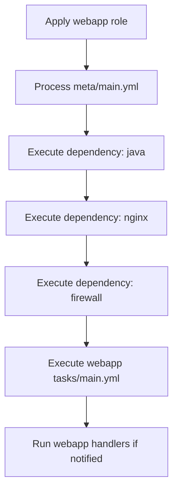

# How to Use Role Meta Dependencies in Ansible

Author: [nawazdhandala](https://www.github.com/nawazdhandala)

Tags: Ansible, Roles, Dependencies, Meta

Description: Learn how to declare and manage role dependencies in Ansible using meta/main.yml for automatic dependency resolution and execution.

---

When you build Ansible roles that depend on other roles, you need a way to express those dependencies so they are resolved automatically. The `meta/main.yml` file in a role lets you declare dependencies that Ansible will install and execute before running the role itself. This post covers how to define dependencies, pass variables to them, control duplicate execution, and avoid common pitfalls.

## Where Dependencies Are Declared

Dependencies live in the `meta/main.yml` file of your role:

```
roles/
  webapp/
    meta/
      main.yml    <-- declare dependencies here
    tasks/
      main.yml
    defaults/
      main.yml
```

## Basic Dependency Declaration

Here is a simple example. A webapp role that depends on a java role and an nginx role:

```yaml
# roles/webapp/meta/main.yml
# This role requires Java and Nginx to be installed first
---
galaxy_info:
  author: nawazdhandala
  description: Deploys a Java web application behind Nginx
  license: MIT
  min_ansible_version: "2.14"

dependencies:
  - role: java
  - role: nginx
```

When you apply the `webapp` role to a host, Ansible will first apply `java`, then `nginx`, and finally `webapp` itself. This happens automatically without you needing to list all three roles in your playbook.

## Passing Variables to Dependencies

You can pass variables to dependent roles to customize their behavior:

```yaml
# roles/webapp/meta/main.yml
# Pass specific configuration values to each dependency
---
dependencies:
  - role: java
    vars:
      java_version: "17"
      java_install_type: "jdk"

  - role: nginx
    vars:
      nginx_worker_processes: 4
      nginx_enable_ssl: true
      nginx_ssl_cert: "/etc/ssl/certs/webapp.crt"
      nginx_ssl_key: "/etc/ssl/private/webapp.key"

  - role: firewall
    vars:
      firewall_allowed_ports:
        - 80
        - 443
        - 8080
```

This is powerful because it lets you compose roles with specific configurations. The `webapp` role knows exactly what it needs from its dependencies and configures them accordingly.

## Execution Order

Dependencies are processed in the order they are listed, and they are fully executed before the parent role starts. Here is the execution flow:



If a dependency itself has dependencies, those are resolved recursively. For example, if the `nginx` role depends on a `common` role, the order would be: common, java, common (again for nginx), nginx, firewall, webapp. But wait, that brings up an important topic.

## Duplicate Dependency Execution

By default, Ansible deduplicates role execution. If two roles both depend on the `common` role with the same parameters, `common` only runs once. This is usually what you want.

However, if the parameters differ, Ansible treats them as separate invocations and runs the role multiple times:

```yaml
# roles/app1/meta/main.yml
dependencies:
  - role: firewall
    vars:
      firewall_allowed_ports: [8080]

# roles/app2/meta/main.yml
dependencies:
  - role: firewall
    vars:
      firewall_allowed_ports: [9090]
```

If both `app1` and `app2` are applied to the same host, the `firewall` role runs twice: once with port 8080 and once with port 9090.

## Controlling Duplicate Execution with allow_duplicates

If you want a role to always run, even when called with the same parameters, set `allow_duplicates` in its meta:

```yaml
# roles/firewall/meta/main.yml
# Allow this role to run multiple times on the same host
---
allow_duplicates: true

galaxy_info:
  author: nawazdhandala
  description: Configures firewall rules
  license: MIT
```

Use this carefully. Most roles should not allow duplicates because running them twice could produce unexpected results.

## Using Galaxy Roles as Dependencies

Dependencies can reference roles from Ansible Galaxy or from Git repositories:

```yaml
# roles/webapp/meta/main.yml
# Mix local roles with Galaxy roles as dependencies
---
dependencies:
  - role: geerlingguy.java
    vars:
      java_packages:
        - openjdk-17-jdk

  - role: geerlingguy.nginx
    vars:
      nginx_vhosts:
        - listen: "80"
          server_name: "app.example.com"
          root: "/var/www/app"
```

For this to work, the Galaxy roles must be installed first (via `ansible-galaxy install` or a `requirements.yml` file).

## Conditional Dependencies

As of Ansible 2.14, you cannot use `when` conditions directly on meta dependencies. Dependencies are always executed. If you need conditional dependency behavior, you have two options.

Option 1: Use a feature flag variable in the dependent role:

```yaml
# roles/webapp/meta/main.yml
dependencies:
  - role: monitoring
    vars:
      monitoring_enabled: "{{ webapp_enable_monitoring | default(true) }}"
```

```yaml
# roles/monitoring/tasks/main.yml
# Skip all tasks if monitoring is disabled
---
- name: Install monitoring agent
  ansible.builtin.apt:
    name: monitoring-agent
    state: present
  when: monitoring_enabled | bool
```

Option 2: Use `include_role` in tasks instead of meta dependencies (which supports `when`):

```yaml
# roles/webapp/tasks/main.yml
---
- name: Include monitoring role conditionally
  ansible.builtin.include_role:
    name: monitoring
  when: webapp_enable_monitoring | default(true) | bool
```

## Nested Dependencies

Dependencies can be nested to any depth. Consider this chain:

```yaml
# roles/webapp/meta/main.yml
dependencies:
  - role: tomcat

# roles/tomcat/meta/main.yml
dependencies:
  - role: java

# roles/java/meta/main.yml
dependencies:
  - role: common
```

Applying `webapp` triggers: common -> java -> tomcat -> webapp. Ansible resolves the full tree before execution begins.

## Practical Example: Multi-Tier Application

Here is a realistic example of how meta dependencies work across an application stack:

```yaml
# roles/common/meta/main.yml
---
dependencies: []
galaxy_info:
  description: Base system configuration
```

```yaml
# roles/common/tasks/main.yml
---
- name: Update package cache
  ansible.builtin.apt:
    update_cache: yes
    cache_valid_time: 3600

- name: Install common packages
  ansible.builtin.apt:
    name:
      - curl
      - vim
      - htop
      - unzip
    state: present

- name: Set timezone
  community.general.timezone:
    name: "{{ common_timezone | default('UTC') }}"
```

```yaml
# roles/postgresql/meta/main.yml
---
dependencies:
  - role: common

galaxy_info:
  description: PostgreSQL database server
```

```yaml
# roles/redis/meta/main.yml
---
dependencies:
  - role: common

galaxy_info:
  description: Redis cache server
```

```yaml
# roles/webapp/meta/main.yml
# Full application stack - all dependencies resolved automatically
---
dependencies:
  - role: common
  - role: postgresql
    vars:
      postgresql_databases:
        - name: webapp_production
      postgresql_users:
        - name: webapp
          password: "{{ vault_db_password }}"
  - role: redis
    vars:
      redis_maxmemory: "512mb"
  - role: nginx
    vars:
      nginx_proxy_pass: "http://localhost:8080"

galaxy_info:
  description: Full web application stack
```

In this setup, applying the `webapp` role to a host installs and configures the entire stack: common utilities, PostgreSQL, Redis, Nginx, and then the application itself. The `common` role is called by multiple dependencies but only runs once (because the parameters are the same each time).

## Viewing the Dependency Tree

You can see how Ansible resolves dependencies by running your playbook with increased verbosity:

```bash
# Show dependency resolution with verbose output
ansible-playbook site.yml -v
```

The output shows the order in which roles are applied, including dependencies.

## Wrapping Up

Meta dependencies in Ansible roles let you build composable infrastructure. Instead of writing massive playbooks that list every role in the right order, you declare what each role needs, and Ansible figures out the execution order. The key things to remember: dependencies are declared in `meta/main.yml`, they execute before the parent role, you can pass variables to customize them, and Ansible deduplicates identical invocations by default. Use meta dependencies to keep your playbooks clean and let your roles declare their own requirements.
