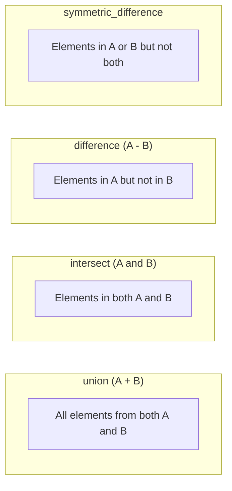

# How to Use Set Operations (union, intersect, difference) in Ansible

Author: [nawazdhandala](https://www.github.com/nawazdhandala)

Tags: Ansible, Set Operations, Filters, Data Manipulation

Description: Learn how to use union, intersect, difference, and symmetric_difference set operations in Ansible for comparing and combining lists effectively.

---

Set operations are incredibly useful when you need to compare lists, find common elements, or compute what has changed between two states. Ansible provides four set operation filters: `union`, `intersect`, `difference`, and `symmetric_difference`. These work just like their mathematical counterparts and come in handy for configuration management, drift detection, and reconciliation tasks.

## The Four Set Operations

Before diving into code, here is a quick refresher on what each operation does:



## Union: Combining Two Lists

The `union` filter merges two lists and removes duplicates:

```yaml
# playbook-union.yml
# Combines two package lists into one deduplicated list
- name: Demonstrate union operation
  hosts: localhost
  gather_facts: false
  vars:
    base_packages:
      - vim
      - curl
      - wget
      - git
    extra_packages:
      - git
      - htop
      - tmux
      - curl

  tasks:
    - name: Get combined unique package list
      ansible.builtin.set_fact:
        all_packages: "{{ base_packages | union(extra_packages) }}"

    - name: Show result
      ansible.builtin.debug:
        var: all_packages
```

Output: `["vim", "curl", "wget", "git", "htop", "tmux"]`

Notice that `git` and `curl` appear only once even though they were in both lists.

## Intersect: Finding Common Elements

The `intersect` filter returns only elements that appear in both lists:

```yaml
# playbook-intersect.yml
# Finds packages that appear in both the required and installed lists
- name: Demonstrate intersect operation
  hosts: localhost
  gather_facts: false
  vars:
    required_packages:
      - nginx
      - postgresql
      - redis
      - certbot
    installed_packages:
      - nginx
      - vim
      - redis
      - curl
      - git

  tasks:
    - name: Find packages that are both required and installed
      ansible.builtin.set_fact:
        already_installed: "{{ required_packages | intersect(installed_packages) }}"

    - name: Show common packages
      ansible.builtin.debug:
        msg: "Already installed: {{ already_installed }}"
```

Output: `["nginx", "redis"]`

## Difference: Finding Missing Elements

The `difference` filter returns elements in the first list that are NOT in the second:

```yaml
# playbook-difference.yml
# Finds required packages that are not yet installed
- name: Demonstrate difference operation
  hosts: localhost
  gather_facts: false
  vars:
    required_packages:
      - nginx
      - postgresql
      - redis
      - certbot
    installed_packages:
      - nginx
      - vim
      - redis
      - curl

  tasks:
    - name: Find packages that still need to be installed
      ansible.builtin.set_fact:
        missing_packages: "{{ required_packages | difference(installed_packages) }}"

    - name: Find extra packages not in required list
      ansible.builtin.set_fact:
        extra_packages: "{{ installed_packages | difference(required_packages) }}"

    - name: Show results
      ansible.builtin.debug:
        msg:
          need_to_install: "{{ missing_packages }}"
          could_remove: "{{ extra_packages }}"
```

Output:

```
need_to_install: ["postgresql", "certbot"]
could_remove: ["vim", "curl"]
```

## Symmetric Difference: Elements Unique to Each List

The `symmetric_difference` filter returns elements that are in either list but not in both:

```yaml
# playbook-symmetric-diff.yml
# Finds all elements unique to either list (not shared)
- name: Demonstrate symmetric difference
  hosts: localhost
  gather_facts: false
  vars:
    list_a:
      - alpha
      - bravo
      - charlie
      - delta
    list_b:
      - bravo
      - delta
      - echo
      - foxtrot

  tasks:
    - name: Find elements unique to either list
      ansible.builtin.set_fact:
        unique_to_either: "{{ list_a | symmetric_difference(list_b) }}"

    - name: Show result
      ansible.builtin.debug:
        var: unique_to_either
```

Output: `["alpha", "charlie", "echo", "foxtrot"]`

## Practical Example: User Account Reconciliation

This is a real-world scenario where set operations shine. You want to ensure that user accounts on a server match a desired state:

```yaml
# playbook-user-reconcile.yml
# Reconciles actual system users against a desired list using set operations
- name: Reconcile user accounts
  hosts: all
  become: true
  vars:
    desired_users:
      - alice
      - bob
      - carol
      - david
      - eve

  tasks:
    - name: Get current users with UID >= 1000
      ansible.builtin.shell: |
        awk -F: '$3 >= 1000 && $3 < 65534 {print $1}' /etc/passwd
      register: current_users_raw
      changed_when: false

    - name: Parse current user list
      ansible.builtin.set_fact:
        current_users: "{{ current_users_raw.stdout_lines }}"

    - name: Calculate user changes needed
      ansible.builtin.set_fact:
        users_to_add: "{{ desired_users | difference(current_users) }}"
        users_to_remove: "{{ current_users | difference(desired_users) }}"
        users_already_present: "{{ desired_users | intersect(current_users) }}"

    - name: Report planned changes
      ansible.builtin.debug:
        msg:
          add: "{{ users_to_add }}"
          remove: "{{ users_to_remove }}"
          no_change: "{{ users_already_present }}"

    - name: Create missing users
      ansible.builtin.user:
        name: "{{ item }}"
        state: present
        create_home: true
      loop: "{{ users_to_add }}"

    - name: Remove unauthorized users
      ansible.builtin.user:
        name: "{{ item }}"
        state: absent
        remove: true
      loop: "{{ users_to_remove }}"
```

## Combining Set Operations

You can chain set operations for more complex logic:

```yaml
# playbook-chain-sets.yml
# Chains multiple set operations to compute a final package list
- name: Chain set operations
  hosts: localhost
  gather_facts: false
  vars:
    team_a_packages:
      - docker
      - kubernetes-cli
      - helm
      - terraform
    team_b_packages:
      - docker
      - ansible
      - terraform
      - packer
    blacklisted:
      - packer

  tasks:
    - name: Get all needed packages minus blacklisted ones
      ansible.builtin.set_fact:
        final_packages: >-
          {{ team_a_packages | union(team_b_packages) | difference(blacklisted) | sort }}

    - name: Show final package list
      ansible.builtin.debug:
        var: final_packages
```

Output: `["ansible", "docker", "helm", "kubernetes-cli", "terraform"]`

## Configuration Drift Detection

Set operations are perfect for detecting configuration drift:

```yaml
# playbook-drift-detection.yml
# Detects drift between desired and actual firewall rules
- name: Detect configuration drift
  hosts: firewalls
  vars:
    desired_ports:
      - 22
      - 80
      - 443
      - 8080

  tasks:
    - name: Get currently open ports
      ansible.builtin.shell: |
        firewall-cmd --list-ports | tr ' ' '\n' | sed 's|/tcp||'
      register: open_ports_raw
      changed_when: false

    - name: Parse port numbers
      ansible.builtin.set_fact:
        actual_ports: "{{ open_ports_raw.stdout_lines | map('int') | list }}"

    - name: Detect drift
      ansible.builtin.set_fact:
        ports_missing: "{{ desired_ports | difference(actual_ports) }}"
        ports_extra: "{{ actual_ports | difference(desired_ports) }}"
        drift_detected: >-
          {{ (desired_ports | difference(actual_ports) | length > 0) or
             (actual_ports | difference(desired_ports) | length > 0) }}

    - name: Report drift status
      ansible.builtin.debug:
        msg: |
          Drift detected: {{ drift_detected }}
          Missing ports: {{ ports_missing }}
          Extra ports: {{ ports_extra }}
```

## Working with Set Operations on Dictionaries

Set operations work on simple values (strings, numbers). For lists of dictionaries, you need to extract the key you want to compare:

```yaml
# playbook-dict-sets.yml
# Compares server names between two inventory sources
- name: Set operations on dictionary lists
  hosts: localhost
  gather_facts: false
  vars:
    inventory_a:
      - name: web-01
        ip: 10.0.1.10
      - name: db-01
        ip: 10.0.2.10
    inventory_b:
      - name: web-01
        ip: 10.0.1.10
      - name: cache-01
        ip: 10.0.3.10

  tasks:
    - name: Find hostnames unique to inventory A
      ansible.builtin.set_fact:
        only_in_a: >-
          {{ inventory_a | map(attribute='name') | list |
             difference(inventory_b | map(attribute='name') | list) }}

    - name: Show unique to A
      ansible.builtin.debug:
        var: only_in_a
```

## Summary

The four set operations, `union`, `intersect`, `difference`, and `symmetric_difference`, cover all the basic comparison needs you will encounter in Ansible. Use `union` to combine lists without duplicates, `intersect` to find commonalities, `difference` to identify what is missing or extra, and `symmetric_difference` to find everything that does not overlap. These filters are especially powerful for reconciliation tasks, drift detection, and building consolidated lists from multiple sources. Chain them together for complex logic, and remember that they work on flat lists of comparable values.
