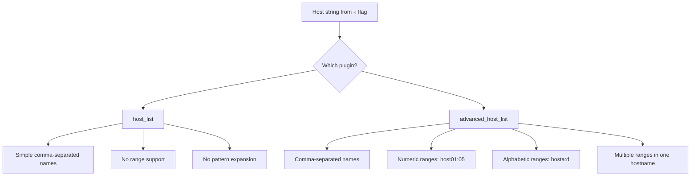

# How to Use the advanced_host_list Inventory Plugin in Ansible

Author: [nawazdhandala](https://www.github.com/nawazdhandala)

Tags: Ansible, Inventory Plugin, CLI, Quick Commands

Description: Learn how to use the advanced_host_list inventory plugin in Ansible for quick ad-hoc commands with comma-separated host lists and patterns.

---

The `advanced_host_list` inventory plugin lets you pass hosts directly on the command line without needing an inventory file at all. It supports comma-separated host lists, ranges, and patterns. This is useful for quick one-off commands, testing, and situations where creating an inventory file is overkill.

## What advanced_host_list Does

This plugin parses a string of hosts passed directly to the `-i` flag. Unlike the basic `host_list` plugin (which only handles simple comma-separated names), the `advanced_host_list` plugin supports patterns and ranges similar to what you would write in an INI inventory file.

## Basic Usage

The simplest use is passing a comma-separated list of hosts:

```bash
# Run a command on three specific hosts (note the trailing comma for single hosts)
ansible -i 'web01.example.com,web02.example.com,web03.example.com,' all -m ping

# Run on a single host (trailing comma tells Ansible this is a host list, not a file)
ansible -i 'web01.example.com,' all -m command -a "uptime"
```

The trailing comma is important. Without it, Ansible interprets the string as an inventory file path and tries to open it as a file.

## Enabling the Plugin

The `advanced_host_list` plugin ships with Ansible but might not be enabled by default. Add it to your `ansible.cfg`:

```ini
# ansible.cfg
[inventory]
enable_plugins = ansible.builtin.advanced_host_list, ansible.builtin.yaml, ansible.builtin.ini, ansible.builtin.host_list
```

The ordering matters. Plugins are tried in order, and you want `advanced_host_list` to be checked before `host_list` to get the expanded feature set.

## Range Patterns

The main advantage over the basic `host_list` plugin is range support. You can specify numeric and alphabetic ranges:

```bash
# Numeric range: expands to web01, web02, web03, web04, web05
ansible -i 'web[01:05].example.com,' all -m ping

# Alphabetic range: expands to web-a, web-b, web-c, web-d
ansible -i 'web-[a:d].example.com,' all -m ping

# Multiple ranges: generates 12 hosts (3 DCs x 4 hosts)
ansible -i 'dc[1:3]-web[01:04].example.com,' all -m ping
```

Here is what the numeric range expands to:

```bash
# Check exactly which hosts the pattern generates
ansible -i 'web[01:05].example.com,' all --list-hosts
```

Output:

```
  hosts (5):
    web01.example.com
    web02.example.com
    web03.example.com
    web04.example.com
    web05.example.com
```

## Combining Multiple Patterns

You can combine different host patterns in a single comma-separated string:

```bash
# Mix specific hosts with ranges
ansible -i 'web01.example.com,db[01:03].example.com,cache01.example.com,' all -m ping
```

This expands to:
- web01.example.com
- db01.example.com
- db02.example.com
- db03.example.com
- cache01.example.com

## Practical Use Cases

**Quick health check across a range of servers:**

```bash
# Check disk space on 20 servers
ansible -i 'app[01:20].prod.example.com,' all -m shell -a "df -h /"
```

**One-off maintenance on specific hosts:**

```bash
# Restart a service on three specific servers without creating an inventory file
ansible -i 'web05.example.com,web12.example.com,web17.example.com,' all \
    -m service -a "name=nginx state=restarted" --become
```

**Quick playbook test against throwaway hosts:**

```bash
# Test a playbook against a range of dev VMs
ansible-playbook -i 'dev-vm[1:5].lab.example.com,' site.yml --check
```

**Ad-hoc configuration query:**

```bash
# Grab the OS version from multiple servers
ansible -i 'server[001:050].example.com,' all -m setup -a "filter=ansible_distribution*"
```

## Setting Variables for CLI Hosts

Since there is no inventory file, you cannot define host or group variables in the usual way. Use `--extra-vars` or set variables in the command:

```bash
# Pass variables through extra-vars
ansible -i 'web[01:05].example.com,' all \
    -m user -a "name=deploy state=present" \
    --become \
    --extra-vars "ansible_user=admin ansible_port=2222"
```

For playbooks, you can set variables in the play itself:

```yaml
# quick-deploy.yml
- hosts: all
  vars:
    ansible_user: deploy
    ansible_port: 2222
    app_version: "2.1.0"
  tasks:
    - name: Deploy application
      ansible.builtin.copy:
        src: "app-{{ app_version }}.tar.gz"
        dest: /opt/app/
```

```bash
# Run the playbook with CLI hosts
ansible-playbook -i 'app[01:10].example.com,' quick-deploy.yml
```

## Comparison with host_list Plugin

Here is how `advanced_host_list` differs from the basic `host_list`:



## Scripting with advanced_host_list

The CLI host list works well in scripts that build the host list dynamically:

```bash
#!/bin/bash
# quick_patch.sh
# Patch a dynamically determined set of hosts

# Build host list from a query (e.g., DNS lookup, API call, etc.)
HOSTS=$(dig +short webservers.example.com | paste -sd, -)

if [ -z "$HOSTS" ]; then
    echo "No hosts found"
    exit 1
fi

# Add trailing comma for Ansible
ansible -i "${HOSTS}," all -m apt -a "name=openssl state=latest" --become
```

```bash
#!/bin/bash
# scale_check.sh
# Check a range of hosts based on input parameters

PREFIX=$1      # e.g., "web"
START=$2       # e.g., "01"
END=$3         # e.g., "20"
DOMAIN=$4      # e.g., "prod.example.com"

ansible -i "${PREFIX}[${START}:${END}].${DOMAIN}," all -m ping
```

Usage:

```bash
./scale_check.sh web 01 20 prod.example.com
./scale_check.sh db 01 05 staging.example.com
```

## Limitations

The `advanced_host_list` plugin has a few constraints:

All hosts end up in the `all` group and `ungrouped` group. There is no way to assign groups from the command line with this plugin. If you need group-based targeting, you need an inventory file.

You cannot set per-host variables (like different SSH ports per host) through the pattern. All hosts in the list share whatever variables you pass through `--extra-vars` or define in the playbook.

The plugin only handles host expansion. It does not support inline variable assignment like the INI format (e.g., `web01 ansible_port=2222` does not work in the CLI string).

If your use case requires groups, per-host variables, or anything beyond simple host lists and ranges, you should use a proper inventory file instead.

## When to Use advanced_host_list

Use this plugin when:
- Running quick ad-hoc commands against known hosts
- Scripting Ansible calls where the host list comes from another tool
- Testing playbooks in development before setting up proper inventory
- Performing emergency maintenance on specific servers

Do not use it when:
- You need group-based organization
- Hosts require different connection settings
- The same host list is used repeatedly (just make an inventory file)

The `advanced_host_list` plugin fills the gap between "I need to run a quick command on these servers" and "I should set up a proper inventory." Its range pattern support makes it practical for environments that follow consistent naming conventions, where specifying `web[01:50].example.com` is faster than listing every host individually.
