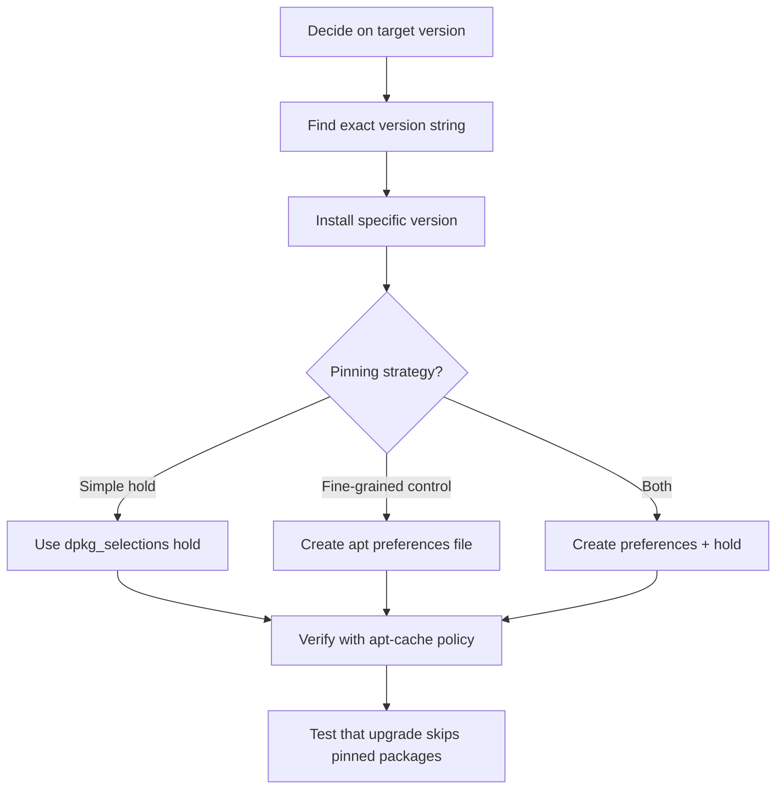

# How to Use the Ansible apt Module with Package Version Pinning

Author: [nawazdhandala](https://www.github.com/nawazdhandala)

Tags: Ansible, apt, Package Pinning, Ubuntu, DevOps

Description: Learn how to pin package versions on Debian and Ubuntu using the Ansible apt module and apt preferences to prevent unwanted upgrades.

---

Version pinning is essential when you need reproducible deployments. You do not want a `dist-upgrade` to silently bump your database server from PostgreSQL 15.3 to 15.5 during a routine patch window. Ansible gives you multiple approaches to pin packages at specific versions, and this post covers all of them with practical examples.

## Installing a Specific Version

The most direct approach is specifying the exact version in the package name:

```yaml
# Install an exact version of a package
- name: Install specific Redis version
  ansible.builtin.apt:
    name: redis-server=5:7.0.12-1
    state: present
    update_cache: yes
```

The version string must match exactly what `apt-cache policy` shows. The format varies between packages and distributions. To find the right string, run:

```bash
# Check available versions for a package
apt-cache policy redis-server
```

The output shows something like:

```
redis-server:
  Installed: 5:7.0.12-1
  Candidate: 5:7.0.15-1
  Version table:
     5:7.0.15-1 500
     5:7.0.12-1 500
```

Use the full version string including any epoch prefix (the `5:` part) and the release suffix.

## Holding Packages with dpkg_selections

After installing a specific version, you need to prevent `apt upgrade` from bumping it. The `dpkg_selections` module marks packages as "held":

```yaml
# Install a specific version and then hold it
- name: Install PostgreSQL 15.4
  ansible.builtin.apt:
    name: postgresql-15=15.4-1.pgdg22.04+1
    state: present

- name: Hold PostgreSQL at installed version
  ansible.builtin.dpkg_selections:
    name: postgresql-15
    selection: hold
```

When a package is held, `apt-get upgrade` and `apt-get dist-upgrade` will skip it. You can verify the hold with `dpkg --get-selections | grep hold`.

To release the hold later:

```yaml
# Release the hold to allow upgrades
- name: Unhold PostgreSQL
  ansible.builtin.dpkg_selections:
    name: postgresql-15
    selection: install
```

## Using APT Preferences for Pin Priorities

For more sophisticated pinning, use APT preferences files. These let you control which version apt prefers based on package names, origins, or release labels.

Here is how to create an apt preferences file that pins a package:

```yaml
# Pin nginx to a specific version using apt preferences
- name: Create apt pin for nginx
  ansible.builtin.copy:
    content: |
      Package: nginx
      Pin: version 1.24.0-1ubuntu1
      Pin-Priority: 1001
    dest: /etc/apt/preferences.d/nginx-pin
    owner: root
    group: root
    mode: '0644'
```

Pin priorities determine behavior:

- **1001+**: Forces installation of this version even if it requires downgrading
- **990**: Normal priority for target releases
- **500**: Default priority for installed packages
- **100**: Priority for packages from non-default releases
- **-1**: Prevents installation entirely

A priority of 1001 is strong enough to override any other preference and even force downgrades.

## Pinning All Packages from a Repository

You can pin all packages from a specific repository. This is useful when you add a third-party repo but do not want its packages to override system packages:

```yaml
# Pin all packages from the Docker repo to a lower priority
- name: Pin Docker repository packages
  ansible.builtin.copy:
    content: |
      Package: *
      Pin: origin download.docker.com
      Pin-Priority: 100
    dest: /etc/apt/preferences.d/docker-pin
    mode: '0644'

# Pin only docker-ce to a higher priority so it actually gets installed
- name: Pin docker-ce to preferred version
  ansible.builtin.copy:
    content: |
      Package: docker-ce docker-ce-cli containerd.io
      Pin: origin download.docker.com
      Pin-Priority: 500
    dest: /etc/apt/preferences.d/docker-ce-pin
    mode: '0644'
```

## Preventing Major Version Upgrades

A common requirement is allowing minor/patch updates but blocking major version jumps. You can use a wildcard pin for this:

```yaml
# Allow PostgreSQL 15.x updates but block upgrades to 16.x
- name: Pin PostgreSQL to version 15
  ansible.builtin.copy:
    content: |
      Package: postgresql-15 postgresql-client-15
      Pin: version 15.*
      Pin-Priority: 900

      Package: postgresql-16 postgresql-client-16
      Pin: release *
      Pin-Priority: -1
    dest: /etc/apt/preferences.d/postgresql-pin
    mode: '0644'
```

The `-1` priority on PostgreSQL 16 prevents it from being installed at all, while the `15.*` wildcard allows any 15.x version to be installed or upgraded.

## A Complete Version Pinning Role

Here is a reusable role that handles version pinning for any package:

```yaml
# roles/pin_package/tasks/main.yml
# Pin a package at a specific version with optional hold

- name: "Install {{ pin_package_name }} version {{ pin_package_version }}"
  ansible.builtin.apt:
    name: "{{ pin_package_name }}={{ pin_package_version }}"
    state: present
    allow_downgrade: yes
  when: pin_package_version is defined

- name: "Create apt pin for {{ pin_package_name }}"
  ansible.builtin.copy:
    content: |
      Package: {{ pin_package_name }}
      Pin: version {{ pin_package_pin_version | default(pin_package_version) }}
      Pin-Priority: {{ pin_package_priority | default(1001) }}
    dest: "/etc/apt/preferences.d/{{ pin_package_name }}-pin"
    owner: root
    group: root
    mode: '0644'
  when: pin_package_version is defined or pin_package_pin_version is defined

- name: "Hold {{ pin_package_name }} at installed version"
  ansible.builtin.dpkg_selections:
    name: "{{ pin_package_name }}"
    selection: hold
  when: pin_package_hold | default(true)
```

Use the role in your playbook:

```yaml
# Pin multiple packages using the role
- name: Pin critical packages
  hosts: database_servers
  become: yes
  tasks:
    - name: Pin PostgreSQL
      ansible.builtin.include_role:
        name: pin_package
      vars:
        pin_package_name: postgresql-15
        pin_package_version: "15.4-1.pgdg22.04+1"
        pin_package_hold: true

    - name: Pin Redis
      ansible.builtin.include_role:
        name: pin_package
      vars:
        pin_package_name: redis-server
        pin_package_version: "5:7.0.12-1"
        pin_package_hold: true
```

## Checking Current Pin Status

Before applying pins, you might want to check what is currently pinned:

```yaml
# Report current package pins and holds
- name: Get held packages
  ansible.builtin.command: dpkg --get-selections
  register: dpkg_selections
  changed_when: false

- name: Show held packages
  ansible.builtin.debug:
    msg: "{{ dpkg_selections.stdout_lines | select('search', 'hold') | list }}"

- name: Show apt pin configuration
  ansible.builtin.command: apt-cache policy postgresql-15
  register: pg_policy
  changed_when: false

- name: Display PostgreSQL pin status
  ansible.builtin.debug:
    msg: "{{ pg_policy.stdout_lines }}"
```

## Version Pinning Workflow



## Handling Version Pin Conflicts

If you have conflicting pins, apt uses the highest priority. Watch out for these common issues:

```yaml
# Check for pin conflicts before applying new pins
- name: List existing pin files
  ansible.builtin.find:
    paths: /etc/apt/preferences.d
    patterns: '*'
  register: existing_pins

- name: Display existing pin files
  ansible.builtin.debug:
    msg: "Existing pin files: {{ existing_pins.files | map(attribute='path') | list }}"

# Use apt-cache policy to see the effective priority
- name: Check effective pin priority
  ansible.builtin.command:
    cmd: "apt-cache policy {{ item }}"
  loop:
    - postgresql-15
    - redis-server
    - nginx
  register: pin_check
  changed_when: false

- name: Show effective priorities
  ansible.builtin.debug:
    msg: "{{ item.stdout_lines }}"
  loop: "{{ pin_check.results }}"
  loop_control:
    label: "{{ item.item }}"
```

## Best Practices for Version Pinning

1. **Document why you are pinning.** Add a comment in the preferences file explaining the reason and linking to a ticket or decision document.
2. **Pin both the package and its library dependencies.** If you pin `postgresql-15` but not `libpq5`, a library upgrade could still cause issues.
3. **Review pins regularly.** Stale pins prevent security updates. Set a calendar reminder to review and update your version pins quarterly.
4. **Test pin removal.** Make sure you know how to unpin and upgrade when the time comes. Practice this in staging before you need to do it under pressure in production.
5. **Prefer dpkg_selections hold for simple cases.** It is easier to manage and audit than apt preferences files. Use preferences only when you need wildcard matching or priority-based control.

Version pinning is a trade-off between stability and security. Pin aggressively for databases and critical infrastructure, but be more lenient with less risky packages. The techniques in this post give you the flexibility to find the right balance for your environment.
