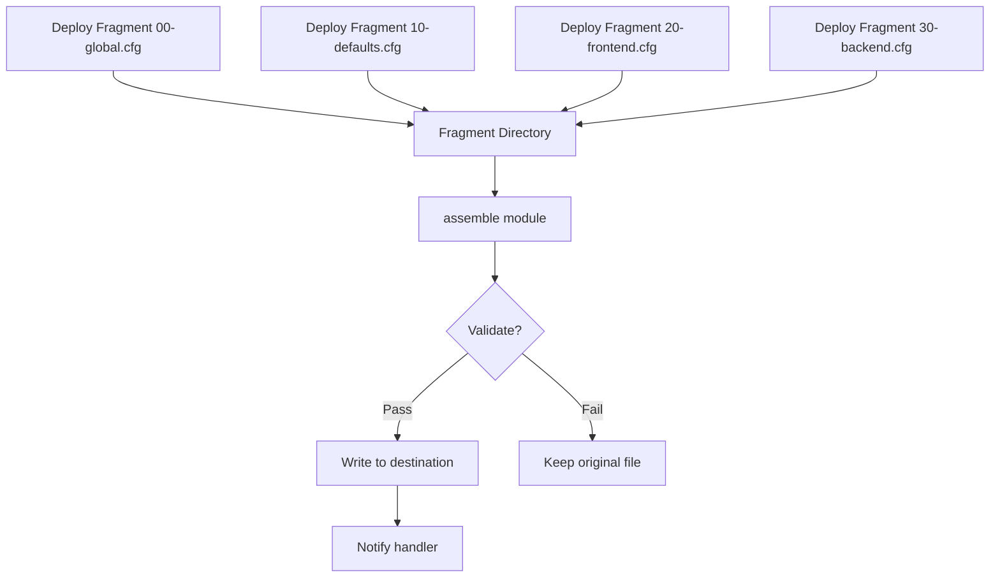

# How to Use the Ansible assemble Module for Config Fragments

Author: [nawazdhandala](https://www.github.com/nawazdhandala)

Tags: Ansible, Configuration Management, DevOps, Linux

Description: Learn how to use the Ansible assemble module to merge multiple configuration file fragments into a single config file on remote hosts.

---

Managing configuration files gets complicated when multiple teams or roles need to contribute sections to the same file. The Ansible `assemble` module provides an elegant solution: store individual configuration fragments in a directory, then merge them into a single file. This pattern is popular with tools like Apache, sudoers, and logrotate that already support drop-in config directories, but `assemble` lets you apply the same approach to any configuration file.

## How the assemble Module Works

The `assemble` module collects all files from a source directory on the Ansible controller (or remote host), concatenates them in sorted order, and writes the result to a destination file on the managed host. The sorting is alphabetical by filename, which means you can control the order of fragments using numeric prefixes.

Here is the basic syntax.

```yaml
# Merge all fragments in the haproxy.d directory into a single config
- name: Assemble HAProxy configuration from fragments
  ansible.builtin.assemble:
    src: /etc/haproxy/conf.d/
    dest: /etc/haproxy/haproxy.cfg
    owner: root
    group: root
    mode: '0644'
  notify: Reload HAProxy
```

## Setting Up the Fragment Directory Pattern

The most common pattern is to number your fragments so they assemble in the right order. Let us walk through building an HAProxy config from fragments.

First, create the fragment directory structure and deploy fragments with the `copy` or `template` module.

```yaml
# Create the fragment directory
- name: Create HAProxy config fragment directory
  ansible.builtin.file:
    path: /etc/haproxy/conf.d
    state: directory
    owner: root
    group: root
    mode: '0755'

# Deploy the global settings fragment
- name: Deploy HAProxy global settings
  ansible.builtin.copy:
    dest: /etc/haproxy/conf.d/00-global.cfg
    content: |
      global
          log /dev/log local0
          log /dev/log local1 notice
          chroot /var/lib/haproxy
          stats socket /run/haproxy/admin.sock mode 660 level admin
          stats timeout 30s
          user haproxy
          group haproxy
          daemon
    owner: root
    group: root
    mode: '0644'

# Deploy the defaults section
- name: Deploy HAProxy defaults
  ansible.builtin.copy:
    dest: /etc/haproxy/conf.d/10-defaults.cfg
    content: |
      defaults
          log     global
          mode    http
          option  httplog
          option  dontlognull
          timeout connect 5000
          timeout client  50000
          timeout server  50000
    owner: root
    group: root
    mode: '0644'

# Deploy a frontend section
- name: Deploy HAProxy frontend
  ansible.builtin.template:
    src: templates/haproxy/30-frontend.cfg.j2
    dest: /etc/haproxy/conf.d/30-frontend.cfg
    owner: root
    group: root
    mode: '0644'
```

Then assemble them all.

```yaml
# Merge all fragments into the final config
- name: Assemble complete HAProxy configuration
  ansible.builtin.assemble:
    src: /etc/haproxy/conf.d/
    dest: /etc/haproxy/haproxy.cfg
    owner: root
    group: root
    mode: '0644'
    validate: '/usr/sbin/haproxy -c -f %s'
  notify: Reload HAProxy
```

## Using the validate Parameter

One of the most important features of the `assemble` module is the `validate` parameter. It runs a validation command against the assembled file before writing it to the final destination. If validation fails, the original file remains unchanged. The `%s` placeholder gets replaced with the path to a temporary file containing the assembled content.

```yaml
# Assemble sudoers fragments with syntax validation
- name: Assemble sudoers from fragments
  ansible.builtin.assemble:
    src: /etc/sudoers.d/fragments/
    dest: /etc/sudoers
    validate: '/usr/sbin/visudo -cf %s'
    owner: root
    group: root
    mode: '0440'
```

This is critical for files like sudoers where a syntax error can lock you out of sudo access entirely.

## Filtering Fragments with regexp

You can filter which fragments get included using the `regexp` parameter. Only files whose names match the regex will be assembled.

```yaml
# Only assemble fragments that end with .conf
- name: Assemble only .conf fragments
  ansible.builtin.assemble:
    src: /opt/app/config.d/
    dest: /opt/app/config.ini
    regexp: '\.conf$'
    owner: appuser
    group: appuser
    mode: '0644'
```

This is handy when your fragment directory contains README files, backup files, or other non-config files you want to exclude.

```yaml
# Exclude backup files and editor swap files
- name: Assemble fragments excluding temp files
  ansible.builtin.assemble:
    src: /etc/myapp/conf.d/
    dest: /etc/myapp/myapp.conf
    regexp: '^[^.].*(?<!\.bak)(?<!\.swp)(?<!~)$'
```

## Using assemble with remote_src

By default, the `assemble` module looks for fragments on the Ansible controller. If your fragments are already on the remote host, set `remote_src: yes`.

```yaml
# Assemble fragments that already exist on the remote host
- name: Assemble config from remote fragments
  ansible.builtin.assemble:
    src: /opt/app/conf.d/
    dest: /opt/app/application.conf
    remote_src: yes
    owner: appuser
    group: appuser
    mode: '0640'
```

## A Complete Role Example

Here is a full role that manages an application configuration using the fragment pattern.

```yaml
# tasks/main.yml - Role for managing application config fragments
---
- name: Create config fragment directory
  ansible.builtin.file:
    path: /opt/myapp/conf.d
    state: directory
    owner: myapp
    group: myapp
    mode: '0755'

- name: Deploy header fragment with application name and version
  ansible.builtin.template:
    src: 00-header.conf.j2
    dest: /opt/myapp/conf.d/00-header.conf
    owner: myapp
    group: myapp
    mode: '0644'

- name: Deploy database configuration fragment
  ansible.builtin.template:
    src: 10-database.conf.j2
    dest: /opt/myapp/conf.d/10-database.conf
    owner: myapp
    group: myapp
    mode: '0640'

- name: Deploy cache configuration fragment
  ansible.builtin.template:
    src: 20-cache.conf.j2
    dest: /opt/myapp/conf.d/20-cache.conf
    owner: myapp
    group: myapp
    mode: '0644'
  when: enable_cache | default(false)

- name: Deploy logging configuration fragment
  ansible.builtin.template:
    src: 30-logging.conf.j2
    dest: /opt/myapp/conf.d/30-logging.conf
    owner: myapp
    group: myapp
    mode: '0644'

- name: Remove cache fragment if cache is disabled
  ansible.builtin.file:
    path: /opt/myapp/conf.d/20-cache.conf
    state: absent
  when: not (enable_cache | default(false))

- name: Assemble final configuration from fragments
  ansible.builtin.assemble:
    src: /opt/myapp/conf.d/
    dest: /opt/myapp/myapp.conf
    remote_src: yes
    regexp: '\.conf$'
    owner: myapp
    group: myapp
    mode: '0640'
    backup: yes
  notify: Restart myapp
```

## Adding Delimiters Between Fragments

The `assemble` module supports a `delimiter` parameter that inserts a string between each fragment. This is useful when your config format needs separators.

```yaml
# Add a blank line between each fragment for readability
- name: Assemble with blank line delimiters
  ansible.builtin.assemble:
    src: /opt/app/rules.d/
    dest: /opt/app/rules.conf
    remote_src: yes
    delimiter: "\n\n"
```

## The Fragment Workflow Visualized

Here is how the fragment assembly process works in a typical deployment.



## When to Use assemble vs template

The `assemble` module shines when different roles or teams contribute to the same config file. For example, if you have a base role that sets up HAProxy and then separate roles for each backend application that need to add their own backend sections, the fragment pattern keeps things modular.

Use `template` when a single role owns the entire configuration file and you can express all the logic in one Jinja2 template. Use `assemble` when multiple roles or conditional blocks contribute to the same file, or when you want to make it easy to add and remove sections independently.

## Summary

The `assemble` module brings the drop-in configuration directory pattern to any file type. By breaking complex configurations into numbered fragments, you gain modularity, testability, and clear separation of concerns. The built-in validation support adds a safety layer that prevents broken configs from being deployed. Whether you are managing HAProxy backends, firewall rules, or application settings, the fragment-and-assemble pattern is a reliable approach worth adding to your Ansible toolkit.
