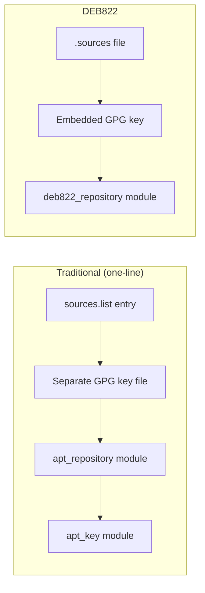

# How to Use the Ansible deb822_repository Module

Author: [nawazdhandala](https://www.github.com/nawazdhandala)

Tags: Ansible, apt, deb822, Ubuntu, Repositories

Description: Learn how to use the Ansible deb822_repository module to manage APT repositories using the modern DEB822 format on Debian and Ubuntu.

---

The DEB822 format is the modern replacement for the traditional one-line APT repository format. Instead of cramming everything into a single `deb` line in `/etc/apt/sources.list`, DEB822 uses a structured, multi-line format stored in `.sources` files under `/etc/apt/sources.list.d/`. Ansible introduced the `deb822_repository` module to work with this format natively. This post explains what DEB822 is, why it matters, and how to use the module.

## What Is the DEB822 Format?

The traditional APT source format looks like this:

```
deb [arch=amd64 signed-by=/usr/share/keyrings/docker.gpg] https://download.docker.com/linux/ubuntu jammy stable
```

The DEB822 format for the same repository looks like this:

```
Types: deb
URIs: https://download.docker.com/linux/ubuntu
Suites: jammy
Components: stable
Architectures: amd64
Signed-By: /usr/share/keyrings/docker.gpg
```

The DEB822 format is easier to read, supports comments naturally, and can include the GPG key directly in the file. Starting with Ubuntu 24.04 and Debian 12, the default system sources are already in DEB822 format at `/etc/apt/sources.list.d/ubuntu.sources`.

## Basic Usage of the deb822_repository Module

Here is how to add a simple repository:

```yaml
# Add a repository using the DEB822 format
- name: Add Docker repository
  ansible.builtin.deb822_repository:
    name: docker-ce
    types: deb
    uris: https://download.docker.com/linux/ubuntu
    suites: "{{ ansible_distribution_release }}"
    components: stable
    architectures: amd64
    signed_by: https://download.docker.com/linux/ubuntu/gpg
    state: present
```

The `name` parameter determines the filename. This creates `/etc/apt/sources.list.d/docker-ce.sources`. The `signed_by` parameter is particularly convenient because it can accept a URL directly. The module downloads the key, dearmors it if needed, and embeds it in the `.sources` file.

## Embedding the GPG Key

One of the best features of DEB822 is inline key embedding. The `deb822_repository` module handles this automatically when you provide a URL for `signed_by`:

```yaml
# Add Grafana repository with embedded GPG key
- name: Add Grafana repository with inline key
  ansible.builtin.deb822_repository:
    name: grafana
    types: deb
    uris: https://apt.grafana.com
    suites: stable
    components: main
    signed_by: https://apt.grafana.com/gpg.key
    state: present
    enabled: yes
```

This creates a single `.sources` file that contains both the repository definition and the GPG key. No separate keyring file management is needed. This is a significant improvement over the old workflow of separately managing keys and repository files.

## Adding Source Repositories

If you need source packages (for building from source or backporting), include `deb-src` in the types:

```yaml
# Add repository with both binary and source packages
- name: Add PostgreSQL repository with sources
  ansible.builtin.deb822_repository:
    name: pgdg
    types:
      - deb
      - deb-src
    uris: http://apt.postgresql.org/pub/repos/apt
    suites: "{{ ansible_distribution_release }}-pgdg"
    components: main
    signed_by: https://www.postgresql.org/media/keys/ACCC4CF8.asc
    state: present
```

## Multiple Suites and Components

You can specify multiple suites or components:

```yaml
# Add Elasticsearch repository with multiple components
- name: Add Elastic repository
  ansible.builtin.deb822_repository:
    name: elastic-8
    types: deb
    uris: https://artifacts.elastic.co/packages/8.x/apt
    suites: stable
    components: main
    signed_by: https://artifacts.elastic.co/GPG-KEY-elasticsearch
    state: present
```

## Disabling a Repository Temporarily

Instead of removing a repository, you can disable it:

```yaml
# Disable a repository without removing it
- name: Disable staging repository
  ansible.builtin.deb822_repository:
    name: myapp-staging
    types: deb
    uris: https://packages.example.com/staging
    suites: "{{ ansible_distribution_release }}"
    components: main
    signed_by: https://packages.example.com/gpg.key
    enabled: no
    state: present
```

This sets `Enabled: no` in the `.sources` file. APT ignores disabled repositories during `apt-get update`, but the configuration stays on disk so you can re-enable it easily.

## Removing a Repository

To remove a repository, just set `state: absent`:

```yaml
# Remove a repository completely
- name: Remove old testing repository
  ansible.builtin.deb822_repository:
    name: myapp-testing
    state: absent
```

When using `state: absent`, you only need the `name` parameter. The module finds and removes the corresponding `.sources` file.

## Complete Example: Setting Up a Dev Workstation

Here is a playbook that adds several repositories for a development workstation:

```yaml
# Set up development repositories on Ubuntu
- name: Configure dev workstation repositories
  hosts: workstations
  become: yes
  tasks:
    - name: Add VS Code repository
      ansible.builtin.deb822_repository:
        name: vscode
        types: deb
        uris: https://packages.microsoft.com/repos/code
        suites: stable
        components: main
        architectures: amd64
        signed_by: https://packages.microsoft.com/keys/microsoft.asc
        state: present

    - name: Add Node.js 20 repository
      ansible.builtin.deb822_repository:
        name: nodesource
        types: deb
        uris: https://deb.nodesource.com/node_20.x
        suites: nodistro
        components: main
        architectures: amd64
        signed_by: https://deb.nodesource.com/gpgkey/nodesource-repo.gpg.key
        state: present

    - name: Add Docker repository
      ansible.builtin.deb822_repository:
        name: docker-ce
        types: deb
        uris: https://download.docker.com/linux/ubuntu
        suites: "{{ ansible_distribution_release }}"
        components: stable
        architectures: amd64
        signed_by: https://download.docker.com/linux/ubuntu/gpg
        state: present

    - name: Add Terraform repository
      ansible.builtin.deb822_repository:
        name: hashicorp
        types: deb
        uris: https://apt.releases.hashicorp.com
        suites: "{{ ansible_distribution_release }}"
        components: main
        architectures: amd64
        signed_by: https://apt.releases.hashicorp.com/gpg
        state: present

    - name: Update apt cache after adding repositories
      ansible.builtin.apt:
        update_cache: yes

    - name: Install development tools
      ansible.builtin.apt:
        name:
          - code
          - nodejs
          - docker-ce
          - terraform
        state: present
```

## Migrating from Traditional Format to DEB822

If you have existing repositories in the old format, here is how to migrate:

```yaml
# Migrate from one-line format to DEB822
- name: Remove old-format Docker repository
  ansible.builtin.apt_repository:
    repo: "deb [arch=amd64 signed-by=/usr/share/keyrings/docker.gpg] https://download.docker.com/linux/ubuntu {{ ansible_distribution_release }} stable"
    state: absent
    filename: docker-ce

- name: Add Docker repository in DEB822 format
  ansible.builtin.deb822_repository:
    name: docker-ce
    types: deb
    uris: https://download.docker.com/linux/ubuntu
    suites: "{{ ansible_distribution_release }}"
    components: stable
    architectures: amd64
    signed_by: https://download.docker.com/linux/ubuntu/gpg
    state: present

- name: Clean up old keyring file
  ansible.builtin.file:
    path: /usr/share/keyrings/docker.gpg
    state: absent

- name: Update apt cache
  ansible.builtin.apt:
    update_cache: yes
```

## DEB822 vs Traditional Format



## What the Generated File Looks Like

When you use the `deb822_repository` module, the generated `.sources` file looks something like this:

```
X-Repolib-Name: docker-ce
Types: deb
URIs: https://download.docker.com/linux/ubuntu
Suites: jammy
Components: stable
Architectures: amd64
Signed-By:
 -----BEGIN PGP PUBLIC KEY BLOCK-----
 .
 mQINBFi... (key data) ...
 -----END PGP PUBLIC KEY BLOCK-----
```

The key is embedded directly in the file, making the repository fully self-contained.

## When to Use deb822_repository

Use the `deb822_repository` module when:

- You are targeting Ubuntu 22.04+ or Debian 12+
- You want the simplest possible key management (inline keys)
- You are starting a new project and want to use modern practices
- You want to disable/enable repositories without removing them

Stick with `apt_repository` when:

- You need to support older distributions that do not understand DEB822
- Your existing infrastructure is already set up with the traditional format and migration is not worth the effort

The `deb822_repository` module simplifies what used to be a multi-step process (download key, dearmor key, store key, add repo with signed-by reference) into a single task. For new Ansible projects targeting modern Debian or Ubuntu systems, it is the right choice.
