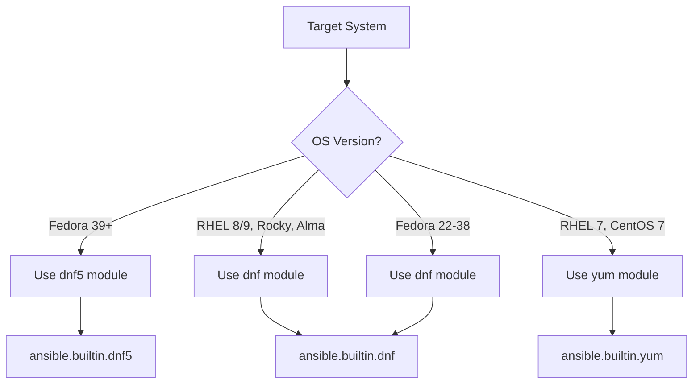

# How to Use the Ansible dnf5 Module

Author: [nawazdhandala](https://www.github.com/nawazdhandala)

Tags: Ansible, dnf5, Fedora, RHEL, Package Management

Description: Learn how to use the Ansible dnf5 module for next-generation package management on Fedora and future RHEL systems.

---

dnf5 is the next generation of the dnf package manager. It is a complete rewrite in C++ that replaces both the dnf command-line tool and the underlying libdnf library. Fedora 39+ ships dnf5 as the default, and it is expected to become the default in future RHEL versions. Ansible has a `dnf5` module in the `ansible.builtin` namespace to work with this new package manager. This post covers what is different about dnf5 and how to use the Ansible module.

## What Changed in dnf5

dnf5 is not just a version bump. It is a ground-up rewrite with several important changes:

- Written in C++ instead of Python, so it is significantly faster
- The command-line interface has some syntax changes
- Plugin architecture is different
- Module streams handling has changed
- The Python API is replaced by a C++ library with Python bindings

From an Ansible perspective, the `dnf5` module provides the same core functionality as the `dnf` module but talks to the dnf5 backend instead of the dnf4 one.

## Basic Usage

The syntax mirrors the `dnf` module almost exactly:

```yaml
# Install a package using dnf5
- name: Install nginx with dnf5
  ansible.builtin.dnf5:
    name: nginx
    state: present
```

Installing multiple packages:

```yaml
# Install multiple packages with dnf5
- name: Install development dependencies
  ansible.builtin.dnf5:
    name:
      - git
      - gcc
      - make
      - python3-devel
      - openssl-devel
    state: present
```

## Detecting Which Module to Use

If your inventory includes both dnf4 and dnf5 systems, you need to detect which module to use. The `package` module can abstract this, but if you want explicit control:

```yaml
# Detect whether to use dnf or dnf5
- name: Check if dnf5 is available
  ansible.builtin.command:
    cmd: which dnf5
  register: dnf5_check
  ignore_errors: yes
  changed_when: false

- name: Install packages with dnf5
  ansible.builtin.dnf5:
    name:
      - nginx
      - redis
    state: present
  when: dnf5_check.rc == 0

- name: Install packages with dnf (fallback)
  ansible.builtin.dnf:
    name:
      - nginx
      - redis
    state: present
  when: dnf5_check.rc != 0
```

A cleaner approach uses the `ansible_pkg_mgr` fact:

```yaml
# Use the detected package manager
- name: Gather package manager facts
  ansible.builtin.setup:
    gather_subset:
      - pkg_mgr

- name: Display detected package manager
  ansible.builtin.debug:
    msg: "Package manager is {{ ansible_pkg_mgr }}"
```

## Installing Package Groups

Package groups work the same way as with dnf4:

```yaml
# Install a package group with dnf5
- name: Install Development Tools
  ansible.builtin.dnf5:
    name: "@Development Tools"
    state: present

# Install a group and individual packages together
- name: Install build environment
  ansible.builtin.dnf5:
    name:
      - "@C Development Tools and Libraries"
      - cmake
      - ninja-build
    state: present
```

## Upgrading Packages

Upgrading all packages:

```yaml
# Upgrade all packages to their latest versions
- name: Upgrade all packages
  ansible.builtin.dnf5:
    name: "*"
    state: latest
```

Upgrading specific packages:

```yaml
# Upgrade only security-related packages
- name: Upgrade security packages
  ansible.builtin.dnf5:
    name:
      - openssl
      - openssh
      - ca-certificates
      - kernel
    state: latest
```

## Removing Packages

```yaml
# Remove packages with dnf5
- name: Remove unwanted packages
  ansible.builtin.dnf5:
    name:
      - telnet
      - rsh
      - tftp
    state: absent

# Remove with dependency cleanup
- name: Remove package and orphaned deps
  ansible.builtin.dnf5:
    name: nodejs
    state: absent
    autoremove: yes
```

## Working with Repositories

Enabling or disabling repositories during installation:

```yaml
# Install from a specific repository
- name: Install package from CRB repo
  ansible.builtin.dnf5:
    name: ninja-build
    state: present
    enablerepo: crb

# Install while disabling a problematic repo
- name: Install packages with repo disabled
  ansible.builtin.dnf5:
    name: httpd
    state: present
    disablerepo: testing
```

## Installing from RPM URLs

```yaml
# Install directly from a URL
- name: Install EPEL release
  ansible.builtin.dnf5:
    name: https://dl.fedoraproject.org/pub/epel/epel-release-latest-9.noarch.rpm
    state: present
    disable_gpg_check: yes
```

## Installing Local RPM Files

```yaml
# Install a local RPM file
- name: Install custom application
  ansible.builtin.dnf5:
    name: /opt/packages/myapp-3.0.0-1.fc39.x86_64.rpm
    state: present
    disable_gpg_check: yes
```

## Performance Comparison: dnf vs dnf5

dnf5 is noticeably faster for several reasons. Here is a practical comparison playbook you can use to benchmark:

```yaml
# Benchmark dnf5 vs dnf4 performance
- name: Benchmark package operations
  hosts: test_server
  become: yes
  tasks:
    - name: Time dnf5 cache refresh
      ansible.builtin.shell:
        cmd: "time dnf5 makecache 2>&1"
      register: dnf5_time
      changed_when: false

    - name: Display dnf5 timing
      ansible.builtin.debug:
        msg: "dnf5 makecache: {{ dnf5_time.stderr }}"

    - name: Time dnf5 install (dry run)
      ansible.builtin.shell:
        cmd: "time dnf5 install --assumeno nginx 2>&1 || true"
      register: dnf5_install_time
      changed_when: false

    - name: Display dnf5 install timing
      ansible.builtin.debug:
        msg: "dnf5 install timing: {{ dnf5_install_time.stderr }}"
```

In typical benchmarks, dnf5 is 2-3x faster for metadata refresh and dependency resolution. On servers with hundreds of packages, the difference adds up significantly.

## A Complete Server Setup with dnf5

```yaml
# Full server setup playbook using dnf5
- name: Set up Fedora application server
  hosts: fedora_servers
  become: yes
  vars:
    base_packages:
      - nginx
      - python3
      - python3-pip
      - redis
      - postgresql-server
    monitoring_packages:
      - htop
      - iotop
      - sysstat
      - net-tools
    security_packages:
      - fail2ban
      - firewalld
      - aide
  tasks:
    - name: Upgrade all existing packages
      ansible.builtin.dnf5:
        name: "*"
        state: latest

    - name: Install base packages
      ansible.builtin.dnf5:
        name: "{{ base_packages }}"
        state: present

    - name: Install monitoring tools
      ansible.builtin.dnf5:
        name: "{{ monitoring_packages }}"
        state: present

    - name: Install security packages
      ansible.builtin.dnf5:
        name: "{{ security_packages }}"
        state: present

    - name: Remove unnecessary packages
      ansible.builtin.dnf5:
        name:
          - cockpit
          - evolution
        state: absent
        autoremove: yes

    - name: Clean dnf cache
      ansible.builtin.dnf5:
        autoremove: yes
```

## Module Compatibility Matrix



## Key Differences Between the dnf and dnf5 Modules

| Feature | dnf module | dnf5 module |
|---------|-----------|-------------|
| Backend | libdnf (Python) | libdnf5 (C++) |
| Speed | Standard | 2-3x faster |
| Module streams | Full support | Evolving support |
| Availability | RHEL 8+, Fedora 22+ | Fedora 39+ |
| FQCN | ansible.builtin.dnf | ansible.builtin.dnf5 |

## Tips for Transitioning

1. **Test in Fedora first.** Since Fedora is the testing ground for RHEL features, use Fedora VMs or containers to validate your dnf5 playbooks before RHEL adoption.

2. **Use the package module for cross-platform plays.** If your inventory mixes dnf4 and dnf5 systems, the `package` module auto-detects the correct backend.

3. **Check module stream support.** dnf5's module stream handling is still maturing. If you rely heavily on module streams, test thoroughly before switching.

4. **Update your CI/CD pipelines.** If your pipeline tests use dnf and you are upgrading to Fedora 39+, switch to dnf5 in your test playbooks.

5. **Watch the Ansible changelog.** The dnf5 module is actively developed. New parameters and bug fixes land regularly.

The dnf5 module is the future for RPM-based package management in Ansible. While the transition from dnf to dnf5 is less disruptive than the yum-to-dnf migration was, it is worth testing your playbooks early so you are ready when dnf5 becomes the default on your production systems.
